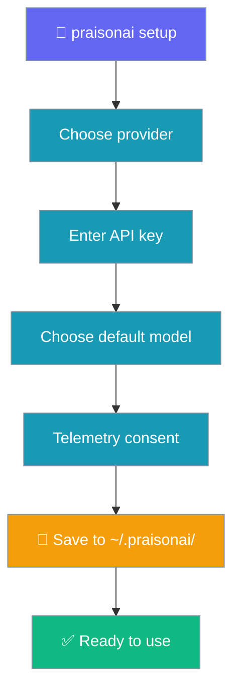
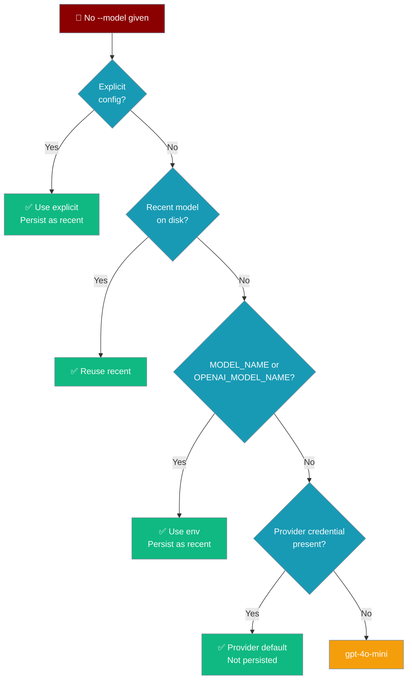

Interactive wizard that stores your LLM provider API key so every subsequent `praisonai` command works without extra configuration.

<Note>
Running `praisonai --init` without a configured provider prints a pointer to this page — you do not have to find `setup` separately.
</Note>



## Quick Start

<Steps>
<Step title="Run the setup wizard">
```bash
praisonai setup
```

The interactive wizard walks you through provider selection and key entry.
</Step>

<Step title="Choose a provider">
```
🚀 PraisonAI Setup Wizard

1. Choose your LLM provider:
  1) OpenAI (GPT-4o, GPT-4, GPT-3.5)
  2) Anthropic (Claude)
  3) Google (Gemini)
  4) Ollama (Local models)
  5) Custom provider

Select provider [1]:
```
</Step>

<Step title="Enter your API key">
```
2. Enter your OpenAI API key:
Enter API key (hidden):
```

The key is stored securely in `~/.praisonai/.env` with permissions `0600`.
</Step>

<Step title="Verify it works">
```bash
praisonai "Say hello in one sentence"
```
</Step>
</Steps>

---

## CLI Flags

```bash
praisonai setup [OPTIONS] [COMMAND]
```

| Option | Description |
|--------|-------------|
| `--non-interactive` | Run without prompts (requires `--provider` and `--api-key`) |
| `--provider TEXT` | Provider: `openai`, `anthropic`, `google`, `ollama`, `custom` |
| `--api-key TEXT` | API key for the provider |
| `--model TEXT` | Default model to use |

### Subcommands

| Command | Description |
|---------|-------------|
| `setup wizard` | Explicitly run the interactive wizard |
| `setup config --show` | Show current configuration (API keys masked) |
| `setup config --edit` | Open configuration in `$EDITOR` |
| `setup reset` | Remove stored credentials |
| `setup reset --force` | Remove without confirmation |

---

## Non-interactive Mode

For CI/CD or scripted setup:

```bash
praisonai setup --non-interactive \
  --provider openai \
  --api-key "$OPENAI_API_KEY" \
  --model gpt-4o-mini
```

Supported providers and their required env vars:

| Provider | `--provider` value | Env var written |
|----------|--------------------|-----------------|
| OpenAI | `openai` | `OPENAI_API_KEY` |
| Anthropic | `anthropic` | `ANTHROPIC_API_KEY` |
| Google | `google` | `GEMINI_API_KEY` |
| Ollama | `ollama` | *(no key needed)* |
| Custom | `custom` | *(user-defined)* |

---

## Where Credentials Are Stored

`praisonai setup` writes two files:

| File | Purpose | Permissions |
|------|---------|-------------|
| `~/.praisonai/.env` | API keys as `KEY=value` lines | `0600` |
| `~/.praisonai/config.yaml` | Provider name, default model, telemetry flag | `0600` |

The credential store (`CredentialStore`) reads `~/.praison/credentials.json` as an additional fallback path consulted by `resolve_llm_endpoint_with_credentials()`.

<Note>
All sensitive files are written with `chmod 600` and are never included in any telemetry data.
</Note>

---

## What happens if you skip `--model`

When you don't pass `--model` to `setup` (or when you run a command like `praisonai chat` with no `--model`), PraisonAI picks a sensible default that **matches the provider you actually have a key for** — it no longer always picks an OpenAI model.

```python
from praisonaiagents import Agent

# Only ANTHROPIC_API_KEY is set in the environment — Agent picks
# anthropic/claude-3-5-sonnet-latest automatically.
agent = Agent(name="Research Agent", instructions="Summarise news")
agent.start("What happened in AI today?")
```



### Resolution precedence

| Step | Source | Notes |
|------|--------|-------|
| 1 | Explicit `--model` / `llm=` arg / YAML / config | Wins, persisted as the recent model |
| 2 | Most-recently-used model (`~/.praison/state/model.json`) | Only *user-chosen* values are remembered |
| 3 | `MODEL_NAME` env var (then `OPENAI_MODEL_NAME` for backward compatibility) | Persisted on use |
| 4 | First present provider credential (table below) | **Not** persisted — kept fresh per run |
| 5 | Terminal fallback (`DEFAULT_FALLBACK_MODEL` — currently `gpt-4o-mini`) | **Not** persisted |

### Credential → default-model map

The first credential found wins, in this order:

| Credential env var | Default model picked |
|--------------------|----------------------|
| `OPENAI_API_KEY` | `gpt-4o-mini` |
| `ANTHROPIC_API_KEY` | `anthropic/claude-3-5-sonnet-latest` |
| `GEMINI_API_KEY` | `gemini/gemini-1.5-flash` |
| `GOOGLE_API_KEY` | `google/gemini-1.5-flash` |
| `GROQ_API_KEY` | `groq/llama-3.3-70b-versatile` |
| `COHERE_API_KEY` | `cohere/command-r` |
| `OLLAMA_HOST` | `ollama/llama3.2` |

The first time a provider-aware default is inferred, the CLI prints a one-line notice:

```
No model set; using anthropic/claude-3-5-sonnet-latest because ANTHROPIC_API_KEY is present.
```

Only *user-chosen* values (explicit `--model`, env overrides) are persisted as the recent model. Provider-inferred defaults and the terminal fallback (`DEFAULT_FALLBACK_MODEL`, currently `gpt-4o-mini`) are **deliberately not** persisted — this keeps model selection fresh if your available providers change between runs.

<Note>
The recency file lives at `~/.praison/state/model.json` (note: `.praison`, not `.praisonai`). It is created on demand; if it's missing or unreadable, resolution falls straight through to provider inference and works normally.
</Note>

---

## When Does Setup Run Automatically?

If you skip setup at install time (or run `--no-prompt`), the first `praisonai` or `praisonai run` command detects the missing credentials and offers to launch this wizard for you. See [First-run Onboarding](/docs/features/first-run-onboarding) for the full flow.

---

## Best Practices

<AccordionGroup>
<Accordion title="Re-run setup to change provider or rotate keys">
`praisonai setup` is idempotent — running it again overwrites the previous configuration. Use it whenever you switch providers or need to rotate an API key.
</Accordion>

<Accordion title="Use env vars in CI, stored credentials on workstations">
In CI environments set `OPENAI_API_KEY` (or the provider-specific key) as a secret. On developer workstations use `praisonai setup` so you don't have to set env vars in every shell session.
</Accordion>

<Accordion title="Inspect what is stored without exposing keys">
```bash
praisonai setup config --show
# Output: OPENAI_API_KEY=***
```

API keys are masked in the output. Only non-sensitive settings (provider, model) appear in plaintext.
</Accordion>

<Accordion title="With one credential set, --model is optional">
With just one credential env var set (e.g. `ANTHROPIC_API_KEY`), running `praisonai chat` without `--model` now picks the matching default automatically. You only need `--model` to override or to mix providers in one session.
</Accordion>
</AccordionGroup>

---

## Related

<CardGroup cols={2}>
  <Card title="First-run Onboarding" icon="key-round" href="/docs/features/first-run-onboarding">
    Auto-detects missing credentials at first invocation
  </Card>
  <Card title="Quick Start (--init)" icon="bolt" href="/docs/quickstart">
    Generate agents.yaml with `praisonai --init` — links here when no provider is configured
  </Card>
  <Card title="Run Command" icon="play" href="/docs/cli/run">
    Run agents from files or prompts
  </Card>
  <Card title="CLI Reference" icon="terminal" href="/docs/cli/cli-reference">
    Complete command tree and flag reference
  </Card>
  <Card title="Installer Internals" icon="gear" href="/docs/install/installer">
    How the installer sets up credentials at install time
  </Card>
</CardGroup>
