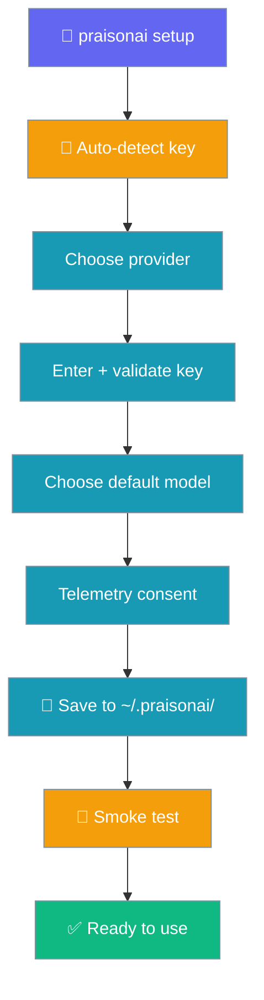
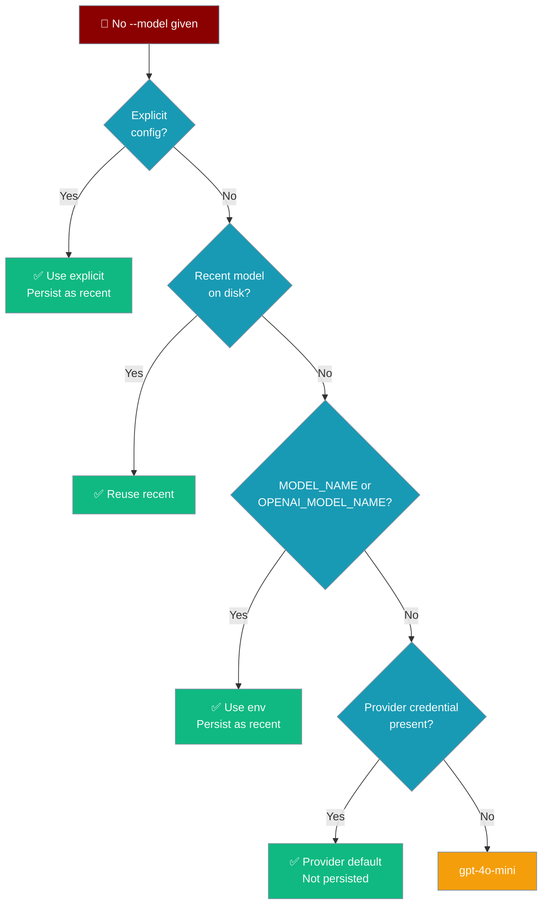

Interactive wizard that stores your LLM provider API key so every subsequent `praisonai` command works without extra configuration.

<Note>
Running `praisonai --init` without a configured provider prints a pointer to this page — you do not have to find `setup` separately.
</Note>



## Quick Start

<Steps>
<Step title="Run the setup wizard">
```bash
praisonai setup
```

The interactive wizard walks you through provider selection and key entry.
</Step>

<Step title="Confirm the detected provider">
If a provider key is already in your environment, the wizard confirms it instead of showing the menu (the wizard inspects the environment — it isn't tied to any one provider):

```
Detected ANTHROPIC_API_KEY in your environment.
Use Anthropic (claude-sonnet-4-20250514)? [Y/n]:
```

Press Enter to accept, or answer `n` to pick a different provider from the numeric menu.
</Step>

<Step title="Choose a provider (fallback)">
Shown only when no `*_API_KEY` was detected or you declined the detected one. The menu is now **catalogue-driven**, built from `ModelCatalogue.list_providers()` — `openai`, `anthropic`, `google`, `ollama` first, every other catalogue provider (Groq, OpenRouter, Mistral, DeepSeek, xAI, …) next, and `custom` last — not a hardcoded five:

```
🚀 PraisonAI Setup Wizard

Choose your LLM provider:
  1) OpenAI
  2) Anthropic
  3) Google
  4) Ollama
  5) Groq
  6) OpenRouter
  7) Mistral
  8) DeepSeek
  ...
  N) Custom

Select provider [1]:
```

<Note>
The exact list follows `ModelCatalogue.list_providers()`, so new providers appear automatically as the catalogue grows — no code change in setup. A one-line "Get your key" hint prints before the masked prompt for well-known providers.
</Note>
</Step>

<Step title="Enter your API key">
A `Get your key:` link to the provider's key-creation page prints before the hidden prompt for catalogue providers:

```
Get your key: https://console.groq.com/keys
2. Enter your Groq API key:
Enter API key (hidden):
```

The key is validated against the provider's expected format (same check as `auth login`); a bad key re-prompts up to three times before setup proceeds. Keys are stored in `~/.praisonai/.env` with permissions `0600`.
</Step>

<Step title="Verified automatically">
```
Verifying your setup...
✅ Verified — your agent is working!
Hello!
```

Setup runs a one-shot `Agent.start("Say hello in one sentence")` and prints the reply. Skip with `--no-verify` in offline/CI.
</Step>
</Steps>

---

## CLI Flags

```bash
praisonai setup [OPTIONS] [COMMAND]
```

| Option | Description |
|--------|-------------|
| `--non-interactive` | Run without prompts (requires `--provider` and `--api-key`) |
| `--provider TEXT` | Any catalogue-known provider (`openai`, `anthropic`, `google`, `groq`, `openrouter`, `mistral`, `deepseek`, `ollama`, `custom`, …). Non-curated providers derive `<PROVIDER>_API_KEY` automatically |
| `--api-key TEXT` | API key for the provider |
| `--model TEXT` | Default model to use |
| `--no-verify` | Skip the post-setup smoke test (offline/CI). Available on `setup` and `setup wizard`. |

The `--no-verify` flag applies to both `setup` and `setup wizard` — the sub-command inherits it.

### Subcommands

| Command | Description |
|---------|-------------|
| `setup wizard` | Explicitly run the interactive wizard |
| `setup config --show` | Show current configuration (API keys masked) |
| `setup config --edit` | Open configuration in `$EDITOR` |
| `setup reset` | Remove stored credentials |
| `setup reset --force` | Remove without confirmation |

---

## Non-interactive Mode

For CI/CD or scripted setup:

```bash
praisonai setup --non-interactive \
  --provider openai \
  --api-key "$OPENAI_API_KEY" \
  --model gpt-4o-mini \
  --no-verify  # skip the smoke test in CI so we don't hit the network
```

Curated providers and their auto-detected env vars — set any one of these and the wizard pre-selects that provider:

| Provider | `--provider` value | Env var detected / written |
|----------|--------------------|----------------------------|
| OpenAI | `openai` | `OPENAI_API_KEY` |
| Anthropic | `anthropic` | `ANTHROPIC_API_KEY` |
| Google | `google` | `GEMINI_API_KEY` or `GOOGLE_API_KEY` |
| Ollama | `ollama` | *(no key needed)* |
| Custom | `custom` | *(user-defined)* |

### Any catalogue provider

`--provider` in non-interactive mode accepts **any** provider returned by `ModelCatalogue.list_providers()` — not just the five above. For a catalogue provider without a curated row, the env-var name is derived as `<PROVIDER>_API_KEY`:

```bash
# Writes DEEPSEEK_API_KEY to ~/.praisonai/.env
praisonai setup --non-interactive --provider deepseek --api-key sk-...
```

`groq` → `GROQ_API_KEY`, `openrouter` → `OPENROUTER_API_KEY`, and so on. A few providers keep a canonical override: `google`/`gemini` → `GEMINI_API_KEY`, `perplexity` → `PERPLEXITYAI_API_KEY`.

---

## Post-setup smoke test

After the wizard writes your config, it runs one live call to confirm the credential is good.

| Step | Behaviour |
|------|-----------|
| Constructs `Agent` | `Agent(name="setup-check", llm=<model>)` |
| Runs a prompt | `agent.start("Say hello in one sentence")` |
| On success | Prints the reply and `Verified — your agent is working!` |
| On failure | Prints a warning and points at `praisonai doctor`; **never aborts setup** |
| No model | Skipped silently (see [non-interactive mode without `--model`](#non-interactive-mode)) |

**Passing case** — the reply is printed and the agent is confirmed working:

```
Verifying your setup...
✅ Verified — your agent is working!
Hello! How can I help you today?
```

**Failing case** — a bad key or no network. The config is **still saved**; the failure is a warning, not an abort:

```
Verifying your setup...
⚠️  Verification failed: AuthenticationError - invalid api key
Your config was saved. Check your key/model, then run praisonai doctor.
```

Skip the smoke test entirely for offline or CI installs:

```bash
praisonai setup --no-verify --non-interactive \
  --provider openai --api-key sk-...
```

<Tip>
Use `--no-verify` in CI or offline installs where the smoke test would fail due to no network.
</Tip>

If verification fails, your config is already saved — run [`praisonai doctor`](/docs/cli/doctor) to diagnose the key or model.

---

## Where Credentials Are Stored

`praisonai setup` now writes **three files** so the same key is visible to every CLI code path (`setup`, `auth list`, `run` / `inject_credentials_into_env`):

| File | Purpose | Permissions |
|------|---------|-------------|
| `~/.praisonai/.env` | API keys as `KEY=value` lines (primary artifact — this is what agents read via env vars) | `0600` |
| `~/.praisonai/config.yaml` | Provider name, default model, telemetry flag | `0600` |
| `~/.praisonai/credentials.json` | Mirror of the API key into the unified credential store — the same file `praisonai auth list` reads and that `inject_credentials_into_env()` uses at run time | `0600` |

The credential-store mirror means a key set via `praisonai setup` shows up in `praisonai auth list` and is picked up by `praisonai run` without exporting anything.

<Note>
**Legacy path migration.** Prior releases used `~/.praison/credentials.json`. That location is now a read-only backward-compat fallback: it's still read if the canonical `~/.praisonai/credentials.json` doesn't exist yet, and any write transparently migrates your old entries onto the canonical file. You don't need to re-run `auth login` or lose any stored providers — running `setup` (or any `auth login`) once completes the migration. No re-login is required.
</Note>

<Note>
Local providers like `ollama` (no API key) are skipped for the credential-store mirror — only providers with a real key/env var are written to `credentials.json`. If the mirror step fails for any reason (permissions, disk full), `setup` prints a warning and continues — the `.env` file is the primary artifact and is written first.
</Note>

<Note>
`PRAISONAI_HOME` is honoured. When `PRAISONAI_HOME` points at a non-default directory, `setup` writes `credentials.json` under that directory. When it equals the default `~/.praisonai`, `setup` keeps the legacy-fallback + migration path active.
</Note>

All sensitive files are written with `chmod 600` and are never included in any telemetry data.

---

## What happens if you skip `--model`

When you don't pass `--model` to `setup` (or when you run a command like `praisonai chat` with no `--model`), PraisonAI picks a sensible default that **matches the provider you actually have a key for** — it no longer always picks an OpenAI model.

```python
from praisonaiagents import Agent

# Only ANTHROPIC_API_KEY is set in the environment — Agent picks
# anthropic/claude-3-5-sonnet-latest automatically.
agent = Agent(name="Research Agent", instructions="Summarise news")
agent.start("What happened in AI today?")
```



### Resolution precedence

| Step | Source | Notes |
|------|--------|-------|
| 1 | Explicit `--model` / `llm=` arg / YAML / config | Wins, persisted as the recent model |
| 2 | Most-recently-used model (`~/.praison/state/model.json`) | Only *user-chosen* values are remembered |
| 3 | `MODEL_NAME` env var (then `OPENAI_MODEL_NAME` for backward compatibility) | Persisted on use |
| 4 | First present provider credential (table below) | **Not** persisted — kept fresh per run |
| 5 | Terminal fallback (`DEFAULT_FALLBACK_MODEL` — currently `gpt-4o-mini`) | **Not** persisted |

### Credential → default-model map

The first credential found wins, in this order:

This map is **run-time inference** (`_PROVIDER_DEFAULTS` in `llm/env.py`) — used when an `Agent` starts with no explicit model:

| Credential env var | Default model picked |
|--------------------|----------------------|
| `OPENAI_API_KEY` | `DEFAULT_FALLBACK_MODEL` (`gpt-4o-mini`) |
| `ANTHROPIC_API_KEY` | `anthropic/claude-3-5-sonnet-latest` |
| `GEMINI_API_KEY` | `gemini/gemini-1.5-flash` |
| `GOOGLE_API_KEY` | `google/gemini-1.5-flash` |
| `GROQ_API_KEY` | `groq/llama-3.3-70b-versatile` |
| `COHERE_API_KEY` | `cohere/command-r` |
| `OPENROUTER_API_KEY` | `openrouter/openai/gpt-4o-mini` |
| `OLLAMA_HOST` | `ollama/llama3.2` |

<Note>
The **setup wizard** shows its own refreshed defaults from `SetupHandler._provider_defaults()` — Anthropic `claude-sonnet-4-20250514`, Google `gemini-2.5-flash`, and OpenAI sourced from `DEFAULT_FALLBACK_MODEL`. These are the values pre-filled at the model-selection step; the run-time inference table above is the fallback used later when an `Agent` starts without an explicit model.
</Note>

The first time a provider-aware default is inferred, the CLI prints a one-line notice:

```
No model set; using anthropic/claude-3-5-sonnet-latest because ANTHROPIC_API_KEY is present.
```

Only *user-chosen* values (explicit `--model`, env overrides) are persisted as the recent model. Provider-inferred defaults and the terminal fallback (`DEFAULT_FALLBACK_MODEL`, currently `gpt-4o-mini`) are **deliberately not** persisted — this keeps model selection fresh if your available providers change between runs.

<Note>
The recency file lives at `~/.praison/state/model.json` (note: `.praison`, not `.praisonai`). It is created on demand; if it's missing or unreadable, resolution falls straight through to provider inference and works normally.
</Note>

---

## When Does Setup Run Automatically?

If you skip setup at install time (or run `--no-prompt`), the first `praisonai` or `praisonai run` command detects the missing credentials and offers to launch this wizard for you. See [First-run Onboarding](/docs/features/first-run-onboarding) for the full flow.

---

## Best Practices

<AccordionGroup>
<Accordion title="Re-run setup to change provider or rotate keys">
`praisonai setup` is idempotent — running it again overwrites the previous configuration. Use it whenever you switch providers or need to rotate an API key.
</Accordion>

<Accordion title="Use env vars in CI, stored credentials on workstations">
In CI environments set `OPENAI_API_KEY` (or the provider-specific key) as a secret. On developer workstations use `praisonai setup` so you don't have to set env vars in every shell session.
</Accordion>

<Accordion title="Inspect what is stored without exposing keys">
```bash
praisonai setup config --show
# Output: OPENAI_API_KEY=***
```

API keys are masked in the output. Only non-sensitive settings (provider, model) appear in plaintext.
</Accordion>

<Accordion title="With one credential set, --model is optional">
With just one credential env var set (e.g. `ANTHROPIC_API_KEY`), running `praisonai chat` without `--model` now picks the matching default automatically. You only need `--model` to override or to mix providers in one session.
</Accordion>

<Accordion title="Verify your setup automatically">
By default `praisonai setup` finishes by running a one-shot `Agent.start(...)` to confirm your key and model work. If you're setting up offline or in CI where the smoke test would fail, pass `--no-verify`.
</Accordion>
</AccordionGroup>

---

## Related

<CardGroup cols={2}>
  <Card title="First-run Onboarding" icon="key-round" href="/docs/features/first-run-onboarding">
    Auto-detects missing credentials at first invocation
  </Card>
  <Card title="Quick Start (--init)" icon="bolt" href="/docs/quickstart">
    Generate agents.yaml with `praisonai --init` — links here when no provider is configured
  </Card>
  <Card title="Run Command" icon="play" href="/docs/cli/run">
    Run agents from files or prompts
  </Card>
  <Card title="CLI Reference" icon="terminal" href="/docs/cli/cli-reference">
    Complete command tree and flag reference
  </Card>
  <Card title="Installer Internals" icon="gear" href="/docs/install/installer">
    How the installer sets up credentials at install time
  </Card>
</CardGroup>
