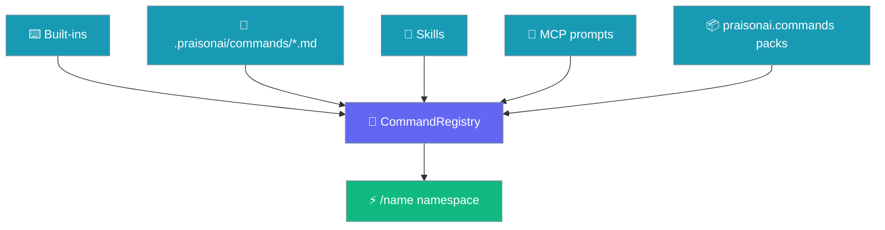
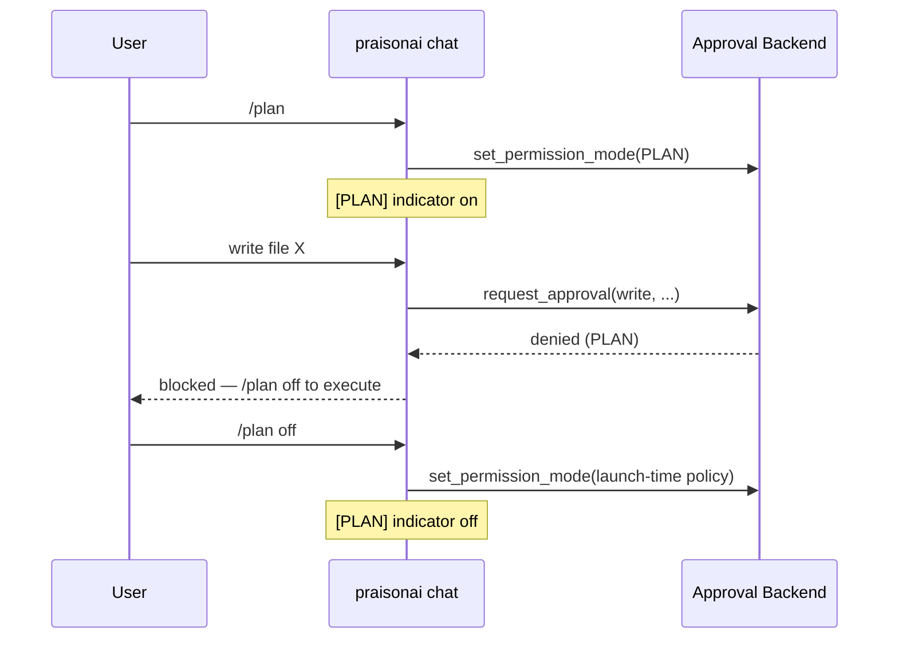

# Slash Commands

PraisonAI CLI provides interactive slash commands for quick actions during your AI coding sessions. Inspired by Gemini CLI, Codex CLI, and Claude Code, these commands give you powerful control without leaving the terminal.

## Overview

Slash commands start with `/` and provide quick access to common operations in interactive mode.

```bash
❯ /help
❯ /tools
❯ /clear
❯ /exit
```

<Note>`/cmd` invokes registered commands. For a one-shot **shell command** in the same session, use `!cmd` (or `!!cmd` to attach output as context) — see [Shell Escape](/docs/features/interactive-shell-escape). The `!` prefix bypasses the command registry entirely.</Note>

## Available Commands (Interactive Mode)

When using `praisonai chat`, these commands are available:

| Command | Description |
|---------|-------------|
| `/help` | Show available commands and features |
| `/exit` | Exit interactive mode |
| `/quit` | Exit interactive mode (alias) |
| `/clear` | Clear the screen |
| `/tools` | List available tools |
| `/profile` | Toggle profiling (show timing breakdown) |
| `/model [name]` | Show or change current model |
| `/plan` | Toggle read-only plan mode (`/plan off` to exit; `/plan <task>` to plan) |
| `/code-review [file] [--staged]` | Review the uncommitted diff for bugs — see [Code Review & Security Review](/docs/features/interactive-code-review) |
| `/security-review [file] [--staged]` | Review the uncommitted diff against a security rubric (injection, authz, secrets, path traversal, SSRF, crypto) |
| `/stats` | Show session statistics (tokens, cost) |
| `/compact` | Compress conversation history |
| `/undo` | Undo last response |
| `/queue` | Show queued messages |
| `/queue clear` | Clear the message queue |
| `/queue remove N` | Remove message at index N |

## Built-in Tools

Interactive mode includes 5 built-in tools that the AI can use:

| Tool | Description | Risk Level |
|------|-------------|------------|
| `read_file` | Read contents of a file | Low |
| `write_file` | Write content to a file | High (requires approval) |
| `list_files` | List files in a directory | Low |
| `execute_command` | Run shell commands | Critical (requires approval) |
| `internet_search` | Search the web | Low |

```bash
❯ /tools
Available tools: 5
  • read_file
  • write_file
  • list_files
  • execute_command
  • internet_search
```

## Usage Examples

### Starting Interactive Mode

```bash
# Start interactive mode
praisonai chat

# Or use short flag
praisonai -i
```

### Using Help

```bash
❯ /help

Commands:
  /help          - Show this help
  /exit          - Exit interactive mode
  /clear         - Clear screen
  /tools         - List available tools
  /profile       - Toggle profiling (show timing breakdown)
  /model [name]  - Show or change current model
  /code-review [file|--staged]     - Review the uncommitted diff for bugs (read-only)
  /security-review [file|--staged] - Audit the uncommitted diff for security issues (read-only)
  /stats         - Show session statistics (tokens, cost)
  /compact       - Compress conversation history
  /undo          - Undo last response
  /queue         - Show queued messages
  /queue clear   - Clear message queue

@ Mentions:
  @file.txt      - Include file content in prompt
  @src/          - Include directory listing

Features:
  • File operations (read, write, list)
  • Shell command execution
  • Web search
  • Context compression for long sessions
  • Queue messages while agent is processing
```

### Listing Tools

```bash
❯ /tools
Available tools: 5
  • read_file
  • write_file
  • list_files
  • execute_command
  • internet_search
```

### Using Tools via Natural Language

```bash
# List files
❯ list files in current folder
Here are the files: README.md, main.py, config.yaml

# Read a file
❯ read the contents of README.md
The file contains: # My Project...

# Search the web
❯ search the web for latest AI news
Here are the results from web search...
```

## Python API

You can also use slash commands programmatically:

```python
from praisonai.cli.features import SlashCommandHandler

# Create handler
handler = SlashCommandHandler()

# Check if input is a command
if handler.is_command("/help"):
    result = handler.execute("/help")
    print(result)

# Get completions for auto-complete
completions = handler.get_completions("/he")
# Returns: ["/help"]
```

### Custom Commands

File-based commands in `.praisonai/commands/*.md` auto-register in interactive mode with `kind=CommandKind.CUSTOM`. Disable discovery with `SlashCommandHandler(discover_custom=False)`. See [Custom Agents & Commands](/features/custom-agents-commands).

## Unified Command Registry

Inside `praisonai code` (and the REPL / async TUI) a single `CommandRegistry` aggregates every command source into one `/name` namespace — built-ins, your `.praisonai/commands/*.md` files, skills, MCP prompts, and pip-installed command packs all appear together.



| Source | Where commands come from |
|--------|--------------------------|
| `BuiltinCommandSource` | Built-in `/help`, `/undo`, `/sessions`, etc. |
| `CustomCommandSource` | `.praisonai/commands/*.md` files (same path as `praisonai run --command`) |
| `SkillCommandSource` | Skills exposed as `/name` |
| `MCPPromptCommandSource` | MCP prompts exposed as `/name` |
| `praisonai.commands` entry point | Any pip-installed command pack |

### Custom commands work inside `praisonai code`

Create `.praisonai/commands/mydeploy.md`:

```markdown
Deploy to {{env}}: run tests, build the image, push to registry.
```

Then invoke it inside the interactive session:

```text
> /mydeploy staging
```

This runs the exact interpolated template that `praisonai run --command mydeploy staging` would — full parity between interactive and CLI invocation.

<Note>
`/help` lists every discovered command and `command list --all` shows the same unified namespace. Later sources override earlier ones on a name collision, matching user/project override semantics.
</Note>

### Ship a command pack as a pip package

Register a command source in the `praisonai.commands` entry-point group in `pyproject.toml`:

```toml
[project.entry-points."praisonai.commands"]
my_commands = "my_package.commands:make_source"
```

The registry discovers it on start — no user code needed. A broken pack is logged and skipped, never taking down the registry.

Register programmatic slash commands:

```python
from praisonai.cli.features.slash_commands import (
    SlashCommand, SlashCommandHandler, CommandKind
)

# Define custom command
def my_command(args, context):
    return {"type": "custom", "message": f"Args: {args}"}

custom_cmd = SlashCommand(
    name="mycommand",
    description="My custom command",
    handler=my_command,
    kind=CommandKind.ACTION,
    aliases=["mc"]
)

# Register it
handler = SlashCommandHandler()
handler.register(custom_cmd)

# Use it
result = handler.execute("/mycommand arg1 arg2")
```

### Command Context

Provide context for commands that need session data:

```python
from praisonai.cli.features.slash_commands import CommandContext

# Create context with session data
context = CommandContext(
    total_tokens=5000,
    total_cost=0.015,
    prompt_count=10,
    current_model="gpt-4o",
    session_start_time=time.time() - 300
)

# Set context on handler
handler.set_context(context)

# Now /cost will show real data
result = handler.execute("/cost")
```

## Integration with Interactive Mode

Slash commands are automatically available in interactive mode:

```bash
praisonai chat

>>> Hello, help me with my code
[AI responds...]

>>> /cost
Session: abc12345
Tokens: 1,500
Cost: $0.0045

>>> /model gpt-4o-mini
Model changed to: gpt-4o-mini

>>> /exit
Goodbye!
```

## Command Reference

### /help

Show help information.

```bash
/help              # Show all commands
/help <command>    # Show help for specific command
```

### /cost

Display session cost and token statistics.

```bash
/cost              # Show full statistics
```

### /model

Manage the AI model.

```bash
/model             # Show current model
/model <name>      # Change to specified model
```

### /plan

Toggle a persistent **read-only mode** — writes, edits, deletions, and shell commands are denied until you leave the mode.

| Usage | What it does |
|-------|--------------|
| `/plan` | Toggle on/off. First call enters read-only mode; second call exits and restores your launch-time policy. |
| `/plan off` | Explicit exit. Writes/edits/commands are allowed again. |
| `/plan <task>` | Enter read-only mode and produce a step-by-step plan for `<task>` under enforcement. Run `/plan off` to execute. |

```bash
> /plan
[PLAN] Plan mode enabled — read-only. Writes/edits/commands are denied until you /plan off.

> /plan refactor the auth module
[PLAN] Creating plan (read-only) for: refactor the auth module
...

> /plan off
Plan mode disabled. Writes/edits/commands are allowed again.
```

While plan mode is active, the status bar shows `[PLAN]`.



<Note>
`/plan` flips the live approval backend into `PermissionMode.PLAN`, which unconditionally denies write / edit / delete / bash / shell tool calls. Exiting restores the **launch-time policy** (e.g. `accept-edits`, `bypass`) — not `default` — so a session that started with `--approval accept-edits` keeps that policy after `/plan off`.

Launch a session already in plan mode with `praisonai chat --approval plan` (or `praisonai code --plan`). See [Permission Modes](/features/permission-modes) for the full mode reference.
</Note>

**Real-world flow:**

<Steps>
<Step title="Open on an unfamiliar codebase">
Start `praisonai chat` with your default policy.
</Step>
<Step title="Enter read-only mode">
Type `/plan` — the status bar flips to `[PLAN]` and writes/edits are denied.
</Step>
<Step title="Explore freely">
Ask `read src/auth/*.py and summarise the auth flow` — the agent uses read-only tools only.
</Step>
<Step title="Plan a fix under enforcement">
Type `/plan design a fix for the token-refresh bug` — the agent produces a step-by-step plan with no accidental edits mid-plan.
</Step>
<Step title="Exit and execute">
Type `/plan off` — the status bar clears and your launch-time policy returns. Now `apply the plan` writes and edits normally.
</Step>
</Steps>

### /diff

Show workspace file changes made this session, from the session-start baseline to the working directory.

```bash
/diff              # all changes since session start
/diff --turn       # only the last turn's changes (alias: -t)
/diff <file>       # changes to a single file since session start
```

`/diff` is backed by the checkpoint engine, so it requires auto-checkpointing: set `checkpoints.auto: true` in config **or** `PRAISONAI_CHECKPOINTS=on`. When disabled, `/diff` prints an enable hint and does nothing else.

<Note>
See [Checkpoints](/features/checkpoints) for the underlying engine and the "In-session `/diff`" deep-dive, including the `--turn` vs. session-scope decision guide.
</Note>

### /commit

Commit changes with an AI-generated message.

```bash
/commit            # Auto-generate commit message
/commit "message"  # Use custom message
```

### /profile

Toggle profiling to see timing breakdown.

```bash
/profile           # Toggle profiling on/off
```

When enabled, shows timing after each response:
```bash
─── Profiling ───
Import:      0.1ms
Agent setup: 0.3ms
LLM call:    1,234.5ms
Display:     15.2ms
Total:       1,250.1ms
```

### /stats

Show session statistics.

```bash
/stats             # Show token usage and cost
```

Output:
```bash
Session Statistics
  Model:          gpt-4o-mini
  Requests:       5
  Input tokens:   1,234
  Output tokens:  2,567
  Total tokens:   3,801
  Estimated cost: $0.0023
  History turns:  10
```

### /compact

Compress conversation history to save tokens.

```bash
/compact           # Summarize older history
```

This command:
- Keeps the last 2 conversation turns intact
- Summarizes older turns using the LLM
- Reduces token usage for long sessions

### /undo

Undo the last turn. What `/undo` restores depends on whether checkpointing and the session store are wired in.

```bash
/undo              # roll back the last turn
```

| Checkpointing | Session store | `/undo` effect |
|---------------|---------------|----------------|
| Off (default) | n/a | Removes the last assistant + user message pair from history. Workspace files untouched. |
| On, no session store | n/a | Restores workspace files to the previous turn's checkpoint. Conversation history untouched (file-only fallback). |
| On, session store wired (default in `praisonai code`) | wired | Restores workspace files **and** rewinds `chat_history` to the message boundary captured at `checkpoint_turn()`. Diff preview shown first. |

<Note>
The deep-dive lives in [Checkpoints → In-session `/undo` and `/revert`](/features/checkpoints).
</Note>

### /queue

Manage the message queue. Queue messages while the AI agent is processing and they'll be executed in order.

```bash
/queue             # Show all queued messages
/queue clear       # Clear the entire queue
/queue remove N    # Remove message at index N
```

Output when messages are queued:
```bash
❯ /queue
⏳ Processing...

Queued Messages (2):
  0. ↳ Add docstrings to the function
  1. ↳ Create unit tests

Use /queue clear to clear, /queue remove N to remove
```

<Tip>
Type new messages while the agent is processing. They'll be queued and executed automatically in FIFO order.
</Tip>

## Best Practices

1. **Use aliases** - `/h` is faster than `/help`
2. **Check costs regularly** - Use `/cost` to monitor spending
3. **Explore unfamiliar code with `/plan` first** - Read-only enforcement prevents accidental writes while you form a plan; run `/plan off` when you're ready to execute
4. **Commit frequently** - Use `/commit` after each logical change

## Related Features

- [Message Queue](/cli/message-queue) - Full message queue documentation
- [Interactive TUI](/cli/interactive-tui) - Full interactive terminal interface
- [Cost Tracking](/cli/cost-tracking) - Detailed cost monitoring
- [Git Integration](/cli/git-integration) - Git operations
