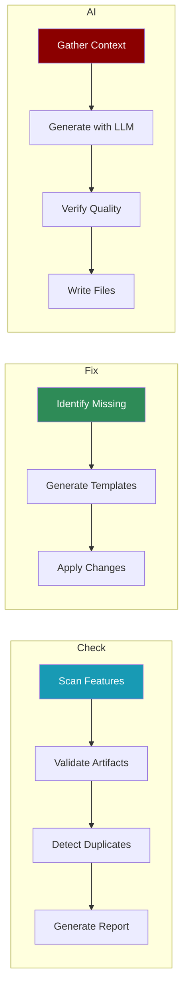

## Overview

The `standardise` command provides tools for managing documentation and examples consistency across the PraisonAI project. It implements the Feature Docs/Examples Protocol (FDEP) to ensure all features have proper documentation and examples.



## Commands

### Check

Check for standardisation issues without making changes.

```bash
praisonai standardise check [OPTIONS]
```

**Options:**
| Option | Type | Default | Description |
|--------|------|---------|-------------|
| `--path`, `-p` | string | `.` | Project root path |
| `--feature` | string | - | Specific feature slug to check |
| `--scope` | choice | `all` | Scope: all, docs, examples, sdk, cli |
| `--ci` | flag | false | CI mode with exit codes |

**Example:**
```bash
# Check all features
praisonai standardise check

# Check specific feature
praisonai standardise check --feature guardrails

# CI mode (returns exit code 1 if issues found)
praisonai standardise check --ci
```

### Report

Generate a detailed standardisation report.

```bash
praisonai standardise report [OPTIONS]
```

**Options:**
| Option | Type | Default | Description |
|--------|------|---------|-------------|
| `--path`, `-p` | string | `.` | Project root path |
| `--format`, `-f` | choice | `text` | Format: text, json, markdown |
| `--output`, `-o` | string | - | Output file path |

**Example:**
```bash
# Text report to stdout
praisonai standardise report

# Markdown report to file
praisonai standardise report --format markdown --output report.md

# JSON report for automation
praisonai standardise report --format json
```

### Fix

Fix standardisation issues by creating missing artifacts.

```bash
praisonai standardise fix [OPTIONS]
```

**Options:**
| Option | Type | Default | Description |
|--------|------|---------|-------------|
| `--path`, `-p` | string | `.` | Project root path |
| `--feature` | string | - | Specific feature slug to fix |
| `--apply` | flag | false | Actually apply changes (default: dry-run) |
| `--no-backup` | flag | false | Don't create backups |

**Example:**
```bash
# Preview what would be fixed (dry-run)
praisonai standardise fix --feature guardrails

# Actually apply fixes
praisonai standardise fix --feature guardrails --apply
```

### Init

Initialise a new feature with all required artifacts.

```bash
praisonai standardise init FEATURE [OPTIONS]
```

**Arguments:**
| Argument | Description |
|----------|-------------|
| `FEATURE` | Feature slug to initialise |

**Options:**
| Option | Type | Default | Description |
|--------|------|---------|-------------|
| `--path`, `-p` | string | `.` | Project root path |
| `--apply` | flag | false | Actually create files |

**Example:**
```bash
# Preview what would be created
praisonai standardise init my-feature

# Create the files
praisonai standardise init my-feature --apply
```

### AI

AI-powered generation of documentation and examples using LLM.

```bash
praisonai standardise ai FEATURE [OPTIONS]
```

**Arguments:**
| Argument | Description |
|----------|-------------|
| `FEATURE` | Feature slug to generate content for |

**Options:**
| Option | Type | Default | Description |
|--------|------|---------|-------------|
| `--type`, `-t` | choice | `all` | Type: docs, examples, all |
| `--apply` | flag | false | Actually create files |
| `--verify` | flag | false | Verify generated content with AI |
| `--model` | string | `gpt-4o-mini` | LLM model to use |
| `--path`, `-p` | string | `.` | Project root path |

**Example:**
```bash
# Preview AI-generated docs
praisonai standardise ai guardrails --type docs

# Generate and apply examples with verification
praisonai standardise ai guardrails --type examples --apply --verify

# Use a different model
praisonai standardise ai guardrails --model gpt-4o --apply
```

### Checkpoint

Create an undo checkpoint before making changes.

```bash
praisonai standardise checkpoint [OPTIONS]
```

**Options:**
| Option | Type | Default | Description |
|--------|------|---------|-------------|
| `--message`, `-m` | string | - | Checkpoint message |
| `--path`, `-p` | string | `.` | Repository path |

**Example:**
```bash
# Create checkpoint with message
praisonai standardise checkpoint -m "Before AI generation"
```

### Undo

Undo to a previous checkpoint.

```bash
praisonai standardise undo [OPTIONS]
```

**Options:**
| Option | Type | Default | Description |
|--------|------|---------|-------------|
| `--checkpoint` | string | - | Specific checkpoint ID |
| `--list` | flag | false | List available checkpoints |
| `--path`, `-p` | string | `.` | Repository path |

**Example:**
```bash
# List available checkpoints
praisonai standardise undo --list

# Undo to specific checkpoint
praisonai standardise undo --checkpoint standardise-checkpoint-20240101-120000

# Undo to previous checkpoint
praisonai standardise undo
```

### Redo

Redo after an undo operation.

```bash
praisonai standardise redo [OPTIONS]
```

**Options:**
| Option | Type | Default | Description |
|--------|------|---------|-------------|
| `--path`, `-p` | string | `.` | Repository path |

**Example:**
```bash
praisonai standardise redo
```

## Workflow Example

```bash
# 1. Check current state
praisonai standardise check

# 2. Create checkpoint before changes
praisonai standardise checkpoint -m "Before standardisation"

# 3. Generate missing examples with AI
praisonai standardise ai guardrails --type examples --apply --verify

# 4. If something went wrong, undo
praisonai standardise undo

# 5. Generate report for documentation
praisonai standardise report --format markdown --output STANDARDISATION.md
```

## Exit Codes

When using `--ci` mode:

| Code | Meaning |
|------|---------|
| 0 | No issues found |
| 1 | Issues found |
| 2 | Error running check |

## See Also

- [Documentation Guide](/docs/guides/documentation)
- [Examples Guide](/docs/guides/examples)
- [Contributing](/docs/contributing)
