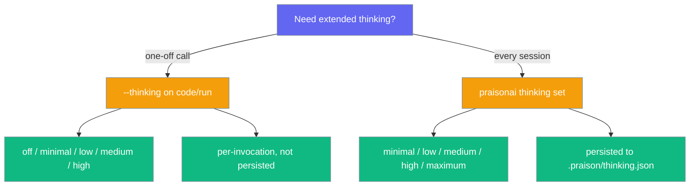

The `thinking` command manages thinking token budgets for complex reasoning.

## Quick Start

```bash
# Show current thinking budget
praisonai thinking status
```

## Usage

### Show Status

```bash
praisonai thinking status
```

**Expected Output:**
```
╭─ Thinking Budget ────────────────────────────────────────────────────────────╮
│  Level: medium                                                               │
│  Max Tokens: 8,000                                                           │
│  Adaptive: enabled                                                           │
╰──────────────────────────────────────────────────────────────────────────────╯
```

### Set Budget Level

```bash
praisonai thinking set high
```

Available levels: `minimal`, `low`, `medium`, `high`, `maximum`

## Use from `code` / `run`

For a single invocation without persisting a global default, pass `--thinking` on `praisonai code` or `praisonai run`:

```bash
praisonai code --thinking high "Refactor src/utils.py for readability"
praisonai run --thinking medium "Plan a release checklist"
```



| Surface | Levels | Persisted? |
|---|---|---|
| `--thinking` on `code` / `run` | `off`, `minimal`, `low`, `medium`, `high` | No — per invocation |
| `praisonai thinking set` | `minimal`, `low`, `medium`, `high`, `maximum` | Yes — `.praison/thinking.json` |

Unknown `--thinking` values fail closed with exit code `1` before any work runs.

### Show Usage Stats

```bash
praisonai thinking stats
```

## Python API

```python
from praisonaiagents.thinking import ThinkingBudget, ThinkingTracker

# Use predefined levels
budget = ThinkingBudget.high()  # 16,000 tokens

# Track usage
tracker = ThinkingTracker()
session = tracker.start_session(budget_tokens=16000)
tracker.end_session(session, tokens_used=12000)

summary = tracker.get_summary()
print(f"Utilization: {summary['average_utilization']:.1%}")
```

## See Also

- [Thinking Budgets Feature](/docs/features/thinking-budgets)
