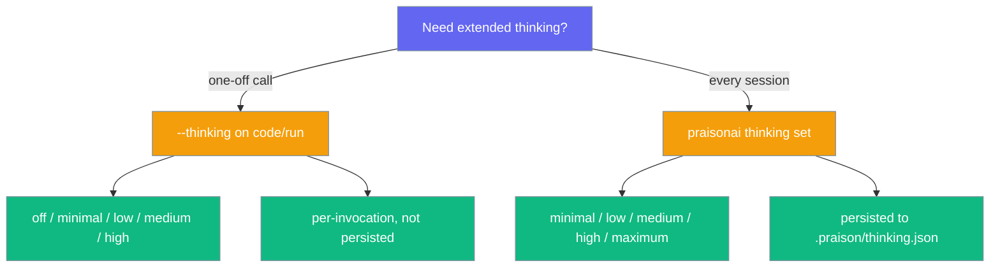

The `thinking` command manages thinking token budgets for complex reasoning.

## Quick Start

```bash
# Show current thinking budget
praisonai thinking status
```

## Usage

### Show Status

```bash
praisonai thinking status
```

**Expected Output:**
```
╭─ Thinking Budget ────────────────────────────────────────────────────────────╮
│  Level: medium                                                               │
│  Max Tokens: 8,000                                                           │
│  Adaptive: enabled                                                           │
╰──────────────────────────────────────────────────────────────────────────────╯
```

### Set Budget Level

```bash
praisonai thinking set high
```

Available levels: `minimal`, `low`, `medium`, `high`, `maximum`

### Show Usage Stats

```bash
praisonai thinking stats
```

## Python API

```python
from praisonaiagents.thinking import ThinkingBudget, ThinkingTracker

# Use predefined levels
budget = ThinkingBudget.high()  # 16,000 tokens

# Track usage
tracker = ThinkingTracker()
session = tracker.start_session(budget_tokens=16000)
tracker.end_session(session, tokens_used=12000)

summary = tracker.get_summary()
print(f"Utilization: {summary['average_utilization']:.1%}")
```

## Use from `code` / `run`

Both `praisonai code` and `praisonai run` accept a `--thinking` flag that sets the reasoning effort for that single invocation without touching `.praison/thinking.json`.



```bash
# Per-invocation — does not persist
praisonai code --thinking high "Refactor src/utils.py for readability"
praisonai run --thinking medium "Plan a release checklist for v4.7"
```

### Canonical levels for `--thinking`

| Level | Token budget | Notes |
|---|---|---|
| `off` | none | Disables extended thinking |
| `minimal` | 2,000 | |
| `low` | 4,000 | |
| `medium` | 8,000 | |
| `high` | 16,000 | |

Values are case-insensitive. An unknown value exits `1` before any work runs:
```
Error: Invalid thinking level: <x>. Valid levels: off, minimal, low, medium, high
```

### Difference vs `praisonai thinking set`

| | `--thinking` flag | `praisonai thinking set` |
|---|---|---|
| Scope | Single invocation | Global (all sessions) |
| Persisted | No | Yes (`.praison/thinking.json`) |
| Levels | `off`, `minimal`, `low`, `medium`, `high` | `minimal`, `low`, `medium`, `high`, `maximum` |
| Extra level | — | `maximum` (32,000 tokens) |

Use `--thinking` for one-off calls; use `praisonai thinking set` when you want a higher budget to apply every time.

## See Also

- [Thinking Budgets Feature](/docs/features/thinking-budgets)
- [Code](/docs/cli/code) - `--thinking` on the code command
- [Run](/docs/cli/run) - `--thinking` on the run command
