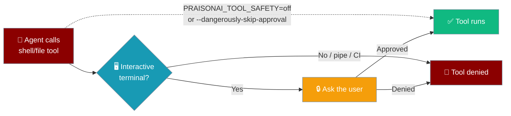

PraisonAI asks before running anything dangerous: a fresh install on an interactive terminal will prompt you the first time a tool wants to touch your files or shell.



## Default Behaviour

PraisonAI is **safe by default**: a fresh install on an interactive terminal asks before running dangerous tools (shell exec, file writes, code execution). Pipes, CI runners, and redirected I/O fall back to **deny by default** — dangerous tools never run unattended without an explicit policy.

| Context | Default | What you see |
|---------|---------|--------------|
| Interactive terminal (TTY) | **Ask** | An approval prompt appears the first time a dangerous tool is called |
| Pipe / CI / non-TTY | **Deny** | The dangerous tool is hard-denied before it runs |
| `PRAISONAI_TOOL_SAFETY=off` set | **Bypass** | Legacy ungated behaviour; nothing is gated |
| `approval=False` (Python) | **Deny** | Same as non-TTY: deny-by-default, no prompt |
| `approval="bypass"` (Python) | **Bypass** | Same as `PRAISONAI_TOOL_SAFETY=off` |

```python
from praisonaiagents import Agent

# Safe-by-default: on a TTY, asks; off-TTY, denies — no kwargs needed
agent = Agent(name="Dev Agent", instructions="Help with file ops",
              tools=["write_file", "execute_command"])
agent.start("create a hello.txt file")
```

A session counts as interactive only when **both** `sys.stdin` and `sys.stdout` are TTYs. This avoids surprises in CI / Docker / scheduled-task contexts.

## Bypassing the Prompt

### Per-run bypass — `--dangerously-skip-approval`

For one-off runs you trust completely:

```bash
praisonai code "rename src/ to lib/" --dangerously-skip-approval
```

This is identical to `--no-safe`. Both set `PRAISONAI_TOOL_SAFETY=off` for the subprocess and run dangerous tools without prompting.

### Session-wide bypass — `PRAISONAI_TOOL_SAFETY=off`

For a whole shell session:

```bash
export PRAISONAI_TOOL_SAFETY=off
praisonai code "..."   # all calls in this shell skip the safe-default ask
```

Accepted values that bypass: `off`, `full`, `none`, `0`, `false` (case-insensitive). Any other value falls back to the `default` preset.

### Python-level bypass — `approval="bypass"`

```python
from praisonaiagents import Agent

agent = Agent(name="Dev Agent", approval="bypass", tools=["write_file", "execute_command"])
agent.start("task")
```

Use `approval=False` instead if you want **deny-by-default** without the prompt (CI-style behaviour from inside a TTY-attached process).

## Declarative Permissions

Pre-declare allow/deny rules for CI-safe runs. See [Declarative Permissions](/docs/features/declarative-permissions).

```bash
praisonai run agents.yaml \
  --allow 'read:*' \
  --allow 'bash:git *' \
  --deny 'bash:rm *' \
  --permission-default ask
```

| Flag | Description |
|---|---|
| `--allow <pattern>` | Allow matching tool calls (repeatable) |
| `--deny <pattern>` | Deny matching tool calls (repeatable) |
| `--permissions <file>` | Load rules from YAML or JSON |
| `--permission-default <action>` | Default for unmatched patterns (`allow`, `deny`, `ask`) |

## Overview

Certain tools are marked with risk levels and require approval before execution:

| Risk Level | Tools | Default Behavior |
|------------|-------|------------------|
| **CRITICAL** | `execute_command`, `kill_process`, `execute_code` | Always prompts |
| **HIGH** | `write_file`, `delete_file`, `move_file`, `copy_file`, `edit_file`, `apply_patch` | Always prompts |
| **MEDIUM** | `evaluate`, `crawl`, `scrape_page` | Always prompts |
| **LOW** | (none by default) | Always prompts |

<Note>
When called from PraisonAI's interactive modes (`praison "prompt"` / `praisonai tui launch`) under the default `approval_mode="auto"`, `edit_file` and `apply_patch` are context-approved by the interactive-tools loader so they don't block on a console prompt. In `manual` / `scoped` modes the normal HIGH-risk prompt with diff preview still applies. See [Interactive Tools](/docs/cli/interactive-tools#edit-tools-targeted-atomic-edits).
</Note>

## YAML Configuration

Configure approval settings in your YAML configuration file using the `approval:` block:

```yaml
permissions:
  "read:*": allow
  "bash:rm *": deny

approval:
  enabled: true                    # bool, default false
  backend: "console"               # console | slack | telegram | discord | webhook | http | agent | auto | none
  approve_all_tools: false         # bool, default false
  timeout: 60                      # float seconds, default null (no timeout); accepts "none"
  approve_level: "high"            # low | medium | high | critical, default null
  guardrails: "..."                # optional guardrail description
```

### Shorthand Forms

```yaml
approval: true                # → enabled, console backend
approval: false               # → disabled
approval: slack               # → enabled, slack backend
approval: null                # → disabled
```

### Legacy YAML Aliases (Backward Compatible)

| Legacy key | New key |
|---|---|
| `backend_name` | `backend` |
| `all_tools` | `approve_all_tools` |
| `approval_timeout` | `timeout` |

Primary keys win when both are present.

### Validation

Unknown keys now raise `ValueError` with the list of allowed keys — silent typos no longer pass through undetected.

### CLI ⇄ YAML ⇄ Python Mapping

All three surfaces use the same unified configuration:

| CLI flag | YAML key | Python field |
|---|---|---|
| `--trust` | N/A (use `backend: auto`) | `backend="auto"`, `enabled=True` |
| `--approval <backend>` | `backend: <backend>` | `backend="<backend>"`, `enabled=True` |
| `--approve-all-tools` | `approve_all_tools: true` | `approve_all_tools=True` |
| `--approval-timeout <sec>` | `timeout: <sec>` | `timeout=<sec>` |
| `--approve-level <level>` | `approve_level: <level>` | `approve_level="<level>"` |
| `--guardrail "<text>"` | `guardrails: "<text>"` | `guardrails="<text>"` |

---

## `praisonai code` Safety Flags

| Flag | Default | Effect |
|------|---------|--------|
| `--safe / --no-safe` | **`--safe` (ON)** | Safe mode ON by default. `--no-safe` sets `PRAISONAI_TOOL_SAFETY=off` and restores legacy ungated behaviour. |
| `--dangerously-skip-approval` | OFF | Skip all approval prompts and run dangerous tools unguarded. Equivalent to `--no-safe`. |
| `--trust` | OFF | Auto-approve all tool executions. |
| `--approval <backend>` | — | Route approvals to a backend (`console`, `slack`, …). |

---

## Auto-Approve All Tools (`--trust`)

Use the `--trust` flag to auto-approve all tool executions without prompting:

```bash
praisonai "hello world" --trust
```

<Frame>
  
</Frame>

### Usage

```bash
# Auto-approve all tools (use with caution!)
praisonai "run ls -la command" --trust
```

**Output:**
```
⚠️  Trust mode enabled - all tool executions will be auto-approved
Tools used: execute_command
[directory listing...]
```

<Warning>
The `--trust` flag bypasses all safety prompts. Only use this when you trust the AI's actions completely, such as in controlled environments or for testing.
</Warning>

## Level-Based Approval (`--approve-level`)

Use `--approve-level` to auto-approve tools up to a specific risk level:

```bash
# Auto-approve low, medium, and high risk tools
# Still prompt for critical tools
praisonai "write to file and run command" --approve-level high
```

**Available levels:**
- `low` - Only auto-approve low risk tools
- `medium` - Auto-approve low and medium risk tools
- `high` - Auto-approve low, medium, and high risk tools
- `critical` - Auto-approve all tools (same as `--trust`)

### Examples

```bash
# Auto-approve only low risk tools
praisonai "task" --approve-level low

# Auto-approve up to medium risk
praisonai "task" --approve-level medium

# Auto-approve up to high risk (prompt for critical)
praisonai "task" --approve-level high

# Auto-approve everything (same as --trust)
praisonai "task" --approve-level critical
```

## Approval Backend (`--approval`)

Use `--approval` to route tool approvals to a specific backend — Slack, Telegram, Discord, a webhook, or more:

```bash
# Route approvals to Slack
praisonai "deploy to production" --approval slack

# Route approvals to Telegram
praisonai "delete old logs" --approval telegram

# Auto-approve everything (same as --trust)
praisonai "run tests" --approval auto

# Interactive console prompt (default)
praisonai "clean up files" --approval console
```

### Available Backends

| Value | Backend | Required Env Vars |
|-------|---------|-------------------|
| `console` | Interactive terminal prompt (default) | — |
| `slack` | Slack Block Kit message + reply polling | `SLACK_BOT_TOKEN`, `SLACK_CHANNEL` |
| `telegram` | Telegram inline keyboard + polling | `TELEGRAM_BOT_TOKEN`, `TELEGRAM_CHAT_ID` |
| `discord` | Discord embed + text reply polling | `DISCORD_BOT_TOKEN`, `DISCORD_CHANNEL_ID` |
| `webhook` | POST to HTTP endpoint + poll for decision | `APPROVAL_WEBHOOK_URL` |
| `http` | Local web dashboard (browser-based) | — |
| `agent` | Delegate to an AI reviewer agent | — |
| `auto` | Auto-approve all (same as `--trust`) | — |
| `none` | Disable approval entirely | — |

### Works With All CLI Commands

```bash
# Direct prompt
praisonai "task" --approval slack

# Run command
praisonai run "task" --approval telegram

# Chat / TUI
praisonai chat --approval discord
```

<Tip>
  For full configuration of each backend (timeouts, polling intervals, custom parameters), see [Approval Protocol](/features/approval-protocol).
</Tip>

---

## Programmatic Control

```python
from praisonaiagents import Agent

# Safe-by-default (TTY = ask, non-TTY = deny)
agent = Agent(name="Dev Agent", tools=["write_file", "execute_command"])

# Deny-by-default without any prompt (CI-style)
agent = Agent(name="CI Agent", approval=False, tools=["write_file"])

# Full bypass — legacy ungated behaviour
agent = Agent(name="Trusted Agent", approval="bypass", tools=["write_file"])
```

Custom approval callbacks:

```python
from praisonaiagents.approval import (
    set_approval_callback,
    ApprovalDecision,
    remove_approval_requirement,
    add_approval_requirement
)

# Auto-approve all tools
def auto_approve(function_name, arguments, risk_level):
    return ApprovalDecision(approved=True, reason="Auto-approved")

set_approval_callback(auto_approve)

# Level-based approval
def level_approve(function_name, arguments, risk_level):
    levels = {"low": 1, "medium": 2, "high": 3, "critical": 4}
    if levels.get(risk_level, 4) <= levels["high"]:
        return ApprovalDecision(approved=True)
    return ApprovalDecision(approved=False, reason="Too risky")

set_approval_callback(level_approve)

# Remove approval requirement for specific tool
remove_approval_requirement("execute_command")

# Add approval requirement for custom tool
# Custom tools registered here are also honoured on the interactive ask path (ConsoleBackend)
add_approval_requirement("my_dangerous_tool", risk_level="high")
```

<Note>
Custom tools registered via `add_approval_requirement(...)` are now gated on the interactive `ConsoleBackend` ask path, not just the deny path. Previously, registry-required custom tools were only blocked in non-interactive mode — that gap is now closed.
</Note>

## Risk Level Reference

### Critical Risk Tools
- `execute_command` - Run shell commands
- `kill_process` - Terminate processes
- `execute_code` - Execute arbitrary code

### High Risk Tools
- `write_file` - Write to files
- `delete_file` - Delete files
- `move_file` - Move/rename files
- `copy_file` - Copy files
- `edit_file` - Edit existing file content
- `apply_patch` - Apply a patch/diff to files
- `execute_query` - Database queries

### Medium Risk Tools
- `evaluate` - Evaluate expressions
- `crawl` - Web crawling
- `scrape_page` - Web scraping

## Best Practices

<AccordionGroup>
<Accordion title="Use deny-by-default in CI">
Set `approval=False` (or let the non-TTY default kick in automatically) so an agent run in CI never silently executes a destructive tool, even on a misconfigured runner that mistakenly attaches a TTY.

```python
from praisonaiagents import Agent

# Explicit deny-by-default for CI pipelines
agent = Agent(name="CI Agent", approval=False, tools=["write_file", "execute_command"])
agent.start("run tests and update report")
```
</Accordion>

<Accordion title="Never set PRAISONAI_TOOL_SAFETY=off in a shared shell profile">
`PRAISONAI_TOOL_SAFETY=off` is a per-session bypass intended for one-off trusted runs. Putting it in `~/.bashrc` or `~/.zshrc` re-introduces every safety gap that the safe-by-default system closed — any agent running in that shell will execute dangerous tools unguarded.
</Accordion>

<Accordion title="For development/testing: use --trust for faster iteration">
When you're actively monitoring the AI's actions, `--trust` speeds up iteration by skipping prompts entirely.

```bash
praisonai "refactor utils.py" --trust
```
</Accordion>

<Accordion title="For production scripts: use --approve-level high">
Allow file operations but still require approval for shell commands:

```bash
praisonai "generate and save report" --approve-level high
```
</Accordion>
</AccordionGroup>

## Related Features

<CardGroup cols={2}>
  <Card title="Approval Protocol" icon="shield-check" href="/features/approval-protocol">
    All approval backends (Slack, Telegram, Discord, Webhook, HTTP, Agent)
  </Card>
  <Card title="Sandbox Execution" icon="shield-halved" href="/docs/cli/sandbox-execution">
    Secure isolated command execution
  </Card>
  <Card title="Autonomy Modes" icon="robot" href="/docs/cli/autonomy-modes">
    Control AI autonomy levels
  </Card>
  <Card title="Tool Tracking" icon="wrench" href="/docs/cli/tool-tracking">
    Monitor tool usage
  </Card>
</CardGroup>
