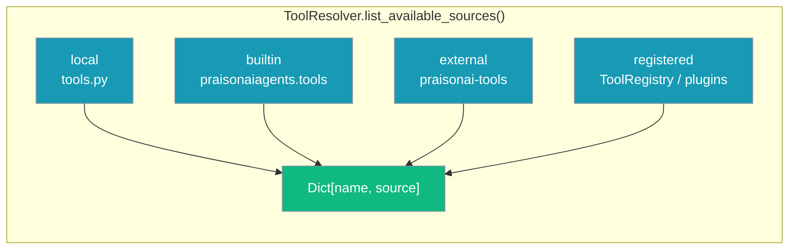

`ToolResolver.list_available_sources()` is the single entry point for discovering tools from every source — local `tools.py`, built-in agents tools, the `praisonai-tools` package, and registered or plugin tools.

## Quick Start

```python
from praisonai.tool_resolver import ToolResolver

resolver = ToolResolver()
sources = resolver.list_available_sources()

# sources is a dict of {tool_name: source_label}
print(f"Total tools available: {len(sources)}")
for name, source in list(sources.items())[:10]:
    print(f"  {name}: {source}")
```

## Filter by Source Bucket

```python
from praisonai.tool_resolver import ToolResolver

resolver = ToolResolver()
sources = resolver.list_available_sources()

local      = [n for n, s in sources.items() if s == "local"]
builtin    = [n for n, s in sources.items() if s == "builtin"]
external   = [n for n, s in sources.items() if s == "external"]
registered = [n for n, s in sources.items() if s == "registered"]

print(f"Local tools ({len(local)}):      {local}")
print(f"Built-in tools ({len(builtin)}): {builtin[:5]}...")
print(f"External tools ({len(external)}): {external[:5]}...")
print(f"Registered tools ({len(registered)}): {registered}")
```

**Source bucket reference:**

| Source | What it includes |
|--------|-----------------|
| `local` | Functions and classes from your local `tools.py` |
| `builtin` | Tools shipped with `praisonaiagents.tools` |
| `external` | Tools from the optional `praisonai-tools` package |
| `registered` | Tools added via `ToolRegistry.register_function()` or a `praisonai.tool_sources` entry-point plugin |

## Check a Single Tool

```python
from praisonai.tool_resolver import ToolResolver

resolver = ToolResolver()

# has_tool() uses the same chain without loading the callable
if resolver.has_tool("internet_search"):
    source = resolver.list_available_sources().get("internet_search")
    print(f"internet_search is available from: {source}")
```

## CLI Equivalent

```bash
# Same resolver-backed enumeration from the command line
praisonai tools list

# Filter by bucket
praisonai tools list --source registered
praisonai tools list --source external
praisonai tools list --source local
praisonai tools list --source builtin

# Full diagnostics (same source of truth)
praisonai tools doctor
```

## How It Works



`list_available_sources()` reflects the same four-source chain that `resolve()` uses at run time. Every name returned can be passed to `resolve(name)` and will load successfully — no more "visible in list, fails at runtime" mismatches.

## Legacy Discovery (Pre-#2476)

<AccordionGroup>
<Accordion title="Raw importlib / TOOL_MAPPINGS pattern (deprecated)">
Before `ToolResolver.list_available_sources()` was introduced in [PR #2476](https://github.com/MervinPraison/PraisonAI/pull/2476), each surface walked its own partial subset:

```python
# Old pattern — only sees TOOL_MAPPINGS, misses registered/plugin tools
from praisonaiagents import TOOL_MAPPINGS

for tool_name in list(TOOL_MAPPINGS.keys())[:10]:
    print(f"Built-in: {tool_name}")
```

```python
# Old pattern — only sees praisonai_tools, misses builtin/registered
import praisonai_tools.tools as ext_tools
for name in dir(ext_tools):
    if not name.startswith('_') and callable(getattr(ext_tools, name, None)):
        print(f"Found: {name}")
```

Use `ToolResolver.list_available_sources()` instead — it covers all four sources in a single call.
</Accordion>
</AccordionGroup>

## Related

<CardGroup cols={2}>
<Card title="Tools" icon="wrench" href="/docs/cli/tools">
  Source label table and --source filter
</Card>
<Card title="Tool Resolver" icon="wrench" href="/docs/features/tool-resolver">
  Full resolver API and source buckets
</Card>
<Card title="Tools Doctor" icon="stethoscope" href="/docs/cli/tools-doctor">
  Diagnostic output backed by the resolver
</Card>
</CardGroup>
