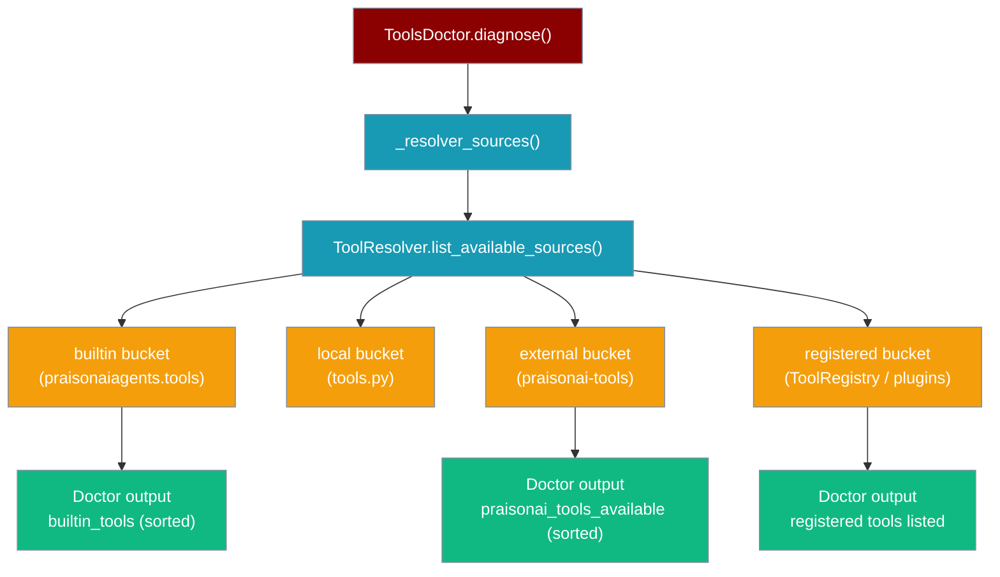

Tools Doctor diagnoses tool availability, checks dependencies, and reports issues with your PraisonAI tools setup — using the same `ToolResolver` source of truth as `praisonai tools list`.

## Quick Start

```python
from praisonai.templates import ToolsDoctor

doctor = ToolsDoctor()
result = doctor.diagnose()

print(f"praisonai-tools installed: {result['praisonai_tools_installed']}")
print(f"Built-in tools: {len(result['builtin_tools'])}")
print(f"Issues found: {len(result['issues'])}")

# Human-readable output
print(doctor.diagnose_human())
```

## How Tools Are Discovered

`ToolsDoctor` delegates to `ToolResolver.list_available_sources()` — the same resolution chain that `praisonai tools list` and `resolve()` use at run time. This guarantees that the doctor's counts and listings match what actually loads when agents run.



**Bucket mapping:**

| Doctor field | Resolver bucket | What's included |
|---|---|---|
| `builtin_tools` | `builtin` | Tools from `praisonaiagents.tools`, sorted alphabetically |
| `praisonai_tools_available` | `external` | Tools from `praisonai-tools` package, sorted alphabetically |
| Registered tools (new) | `registered` | Tools from `ToolRegistry.register_function()` or entry-point plugins |

<Note>
**Registered tools are now visible.** As of [PR #2642](https://github.com/MervinPraison/PraisonAI/pull/2642), tools registered via `ToolRegistry.register_function()` and core SDK entry-point plugins appear in the doctor's output. Previously they were silently omitted — they resolved correctly at runtime but were invisible to diagnostics.

See [`ToolResolver.list_available_sources()`](/docs/features/tool-resolver#configuration-options) and the [source label table](/docs/cli/tools) for full details.
</Note>

### Fallback Behaviour

When `ToolResolver` cannot be imported (e.g. the `praisonai` wrapper package is not installed), the doctor falls back to:

- `_get_builtin_tools()` → direct `praisonaiagents.tools.TOOL_MAPPINGS` scan (unsorted, legacy labels)
- `_get_praisonai_tools_list()` → direct `praisonai_tools` module scan (unsorted, legacy labels)

The fallback path covers the same `builtin` and `praisonai-tools` sources, but misses the `local`, `external` (resolver-filtered), and `registered` buckets. Install the `praisonai` wrapper to get full resolver-backed diagnostics.

## Python API

```python
from praisonai.templates import ToolsDoctor

# Create doctor instance
doctor = ToolsDoctor()

# Run full diagnostics
result = doctor.diagnose()

# Check results
print(f"praisonai-tools installed: {result['praisonai_tools_installed']}")
print(f"Built-in tools: {len(result['builtin_tools'])}")
print(f"Issues found: {len(result['issues'])}")

# Get JSON output
json_output = doctor.diagnose_json()

# Get human-readable output
human_output = doctor.diagnose_human()
print(human_output)
```

## Diagnostic Results

The `diagnose()` method returns a dictionary with:

| Key | Type | Description |
|-----|------|-------------|
| `praisonai_tools_installed` | bool | Whether praisonai-tools package is installed |
| `praisonaiagents_installed` | bool | Whether praisonaiagents is installed |
| `builtin_tools` | list | Sorted list of available built-in tool names (resolver `builtin` bucket) |
| `praisonai_tools_available` | list | Sorted list of tools from praisonai-tools (resolver `external` bucket) |
| `custom_tools_dirs` | list | Status of custom tool directories |
| `tool_dependencies` | dict | Optional dependencies for known tools |
| `issues` | list | Detected issues with severity and hints |

`builtin_tools` and `praisonai_tools_available` are **sorted alphabetically** — matching `praisonai tools list` output order. The legacy fallback path returns them in dict-iteration order (unsorted).

## Custom Tool Directories

The doctor checks these default directories for custom tools:

- `~/.praison/tools` (primary)
- `~/.config/praison/tools` (XDG-friendly)

```python
# Check with additional custom directories
doctor = ToolsDoctor(custom_dirs=["./my-tools", "~/shared-tools"])
result = doctor.diagnose()

for dir_info in result["custom_tools_dirs"]:
    status = "✓" if dir_info["exists"] else "✗"
    print(f"{status} {dir_info['path']} ({dir_info['tool_count']} tools)")
```

## Tool Dependencies

The doctor checks optional dependencies for known tools:

```python
result = doctor.diagnose()

for tool, deps in result["tool_dependencies"].items():
    missing = [d["name"] for d in deps if not d["available"]]
    if missing:
        print(f"Tool '{tool}' missing: {', '.join(missing)}")
```

## Issue Severity Levels

| Severity | Description |
|----------|-------------|
| `error` | Critical issue preventing tool usage |
| `warning` | Non-critical issue that may affect functionality |
| `info` | Informational message about optional features |

## Related

<CardGroup cols={2}>
<Card title="Tools Doctor CLI" icon="terminal" href="/docs/cli/tools-doctor-cli">
  Run diagnostics from the command line
</Card>
<Card title="Tool Resolver" icon="wrench" href="/docs/features/tool-resolver#configuration-options">
  list_available_sources() and source buckets
</Card>
<Card title="Tools" icon="wrench" href="/docs/cli/tools">
  Source label table and CLI reference
</Card>
<Card title="Strict Tools Mode" icon="shield-check" href="/docs/cli/strict-tools">
  Fail-fast dependency checking for templates
</Card>
</CardGroup>
