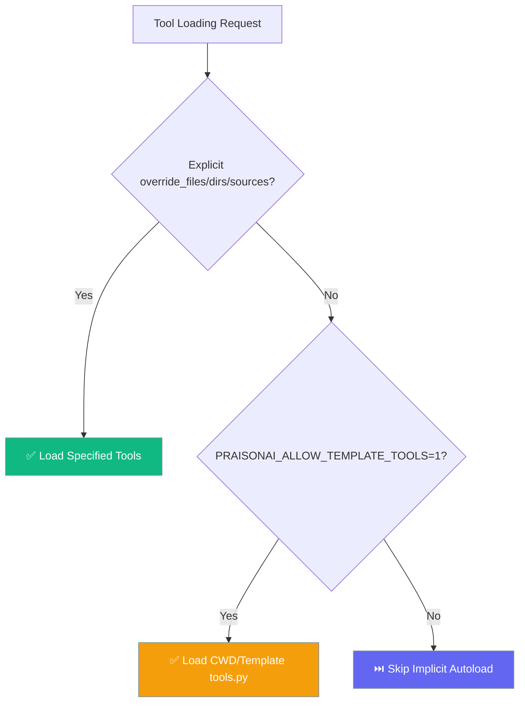

## Overview

The Tool Override system allows loading custom tools from Python files, modules, and directories at runtime. This enables extending PraisonAI with custom functionality without modifying the core package.

## Python API

### ToolOverrideLoader

```python
from praisonai.templates import ToolOverrideLoader

loader = ToolOverrideLoader()

# Load tools from a Python file
tools = loader.load_from_file("./my_tools.py")
print(f"Loaded tools: {list(tools.keys())}")

# Load tools from a module
tools = loader.load_from_module("mypackage.tools")

# Load tools from a directory
tools = loader.load_from_directory("~/.praisonai/tools")
```

### Context Manager Pattern

Use the context manager for temporary tool overrides:

```python
from praisonai.templates import ToolOverrideLoader

loader = ToolOverrideLoader()

with loader.override_context(
    files=["./custom_tools.py"],
    directories=["./more_tools"]
) as tools:
    # Tools are available within this context
    print(f"Available tools: {list(tools.keys())}")
    
# Tools are cleaned up after context exits
```

### Creating Tool Registry with Overrides

```python
from praisonai.templates.tool_override import create_tool_registry_with_overrides

# Create registry with custom tools
registry = create_tool_registry_with_overrides(
    override_files=["./my_tools.py"],
    override_dirs=["~/.praisonai/tools"],
    include_defaults=True  # Include built-in tools
)

# Resolution order (highest priority first):
# 1. Override files (explicit)
# 2. Override directories
# 3. Default custom dirs (~/.praisonai/tools)
# 4. Built-in tools
```

## Default Custom Tool Directories

PraisonAI checks these locations for custom tools:

| Priority | Path | Description |
|----------|------|-------------|
| 1 | `./tools.py` | Current working directory (opt-in only — requires `PRAISONAI_ALLOW_TEMPLATE_TOOLS=1`) |
| 2 | `~/.praisonai/tools` | Primary user tools |
| 3 | `~/.config/praison/tools` | XDG-friendly location |

<Warning>
Implicit `tools.py` autoload from the current working directory is **disabled by default**. To enable this legacy behavior, set `PRAISONAI_ALLOW_TEMPLATE_TOOLS=1`. For new projects, prefer explicit `override_files` or `override_dirs` configuration.
</Warning>

```python
loader = ToolOverrideLoader()
default_dirs = loader.get_default_tool_dirs()
for d in default_dirs:
    print(f"Default dir: {d}")
```

## Discovering Tools Without Execution

Discover tool names without importing/executing code:

```python
loader = ToolOverrideLoader()

# Uses AST parsing - safe, no code execution
tool_names = loader.discover_tools_in_directory("./tools")
print(f"Found tools: {tool_names}")
```

## Security

### Local Paths Only

Remote URLs are rejected by default:

```python
from praisonai.templates import ToolOverrideLoader, SecurityError

loader = ToolOverrideLoader()

try:
    # This will raise SecurityError
    loader.load_from_file("https://example.com/tools.py")
except SecurityError as e:
    print(f"Blocked: {e}")
```

### Safe Defaults

- Only local file paths are allowed
- Implicit `tools.py` autoload from CWD or template directories is disabled by default — opt in with `PRAISONAI_ALLOW_TEMPLATE_TOOLS=1`
- Discovery uses AST parsing (no execution)
- Context manager ensures cleanup

### Opting in to implicit `tools.py` autoload

For legacy workflows that depend on automatic `tools.py` loading:

```bash
export PRAISONAI_ALLOW_TEMPLATE_TOOLS=1
```

**Accepted truthy values:** `1`, `true`, `yes`, `on` (case-insensitive, whitespace-stripped)

**Recommended approach:** Use explicit `override_files`, `override_dirs`, or `tools_sources` configuration instead of relying on implicit autoload. See [Security Environment Variables](/docs/features/security-environment-variables#praisonai_allow_template_tools) for more details.



## Custom Tool File Format

Create a Python file with functions:

```python
# my_tools.py

def my_search_tool(query: str) -> str:
    """Search for information."""
    return f"Results for: {query}"

def my_calculator(expression: str) -> float:
    """Evaluate a math expression."""
    return eval(expression)  # Use safely in production

# Private functions (starting with _) are ignored
def _helper():
    pass
```
