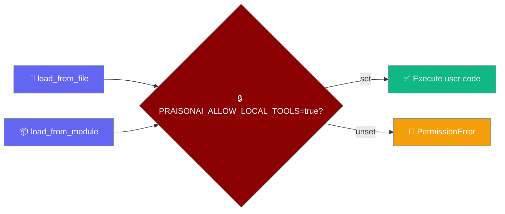
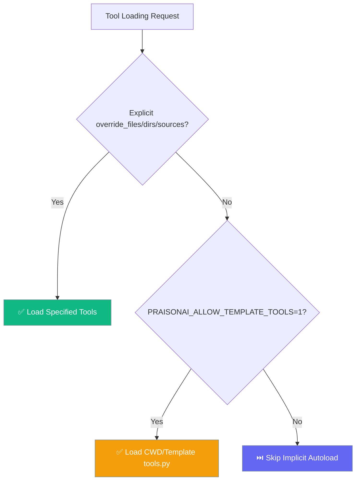

## Overview

The Tool Override system allows loading custom tools from Python files, modules, and directories at runtime. This enables extending PraisonAI with custom functionality without modifying the core package.

## Python API

### ToolOverrideLoader

```python
from praisonai.templates import ToolOverrideLoader

loader = ToolOverrideLoader()

# Load tools from a Python file
tools = loader.load_from_file("./my_tools.py")
print(f"Loaded tools: {list(tools.keys())}")

# Load tools from a module — requires PRAISONAI_ALLOW_LOCAL_TOOLS=true.
# Importing a module runs its code, so this raises PermissionError when unset.
tools = loader.load_from_module("mypackage.tools")

# Load tools from a directory
tools = loader.load_from_directory("~/.praisonai/tools")
```

Both `load_from_file` and `load_from_module` funnel through the same
`PRAISONAI_ALLOW_LOCAL_TOOLS=true` gate as the runtime loader. `load_from_module`
raises `PermissionError` when the env var is unset:

```text
PermissionError: PRAISONAI_ALLOW_LOCAL_TOOLS=true is required to import user modules (refusing to load 'mypackage.tools').
```


```mermaid
graph LR
    A[📄 load_from_file] --> Gate{🔒 PRAISONAI_ALLOW_LOCAL_TOOLS=true?}
    B[📦 load_from_module] --> Gate
    Gate -->|set| Exec[✅ Execute user code]
    Gate -->|unset| Deny[🛑 PermissionError]

    classDef entry fill:#6366F1,stroke:#7C90A0,color:#fff
    classDef gate fill:#8B0000,stroke:#7C90A0,color:#fff
    classDef ok fill:#10B981,stroke:#7C90A0,color:#fff
    classDef deny fill:#F59E0B,stroke:#7C90A0,color:#fff

    class A,B entry
    class Gate gate
    class Exec ok
    class Deny deny
```

### Context Manager Pattern

Use the context manager for temporary tool overrides:

```python
from praisonai.templates import ToolOverrideLoader

loader = ToolOverrideLoader()

with loader.override_context(
    files=["./custom_tools.py"],
    directories=["./more_tools"]
) as tools:
    # Tools are available within this context
    print(f"Available tools: {list(tools.keys())}")
    
# Tools are cleaned up after context exits
```

### Creating Tool Registry with Overrides

```python
from praisonai.templates.tool_override import create_tool_registry_with_overrides

# Create registry with custom tools
registry = create_tool_registry_with_overrides(
    override_files=["./my_tools.py"],
    override_dirs=["~/.praisonai/tools"],
    include_defaults=True  # Include built-in tools
)

# Wrapper-owned resolution order (highest priority first):
# 1. Override files       (explicit CLI --tools)
# 2. Override directories (explicit CLI --tools-dir)
# 3. Template tools_sources (from TEMPLATE.yaml)
# 4. Template-local tools.py / cwd tools.py  (autoload — requires
#    PRAISONAI_ALLOW_TEMPLATE_TOOLS=1)
# 5. Default custom dirs (~/.praison/tools, ~/.config/praison/tools)
#
# A tools_source (step 3) that resolves to a dotted module is denied when
# PRAISONAI_ALLOW_LOCAL_TOOLS is unset. The skip is now logged at warning
# (logger.warning("skipping tools_source ...")) instead of being swallowed
# silently.
#
# praisonai-tools package discovery and praisonaiagents built-ins are
# NOT re-implemented here (fix: #3122). They are owned by
# praisonai_code.tool_resolver.ToolResolver, which resolve_tools()
# consults after this registry. See /docs/features/tool-resolver.
```

## Default Custom Tool Directories

PraisonAI loads custom tools from two distinct groups.

**Autoload-gated files** load only when `PRAISONAI_ALLOW_TEMPLATE_TOOLS=1`:

| Path | Description |
|------|-------------|
| `./tools.py` | Current working directory autoload |
| `<template_dir>/tools.py` | Template-local autoload (recipe directory) |

**Default custom dirs** are always scanned when `include_defaults=True`:

| Path | Description |
|------|-------------|
| `~/.praison/tools` | Primary user tools |
| `~/.config/praison/tools` | XDG-friendly location |

<Warning>
Implicit `tools.py` autoload from the current working directory is **disabled by default**. To enable this legacy behavior, set `PRAISONAI_ALLOW_TEMPLATE_TOOLS=1`. For new projects, prefer explicit `override_files` or `override_dirs` configuration.
</Warning>

```python
loader = ToolOverrideLoader()
default_dirs = loader.get_default_tool_dirs()
for d in default_dirs:
    print(f"Default dir: {d}")
```

---

## What the wrapper does not own

`create_tool_registry_with_overrides()` used to re-implement `praisonai-tools` package discovery and a `praisonaiagents` built-ins hook of its own. As of **PraisonAI#3122** those are handled only by the canonical [`ToolResolver`](/features/tool-resolver), so:

- **You do not need to install `praisonai-tools` differently** — `resolve_tools()` still finds it via the canonical resolver.
- **A tool that resolved through the wrapper's old package-discovery block still resolves** — just one implementation away, in the resolver instead.
- **The template/CWD `tools.py` autoload stays in the wrapper on purpose.** It carries the `PRAISONAI_ALLOW_TEMPLATE_TOOLS` gate (with a skip-on-error contract and explicit-template-dir-outside-CWD support) that the resolver's `PRAISONAI_ALLOW_LOCAL_TOOLS` + CWD-boundary gate does not provide.


```mermaid
graph LR
    subgraph "Wrapper — create_tool_registry_with_overrides"
        A[📄 --tools files] --> B[📂 --tools-dir]
        B --> C[📝 TEMPLATE.yaml tools_sources]
        C --> D[🔒 tools.py autoload<br/>PRAISONAI_ALLOW_TEMPLATE_TOOLS=1]
        D --> E[🗂️ ~/.praison/tools defaults]
    end

    subgraph "Canonical resolver — consulted after"
        F[📦 praisonai-tools package]
        G[🔧 praisonaiagents built-ins]
        H[🔌 core SDK plugins]
    end

    E --> F
    F --> G
    G --> H

    classDef wrapper fill:#F59E0B,stroke:#7C90A0,color:#fff
    classDef gate fill:#8B0000,stroke:#7C90A0,color:#fff
    classDef canonical fill:#189AB4,stroke:#7C90A0,color:#fff

    class A,B,C,E wrapper
    class D gate
    class F,G,H canonical
```

---

## Discovering Tools Without Execution

Discover tool names without importing/executing code:

```python
loader = ToolOverrideLoader()

# Uses AST parsing - safe, no code execution
tool_names = loader.discover_tools_in_directory("./tools")
print(f"Found tools: {tool_names}")
```

## Security

### Local Paths Only

Remote URLs are rejected by default:

```python
from praisonai.templates import ToolOverrideLoader, SecurityError

loader = ToolOverrideLoader()

try:
    # This will raise SecurityError
    loader.load_from_file("https://example.com/tools.py")
except SecurityError as e:
    print(f"Blocked: {e}")
```

### Safe Defaults

- Only local file paths are allowed
- Both `load_from_file` and `load_from_module` require `PRAISONAI_ALLOW_LOCAL_TOOLS=true` (same gate as the runtime loader) — `load_from_module` raises `PermissionError` when it is unset
- Implicit `tools.py` autoload from CWD or template directories is disabled by default — opt in with `PRAISONAI_ALLOW_TEMPLATE_TOOLS=1`
- Discovery uses AST parsing (no execution)
- Context manager ensures cleanup

### Opting in to implicit `tools.py` autoload

For legacy workflows that depend on automatic `tools.py` loading:

```bash
export PRAISONAI_ALLOW_TEMPLATE_TOOLS=1
```

**Accepted truthy values:** `1`, `true`, `yes`, `on` (case-insensitive, whitespace-stripped)

**Recommended approach:** Use explicit `override_files`, `override_dirs`, or `tools_sources` configuration instead of relying on implicit autoload. See [Security Environment Variables](/docs/features/security-environment-variables#praisonai_allow_template_tools) for more details.


```mermaid
flowchart TD
    A[Tool Loading Request] --> B{Explicit override_files/dirs/sources?}
    B -->|Yes| C[✅ Load Specified Tools]
    B -->|No| D{PRAISONAI_ALLOW_TEMPLATE_TOOLS=1?}
    D -->|Yes| E[✅ Load CWD/Template tools.py]
    D -->|No| F[⏭️ Skip Implicit Autoload]
    
    classDef explicit fill:#10B981,stroke:#7C90A0,color:#fff
    classDef implicit fill:#F59E0B,stroke:#7C90A0,color:#fff
    classDef skip fill:#6366F1,stroke:#7C90A0,color:#fff
    
    class C explicit
    class E implicit
    class F skip
```

## Custom Tool File Format

Create a Python file with functions:

```python
# my_tools.py

def my_search_tool(query: str) -> str:
    """Search for information."""
    return f"Results for: {query}"

def my_calculator(expression: str) -> float:
    """Evaluate a math expression."""
    raise ValueError("Use AST safe math — see /features/custom-tool-safe-eval")

# Private functions (starting with _) are ignored
def _helper():
    pass
```
