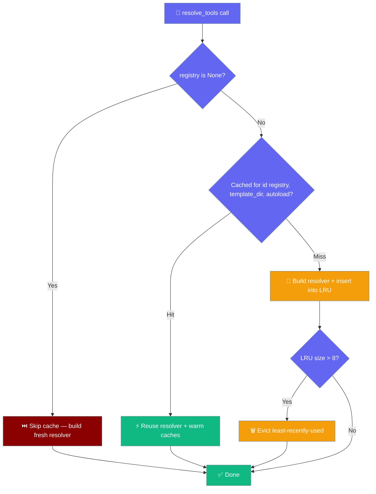

`resolve_tools()` from `praisonai.templates.tool_override` delegates name resolution to the canonical [`ToolResolver`](/docs/features/tool-resolver). It preserves the `registry=` override layer and the `PRAISONAI_ALLOW_TEMPLATE_TOOLS` security gate for template-dir `tools.py` autoload, then falls back to name-variation matching (lowercase, `_`/`-`, `_tool`, `Tool` suffix) when the canonical lookup misses.

Tools previously invisible to recipe/template resolution are now reachable:

- Wrapper `ToolRegistry.register_function()` registrations
- Tools from the `praisonai-tools` external package
- Core SDK plugin-registered tools

## Code Usage

```python
from praisonai.templates.tool_override import (
    create_tool_registry_with_overrides,
    resolve_tools,
)

# Create registry
registry = create_tool_registry_with_overrides(include_defaults=True)

# Resolve tool names to callables
tools = resolve_tools(["shell_tool", "internet_search"], registry=registry)

# Check resolution
for tool in tools:
    print(f"Resolved: {tool.__name__} from {tool.__module__}")
```

```python
from praisonai.templates.tool_override import resolve_tools

# Resolve with custom registry
registry = create_tool_registry_with_overrides(
    override_files=["my_tools.py"],
    tools_sources=["praisonai_tools.video"],
)

tools = resolve_tools(["my_custom_tool"], registry=registry)
```

`resolve_tools()` no longer implicitly loads `<template_dir>/tools.py` unless `PRAISONAI_ALLOW_TEMPLATE_TOOLS=1`. See [Tools Override → Security](/docs/cli/tools-override#security) for details.

---

## Resolver memoisation

Repeated calls to `resolve_tools()` over the **same `registry` object** share one underlying [`ToolResolver`](/docs/features/tool-resolver) instead of rebuilding it per call.

```python
from praisonai.templates.tool_override import (
    create_tool_registry_with_overrides,
    resolve_tools,
)

# Build the registry ONCE, then pass it into resolve_tools() per agent/step.
registry = create_tool_registry_with_overrides(include_defaults=True)

for agent_tools in agent_tool_lists:
    # Second and later calls reuse the memoised resolver + warm caches.
    tools = resolve_tools(agent_tools, registry=registry)
```

Callers invoke `resolve_tools()` once per agent/step over the same registry, so the memoised resolver preserves its per-instance caches and skips re-executing local `tools.py` on every agent build.

### When the cache is skipped

Passing `registry=None` (the default) builds a fresh registry per call, whose `id()` is never stable across calls, so `resolve_tools()` skips memoisation — one call, one resolver. Pass an explicit `registry=` to keep the memoisation benefit across a workflow build.

### Cache size

The memo cache is a bounded LRU with capacity `8`. In a long-running process (multi-tenant gateway, hot-reload dev server, workflow batch runner) that builds many workflows over distinct registries, least-recently-used resolvers are evicted so memory does not grow with the number of builds.

<Tip>
Resolution order, resolved results, and the `PRAISONAI_ALLOW_TEMPLATE_TOOLS` security gate are unchanged — memoisation only affects how many times the resolver is *constructed*, not what it returns.
</Tip>



---

## Related

<Note>
**Canonical resolution chain:** `resolve_tools()` is a thin wrapper around [`ToolResolver`](/docs/features/tool-resolver) with a registry-override layer on top. See [Templates Module → Tool Override](/docs/sdk/praisonai/templates#tool-override-integration) for programmatic usage.

**Alternative Tool Resolution:** For YAML-based tool resolution with per-agent isolation, see [YAML Tools - Tool Resolver](/docs/tools/yaml-tools#per-agent-tool-resolution) which uses the `praisonai.tool_resolver` module directly.

**CLI flag (`--tools name1,name2`)** also goes through `praisonai.tool_resolver.ToolResolver` (PR #1857). Recipe and template `tools:` lists share the same five-source chain as of PR #2059.
</Note>
