Track every step an autonomous agent takes — tool calls, decisions, errors — then optionally judge execution quality with an LLM.

```mermaid
graph LR
    subgraph "Tracker Flow"
        A["📝 Task"] --> B["🤖 Agent"]
        B --> C["📊 Steps"]
        C --> D["⚖️ Judge"]
    end

    classDef input fill:#6366F1,stroke:#7C90A0,color:#fff
    classDef process fill:#F59E0B,stroke:#7C90A0,color:#fff
    classDef output fill:#10B981,stroke:#7C90A0,color:#fff

    class A input
    class B,C process
    class D output
```



## Quick Start

<Steps>

<Step title="Run a Tracked Task">
```bash
praisonai tracker run "Search for Python best practices and summarize"
```
</Step>

<Step title="Run and Judge">
```bash
praisonai tracker judge "What is 2+2? Use execute_code" --expected "4"
```
</Step>

</Steps>

---

## Commands

### `tracker run`

Execute a task with full step tracking.

```bash
praisonai tracker run "Read config.yaml and explain its structure" -v
```

| Option | Description |
|--------|-------------|
| `--max-iterations`, `-n` | Maximum iterations (default: 20) |
| `--model`, `-m` | LLM model to use |
| `--tools`, `-t` | Comma-separated tool names |
| `--extended`, `-e` | Include extended tools (may require API keys) |
| `--verbose`, `-v` | Show full agent output |
| `--live/--no-live` | Live step updates (default: on) |

---

### `tracker judge`

Execute a task, then evaluate the execution trace with an LLM judge. Returns a score (1–10), pass/fail verdict, reasoning, and suggestions.

```bash
# Default criteria (task completion, tool selection, efficiency, error handling, output quality)
praisonai tracker judge "Calculate fibonacci(10) using execute_code"

# Custom criteria
praisonai tracker judge "Search for AI news" --criteria "Must use search_web tool"

# Accuracy mode with expected output
praisonai tracker judge "What is 2+2?" --expected "4" --threshold 8.0

# Use a different model for judging
praisonai tracker judge "List files in /tmp" --judge-model gpt-4o
```

| Option | Description |
|--------|-------------|
| `--criteria`, `-c` | Custom evaluation criteria |
| `--expected`, `-e` | Expected output for accuracy check |
| `--threshold` | Pass/fail score threshold, 1–10 (default: 7.0) |
| `--max-iterations`, `-n` | Maximum iterations (default: 20) |
| `--model`, `-m` | LLM model for the agent |
| `--judge-model` | LLM model for the judge (defaults to agent model) |
| `--tools`, `-t` | Comma-separated tool names |
| `--extended` | Include extended tools |
| `--verbose`, `-v` | Show full agent output |

**Output:**

```
⚖️ Agent Tracker + Judge

Phase 1: Executing task...
  [1] ✅ tool_call: execute_code (0.16s)
  [2] ✅ chat: thinking (3.21s)

Phase 2: Judging execution...
╭── ⚖️ Judge Verdict ──────────────────────────────────╮
│ ✅ Score: 9.0/10  ██████████████████░░                │
│ Threshold: 7.0  |  Verdict: PASS                     │
│                                                       │
│ Reasoning:                                            │
│ Correctly calculated 2+2=4 using execute_code tool.   │
╰───────────────────────────────────────────────────────╯
💡 Suggestions:
  • Streamline output to focus on final result
```

---

### `tracker tools`

List all available tools.

```bash
praisonai tracker tools
```

---

### `tracker batch`

Run multiple tasks from a JSON file and compare results.

```bash
praisonai tracker batch tasks.json -o results.json
```

| Option | Description |
|--------|-------------|
| `--max-iterations`, `-n` | Max iterations per task |
| `--model`, `-m` | LLM model |
| `--output`, `-o` | Output JSON file |

---

## Default Tools

The tracker includes **23 built-in tools** — no API keys required:

| Category | Tools |
|----------|-------|
| **Web** | `search_web`, `internet_search`, `web_crawl`, `scrape_page`, `extract_text`, `extract_links` |
| **Files** | `read_file`, `write_file`, `list_files`, `copy_file`, `move_file`, `delete_file`, `get_file_info` |
| **System** | `execute_command`, `list_processes`, `get_system_info` |
| **Code** | `execute_code`, `analyze_code`, `format_code`, `lint_code` |
| **Scheduling** | `schedule_add`, `schedule_list`, `schedule_remove` |

Use `--extended` to also load tools that need API keys (Tavily, Exa, Crawl4AI, You.com).

---

## How the Judge Works


The judge evaluates five dimensions by default:

1. **Task Completion** — Did the agent finish the task?
2. **Tool Selection** — Were the right tools used?
3. **Efficiency** — Minimal unnecessary steps?
4. **Error Handling** — Graceful error recovery?
5. **Output Quality** — Accurate and useful result?

Override with `--criteria` for domain-specific evaluation.

---

## Best Practices

<AccordionGroup>
  <Accordion title="Use judge for CI/CD quality gates">
    Run `tracker judge` with `--threshold 8.0` in your pipeline to catch regressions in agent behavior.
  </Accordion>

  <Accordion title="Set --max-iterations low for testing">
    Use `--max-iterations 5` during development to get fast feedback loops.
  </Accordion>

  <Accordion title="Use --expected for deterministic tasks">
    For math, code execution, or factual queries, pass `--expected` to enable accuracy scoring.
  </Accordion>

  <Accordion title="Separate agent and judge models">
    Use `--judge-model gpt-4o` with a cheaper agent model to get high-quality evaluation without increasing agent costs.
  </Accordion>
</AccordionGroup>

---

## Related

<CardGroup cols={2}>
  <Card title="Eval" icon="chart-line" href="/docs/cli/eval">
    Evaluation framework for agents
  </Card>
  <Card title="Autonomy Modes" icon="robot" href="/docs/cli/autonomy-modes">
    Configure agent autonomy levels
  </Card>
</CardGroup>
