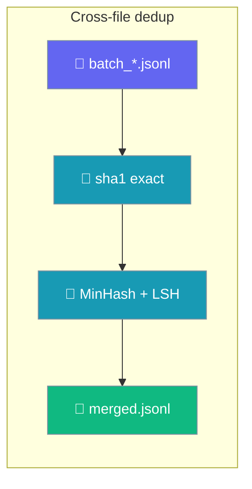
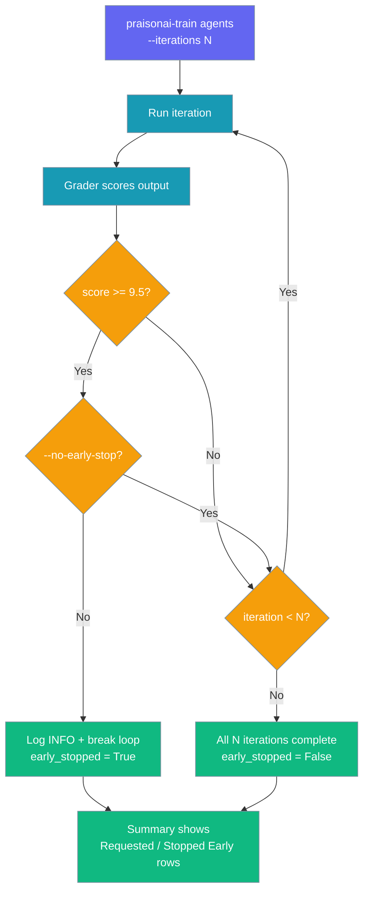

The `train` command group covers LLM fine-tuning and iterative agent training.

## Usage

```bash
praisonai train {generate|validate|benchmark|dedup|llm|agents|list|show|apply}
```

<Note>
Every `praisonai train <sub>` also runs as `praisonai-train <sub>` when `praisonai-train` is installed on its own.
</Note>

## Requirements

Pick the install that matches what you want to train.

| Command | Gets you | When to use |
|---------|----------|-------------|
| `pip install praisonai-train` | Agent training via `agents`/`list`/`show`/`apply`, no CUDA/Unsloth; litellm included for LLM-as-Judge grading | Fastest way to try LLM-as-Judge / human-feedback agent training |
| `pip install "praisonai-train[llm]"` | Above + Unsloth/torch stack for `llm` | Fine-tuning a base model |
| `pip install praisonai` | Full stack: `praisonai train ...` routes through the code tier | Standard PraisonAI install |
| `pip install "praisonai[train]"` | Now equivalent to `praisonai` + `praisonai-train[llm]` | Full stack **plus** fine-tuning deps |

<Note>
`pip install "praisonai[train]"` previously installed nothing (empty extra). It now pulls `praisonai-train[llm]`, so it installs the Unsloth stack.
</Note>

<Note>
The `[llm]` extra now needs the modern base stack: `torch>=2.6.0`, `unsloth>=2025.9.1`, `trl>=0.18.2`, `transformers>=4.51.3`. Pinning `torch<2.6` is why install can fail — upgrade torch first. Tested on Python 3.11 with pytorch-cuda 12.4.
</Note>

---

## `praisonai train generate`

Synthesize an instruction dataset from a teacher LLM.

```bash
praisonai train generate [OPTIONS]
```

### Options

| Option | Short | Description | Default |
|--------|-------|-------------|---------|
| `--config` | `-c` | YAML config file (all keys below can live here) | - |
| `--output` | `-o` | Output JSONL file (**required**) | - |
| `--recipe` | `-r` | Recipe name (e.g. `tamil`) or an inline dict | `tamil` |
| `--deployment` | `-d` | Teacher model / Azure deployment name (**required**) | - |
| `--num` | `-n` | Number of examples to generate (**required**) | - |
| `--concurrency` | - | Parallel teacher requests | `32` |
| `--start-offset` | - | Prompt-index offset for disjoint parallel workers | `0` |
| `--snapshot-every` | - | Copy the output to `snapshots/{stem}_{n}.jsonl` every N rows | - |

### YAML-only keys

These have no CLI flag — set them in `--config`.

| Key | Type | Default | Description |
|-----|------|---------|-------------|
| `endpoint` | `str` | env `AZURE_OPENAI_ENDPOINT` / `OPENAI_BASE_URL` | Chat completions endpoint |
| `api_key` | `str` | env `AZURE_OPENAI_KEY` / `OPENAI_API_KEY` | Bearer / Azure api-key |
| `azure` | `bool` | auto | Force Azure vs OpenAI routing |
| `api_version` | `str` | `2024-10-21` | Azure only |
| `max_completion_tokens` | `int` | `2048` | Teacher `max_completion_tokens` |
| `request_timeout` | `int` | `120` | Per-request HTTP timeout (seconds) |
| `dedup_from` | `list` | `[]` | JSONL paths whose `instruction` values are excluded |
| `stop_file` | `path` | `~/.praisonai_train_stop` | Touch this file to halt immediately |
| `snapshot_dir` | `path` | `snapshots` | Directory for `--snapshot-every` snapshots |

### Examples

```bash
# One-command dataset
praisonai train generate -r tamil -d gpt-4o -n 1000 -o data/tamil.jsonl

# Drive everything from YAML
praisonai train generate --config generate.yaml

# Disjoint parallel slice (offset past the first worker)
praisonai train generate -r tamil -d gpt-4o -n 5000 --start-offset 5000 -o data/b.jsonl
```

<Note>
`output` and `num_examples` are validated up-front. The destination file is only truncated after the first row arrives, so a run that fails on credentials or the first request never wipes an existing file. Zero unique rows exits `1`.
</Note>

See [Dataset Tooling](/docs/features/praisonai-train-dataset-tooling) for recipes, dedup, snapshots, and the `generate_dataset()` Python API.

---

## `praisonai train validate`

Quality-check and filter an instruction dataset (dedup, boilerplate/refusal, script purity, diversity).

```bash
praisonai train validate [OPTIONS] DATASET
```

### Options

| Option | Short | Description | Default |
|--------|-------|-------------|---------|
| `dataset` (positional) | - | JSONL dataset to validate (or `input:` in config) | - |
| `--config` | `-c` | YAML config for thresholds | - |
| `--out` | `-o` | Write filtered (kept) rows to this JSONL | - |
| `--no-near-dup` | - | Skip the O(n²) near-dup pass on very large datasets | `false` |

### YAML-only keys

| Key | Type | Default | Description |
|-----|------|---------|-------------|
| `near_dup` | `bool` | `true` | Enable near-duplicate detection |
| `near_dup_jaccard` | `float` | `0.7` | 4-gram Jaccard threshold (≈ Self-Instruct ROUGE-L 0.7) |
| `min_output_chars` | `int` | `20` | Below this, output is dropped as `too_short` |
| `script_range` | `[int, int]` | `[2944, 3071]` | Unicode range that defines the target script |
| `script_drop` | `float` | `0.5` | Drop rows below this script purity |
| `script_flag` | `float` | `0.7` | Flag (but keep) rows between `script_drop` and this |

### Examples

```bash
# Validate and write the clean rows
praisonai train validate data/tamil.jsonl --out data/clean.jsonl

# Drive thresholds from YAML
praisonai train validate --config validate.yaml

# Skip the O(n^2) near-dup pass on a large dataset
praisonai train validate data/big.jsonl --no-near-dup --out data/clean.jsonl
```

The command prints an `in / kept / drops / flags / metrics` report to stdout. Malformed JSONL lines are skipped with a warning — the run still succeeds on the remaining rows.

See [Dataset Tooling](/docs/features/praisonai-train-dataset-tooling) for the full check list and the `score()` / `filter_rows()` Python API.

---

## `praisonai train benchmark`

Measure and rank generation speed across LLM deployments.

```bash
praisonai train benchmark [OPTIONS]
```

### Options

| Option | Short | Description | Default |
|--------|-------|-------------|---------|
| `--config` | `-c` | YAML config file | - |
| `--deployment` | `-d` | Deployment/model to benchmark (repeatable; **required** via flag or config) | - |
| `--n` | `-n` | Requests per deployment | `24` |
| `--concurrency` | - | In-flight requests per deployment | `8` |
| `--api-version` | - | Azure OpenAI api-version | `"2024-10-21"` |
| `--max-tokens` | - | `max_completion_tokens` per request | `2048` |
| `--recipe` | `-r` | Recipe supplying the default prompt | `"tamil"` |
| `--json-mode` / `--no-json-mode` | - | Send the `response_format` JSON hint; disable for endpoints without JSON mode | `True` |
| `--output` | `-o` | Write ranked results as JSON | - |

### YAML-only keys

| Key | Type | Description |
|-----|------|-------------|
| `endpoint` | `str` | Shared endpoint for every target (falls back to `AZURE_OPENAI_*` / `OPENAI_*`) |
| `api_key` | `str` | Shared API key |
| `azure` | `bool` | `true` for Azure OpenAI, `false` for OpenAI-compatible |
| `prompt` | `dict` | Explicit `{system, user}` prompt sent on every request |
| `request_timeout` | `int` | Per-request timeout in seconds (default `180`) |

### Examples

```bash
# Compare two deployments from the environment credentials
praisonai train benchmark -d gpt-4o -d gpt-4o-mini --n 24 --concurrency 8 -o bench.json

# Drive everything from YAML
praisonai train benchmark --config benchmark.yaml

# OpenAI-compatible endpoint without JSON mode
praisonai train benchmark -d llama-3.1-70b --no-json-mode
```

The command prints each target as it finishes, then a table ranked by `rows/min`. `n < 1` or `concurrency < 1` raises `ValueError`; if every request fails the CLI exits `1`.

See [Speed Benchmark](/docs/features/praisonai-train-benchmark) for the `benchmark_deployments()` Python API and cross-endpoint benchmarking.

---

## `praisonai train dedup`

Merge many JSONL files into one deduped file with a single shared exact + MinHash/LSH index — catching the cross-file near-duplicates that per-file `validate` always misses.



```bash
praisonai train dedup FILES... --out MERGED.jsonl \
    [--method minhash|sliding] \
    [--threshold 0.7] \
    [--exact-only]
```

### Options

| Option | Type | Default | Description |
|--------|------|---------|-------------|
| `FILES...` (positional) | `list[Path]` | — | One or more JSONL files to merge and dedup across. Glob expansion happens in the shell (`batch_*.jsonl`). |
| `--out` | `Path` | **required** | Path to write the merged, deduplicated JSONL. |
| `--method` | `str` | `minhash` | Near-dup engine — `minhash` (scalable MinHash + LSH) or `sliding` (bounded look-back window). |
| `--threshold` | `float` | `0.7` | Jaccard threshold above which two rows are treated as near-duplicates. |
| `--exact-only` | flag | `false` | Skip near-dup detection — only sha1 exact matches are removed. Fastest mode. |
| `--config` | `Path` | — | YAML supplying the same keys (`near_dup_method`, `near_dup_window`, `minhash_perm`, `ngram_n`, `minhash_seed`, `near_dup_jaccard`) for reproducible runs. |

### Examples

```bash
# Merge parallel-generation batches, remove exact + near-duplicates
praisonai train dedup batch_*.jsonl --out data/merged.jsonl

# Exact-only, fastest path (no near-dup pass)
praisonai train dedup a.jsonl b.jsonl c.jsonl --out merged.jsonl --exact-only
```

Drive it from YAML for a reproducible config:

```yaml
# dedup.yaml
inputs: [batch_1.jsonl, batch_2.jsonl, batch_3.jsonl]
out: data/merged.jsonl
near_dup_method: minhash
near_dup_jaccard: 0.75
minhash_perm: 128
ngram_n: 4
minhash_seed: 1
```

```bash
praisonai train dedup --config dedup.yaml
```

The command prints a `in / kept / removed` stats block on completion and exits non-zero only on IO errors. The write is atomic — an `--out` that aliases an input is never truncated before its rows are read.

<Card title="Cross-file dedup (Python API)" icon="database" href="/docs/features/praisonai-train-dataset-tooling#cross-file-dedup">
  The `global_dedup()`, `near_dedup()`, and `MinHashLSH` Python API behind this command.
</Card>

---

## `praisonai train llm`

Fine-tune an LLM using Unsloth.

```bash
praisonai train llm [OPTIONS] DATASET
```

### Options

| Option | Short | Description | Default |
|--------|-------|-------------|---------|
| `--model` | `-m` | Base model to fine-tune — Llama, Gemma, Qwen, Mistral, and Phi bases are validated | - |
| `--verbose` | `-v` | Verbose output | `false` |

<Note>
Fine-tuning parameters live in the YAML config, not on the CLI. See [Train → Config.yaml example](/docs/train#configyaml-example) — this now includes `chat_template` (pick the model's chat-template family; omit to use the built-in) and `assistant_only_loss` (mask non-assistant tokens out of the loss; needs a template with `` blocks).
</Note>

### Supported models

The trainer uses each model's own chat template, so `chat_template` is optional — set it only to override.

| Model family | Example `--model` | Optional `chat_template` |
|---|---|---|
| Llama | `unsloth/Meta-Llama-3.1-8B-Instruct-bnb-4bit` | `llama-3.1` / `llama-3` |
| Gemma | `unsloth/gemma-2-2b-it-bnb-4bit` | `gemma` / `gemma-2` |
| Qwen | `unsloth/Qwen2.5-0.5B-Instruct-bnb-4bit` | `qwen-2.5` / `qwen-3` |
| Mistral | `unsloth/mistral-7b-instruct-v0.3-bnb-4bit` | `mistral` |
| Phi | `unsloth/Phi-3-mini-4k-instruct-bnb-4bit` | `phi-3` |

<Card title="Full chat_template reference" icon="graduation-cap" href="/docs/train#model--template-keys">
  Types, defaults, and the fail-fast `ValueError` when no template is available.
</Card>

### Examples

```bash
# Fine-tune with a dataset
praisonai train llm dataset.json

# Fine-tune with a specific base model
praisonai train llm --model llama-3.1 dataset.json

# Fine-tune Gemma or Qwen with their native templates (no config needed)
praisonai train llm dataset.json --model unsloth/gemma-2-2b-it-bnb-4bit
praisonai train llm dataset.json --model unsloth/Qwen2.5-0.5B-Instruct-bnb-4bit
```

### Config keys for LLM fine-tuning

Drive fine-tuning from `config.yaml` (all keys optional and backward compatible).

| Key | Type | Default | Description |
|-----|------|---------|-------------|
| `model` | `str` | — | Alias for `model_name` (parity with `--model`). If both are set, `model_name` wins. |
| `chat_template` | `str` | `None` (model's own) | Force a specific Unsloth chat template — e.g. `"llama-3.1"`, `"gemma"`, `"qwen-2.5"`. Required when the base model's tokenizer has no built-in template, else the trainer raises `ValueError`. |
| `assistant_only_loss` | `"auto" \| bool` | `"auto"` | Compute loss only on assistant turns. `"auto"` probes the tokenizer and masks iff the template supports it; `true` forces on (fails fast at model-prep time if unsupported); `false` forces off. `train_on_responses_only` is accepted as an alias. |
| `dataset[].num_samples` | `int` | — | Train on the first N rows of the split. Positive integer — validated on load. |
| `train` | `bool` | `true` | Set `false` to skip training and publishing. |
| `huggingface_save` | `bool` | `false` | Push merged LoRA to Hugging Face. Requires `hf_model_name`. |
| `huggingface_save_gguf` | `bool` | `false` | Push GGUF quantizations to Hugging Face. Requires `hf_model_name`. |
| `ollama_save` | `bool` | `false` | Push to Ollama. Requires `ollama_model`. |

<Note>
Invalid or unknown YAML keys are reported before training starts. Missing required keys (`model_name`, `max_seq_length`, `dataset`) raise `ValueError` with a minimal example; unknown keys log `WARNING: ignoring unknown config key '...'` and continue.
</Note>

See [Train → Config.yaml example](/docs/train#config-yaml-example) for the full file.

### Publishing

Publishing defaults **off** — set the flag **and** its matching target to push a fine-tuned model.

| To publish to | Set flag | And target |
|---------------|----------|------------|
| Hugging Face (merged) | `huggingface_save: true` | `hf_model_name` |
| Hugging Face (GGUF) | `huggingface_save_gguf: true` | `hf_model_name` |
| Ollama | `ollama_save: true` | `ollama_model` |

Enabling a flag without its target fails fast on load:

```
ValueError: hf_model_name is required when huggingface_save or huggingface_save_gguf is enabled.
ValueError: ollama_model is required when ollama_save is enabled.
```

### Missing-deps behaviour

On a bare `pip install praisonai-train`, `llm` prints one of two messages: `LLM fine-tuning dependencies not installed` with `pip install "praisonai-train[llm]"` when `praisonai-code` is absent, or `Failed to load LLM fine-tuning runner: <ImportError>` when `praisonai-code` is present but a downstream import (torch/unsloth) failed. See [Train](/docs/train) for the full flow.

### Multi-GPU launch

Fine-tune across every GPU on the machine with `torchrun` — `--nproc_per_node` is the number of GPUs.

```bash
torchrun --nproc_per_node=2 -m praisonai_train.train.llm.trainer train --config config.yaml
```

The trainer detects the distributed launch, loads the full model per rank, and lets only rank 0 save and publish. See [Multi-GPU](/docs/features/praisonai-train-multigpu) for the full walkthrough.

### Resume

Set `resume_from_checkpoint: true` in `config.yaml`, then re-run the same command — the trainer picks the latest checkpoint in `output_dir`.

```yaml
# config.yaml
save_strategy: "steps"
save_steps: 50
resume_from_checkpoint: true
```

```bash
praisonai-train llm config.yaml
```

See [Checkpointing](/docs/features/praisonai-train-checkpointing) for `save_total_limit`, best-checkpoint, and early-stopping keys.

### Environment variables

`torchrun` sets the distributed variables; you set only your Hugging Face token.

| Variable | Set by | Purpose |
|----------|--------|---------|
| `LOCAL_RANK` | `torchrun` | This process's GPU index on the node. |
| `WORLD_SIZE` | `torchrun` | Total number of processes / GPUs. |
| `RANK` | `torchrun` | Global process rank (`0` = main process). |
| `UNSLOTH_USE_NEW_MODEL` | trainer | Set to `1` under DDP before unsloth imports (DDP-safe checkpointing). |
| `HF_TOKEN` | **you** | Needed only when publishing to Hugging Face. |

---

## `praisonai train agents`

Train agents through iterative feedback loops.

```bash
praisonai train agents [OPTIONS] [AGENT_FILE]
```

### Options

| Option | Short | Description | Default |
|--------|-------|-------------|---------|
| `--iterations` | `-n` | Maximum training iterations. In LLM mode, stops early when a score reaches 9.5 (use `--no-early-stop` to force all). | `3` |
| `--no-early-stop` | - | Run all `--iterations` even when a score reaches 9.5. | `false` |
| `--human` | `-h` | Use human feedback instead of LLM grading | `false` |
| `--scenarios` | `-s` | Path to scenarios JSON file | - |
| `--input` | `-i` | Single input text for training | - |
| `--expected` | `-e` | Expected output for the input | - |
| `--output` | `-o` | Output directory for training data | - |
| `--model` | `-m` | LLM model for grading | `gpt-4o-mini` |
| `--verbose` / `--quiet` | `-v` / `-q` | Show detailed progress. When `--verbose`, the orchestrator prints its own post-persist summary; a display-only encoding failure there is logged as a warning and does not affect the exit code. | `--verbose` |
| `--dry-run` | - | Show what would happen without running | `false` |
| `--storage-backend` | - | Storage backend: `file`, `sqlite`, or `redis://url` | `file` |
| `--storage-path` | - | Path for storage backend | - |

### Early Stop (LLM mode)

`--iterations N` is a **maximum**, not an exact count. In LLM-as-Judge mode, training stops early as soon as any iteration scores **≥ 9.5** — easy factual prompts often finish in one iteration.



When training stops early, an `INFO` line is logged **even in `--quiet` mode**:

```text
INFO ...orchestrator: Early stop after iteration 1/3 (score 10.0 >= 9.5 threshold). Use no_early_stop=True to run all iterations.
```

Reaching 9.5 on the **final** iteration counts as a full run — `Stopped Early` stays absent from the summary.

Human-in-the-loop mode (`--human`) does not use the 9.5 threshold — the user decides when to stop.

### Examples

```bash
# Simple training with single input
praisonai train agents --input "What is Python?"

# Training with expected output
praisonai train agents --input "What is 2+2?" --expected "4"

# Training with scenarios file
praisonai train agents --scenarios scenarios.json

# Human feedback mode
praisonai train agents --input "Explain AI" --human

# More iterations
praisonai train agents --input "Hello" --iterations 5

# Force all iterations even if a score hits 9.5
praisonai-train agents --input "What is Python?" --iterations 3 --no-early-stop

# See the early-stop INFO line in the console
praisonai-train agents --input "Capital of Italy?" --iterations 3 --verbose

# With agent file
praisonai train agents my_agent.yaml --scenarios scenarios.json
```

### Summary Rows

When training completes, the summary table always shows `Total Iterations`, `Average / Min / Max Score`, `Improvement`, and `Status`. Two extra rows appear only when the run was truncated:

| Row | When it appears | Value |
|-----|-----------------|-------|
| `Requested Iterations` | `requested > completed` | The value passed via `--iterations` |
| `Stopped Early` | `metadata.early_stopped == True` | `Yes (score X.X >= 9.5; use --no-early-stop to run all)` |

The session JSON persists both signals as `metadata.target_iterations` (int) and `metadata.early_stopped` (bool), so tools reading persisted sessions can distinguish "user asked for 3, got 1 due to 9.5" from "user asked for 1, got 1".

### Storage Backend Options

Store training data in different backends.

```bash
# SQLite backend (recommended for production)
praisonai train agents --input "Hello" --storage-backend sqlite --storage-path ~/.praisonai/train.db

# Redis backend (for distributed systems)
praisonai train agents --input "Hello" --storage-backend redis://localhost:6379

# File backend (default)
praisonai train agents --input "Hello" --storage-backend file --storage-path ~/.praisonai/train
```

### Exit Codes

| Exit | Meaning |
|------|---------|
| `0`  | Training completed and the session was persisted. On non-UTF-8 consoles a warning may be printed if the summary display failed to encode. |
| `1`  | Training failed. This includes both runtime exceptions and encoding errors that occur **before** the report is saved. |
| `130`| Interrupted by `Ctrl-C`. |

<Note>
As of PraisonAI 4.6.148+ (upstream commits [`ce17828`](https://github.com/MervinPraison/PraisonAI/commit/ce17828), [`1a6eed3`](https://github.com/MervinPraison/PraisonAI/commit/1a6eed3), fixes [PraisonAI#3040](https://github.com/MervinPraison/PraisonAI/issues/3040)) a display-only encoding error on Windows cp1252 no longer masquerades as a training failure — the session is still saved and the exit code is `0`.
</Note>

---

## `praisonai train list`

List all training sessions.

```bash
praisonai train list [OPTIONS]
```

### Options

| Option | Short | Description | Default |
|--------|-------|-------------|---------|
| `--limit` | `-n` | Max sessions to show | `20` |
| `--json` | `-j` | Output as JSON | `false` |
| `--storage-backend` | - | Storage backend: `file`, `sqlite`, or `redis://url` | `file` |
| `--storage-path` | - | Path for storage backend (file dir or sqlite db path) | - |

### Examples

```bash
# List recent sessions
praisonai train list

# Show more sessions as JSON
praisonai train list --limit 50 --json

# List sessions from a SQLite backend
praisonai train list --storage-backend sqlite --storage-path ~/.praisonai/train.db

# List sessions from Redis
praisonai train list --storage-backend redis://localhost:6379

# List sessions from a custom file directory
praisonai train list --storage-backend file --storage-path ~/.praisonai/train
```

<Note>
Without `--storage-backend`, `list` scans the default `~/.praison/train` JSON directory. Sessions written by `praisonai train agents --storage-backend sqlite ...` (or Redis, or a custom file dir) are only visible when the same backend/path pair is passed to `list`.
</Note>

Each row shows the session ID, iteration count, size, and last-modified time.

---

## `praisonai train show`

Show details of a training session, including its iterations and best score.

```bash
praisonai train show [OPTIONS] SESSION_ID
```

### Options

| Option | Short | Description | Default |
|--------|-------|-------------|---------|
| `--iterations` | `-i` | Show detailed iteration info | `false` |
| `--json` | `-j` | Output as JSON | `false` |
| `--storage-backend` | - | Storage backend: `file`, `sqlite`, or `redis://url` | `file` |
| `--storage-path` | - | Path for storage backend (file dir or sqlite db path) | - |

### Examples

```bash
# Show session summary
praisonai train show train-abc123

# Show with detailed iterations
praisonai train show train-abc123 --iterations

# Output as JSON
praisonai train show train-abc123 --json

# Session stored in a SQLite database
praisonai train show train-abc123 \
    --storage-backend sqlite --storage-path ~/.praisonai/train.db

# Session stored in Redis
praisonai train show train-abc123 --storage-backend redis://localhost:6379

# Session stored in a custom file directory
praisonai train show train-abc123 \
    --storage-backend file --storage-path ~/.praisonai/train
```

The summary highlights the best iteration (★) with its score and feedback.

---

## `praisonai train apply`

Apply learned suggestions from a session to an agent via hooks. Uses the best-scoring iteration by default.

```bash
praisonai train apply [OPTIONS] SESSION_ID
```

### Options

| Option | Short | Description | Default |
|--------|-------|-------------|---------|
| `--agent` | `-a` | Path to agent YAML file | - |
| `--iteration` | `-n` | Specific iteration number | best score |
| `--run` | `-r` | Run agent with this prompt after applying | - |
| `--json` | `-j` | Output as JSON | `false` |
| `--storage-backend` | - | Storage backend: `file`, `sqlite`, or `redis://url` | `file` |
| `--storage-path` | - | Path for storage backend (file dir or sqlite db path) | - |

### Examples

```bash
# Apply best iteration to default agent
praisonai train apply train-abc123

# Apply a specific iteration
praisonai train apply train-abc123 --iteration 2

# Apply to an agent from a YAML file
praisonai train apply train-abc123 --agent my_agent.yaml

# Apply and run immediately
praisonai train apply train-abc123 --run "Hello, how are you?"

# Apply a session stored in SQLite
praisonai train apply train-abc123 \
    --storage-backend sqlite --storage-path ~/.praisonai/train.db

# Apply a session stored in Redis, then run
praisonai train apply train-abc123 \
    --storage-backend redis://localhost:6379 \
    --run "Hello, how are you?"

# Apply a session written to a custom file dir
praisonai train apply train-abc123 \
    --storage-backend file --storage-path ~/.praisonai/train
```

<Warning>
The backend flags must match those used at training time. Applying with `--storage-backend file` (default) to a session written with `--storage-backend sqlite ...` will error with `Session not found: <id>`.
</Warning>

---

## Standalone script

Install `praisonai-train` on its own to get a `praisonai-train` console script that exposes the same subcommands directly.

```bash
pip install praisonai-train

praisonai-train agents --input "What is Python?"
praisonai-train list
praisonai-train show train-abc123 --iterations
praisonai-train apply train-abc123 --iteration 2 --run "Hello, how are you?"
```

Every `praisonai train <sub>` example above runs as-is with the `praisonai-train <sub>` prefix.

---

## See Also

- [Train](/docs/train) - Training overview and fine-tuning setup
- [Dataset Tooling](/docs/features/praisonai-train-dataset-tooling) - Generate and quality-check instruction datasets
- [praisonai-train Package](/docs/features/praisonai-train-package) - Standalone package guide
- [Multi-GPU Training](/docs/features/praisonai-train-multigpu) - Fine-tune across multiple GPUs with torchrun
- [Checkpointing](/docs/features/praisonai-train-checkpointing) - Save, resume, and keep the best checkpoint
- [Eval](/docs/cli/eval) - Evaluation and testing
- [Storage Backends](/docs/storage/backends) - Pluggable storage backends
