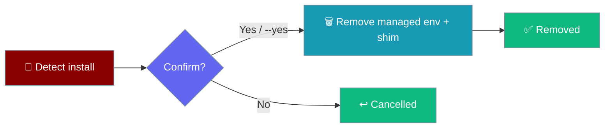

Cleanly remove the PraisonAI CLI — `praisonai uninstall` deletes the managed environment and global shim that the one-line installer created.

```bash
praisonai uninstall
```



<Note>
This is CLI self-management only. The core `praisonaiagents` SDK is not removed by this command.
</Note>

## Quick Start

<Steps>
<Step title="Interactive uninstall">

Prompts for confirmation, then removes the managed install:

```bash
praisonai uninstall
```

```
Remove PraisonAI 1.3.0 (installed via uv)? [y/N]
```

</Step>

<Step title="Non-interactive (CI)">

Skip the prompt with `--yes` (or `-y`):

```bash
praisonai uninstall --yes
```

</Step>
</Steps>

---

## What It Removes

| Removed | Not touched |
|---|---|
| The managed environment (`uv tool` / `pipx` venv) | Your `~/.praison/` config and state |
| The global `praisonai` shim on your `PATH` | Any provider API keys you configured |

The command detects how the CLI was installed and runs the matching removal command:

| Install type | Uninstall command run |
|---|---|
| `uv`-managed | `uv tool uninstall praisonai` |
| `pipx`-managed | `pipx uninstall praisonai` |
| plain `pip` | `pip uninstall -y praisonai` |

<Warning>
If the install type can't be self-managed, the command prints a clear manual fallback (for example `pip uninstall praisonai`) and exits non-zero rather than deleting anything unexpectedly.
</Warning>

---

## Flags

| Flag | Description |
|------|-------------|
| `--yes`, `-y` | Skip the confirmation prompt (non-interactive / CI). |
| `--json` | Global flag — emit machine-readable output (`{"manager": ..., "removed": ...}`). |

<Tabs>
<Tab title="Human output">

```bash
praisonai uninstall --yes
```

```
PraisonAI 1.3.0 removed.
```

</Tab>
<Tab title="JSON output">

```bash
praisonai --json uninstall --yes
```

```json
{"manager": "uv", "removed": "1.3.0"}
```

</Tab>
</Tabs>

---

## Best Practices

<AccordionGroup>
<Accordion title="Use --yes in scripts and CI">
Non-interactive shells have no TTY for the confirmation prompt. Pass `--yes` (or `--json`) to run cleanly in automation.
</Accordion>

<Accordion title="Keep your config if you plan to reinstall">
`praisonai uninstall` leaves `~/.praison/` in place, so a later reinstall keeps your settings and cache. Remove that directory manually only if you want a fully clean slate.
</Accordion>
</AccordionGroup>

---

## Related

<CardGroup cols={2}>
  <Card title="praisonai upgrade" icon="circle-arrow-up" href="/docs/cli/upgrade">
    Update the managed CLI install in place
  </Card>
  <Card title="Installer Internals" icon="gear" href="/docs/install/installer">
    How the one-line installer works
  </Card>
  <Card title="Installation" icon="download" href="/docs/installation">
    Install paths for CLI and SDK users
  </Card>
  <Card title="Isolation Backends" icon="box" href="/docs/install/isolation-backends">
    uv, pipx, and venv explained
  </Card>
</CardGroup>
