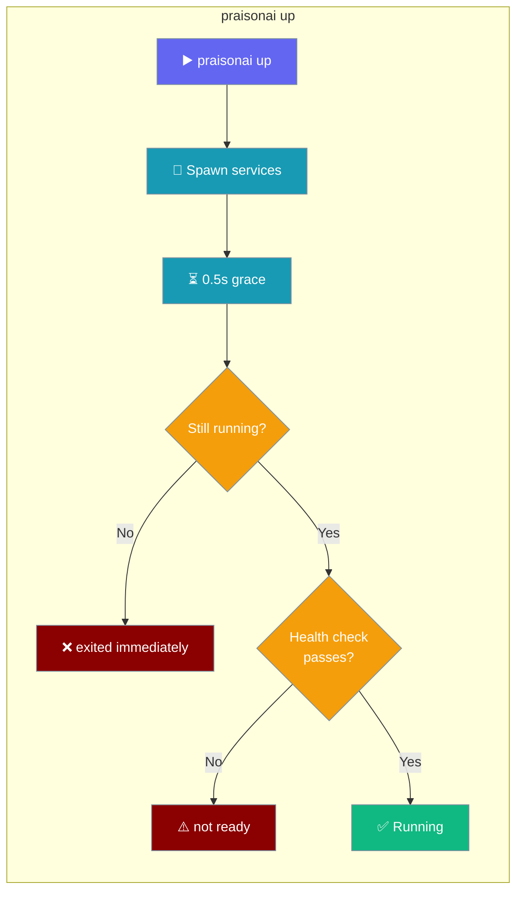
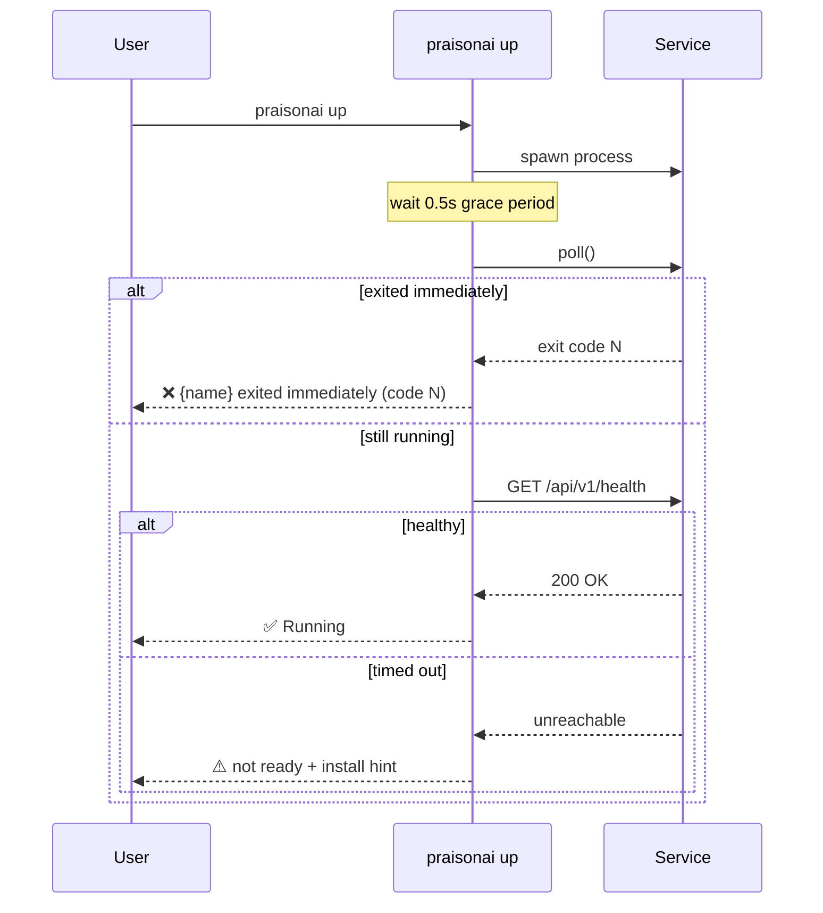

`praisonai up` starts the Langfuse observability backend and the Langflow visual builder together, and reports a service as ready only after it passes a health check.



## Quick Start

<Steps>
<Step title="Start the full stack">
```bash
praisonai up
```

Langfuse starts on port 3000, Langflow on port 7860, and observability is wired automatically.
</Step>

<Step title="Start only one service">
```bash
praisonai up --no-langfuse   # Langflow only
praisonai up --no-langflow   # Langfuse only
```
</Step>

<Step title="Bind a custom host and port">
```bash
praisonai up --host 0.0.0.0 --langfuse-port 3001
```
</Step>
</Steps>

---

## Health-Check Semantics

A service is only reported as `✅ Running` once it is actually reachable — a dead or unreachable service is never shown as "Running".



| Situation | Behaviour |
|-----------|-----------|
| Service exits within 0.5s | Prints `❌ {name} exited immediately (code N)` and is removed from the managed list |
| `requests` not installed | Fails **closed** — the service is reported **not ready**, not blindly "Running". Install with `pip install requests` |
| Health check fails | The service is **not** added to the ready table; the install hint is printed (`pip install 'praisonai[langfuse]'` / `praisonai[flow]`) |
| Health check passes | The service is appended to the ready list and shown as `✅ Running` |

<Note>
A service is only appended to the "Services Ready" table **after** its health
check passes. Before this fix, services were listed as "Running" before the
check, so a dead or unreachable service could still appear healthy.
</Note>

---

## Configuration Options

| Flag | Type | Default | Description |
|------|------|---------|-------------|
| `--langfuse-port` | `int` | `3000` | Langfuse port |
| `--no-langfuse` | `bool` | `False` | Skip starting Langfuse |
| `--langflow-port` | `int` | `7860` | Langflow port |
| `--no-langflow` | `bool` | `False` | Skip starting Langflow |
| `--observe` | `str` | `"langfuse"` | Enable observability backend |
| `--host` | `str` | `"127.0.0.1"` | Host to bind to |
| `--no-open` | `bool` | `False` | Don't open the browser |
| `--wait` | `int` | `60` | Seconds to wait for services to become healthy (`0` disables the check) |

Skipping both services (`--no-langfuse --no-langflow`) is rejected.

---

## Subcommands

| Command | Description |
|---------|-------------|
| `praisonai up status` | Check each service's health and response time (`--langfuse-url`, `--langflow-url`) |
| `praisonai up logs` | Not implemented — exits non-zero. Use `docker logs <container>` instead |

---

## Best Practices

<AccordionGroup>
  <Accordion title="Install requests so health checks run">
    Without `requests`, `praisonai up` cannot confirm a service is healthy and
    reports it as not ready. Install it: `pip install requests`.
  </Accordion>
  <Accordion title="Disable the wait with --wait 0 for fast local loops">
    Set `--wait 0` to skip the health check when you know the services are
    already reachable — but note nothing then verifies readiness.
  </Accordion>
  <Accordion title="Read the install hint when a service fails">
    A failed start prints the exact extra to install: `pip install
    'praisonai[langfuse]'` or `pip install 'praisonai[flow]'`.
  </Accordion>
</AccordionGroup>

---

## Related

<CardGroup cols={2}>
  <Card title="Serve" icon="server" href="/cli/serve">
    Launch individual PraisonAI servers
  </Card>
  <Card title="Flow" icon="diagram-project" href="/cli/flow">
    The Langflow visual builder command
  </Card>
</CardGroup>
