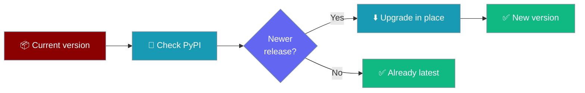
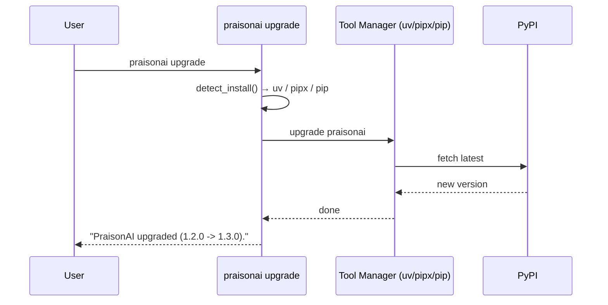

Keep your PraisonAI CLI current — `praisonai upgrade` updates the managed install in place using whichever tool manager provisioned it.

```bash
praisonai upgrade
```



<Note>
This is CLI self-management only. The core `praisonaiagents` SDK is never touched by this command.
</Note>

## Quick Start

<Steps>
<Step title="Upgrade in place">

Update to the newest release using the tool manager that installed the CLI:

```bash
praisonai upgrade
```

</Step>

<Step title="Check without changing anything">

Report whether a newer version exists — no install, no mutation:

```bash
praisonai upgrade --check
```

Example output:

```
Update available: 1.2.0 -> 1.3.0
Run: praisonai upgrade
```

</Step>
</Steps>

---

## How It Works



The command detects how the CLI was installed and runs the matching upgrade command:

| Install type | Upgrade command run |
|---|---|
| `uv`-managed (one-line installer) | `uv tool upgrade praisonai` |
| `pipx`-managed (one-line installer) | `pipx upgrade praisonai` |
| plain `pip` (library / SDK install) | `pip install --upgrade praisonai` |

---

## Flags

| Flag | Description |
|------|-------------|
| `--check` | Report whether a newer version exists **without** upgrading. Exits `1` if PyPI can't be reached. |
| `--json` | Global flag — emit machine-readable output (current / latest / update_available). |

<Tabs>
<Tab title="Human output">

```bash
praisonai upgrade --check
```

```
You are on the latest version (1.3.0).
```

</Tab>
<Tab title="JSON output">

```bash
praisonai --json upgrade --check
```

```json
{"current": "1.2.0", "latest": "1.3.0", "update_available": true}
```

</Tab>
</Tabs>

---

## Behaviour by Install Type

<AccordionGroup>
<Accordion title="uv-managed (recommended)">
The one-line installer provisions an isolated `uv tool` environment. `praisonai upgrade` runs `uv tool upgrade praisonai` — clean, in place, no other Python touched.
</Accordion>

<Accordion title="pipx-managed">
When installed via `pipx`, the command runs `pipx upgrade praisonai` against that isolated venv.
</Accordion>

<Accordion title="pip-installed (library use)">
A plain `pip install praisonai` upgrades via `pip install --upgrade praisonai`. This is best-effort and shares your active environment.
</Accordion>
</AccordionGroup>

<Warning>
If the install type can't be self-managed, the command prints a clear manual fallback (for example `pip install --upgrade praisonai`) and exits non-zero rather than guessing.
</Warning>

---

## Update Hint on Start

Long-lived installs surface a non-blocking **"update available"** hint on start (text mode only), backed by a time-boxed cache at `~/.praison/state/update_check.json` (24h TTL). It never performs network I/O at start-up and never blocks or raises.

Opt out with an environment variable:

```bash
export PRAISONAI_NO_UPDATE_CHECK=1
```

<Tip>
Running `praisonai upgrade --check` also warms this cache, so the next start reflects the newest info without its own network round-trip.
</Tip>

---

## Related

<CardGroup cols={2}>
  <Card title="praisonai uninstall" icon="trash" href="/docs/cli/uninstall">
    Cleanly remove the managed CLI install
  </Card>
  <Card title="Installer Internals" icon="gear" href="/docs/install/installer">
    How the one-line installer picks a backend
  </Card>
  <Card title="Installation" icon="download" href="/docs/installation">
    Install paths for CLI and SDK users
  </Card>
  <Card title="Isolation Backends" icon="box" href="/docs/install/isolation-backends">
    uv, pipx, and venv explained
  </Card>
</CardGroup>
