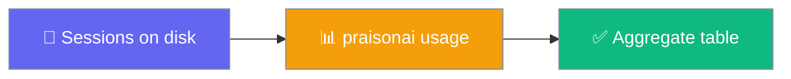
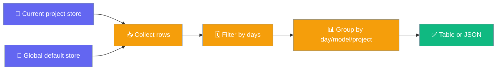
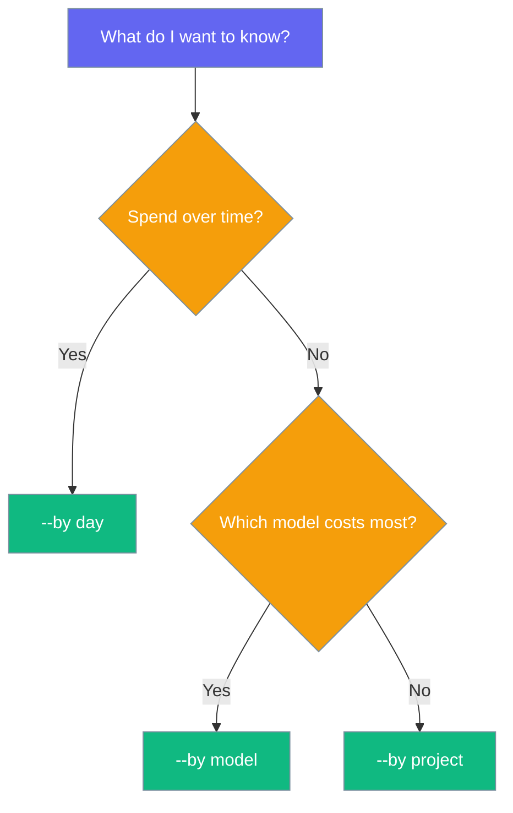

Every time your agent runs with a session store, it records `total_tokens` and `cost` per session. `praisonai usage` reports those totals — no config, no network.

```bash
praisonai usage
```



## Quick Start

<Steps>
<Step title="Run the report">
Print the last 30 days, grouped by day.

```bash
praisonai usage
```
</Step>

<Step title="Group by model or project">
Switch the grouping dimension with `--by`.

```bash
praisonai usage --by model
praisonai usage --by project
```
</Step>

<Step title="Window the results">
Limit the report to a time window with `--days` (`0` = all history).

```bash
praisonai usage --days 7
praisonai usage --days 0
```
</Step>

<Step title="Emit JSON">
Produce machine-readable output for scripts.

```bash
praisonai usage --json
```
</Step>
</Steps>

---

## How It Works

The command reads the current-project and global default session stores, filters by time window, groups the rows, then renders a table or JSON.



| Behaviour | Detail |
|-----------|--------|
| Project buckets | Without `--project`, rows keep their origin — `current` and `global` show as separate buckets under `--by project`. |
| De-duplication | Sessions with the same `session_id` in both stores are counted once. |
| Scan limit | Each store is scanned up to 100,000 sessions. |
| Sort order | `--by day` is chronological; `--by model` and `--by project` are highest-spend-first. |
| Empty state | Prints `No usage recorded yet` when no rows and no errors. |
| Errors | A missing or damaged store prints `Usage may be incomplete: …` (table) or fills the `errors` array (JSON) — nothing is swallowed. |
| Cost source | Reads the pre-persisted `cost` field — no re-pricing. |

---

## Options

| Option | Short | Type | Default | Description |
|--------|-------|------|---------|-------------|
| `--days` | `-d` | `int` | `30` | Only include sessions updated in the last N days (`0` = all) |
| `--by` | `-b` | `str` | `"day"` | Group by: `day`, `model`, or `project` |
| `--project` | `-p` | `str` | `None` | Restrict to a specific project ID |
| `--json` | — | `bool` | `False` | Emit machine-readable JSON |

An invalid `--by` value exits with code `1`.

---

## Which `--by` should I pick?

Pick the grouping that answers your question.



---

## JSON Output

`--json` prints a stable shape for dashboards and pipelines.

```json
{
  "by": "day",
  "days": 30,
  "project": null,
  "rows": [ { "key": "2026-07-19", "total_tokens": 1200, "cost": 0.0034 } ],
  "total_tokens": 1200,
  "cost": 0.0034,
  "errors": []
}
```

Table output shows cost to 4 decimal places (`$0.0034`); JSON rounds to 6.

---

## Common Patterns

Run a quick weekly review of spend by day.

```bash
praisonai usage --days 7
```

Audit which model costs the most across all history.

```bash
praisonai usage --by model --days 0
```

Feed a JSON report into a spreadsheet or dashboard.

```bash
praisonai usage --json > usage.json
```

---

## Best Practices

<AccordionGroup>

<Accordion title="Enable a session store first">
Rows only exist once agents run with a session store. Enable one with `memory="history"` or a `session_id` so `praisonai usage` has data to report.
</Accordion>

<Accordion title="Keep --days small for fast iteration">
A short window (`--days 7`) scans fewer sessions and returns quicker during active development.
</Accordion>

<Accordion title="Use --json for scripting">
Pipe `--json` into `jq` or a spreadsheet instead of parsing the table.
</Accordion>

<Accordion title="Remember --project scopes the read">
Passing `--project <id>` reads only that project's store — the `global` bucket is skipped.
</Accordion>

</AccordionGroup>

---

## Related

<CardGroup cols={2}>
  <Card title="CLI Reference" icon="terminal" href="/docs/cli/cli-reference">
    Full command tree, including session commands
  </Card>
  <Card title="Session Resume" icon="rotate" href="/docs/memory/session-resume">
    The session store these totals come from
  </Card>
</CardGroup>
