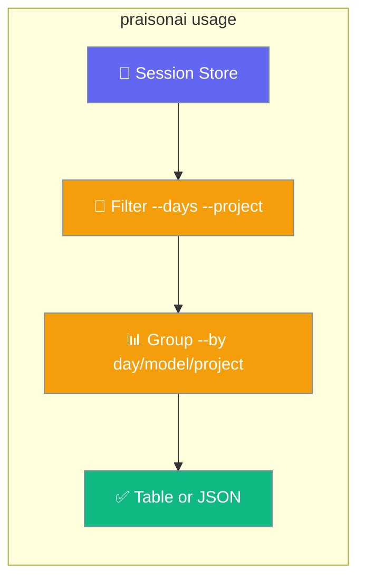
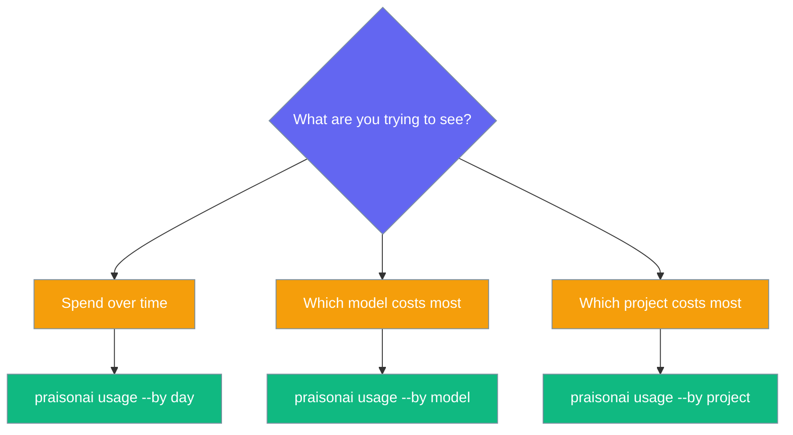

See what you've spent — no dashboard, no API key, no setup. `praisonai usage` reads the token and cost totals PraisonAI already saves per session and rolls them up by day, model, or project.



## Quick Start

<Steps>

<Step title="See your spend">
Run one line to see the last 30 days grouped by day.

```bash
praisonai usage
```

```
              Usage
┏━━━━━━━━━━━━┳━━━━━━━━━┳━━━━━━━━━┓
┃ Day        ┃ Tokens  ┃ Cost    ┃
┡━━━━━━━━━━━━╇━━━━━━━━━╇━━━━━━━━━┩
│ 2026-07-19 │ 1,240   │ $0.0140 │
│ 2026-07-20 │ 3,980   │ $0.0320 │
│ Total      │ 5,220   │ $0.0460 │
└────────────┴─────────┴─────────┘
```
</Step>

<Step title="Group differently">
Switch the grouping to see spend by model or by project.

```bash
praisonai usage --by model
```
</Step>

<Step title="Group by project (current vs global stores)">
```bash
praisonai usage --by project
```
</Step>

<Step title="Last 7 days only">
```bash
praisonai usage --days 7
```
</Step>

<Step title="A single project">
```bash
praisonai usage --project my-app
```
</Step>

<Step title="Get JSON for scripts">
Add `--json` for machine-readable output you can pipe to `jq`.

```bash
praisonai usage --json
```
</Step>


</Steps>

<Note>
This command reads data that `praisonai run` already saved to disk — no setup, no re-instrumentation, no external observability platform.
</Note>

---

## Choose Your Grouping

Pick the `--by` value that matches the question you're asking.




---

## How It Works

`praisonai usage` reads the same session files that `praisonai session list` shows — nothing new is written, no external service is contacted.

```mermaid
sequenceDiagram
    participant User
    participant CLI as praisonai usage
    participant Proj as Current-project store
    participant Glob as Global default store

    User->>CLI: praisonai usage --by model --days 7
    CLI->>Proj: list_sessions()
    Proj-->>CLI: sessions (total_tokens, cost, model, updated_at)
    CLI->>Glob: list_sessions()
    Glob-->>CLI: sessions
    CLI->>CLI: filter by --days, de-dup, group by --by
    CLI-->>User: table (or JSON if --json)

    classDef user fill:#8B0000,stroke:#7C90A0,color:#fff
    classDef cli fill:#189AB4,stroke:#7C90A0,color:#fff
    classDef store fill:#10B981,stroke:#7C90A0,color:#fff

    class User user
    class CLI cli
    class Proj,Glob store
```

| Source | What it contributes |
|---|---|
| Current-project session store | Sessions from the project you're in — labelled `current` under `--by project`. |
| Global default session store | Sessions from the global store — labelled `global` under `--by project`. |
| `--project <id>` | Restricts to exactly that project's store; its own ID becomes the sole `project` label. |

When `--project` is omitted, both stores are scanned separately and session ids shared across them are de-duplicated (the current-project store wins). Each store is scanned up to 100,000 sessions to keep memory predictable — realistic stores are never truncated.

| Behaviour | Detail |
|-----------|--------|
| Time window | `--days` filters on `updated_at`; values without a timezone are treated as UTC |
| Sorting | `--by day` is chronological; `--by model` / `--by project` sort by highest tokens first |
| Grouping keys | Unknown model → `unknown`; unparseable date → `unknown`; empty project → `current` |
| Total row | The table always appends a `Total` row |
| Zero values | Render as `-`; tokens are comma-formatted; cost is `$X.XXXX` |

---

## Options

Every option is optional — `praisonai usage` with no flags reports the last 30 days by day.

| Option | Short | Type | Default | Description |
|--------|-------|------|---------|-------------|
| `--days` | `-d` | `int` | `30` | Only include sessions updated in the last N days. `0` = no time filter (include all). |
| `--by` | `-b` | `str` | `"day"` | Group by: `day`, `model`, or `project`. Any other value exits with an error. |
| `--project` | `-p` | `str` | `None` | Restrict to a specific project ID (reads only that project's scoped store). |
| `--json` |  | `bool` | `False` | Emit machine-readable JSON (also auto-enabled by the CLI's global JSON output mode). |

`--by day` sorts chronologically (ascending); `--by model` and `--by project` sort by tokens descending (highest spend first).

### JSON output shape

`--json` emits a stable object you can pipe into dashboards or cron jobs.

```bash
praisonai usage --by day --days 30 --json
```

```json
{
  "by": "day",
  "days": 30,
  "project": null,
  "rows": [
    {"key": "2026-07-15", "total_tokens": 12340, "cost": 0.043},
    {"key": "2026-07-18", "total_tokens": 5220, "cost": 0.014}
  ],
  "total_tokens": 17560,
  "cost": 0.057,
  "errors": []
}
```

### Empty output

- Table: `No usage recorded yet`
- JSON: `{"rows": [], "total_tokens": 0, "cost": 0.0, ...}`

### Store errors

A missing or damaged store is non-fatal. Table mode prints `Usage may be incomplete: <reason>` as a warning; JSON mode exposes the reasons under `errors`. The command still exits `0` and returns whatever it could read — a broken store is never silently reported as empty. An invalid `--by` value exits `1` with `--by must be one of: day, model, project`.

---

## Common Patterns

Practical one-liners for everyday reviews.

```bash
# Weekly review by model
praisonai usage --days 7 --by model

# CI cost snapshot
praisonai usage --json | jq '.cost'

# Full history by project (no time filter)
praisonai usage --days 0 --by project

# Export 90 days to CSV
praisonai usage --days 90 --by day --json | jq '.rows[] | [.key, .total_tokens, .cost] | @csv' -r > usage.csv
```

---

## Grouping Modes

| Mode | Sorts by | Use it to |
|------|----------|-----------|
| `--by day` | Chronological | See a spend trend over time. |
| `--by model` | Highest spend first | Find which model costs the most. |
| `--by project` | Highest spend first | Compare spend across workspaces. |

---

## Best Practices

<AccordionGroup>
  <Accordion title="Find your most expensive models">
    Run `praisonai usage --by model` — models are sorted by highest token count first, so the biggest spenders appear at the top.
  </Accordion>
  <Accordion title="Report across all history">
    Use `praisonai usage --days 0` to disable the time filter and aggregate every session on disk, not just the last 30 days. Use this sparingly on very large session directories, since it scans up to 100,000 records per store.
  </Accordion>
  <Accordion title="Feed usage into scripts">
    `praisonai usage --json` emits a stable shape (`by`, `days`, `project`, `rows`, `total_tokens`, `cost`, `errors`) that is safe to parse in CI or dashboards. The global JSON output mode auto-enables JSON, so scripts running under it get machine-readable output without passing `--json` explicitly.
  </Accordion>
  <Accordion title="Trust the numbers">
    Watch for `Usage may be incomplete` warnings. They mean a store could not be read fully — check filesystem permissions on the session store path and look for corrupt records. The totals shown exclude that store rather than silently reporting zero. In `--json` mode the same reasons appear in the `errors` array.
  </Accordion>
  <Accordion title="Attribute cost per workspace">
    Combine `--project my-app` with `--by model` to see which model drives spend inside one project.

    ```bash
    praisonai usage --project my-app --by model
    ```
  </Accordion>
  <Accordion title="Script budget checks">
    Pipe `--json` output to `jq` in CI to fail a build when spend crosses a threshold.

    ```bash
    praisonai usage --json | jq 'if .cost > 5 then error("over budget") else .cost end'
    ```
  </Accordion>
  <Accordion title="Missing cost? Check pricing coverage">
    Cost only appears for models present in the default pricing table. See [Cost Tracking](/docs/cli/cost-tracking) to add custom pricing.
  </Accordion>
  <Accordion title="Read current vs global buckets correctly">
    Without `--project`, `--by project` splits usage into a `current` bucket (this project's store) and a `global` bucket (the default store). Shared session IDs appear once. Pass `--project my-app` to report a single project only.
  </Accordion>
</AccordionGroup>


---

## Related

<CardGroup cols={2}>
  <Card title="Cost Tracking" icon="dollar-sign" href="/docs/cli/cost-tracking">
    Per-run and per-session cost source
  </Card>
  <Card title="Session" icon="database" href="/docs/cli/session">
    The underlying session store
  </Card>
  <Card title="Tracker" icon="crosshairs" href="/docs/cli/tracker">
    Per-run execution tracker
  </Card>
  <Card title="Metrics" icon="gauge-high" href="/docs/cli/metrics">
    Performance metrics
  </Card>
</CardGroup>
