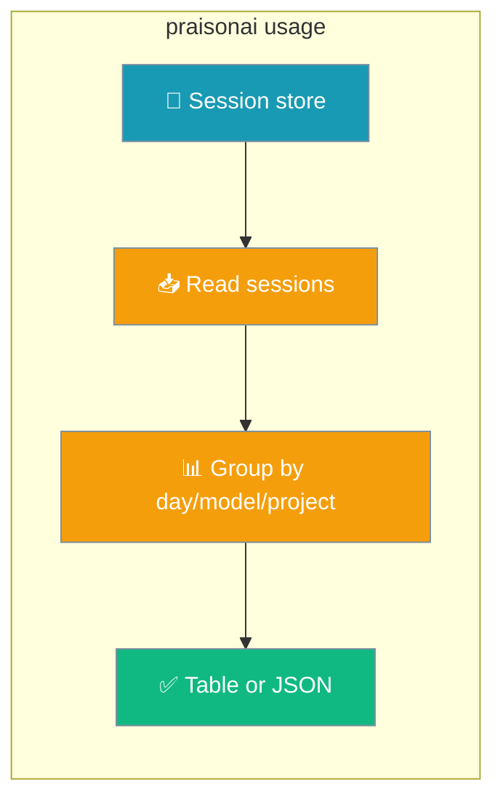

Report token spend and cost from sessions already on disk — no external service, no network calls.



## Quick Start

<Steps>
  <Step title="Report the last 30 days">
    ```bash
    praisonai usage
    ```
  </Step>
  <Step title="Group by model or project">
    ```bash
    praisonai usage --by model
    praisonai usage --by project
    ```
  </Step>
  <Step title="Emit machine-readable JSON">
    ```bash
    praisonai usage --json
    ```
  </Step>
</Steps>

---

## How It Works

`praisonai usage` reads the `total_tokens` and `cost` already persisted per session by [Cost Tracking](/docs/cli/cost-tracking), then aggregates them locally.

```mermaid
sequenceDiagram
    participant User
    participant CLI as praisonai usage
    participant Store as Session store

    User->>CLI: praisonai usage --by model
    CLI->>Store: list_sessions(limit=100000)
    Store-->>CLI: session records (tokens, cost, model, updated_at)
    CLI->>CLI: filter by --days, group by --by, sum
    CLI-->>User: Usage table (or JSON)

    classDef user fill:#6366F1,stroke:#7C90A0,color:#fff
    classDef cli fill:#8B0000,stroke:#7C90A0,color:#fff
    classDef store fill:#189AB4,stroke:#7C90A0,color:#fff
```

Without `--project`, the command reads the current-project store **and** the global default store separately, de-duplicating shared session IDs so `--by project` shows both `current` and `global` buckets. With `--project X`, only that project's scoped store is read.

Sort order depends on the grouping: `--by day` is chronological (oldest first); `--by model` and `--by project` sort by highest tokens first.

---

## Options

| Option | Short | Type | Default | Description |
|--------|-------|------|---------|-------------|
| `--days` | `-d` | `int` | `30` | Only include sessions updated in the last N days. `0` disables the time filter. |
| `--by` | `-b` | `str` | `"day"` | Group by `day`, `model`, or `project`. Any other value exits with code `1` and error `--by must be one of: day, model, project`. |
| `--project` | `-p` | `str` | `None` | Restrict to a specific project ID (reads only that project's scoped store). |
| `--json` | — | `bool` | `False` | Emit machine-readable JSON instead of a table. Also auto-enabled under the global `--output json` mode. |

---

## Examples

```bash
# Default: last 30 days, grouped by day
praisonai usage

# Highest-spend models first
praisonai usage --by model

# Spend per project (current + global buckets)
praisonai usage --by project

# Only the last 7 days
praisonai usage --days 7

# No time filter (all sessions)
praisonai usage --days 0

# Restrict to one project
praisonai usage --project my-project

# Machine-readable output for scripts
praisonai usage --json
```

---

## Output Format

<Tabs>
  <Tab title="Table (default)">
    Columns follow `--by` (`Day` / `Model` / `Project`), plus `Tokens` and `Cost`, with a `Total` row. Zero values render as `-`, and cost uses 4 decimal places.

    ```bash
    praisonai usage --by model
    ```

    ```text
                     Usage
    ┏━━━━━━━━━━━━━━┳━━━━━━━━┳━━━━━━━━━┓
    ┃ Model        ┃ Tokens ┃ Cost    ┃
    ┡━━━━━━━━━━━━━━╇━━━━━━━━╇━━━━━━━━━┩
    │ gpt-4o       │  8,420 │ $0.0930 │
    │ gpt-4o-mini  │  1,240 │ $0.0014 │
    │ Total        │  9,660 │ $0.0944 │
    └──────────────┴────────┴─────────┘
    ```

    An empty store prints `No usage recorded yet`.
  </Tab>
  <Tab title="JSON (--json)">
    JSON rounds cost to 6 decimal places and includes an `errors` array.

    ```json
    {
      "by": "day",
      "days": 30,
      "project": null,
      "rows": [
        { "key": "2026-07-20", "total_tokens": 1240, "cost": 0.014 }
      ],
      "total_tokens": 1240,
      "cost": 0.014,
      "errors": []
    }
    ```
  </Tab>
</Tabs>

<Note>
Store-read failures surface as `Usage may be incomplete: <reason>` warnings (or in `errors[]` for JSON) instead of a silent empty report — a damaged store is distinguishable from genuinely empty usage.
</Note>

---

## Best Practices

<AccordionGroup>
  <Accordion title="Find your most expensive models">
    Run `praisonai usage --by model` — models are sorted by highest token count first, so the biggest spenders appear at the top.
  </Accordion>
  <Accordion title="Report across all history">
    Use `praisonai usage --days 0` to disable the time filter and aggregate every session on disk, not just the last 30 days.
  </Accordion>
  <Accordion title="Feed usage into scripts">
    `praisonai usage --json` emits a stable shape (`by`, `days`, `project`, `rows`, `total_tokens`, `cost`, `errors`) that is safe to parse in CI or dashboards.
  </Accordion>
  <Accordion title="Trust the numbers">
    Watch for `Usage may be incomplete` warnings. They mean a store could not be read fully — the totals shown exclude that store rather than silently reporting zero.
  </Accordion>
</AccordionGroup>

---

## Related

<CardGroup cols={2}>
  <Card title="Cost Tracking" icon="dollar-sign" href="/docs/cli/cost-tracking">
    Per-run token/cost footer and model pricing tables
  </Card>
  <Card title="Session" icon="clock-rotate-left" href="/docs/cli/session">
    Manage the sessions this command reads from
  </Card>
</CardGroup>
