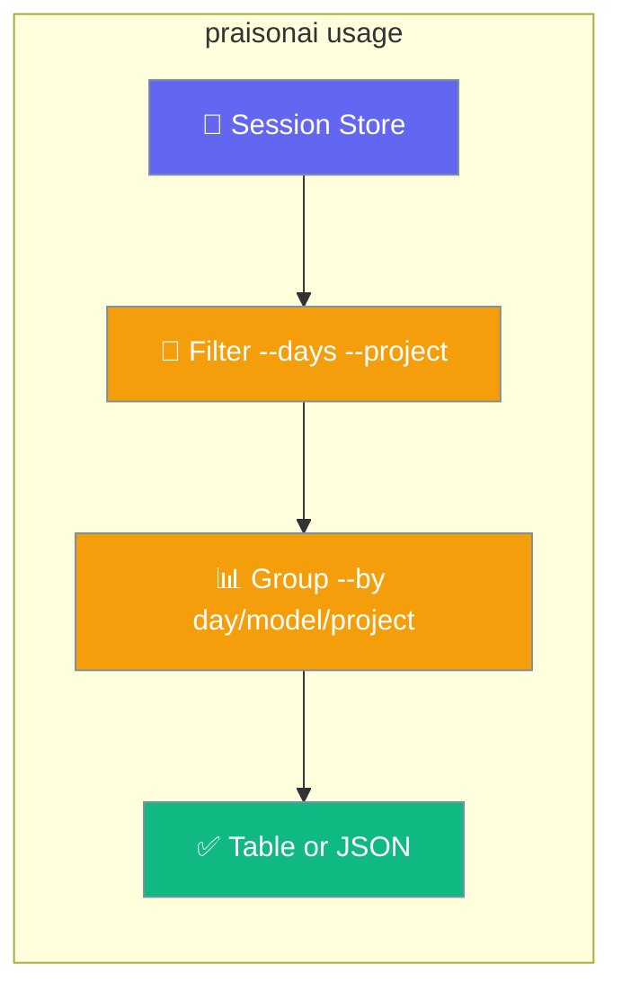
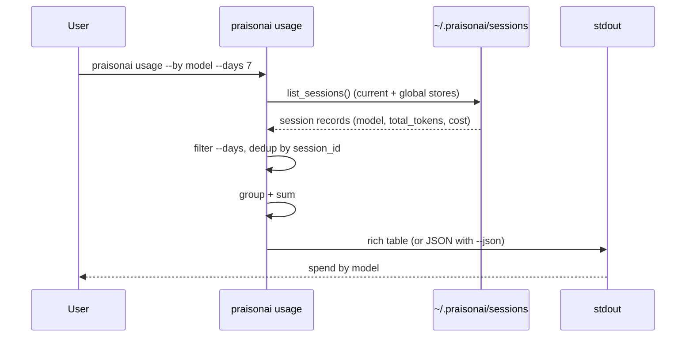
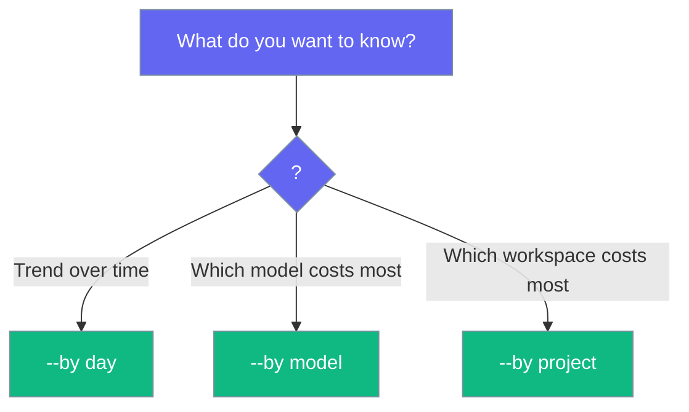

`praisonai usage` reports your total token and cost spend across every locally-saved session — one line, no configuration, no network.



## Quick Start

<Steps>

<Step title="See your spend">
Run one line to see the last 30 days grouped by day.

```bash
praisonai usage
```

```
Usage
┌────────────┬─────────┬─────────┐
│ Day        │ Tokens  │ Cost    │
├────────────┼─────────┼─────────┤
│ 2026-07-19 │ 1,240   │ $0.0140 │
│ 2026-07-20 │ 3,980   │ $0.0320 │
│ Total      │ 5,220   │ $0.0460 │
└────────────┴─────────┴─────────┘
```
</Step>

<Step title="Group differently">
Switch the grouping to see spend by model or by project.

```bash
praisonai usage --by model
praisonai usage --by project
```
</Step>

<Step title="Get JSON for scripts">
Add `--json` for machine-readable output you can pipe to `jq`.

```bash
praisonai usage --json
```
</Step>

</Steps>

<Note>
This command reads data that `praisonai run` already saved to disk — no setup, no re-instrumentation, no external observability platform.
</Note>

---

## How It Works

`praisonai usage` reads the `total_tokens` and `cost` already persisted per session by [Cost Tracking](/docs/cli/cost-tracking), then aggregates them locally.



| Step | What happens |
|------|--------------|
| Read | Loads session records from `~/.praisonai/sessions/*.json`. |
| Filter | Keeps sessions updated within `--days` and, if set, a single `--project`. |
| Group | Buckets rows by day, model, or project and sums tokens and cost. |
| Output | Prints a table, or JSON with `--json`. |

Without `--project`, the command reads the current-project store **and** the global default store separately, de-duplicating shared session IDs so `--by project` shows both `current` and `global` buckets. With `--project X`, only that project's scoped store is read.

Sort order depends on the grouping: `--by day` is chronological (oldest first); `--by model` and `--by project` sort by highest tokens first.

---

## Options

| Option | Short | Type | Default | Description |
|--------|-------|------|---------|-------------|
| `--days` | `-d` | `int` | `30` | Only include sessions updated in the last N days. `0` disables the time filter. |
| `--by` | `-b` | `str` | `"day"` | Group by `day`, `model`, or `project`. Any other value exits with code `1` and error `--by must be one of: day, model, project`. |
| `--project` | `-p` | `str` | `None` | Restrict to a specific project ID (reads only that project's scoped store). |
| `--json` | — | `bool` | `False` | Emit machine-readable JSON instead of a table. Also auto-enabled under the global `--output json` mode. |

---

## Examples

```bash
# Default: last 30 days, grouped by day
praisonai usage

# Highest-spend models first
praisonai usage --by model

# Spend per project (current + global buckets)
praisonai usage --by project

# Only the last 7 days
praisonai usage --days 7

# No time filter (all sessions)
praisonai usage --days 0

# Restrict to one project
praisonai usage --project my-project

# Machine-readable output for scripts
praisonai usage --json
```

---

## Output Format

<Tabs>
  <Tab title="Table (default)">
    Columns follow `--by` (`Day` / `Model` / `Project`), plus `Tokens` and `Cost`, with a `Total` row. Zero values render as `-`, and cost uses 4 decimal places.

    ```bash
    praisonai usage --by model
    ```

    ```text
                     Usage
    ┏━━━━━━━━━━━━━━┳━━━━━━━━┳━━━━━━━━━┓
    ┃ Model        ┃ Tokens ┃ Cost    ┃
    ┡━━━━━━━━━━━━━━╇━━━━━━━━╇━━━━━━━━━┩
    │ gpt-4o       │  8,420 │ $0.0930 │
    │ gpt-4o-mini  │  1,240 │ $0.0014 │
    │ Total        │  9,660 │ $0.0944 │
    └──────────────┴────────┴─────────┘
    ```

    An empty store prints `No usage recorded yet`.
  </Tab>
  <Tab title="JSON (--json)">
    JSON rounds cost to 6 decimal places and includes an `errors` array.

    ```json
    {
      "by": "day",
      "days": 30,
      "project": null,
      "rows": [
        { "key": "2026-07-19", "total_tokens": 1240, "cost": 0.014 },
        { "key": "2026-07-20", "total_tokens": 3980, "cost": 0.032 }
      ],
      "total_tokens": 5220,
      "cost": 0.046,
      "errors": []
    }
    ```
  </Tab>
</Tabs>

<Note>
Store-read failures surface as `Usage may be incomplete: <reason>` warnings (or in `errors[]` for JSON) instead of a silent empty report — a damaged store is distinguishable from genuinely empty usage.
</Note>

---

## Grouping Modes

Pick the grouping that answers your question.



| Mode | Sorts by | Use it to |
|------|----------|-----------|
| `--by day` | Chronological | See a spend trend over time. |
| `--by model` | Highest spend first | Find which model costs the most. |
| `--by project` | Highest spend first | Compare spend across workspaces. |

---

## Best Practices

<AccordionGroup>
  <Accordion title="Find your most expensive models">
    Run `praisonai usage --by model` — models are sorted by highest token count first, so the biggest spenders appear at the top.
  </Accordion>
  <Accordion title="Report across all history">
    Use `praisonai usage --days 0` to disable the time filter and aggregate every session on disk, not just the last 30 days.
  </Accordion>
  <Accordion title="Feed usage into scripts">
    `praisonai usage --json` emits a stable shape (`by`, `days`, `project`, `rows`, `total_tokens`, `cost`, `errors`) that is safe to parse in CI or dashboards.
  </Accordion>
  <Accordion title="Trust the numbers">
    Watch for `Usage may be incomplete` warnings. They mean a store could not be read fully — the totals shown exclude that store rather than silently reporting zero.
  </Accordion>
  <Accordion title="Attribute cost per workspace">
    Combine `--project my-app` with `--by model` to see which model drives spend inside one project.

    ```bash
    praisonai usage --project my-app --by model
    ```
  </Accordion>
  <Accordion title="Script budget checks">
    Pipe `--json` output to `jq` in CI to fail a build when spend crosses a threshold.

    ```bash
    praisonai usage --json | jq 'if .cost > 5 then error("over budget") else .cost end'
    ```
  </Accordion>
  <Accordion title="Missing cost? Check pricing coverage">
    Cost only appears for models present in the default pricing table. See [Cost Tracking](/docs/cli/cost-tracking) to add custom pricing.
  </Accordion>
</AccordionGroup>

---

## Related

<CardGroup cols={2}>
  <Card title="Cost Tracking" icon="dollar-sign" href="/docs/cli/cost-tracking">
    Per-run and per-session cost source
  </Card>
  <Card title="Session" icon="database" href="/docs/cli/session">
    The underlying session store
  </Card>
  <Card title="Tracker" icon="crosshairs" href="/docs/cli/tracker">
    Per-run execution tracker
  </Card>
  <Card title="Metrics" icon="gauge-high" href="/docs/cli/metrics">
    Performance metrics
  </Card>
</CardGroup>
