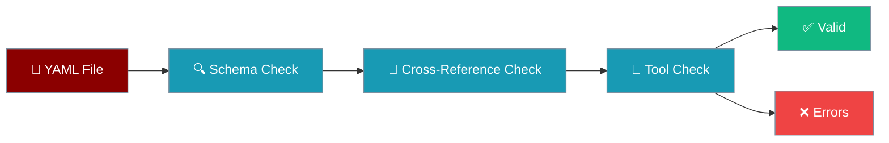
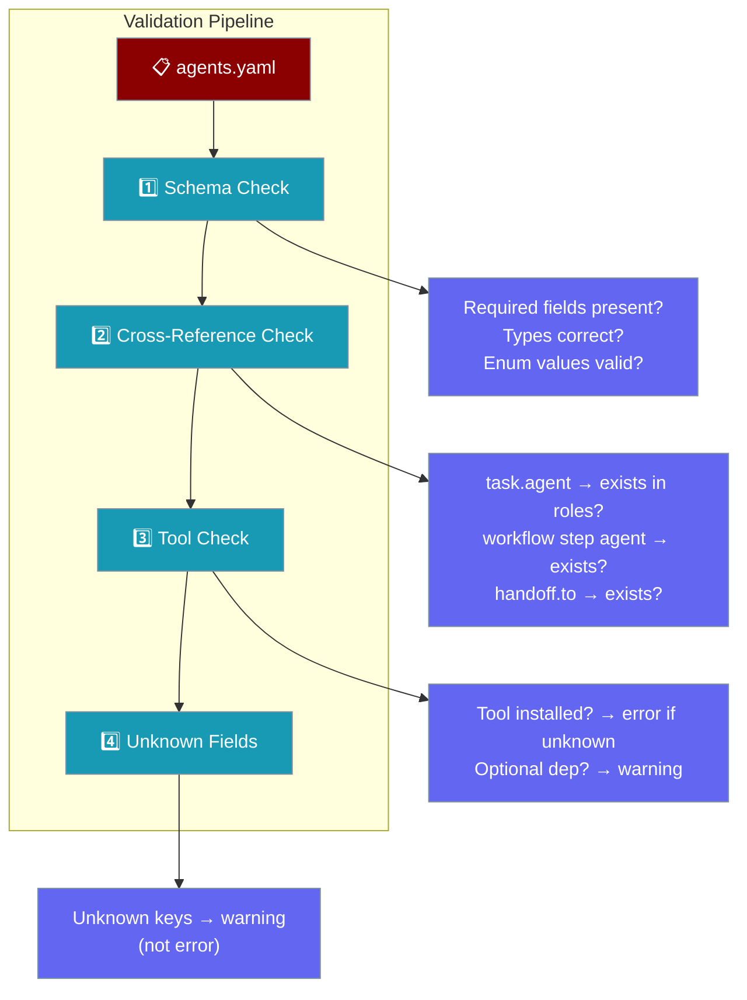

Catch configuration mistakes before they cause runtime failures — `praisonai validate` checks your YAML files against the full schema and reports every error at once.



## Quick Start

<Steps>
<Step title="Validate a single file (success path)">
```bash
praisonai validate agents.yaml
```

Output:
```
✅ agents.yaml is valid
```
</Step>

<Step title="Validate a file with errors (failure path)">
```bash
praisonai validate agents.yaml
```

Output when the config has problems:
```
❌ agents.yaml is invalid

Configuration validation failed with 2 error(s):
  1. Agent 'researcher': missing required field 'goal'
  2. Task 'write_report': references unknown agent 'writer' (not defined in agents/roles)

Additionally, there are 1 warning(s):
  1. Unknown agent field 'instrutions' in agent 'researcher'. This field will be ignored.
```

Exit code: `1`
</Step>

<Step title="CI usage — strict mode + JSON output">
```bash
praisonai validate agents.yaml --strict --json
```

Output:
```json
{
  "file": "agents.yaml",
  "valid": false,
  "errors": [
    "Agent 'researcher': missing required field 'goal'"
  ],
  "warnings": [
    "Unknown agent field 'instrutions' in agent 'researcher'. This field will be ignored."
  ],
  "strict_mode": true
}
```

With `--strict`, warnings are also treated as errors, so exit code is `1` even when only warnings are present.
</Step>
</Steps>

---

## Subcommands

| Command | Purpose |
|---------|---------|
| `praisonai validate <file>` | Validate a single YAML file |
| `praisonai validate check [directory]` | Validate every YAML file in a directory |
| `praisonai validate schema` | Print the YAML config schema (fields, types, required markers) |

---

## Flags

### `praisonai validate <file>`

| Flag | Type | Default | Description |
|------|------|---------|-------------|
| `file` (positional) | `str` | — | Path to YAML config to validate |
| `--strict` | `bool` | `False` | Treat warnings as errors |
| `--quiet` / `-q` | `bool` | `False` | Only show errors, suppress success messages |
| `--json` | `bool` | `False` | Emit results as JSON (for CI) |

### `praisonai validate check [directory]`

| Flag | Type | Default | Description |
|------|------|---------|-------------|
| `directory` (positional) | `str` | `"."` | Directory to search for YAML files |
| `--pattern` / `-p` | `str` | `"*.yaml"` | Glob pattern (also auto-includes `*.yml` when using the default) |
| `--strict` | `bool` | `False` | Treat warnings as errors |
| `--stop-on-error` | `bool` | `False` | Stop on the first invalid file |

### `praisonai validate schema`

Prints all main config sections with field names, types, and required markers — no extra flags.

---

## What Gets Validated



### 1. Schema Validation

Enforces the Pydantic schema. Every agent must have **`role`**, **`goal`**, and **`backstory`** — these are required. Every task must have **`description`** and **`agent`** (matching `^[a-zA-Z0-9_-]+$`).

When `process: workflow`, the config must also include `steps` or `workflow`.

### 2. Cross-Reference Validation

- Every `tasks[i].agent` must name an agent defined under `roles` / `agents`
- Workflow step `agent` fields are validated recursively (through nested `steps` and `routes`)
- Every `handoff.to` target must resolve to a known role

### 3. Tool Validation

Tool names are resolved through `ToolResolver`:

- **Unknown tool** → **error**: *"Unknown tool 'X'. Ensure it's properly installed or defined in your configuration."*
- **Known optional tool** (e.g. `PostgreSQLTool`, `SlackTool`, `AWSTool`, `BrowserTool`, `PandasTool`, `KubernetesTool`) → **warning**: *"Tool 'X' requires additional dependencies. Install with: pip install 'praisonai[tools]' …"*

### 4. Unknown Fields

Top-level unknown keys and unknown agent/role fields produce **warnings**, not errors:

*"Unknown agent field 'X'. This field will be ignored."*

<Note>
Unknown-field warnings are non-blocking — your workflow still runs. Only errors (missing required fields, bad cross-references, unknown tools) cause a hard failure.
</Note>

---

## Output Formats

<Tabs>
<Tab title="Plain (Rich)">
Default output uses Rich formatting for easy reading in the terminal:

```
✅ agents.yaml is valid
  Warnings:
    • Unknown agent field 'stream' in agent 'writer'. This field will be ignored.
```

```
❌ agents.yaml is invalid

Configuration validation failed with 2 error(s):
  1. Agent 'researcher': missing required field 'goal'
  2. Task 'write_report': references unknown agent 'writer' (not defined in agents/roles)

Additionally, there are 1 warning(s):
  1. Unknown agent field 'instrutions' in agent 'researcher'. This field will be ignored.
```
</Tab>

<Tab title="Quiet (-q)">
Only errors are printed; success messages and warnings are suppressed:

```bash
praisonai validate agents.yaml -q
```

Produces no output when valid. On error, only the error block is shown.
</Tab>

<Tab title="JSON (--json)">
Structured output for CI pipelines:

```bash
praisonai validate agents.yaml --json
```

```json
{
  "file": "agents.yaml",
  "valid": true,
  "errors": [],
  "warnings": [],
  "strict_mode": false
}
```

When invalid:
```json
{
  "file": "agents.yaml",
  "valid": false,
  "errors": [
    "Agent 'researcher': missing required field 'goal'"
  ],
  "warnings": [
    "Unknown agent field 'instrutions' in agent 'researcher'. This field will be ignored."
  ],
  "strict_mode": false
}
```
</Tab>

<Tab title="Directory Scan">
`praisonai validate check` renders a Rich table:

```
┌──────────────────┬─────────┬────────┬──────────┐
│ File             │ Status  │ Errors │ Warnings │
├──────────────────┼─────────┼────────┼──────────┤
│ agents.yaml      │ ✅ PASS │ 0      │ 1        │
│ workflow.yaml    │ ❌ FAIL │ 2      │ 0        │
└──────────────────┴─────────┴────────┴──────────┘

Summary: 1/2 files valid
```
</Tab>
</Tabs>

---

## CI Integration

Add validation to your GitHub Actions workflow to block merges on broken configs:

```yaml
name: Validate PraisonAI Config
on: [push, pull_request]

jobs:
  validate:
    runs-on: ubuntu-latest
    steps:
      - uses: actions/checkout@v4

      - name: Install PraisonAI
        run: pip install praisonai

      - name: Validate all YAML configs
        run: praisonai validate check . --strict --json
```

Exit code `1` on any validation failure causes the step to fail.

---

## Strict Mode

Strict mode promotes warnings to errors — useful in CI to keep configs clean.

Enable per-command:

```bash
praisonai validate agents.yaml --strict
praisonai validate check . --strict
```

Enable globally via environment variable:

```bash
export PRAISONAI_VALIDATE_STRICT=true
praisonai validate agents.yaml
```

With `PRAISONAI_VALIDATE_STRICT=true`, **all** validation runs (including the automatic pre-run check in `agents_generator.py`) use strict mode.

---

## Exit Codes

| Code | Meaning |
|------|---------|
| `0` | File is valid (or all files in directory are valid) |
| `1` | One or more errors found, or the file does not exist |

---

## Backward-Compatible Aliases

The validator automatically normalises these field aliases — you can use either form:

| Alias | Canonical |
|-------|-----------|
| `agents:` | `roles:` |
| `topic:` | `input:` |
| `stream:` | `streaming:` |

---

## Fail-Fast Runtime Validation

When you run `praisonai start agents.yaml`, validation now runs automatically **before** execution. If any errors are found, the run aborts with an aggregated `ValueError`:

```
Configuration validation failed with 2 error(s):
  1. Agent 'researcher': missing required field 'goal'
  2. Task 'write_report': references unknown agent 'writer'

Additionally, there are 1 warning(s):
  1. Unknown agent field 'instrutions'. This field will be ignored.
```

This replaces the old behaviour where invalid configs emitted non-blocking warnings and continued running.

---

## Best Practices

<AccordionGroup>
<Accordion title="Run validate before every commit">
Add `praisonai validate agents.yaml` to your pre-commit checks or CI pipeline to catch errors early.
</Accordion>

<Accordion title="Use --json in automated pipelines">
JSON output is easy to parse in scripts or CI steps that need to inspect specific error messages programmatically.
</Accordion>

<Accordion title="Set PRAISONAI_VALIDATE_STRICT=true in production">
Strict mode treats warnings as errors, preventing unknown or misspelled fields from silently being ignored in production environments.
</Accordion>

<Accordion title="Use validate schema to discover required fields">
Run `praisonai validate schema` to see all fields, their types, and which are required — before writing a new config from scratch.
</Accordion>
</AccordionGroup>

---

## Related

<CardGroup cols={2}>
  <Card title="YAML Configuration Reference" icon="book" href="/docs/features/yaml-configuration-reference">
    Complete field reference for agents.yaml and workflow.yaml
  </Card>
  <Card title="CLI Reference" icon="terminal" href="/docs/features/cli">
    All available CLI commands
  </Card>
  <Card title="Doctor" icon="stethoscope" href="/docs/cli/doctor">
    Diagnose environment and dependency issues
  </Card>
  <Card title="Workflow CLI" icon="diagram-project" href="/docs/cli/workflow">
    Run and manage YAML workflows from the terminal
  </Card>
</CardGroup>
