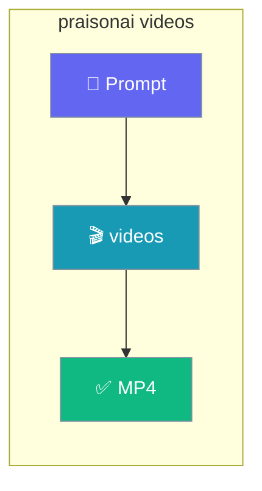

The `praisonai videos` command turns a text prompt into a video from the command line.



## Quick Start

<Steps>
<Step title="Generate a video">
Omit `--model` to use the canonical default `openai/sora-2`.

```bash
praisonai videos "A cat playing with yarn"
```
</Step>

<Step title="Save to a file">
```bash
praisonai videos "A sunset over the ocean" --output sunset.mp4
```
</Step>
</Steps>

---

## How It Works

The command forwards your prompt to the video generation capability and prints the resulting video ID, status, and URL.

| Step | What happens |
|------|--------------|
| Prompt | You describe the video in plain text |
| Model | `--model` selects the route (default `openai/sora-2`) |
| Output | `--output` optionally saves the video to disk |

---

## Options

| Option | Short | Default | Description |
|--------|-------|---------|-------------|
| `--model` | `-m` | `openai/sora-2` | Provider-prefixed LiteLLM route |
| `--output` | `-o` | `None` | Output file path |

Only `--model` and `--output` are configurable on the CLI today.

---

## Common Patterns

Pick a specific model:

```bash
praisonai videos "A city skyline at night" -m openai/sora-2-pro
```

Save the video to disk:

```bash
praisonai videos "A waterfall in a forest" -o waterfall.mp4
```

---

## Best Practices

<AccordionGroup>
<Accordion title="Rely on the default model">
Omit `--model` to use `openai/sora-2`, the canonical default shared by every video surface. Set `--model` only when you need a different provider route.
</Accordion>

<Accordion title="Use provider-prefixed routes">
Always pass a full LiteLLM route such as `openai/sora-2`. Bare names like `sora` are not valid routes and cause routing errors.
</Accordion>

<Accordion title="Save long videos to disk">
Use `--output` to write the result to a file so you keep a local copy of the generated video.
</Accordion>
</AccordionGroup>

---

## Related

<CardGroup cols={2}>
<Card title="Videos Capability" icon="video" href="/capabilities/videos">
The Python `video_generate` API.
</Card>
<Card title="CLI Reference" icon="terminal" href="/cli/cli-reference">
All PraisonAI CLI commands.
</Card>
</CardGroup>
