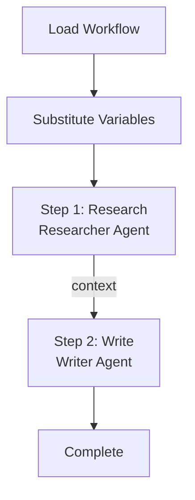

The `workflow` command manages reusable multi-step workflows stored in `.praison/workflows/`.

## Quick Start

```bash
praisonai workflow list
```

<Frame>
  
</Frame>

<CodeGroup>
```bash Template-Based Workflow
# List available workflows
praisonai workflow list

# Execute a workflow
praisonai workflow run "Research Blog" --tools tavily --save
```

```bash Inline Workflow (No Template)
# Quick workflow without creating a file
praisonai "What is AI?" --workflow "Research,Summarize" --save

# With step actions
praisonai "GPT-5" --workflow "Research:Search for info,Analyze:Analyze findings,Write:Write blog"
```
</CodeGroup>

## Two Ways to Run Workflows


| Method | Command | Use Case |
|--------|---------|----------|
| **Template-based** | `praisonai workflow run "name"` | Reusable, complex workflows with per-step agents |
| **Inline** | `praisonai "prompt" --workflow "step1,step2"` | Quick, ad-hoc workflows |

## Template-Based Workflows

### List Workflows

```bash
praisonai workflow list
```

**Expected Output:**
```
╭─ Available Workflows ────────────────────────────────────────────────────────╮
│  📋 deploy - Deploy application to production                               │
│  📋 Research Blog - Research and write blog posts                           │
╰──────────────────────────────────────────────────────────────────────────────╯
```

### Execute Workflow

```bash
praisonai workflow run "Research Blog"
```

### Execute with Options

```bash
# With variables
praisonai workflow run deploy --workflow-var environment=staging --workflow-var branch=main

# With tools and save output
praisonai workflow run "Research Blog" --tools tavily --save

# With planning mode (AI creates sub-steps for each workflow step)
praisonai workflow run "Research Blog" --planning --verbose

# With memory
praisonai workflow run "Research Blog" --memory
```

### Show Workflow Details

```bash
praisonai workflow show deploy
```

### Create Workflow Template

```bash
praisonai workflow create my_workflow
```

## Inline Workflows

Run workflows directly from the command line without creating a template file:

```bash
# Simple format: step names only
praisonai "What is Python?" --workflow "Research,Analyze,Summarize"

# Detailed format: step_name:action
praisonai "AI trends" --workflow "Research:Search for AI trends,Write:Write a blog post"

# With all options
praisonai "GPT-5 features" --workflow "Research,Write" --tools tavily --save --verbose
```

### Inline Workflow Format

| Format | Example | Description |
|--------|---------|-------------|
| Simple | `"Research,Summarize"` | Step name = action |
| Detailed | `"Research:Search for info,Write:Write blog"` | Custom action per step |

## CLI Options

Workflows use global flags (same as other commands):

| Flag | Description |
|------|-------------|
| `--workflow-var key=value` | Set workflow variable (can be repeated) |
| `--llm <model>` | LLM model (e.g., `openai/gpt-4o-mini`) |
| `--tools <tools>` | Tools (comma-separated, e.g., `tavily`) |
| `--planning` | Enable planning mode (AI creates sub-steps) |
| `--memory` | Enable memory |
| `--verbose` | Enable verbose output |
| `--save` | Save output to file |

## Workflow File Format

Workflows are stored in `.praison/workflows/` as **Markdown files** with YAML frontmatter:

```markdown
---
name: Research Blog
description: Research and write blog posts
default_llm: gpt-4o-mini
variables:
  topic: AI trends
---

## Step 1: Research
Research the topic thoroughly.

\`\`\`agent
role: Researcher
goal: Find comprehensive information
\`\`\`

\`\`\`tools
tavily_search
\`\`\`

\`\`\`action
Search for information about {{topic}}
\`\`\`

## Step 2: Write Blog
Write a blog post based on research.

\`\`\`agent
role: Writer
goal: Write engaging content
\`\`\`

context_from: [Research]

\`\`\`action
Write a blog post about {{topic}} using the research data.
\`\`\`
```

## How It Works

1. **Load**: Workflow file is loaded from `.praison/workflows/`
2. **Variables**: Variables are substituted into step prompts
3. **Execution**: Each step is executed sequentially with its configured agent
4. **Context**: Results from each step are passed to the next



## Examples

### Research Workflow

```bash
# Execute with tools
praisonai workflow run "Research Blog" --tools tavily --save

# With planning mode (AI creates sub-steps for each step)
praisonai workflow run "Research Blog" --planning --verbose
```

### Deployment Workflow

```bash
# With variables
praisonai workflow run deploy --workflow-var environment=staging --workflow-var branch=main
```

### Release Workflow

```bash
praisonai workflow run release --workflow-var version=1.2.0
```

## Programmatic Usage

```python
from praisonaiagents import AgentFlowManager

manager = WorkflowManager()

# Execute a workflow
result = manager.execute(
    "deploy",
    executor=lambda prompt: agent.chat(prompt),
    variables={"environment": "production"}
)
```

## Best Practices

<Tip>
Use variables for environment-specific values to make workflows reusable.
</Tip>

<Warning>
Workflows execute steps sequentially. Ensure each step can complete independently.
</Warning>

| Do | Don't |
|-----|-------|
| Use variables for environment values | Hardcode environment names |
| Keep steps focused and atomic | Create monolithic steps |
| Add descriptions to workflows | Skip documentation |
| Test workflows in staging first | Deploy directly to production |

## Auto-Generate Workflows

Generate workflow YAML files automatically from a topic description:

```bash
# Basic auto-generation
praisonai workflow auto "Research and write a blog post"

# With specific pattern
praisonai workflow auto "Analyze market trends" --pattern orchestrator-workers

# With output file
praisonai workflow auto "Customer support routing" --pattern routing --output support_workflow.yaml
```

### Available Patterns

| Pattern | Description | Use Case |
|---------|-------------|----------|
| `sequential` | Agents work one after another | Default, step-by-step tasks |
| `parallel` | Agents work concurrently | Independent subtasks |
| `routing` | Classifier routes to specialists | Different input types |
| `loop` | Repeat steps until condition met | Iterative processing |
| `orchestrator-workers` | Central orchestrator delegates dynamically | Complex decomposition |
| `evaluator-optimizer` | Generate-evaluate loop until quality met | Content refinement |

### Pattern Examples

<AccordionGroup>
  <Accordion title="Orchestrator-Workers">
    Central orchestrator analyzes the task and delegates to specialized workers:
    ```bash
    praisonai workflow auto "Comprehensive market analysis and report" --pattern orchestrator-workers
    ```
    
    Generated workflow includes:
    - **Orchestrator**: Analyzes task, determines required workers
    - **Workers**: Researcher, Analyst, Writer (run in parallel)
    - **Synthesizer**: Combines all worker outputs
</Accordion>

  <Accordion title="Evaluator-Optimizer">
    Iterative refinement with feedback loops:
    ```bash
    praisonai workflow auto "Write and polish a high-quality article" --pattern evaluator-optimizer
    ```
    
    Generated workflow includes:
    - **Generator**: Creates initial content
    - **Evaluator**: Scores content (1-10), provides feedback
    - **Loop**: Continues until score >= 7 or max iterations
</Accordion>

  <Accordion title="Parallel">
    Multiple agents work concurrently:
    ```bash
    praisonai workflow auto "Research from news, social media, and academic sources" --pattern parallel
    ```
  </Accordion>

  <Accordion title="Routing">
    Classifier routes to specialized agents:
    ```bash
    praisonai workflow auto "Handle technical, billing, and general customer requests" --pattern routing
    ```
  </Accordion>
</AccordionGroup>

## Related

- [Workflows Feature](/features/workflows)
- [AutoAgents Feature](/features/autoagents)
- [Auto Generation Mode](/nocode/auto)
- [Planning CLI](/cli/planning)
- [Hooks CLI](/cli/hooks)
