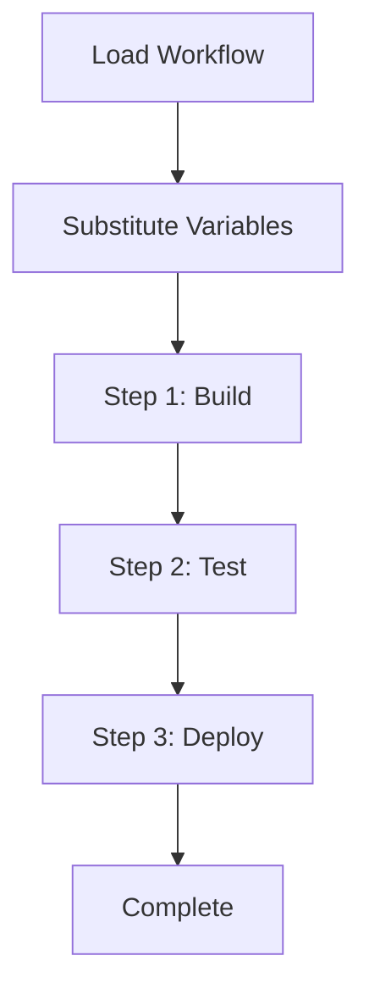

The `workflow` command manages reusable multi-step workflows stored in `.praison/workflows/`.

## Quick Start

```bash
# List available workflows
praisonai workflow list
```

## Usage

### List Workflows

```bash
praisonai workflow list
```

**Expected Output:**
```
╭─ Available Workflows ────────────────────────────────────────────────────────╮
│  📋 deploy - Deploy application to production                               │
│  📋 test - Run test suite with coverage                                     │
│  📋 release - Create and publish release                                    │
╰──────────────────────────────────────────────────────────────────────────────╯
```

### Execute Workflow

```bash
praisonai workflow run deploy
```

### Execute with Variables

```bash
praisonai workflow run deploy --workflow-var environment=staging --workflow-var branch=main
```

### Show Workflow Details

```bash
praisonai workflow show deploy
```

### Create Workflow Template

```bash
praisonai workflow create my_workflow
```

## Workflow File Format

Workflows are stored in `.praison/workflows/` as YAML files:

```yaml
# .praison/workflows/deploy.yaml
name: deploy
description: Deploy application to production
variables:
  environment: production
  branch: main
steps:
  - name: Build
    prompt: Build the application for {{ environment }}
  - name: Test
    prompt: Run tests for {{ branch }} branch
  - name: Deploy
    prompt: Deploy to {{ environment }} environment
```

## How It Works

1. **Load**: Workflow file is loaded from `.praison/workflows/`
2. **Variables**: Variables are substituted into step prompts
3. **Execution**: Each step is executed sequentially
4. **Context**: Results from each step inform the next



## Examples

### Deployment Workflow

```yaml
# .praison/workflows/deploy.yaml
name: deploy
description: Deploy application
variables:
  environment: production
  branch: main
steps:
  - name: Checkout
    prompt: Checkout {{ branch }} branch
  - name: Build
    prompt: Build application for {{ environment }}
  - name: Test
    prompt: Run integration tests
  - name: Deploy
    prompt: Deploy to {{ environment }}
  - name: Verify
    prompt: Verify deployment health
```

```bash
praisonai workflow run deploy --workflow-var environment=staging
```

### Release Workflow

```yaml
# .praison/workflows/release.yaml
name: release
description: Create and publish release
variables:
  version: ""
steps:
  - name: Version
    prompt: Bump version to {{ version }}
  - name: Changelog
    prompt: Generate changelog for {{ version }}
  - name: Tag
    prompt: Create git tag v{{ version }}
  - name: Publish
    prompt: Publish release v{{ version }}
```

```bash
praisonai workflow run release --workflow-var version=1.2.0
```

## Programmatic Usage

```python
from praisonaiagents.memory import WorkflowManager

manager = WorkflowManager()

# Execute a workflow
result = manager.execute(
    "deploy",
    executor=lambda prompt: agent.chat(prompt),
    variables={"environment": "production"}
)
```

## Best Practices

<Tip>
Use variables for environment-specific values to make workflows reusable.
</Tip>

<Warning>
Workflows execute steps sequentially. Ensure each step can complete independently.
</Warning>

| Do | Don't |
|-----|-------|
| Use variables for environment values | Hardcode environment names |
| Keep steps focused and atomic | Create monolithic steps |
| Add descriptions to workflows | Skip documentation |
| Test workflows in staging first | Deploy directly to production |

## Related

- [Workflows Feature](/features/workflows)
- [Planning CLI](/cli/planning)
- [Hooks CLI](/cli/hooks)
