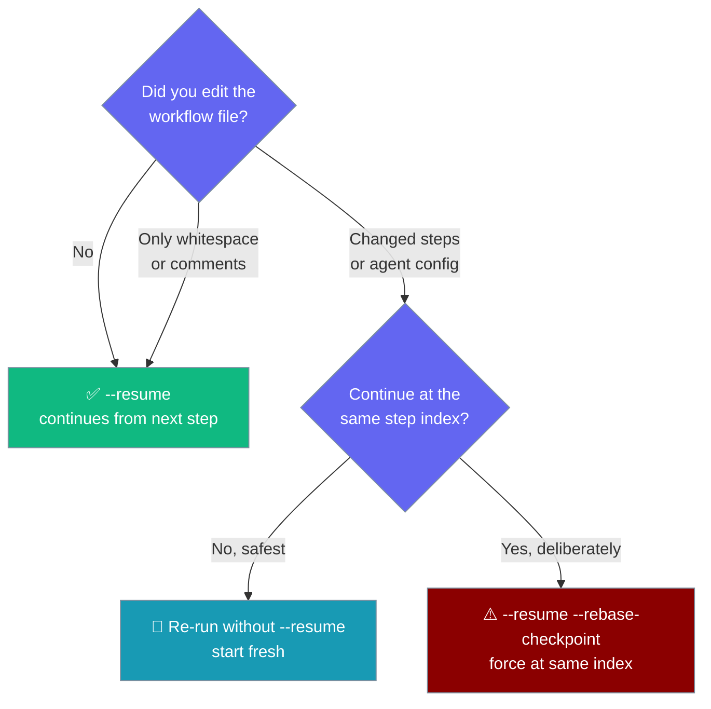
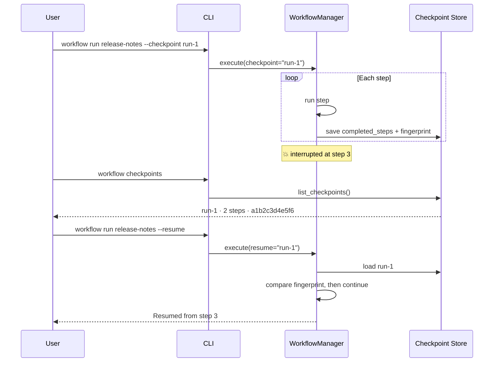
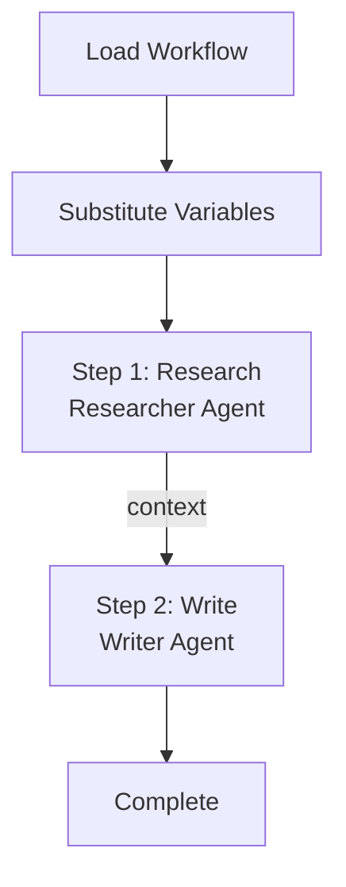

The `workflow` command manages reusable multi-step workflows stored in `.praisonai/workflows/`.

<Info>
**Install requirement:** `praisonai workflow` requires `pip install praisonai` (the full wrapper). On a standalone `pip install praisonai-code` install these subcommands (`list`, `show`, `run`) exit `1` with `workflow requires the full wrapper. Install the full wrapper: pip install praisonai` — a single-line hint, no Rich traceback ([PR #2854](https://github.com/MervinPraison/PraisonAI/pull/2854)).
</Info>

## Quick Start

```bash
praisonai workflow list
```

<Frame>
  
</Frame>

<CodeGroup>
```bash Template-Based Workflow
# List available workflows
praisonai workflow list

# Execute a workflow
praisonai workflow run "Research Blog" --tools tavily --save
```

```bash Inline Workflow (No Template)
# Quick workflow without creating a file
praisonai "What is AI?" --workflow "Research,Summarize" --save

# With step actions
praisonai "GPT-5" --workflow "Research:Search for info,Analyze:Analyze findings,Write:Write blog"
```
</CodeGroup>

## Two Ways to Run Workflows


| Method | Command | Use Case |
|--------|---------|----------|
| **Template-based** | `praisonai workflow run "name"` | Reusable, complex workflows with per-step agents |
| **Inline** | `praisonai "prompt" --workflow "step1,step2"` | Quick, ad-hoc workflows |

## Template-Based Workflows

### List Workflows

```bash
praisonai workflow list
```

**Expected Output:**
```
╭─ Available Workflows ────────────────────────────────────────────────────────╮
│  📋 deploy - Deploy application to production                               │
│  📋 Research Blog - Research and write blog posts                           │
╰──────────────────────────────────────────────────────────────────────────────╯
```

### Execute Workflow

```bash
praisonai workflow run "Research Blog"
```

### Execute with Options

```bash
# With variables
praisonai workflow run deploy --workflow-var environment=staging --workflow-var branch=main

# With tools and save output
praisonai workflow run "Research Blog" --tools tavily --save

# With planning mode (AI creates sub-steps for each workflow step)
praisonai workflow run "Research Blog" --planning --verbose

# With memory
praisonai workflow run "Research Blog" --memory
```

### Resume an Interrupted Workflow

If a workflow stops partway — a crash, a timeout, or a `Ctrl-C` — resume it
from the last saved step instead of starting over. A checkpoint is saved after
each completed step; `--resume` reads it and continues from the next step.

```bash
# Save a checkpoint after each step (name defaults to the workflow name)
praisonai workflow run release-notes --checkpoint run-1

# ...interrupted at step 3 of 6...

# Continue from step 3 — prints "Resumed from step 3"
praisonai workflow run release-notes --resume
```

<Warning>
`--resume`, `--checkpoint`, and `--rebase-checkpoint` apply to **markdown
workflows** run through `WorkflowManager`. YAML workflows use a different
engine and do **not** support these flags yet.
</Warning>

If you edit the workflow file between saving and resuming, a **definition
fingerprint** guards against landing on the wrong step. Whitespace and
comment-only edits keep the same fingerprint, so resume still works. Changing
steps or agent configuration changes the fingerprint and resume refuses:

```bash
# After editing the workflow (add/reorder/remove a step, or change agent config):
praisonai workflow run release-notes --resume
# → Error: workflow definition changed since the checkpoint (fingerprint mismatch:
#          checkpoint=a1b2c3d4e5f6, current=9f8e7d6c5b4a).
#          Re-run without --resume to start fresh, or pass --rebase-checkpoint to
#          deliberately continue at the same step index against the edited definition.

# Force resume at the same step index against the edited workflow (logs a warning):
praisonai workflow run release-notes --resume --rebase-checkpoint
```

Pick between the three options with this decision guide:


```mermaid
graph TD
    Start{Did you edit the<br/>workflow file?} -->|No| Resume[✅ --resume<br/>continues from next step]
    Start -->|Only whitespace<br/>or comments| Resume
    Start -->|Changed steps<br/>or agent config| Decide{Continue at the<br/>same step index?}
    Decide -->|No, safest| Restart[🔁 Re-run without --resume<br/>start fresh]
    Decide -->|Yes, deliberately| Rebase[⚠️ --resume --rebase-checkpoint<br/>force at same index]

    classDef q fill:#6366F1,stroke:#7C90A0,color:#fff
    classDef ok fill:#10B981,stroke:#7C90A0,color:#fff
    classDef restart fill:#189AB4,stroke:#7C90A0,color:#fff
    classDef warn fill:#8B0000,stroke:#7C90A0,color:#fff
    class Start,Decide q
    class Resume ok
    class Restart restart
    class Rebase warn
```

Here is the full save → interrupt → list → resume flow end to end:


```mermaid
sequenceDiagram
    participant User
    participant CLI
    participant Manager as WorkflowManager
    participant Store as Checkpoint Store

    User->>CLI: workflow run release-notes --checkpoint run-1
    CLI->>Manager: execute(checkpoint="run-1")
    loop Each step
        Manager->>Manager: run step
        Manager->>Store: save completed_steps + fingerprint
    end
    Note over Manager: 💥 interrupted at step 3
    User->>CLI: workflow checkpoints
    CLI->>Store: list_checkpoints()
    Store-->>User: run-1 · 2 steps · a1b2c3d4e5f6
    User->>CLI: workflow run release-notes --resume
    CLI->>Manager: execute(resume="run-1")
    Manager->>Store: load run-1
    Manager->>Manager: compare fingerprint, then continue
    Manager-->>User: Resumed from step 3
```

### Manage Checkpoints

List saved workflow checkpoints, or delete one you no longer need.

```bash
# List all saved checkpoints
praisonai workflow checkpoints

# Delete a checkpoint by name
praisonai workflow checkpoints --delete release-notes
```

**Expected Output:**
```
                          Workflow Checkpoints
┏━━━━━━━━━━━━━━┳━━━━━━━━━━━━━━━━┳━━━━━━━━━━━━━━━━━┳━━━━━━━━━━━━━━┳━━━━━━━━━━━━━━━━━━━━━┓
┃ Name         ┃ Workflow       ┃ Completed Steps ┃ Fingerprint  ┃ Saved At            ┃
┡━━━━━━━━━━━━━━╇━━━━━━━━━━━━━━━━╇━━━━━━━━━━━━━━━━━╇━━━━━━━━━━━━━━╇━━━━━━━━━━━━━━━━━━━━━┩
│ release-notes│ release-notes  │ 2               │ a1b2c3d4e5f6 │ 2026-08-19T11:04:12 │
└──────────────┴────────────────┴─────────────────┴──────────────┴─────────────────────┘
```

<Note>
Checkpoint files live in `{workspace}/.praisonai/checkpoints/{name}.json`. The
`Fingerprint` column shows `-` for checkpoints saved before fingerprinting
existed.
</Note>

### Show Workflow Details

```bash
praisonai workflow show deploy
```

### Create Workflow Template

```bash
praisonai workflow create my_workflow
```

## Inline Workflows

Run workflows directly from the command line without creating a template file:

```bash
# Simple format: step names only
praisonai "What is Python?" --workflow "Research,Analyze,Summarize"

# Detailed format: step_name:action
praisonai "AI trends" --workflow "Research:Search for AI trends,Write:Write a blog post"

# With all options
praisonai "GPT-5 features" --workflow "Research,Write" --tools tavily --save --verbose
```

### Inline Workflow Format

| Format | Example | Description |
|--------|---------|-------------|
| Simple | `"Research,Summarize"` | Step name = action |
| Detailed | `"Research:Search for info,Write:Write blog"` | Custom action per step |

## CLI Options

Workflows use global flags (same as other commands):

| Flag | Description |
|------|-------------|
| `--workflow-var key=value` | Set workflow variable (can be repeated) |
| `--llm <model>` | LLM model (e.g., `openai/gpt-4o-mini`) |
| `--tools <tools>` | Tools (comma-separated, e.g., `tavily`) |
| `--planning` | Enable planning mode (AI creates sub-steps) |
| `--memory` | Enable memory |
| `--verbose` | Enable verbose output |
| `--save` | Save output to file |
| `--checkpoint <name>` | Save/resume under this checkpoint name (markdown workflows; defaults to the workflow name) |
| `--resume` | Continue from the last saved checkpoint (markdown workflows only) |
| `--rebase-checkpoint` | Force resume at the same step index despite a workflow definition change (logs a warning) |

## Workflow YAML Schema

### `framework:` key

YAML workflow files accept a top-level `framework:` key. Only `praisonai` (case-insensitive) is supported by the native execution engine.

| Value | Behaviour |
|-------|-----------|
| Omitted or empty | Defaults to `praisonai` — no change |
| `praisonai` (any case) | Runs normally |
| Any other value (`crewai`, `autogen`, …) | Raises `ValueError` at `Workflow.run()` time |

```yaml
# my_workflow.yaml
framework: praisonai   # ✅ OK — or simply omit this key
roles:
  researcher:
    backstory: "You are a researcher"
    goal: "Research the topic"
```

If you set a different framework name, PraisonAI raises immediately rather than silently running the native engine:

```text
ValueError: Workflow YAML framework='crewai' is not supported by the native
PraisonAI execution engine. Only 'praisonai' is supported. Either remove the
'framework:' key or set it to 'praisonai'.
```

<Note>
The `framework:` validation only applies to the native YAML workflow executor (`Workflow.run()`). To run CrewAI or AutoGen, use the [framework adapters](/features/framework-adapter-plugins) path via `praisonai --framework crewai agents.yaml` — see [Framework Availability](/features/framework-availability) for adapter details.
</Note>

## Workflow File Format

Workflows are stored in `.praisonai/workflows/` as **Markdown files** with YAML frontmatter:

```markdown
---
name: Research Blog
description: Research and write blog posts
default_llm: gpt-4o-mini
variables:
  topic: AI trends
---

## Step 1: Research
Research the topic thoroughly.

\`\`\`agent
role: Researcher
goal: Find comprehensive information
\`\`\`

\`\`\`tools
tavily_search
\`\`\`

\`\`\`action
Search for information about {{topic}}
\`\`\`

## Step 2: Write Blog
Write a blog post based on research.

\`\`\`agent
role: Writer
goal: Write engaging content
\`\`\`

context_from: [Research]

\`\`\`action
Write a blog post about {{topic}} using the research data.
\`\`\`
```

## How It Works

1. **Load**: Workflow file is loaded from `.praisonai/workflows/`
2. **Variables**: Variables are substituted into step prompts
3. **Execution**: Each step is executed sequentially with its configured agent
4. **Context**: Results from each step are passed to the next


```mermaid
flowchart TD
    A[Load Workflow] --> B[Substitute Variables]
    B --> C[Step 1: Research<br/>Researcher Agent]
    C -->|context| D[Step 2: Write<br/>Writer Agent]
    D --> E[Complete]
```

## Exit Codes

`praisonai workflow` now returns process exit codes that reflect what actually happened, so CI, benchmarks, and shell pipelines can branch on success without parsing stdout.

| Command | Success | Failure |
|---------|---------|---------|
| `workflow run <name>` | `0` when **every** step succeeds | non-zero when any step fails, the file is missing, or (hierarchical) the manager rejects or raises |
| `workflow validate <file>` | `0` on a valid file | non-zero on validation errors |
| `workflow list` / `workflow show` | `0` | — |
| `workflow help` | `2` | — (Typer rejects the bare `help` topic before the legacy path) |

<Warning>
**Behaviour change (PraisonAI PR #4946).** An `agent`/`action` step that produces **no output** is now a **step failure**, not a warning. Previously every path in the `workflow` handler exited `0` even when steps failed — the fix behind `.github/workflows/praisonai-pr-review.yml` no longer passing unconditionally. Any recipe, tutorial, or CI job that shells out to `praisonai workflow run` and swallows the exit code should be updated: a non-zero exit is now a signal, not noise.
</Warning>

Before the fix, a failed model call was silently swallowed and the run still reported success:

```text
[Writer] Authentication failed for openai.
⚠️  Step 'haiku': Output is None.
✅ Workflow completed successfully!
EXIT=0
```

After the fix, the same run fails loudly:

```text
❌ Workflow failed: haiku: agent produced no output (None) — the model call most likely failed
EXIT=1
```

<Note>
`handler` steps are unchanged — a custom Python `handler` may legitimately return `None`. Only `agent` and `action` steps are treated as failures when they produce nothing.
</Note>

### The `error` field on a failed result

A failed `Workflow.start()` (or `.run()`) result carries an `error` string describing the first failure. It is populated whenever the final workflow status is `failed`; a successful run does not set it.

```python
from praisonaiagents import Workflow

result = Workflow(...).start()
if result.get("error"):
    print("workflow failed:", result["error"])
```

| Failure | Example `error` value |
|---------|-----------------------|
| LLM produced `None` | `haiku: agent produced no output (None) — the model call most likely failed` |
| Manager rejected the step (hierarchical) | `Manager rejected step 'review': output is off-topic` |
| Manager call raised (hierarchical) | the underlying exception text from the manager LLM call |

### Hierarchical Mode Validation

When a workflow runs with `process="hierarchical"`, a manager LLM judges each step's output. Three fail-open defects are fixed as of PR #4946:

- **Manager rejections are honoured.** The manager verdict is parsed with the engine's own `_parse_json_output` helper (the same one used elsewhere in the engine), which strips the ```` ```json ```` fences models routinely emit. A bare `json.loads` used to raise `JSONDecodeError` on every fenced reply and substitute `{"approved": true, "reason": "assuming success"}`, silently discarding a rejection. Now `"approved": false` fails the run.
- **An unreadable verdict fails closed.** If the manager response cannot be parsed into a dict, it is treated as *not approved* rather than assumed successful.
- **A manager outage fails the run.** Exceptions raised during the manager call are now failures, not a logged-and-ignored pass.
- **A step that produced nothing is judged too** — the same no-output rule from the sequential path applies here.

## Examples

### Research Workflow

```bash
# Execute with tools
praisonai workflow run "Research Blog" --tools tavily --save

# With planning mode (AI creates sub-steps for each step)
praisonai workflow run "Research Blog" --planning --verbose
```

### Deployment Workflow

```bash
# With variables
praisonai workflow run deploy --workflow-var environment=staging --workflow-var branch=main
```

### Release Workflow

```bash
praisonai workflow run release --workflow-var version=1.2.0
```

## Programmatic Usage

```python
from praisonaiagents import AgentFlowManager

manager = WorkflowManager()

# Execute a workflow
result = manager.execute(
    "deploy",
    executor=lambda prompt: agent.chat(prompt),
    variables={"environment": "production"}
)
```

## Best Practices

<Tip>
Use variables for environment-specific values to make workflows reusable.
</Tip>

<Warning>
Workflows execute steps sequentially. Ensure each step can complete independently.
</Warning>

| Do | Don't |
|-----|-------|
| Use variables for environment values | Hardcode environment names |
| Keep steps focused and atomic | Create monolithic steps |
| Add descriptions to workflows | Skip documentation |
| Test workflows in staging first | Deploy directly to production |

## Auto-Generate Workflows

<Note>
**Fixed in [PR #2147](https://github.com/MervinPraison/PraisonAI/pull/2147):** `praisonai workflow auto` was non-functional in all previous releases — every call raised a `NameError` on `_models_cache` and surfaced as `Generation failed:` in the CLI. The command now works as documented below.
</Note>

Generate workflow YAML files automatically from a topic description:

```bash
# Basic auto-generation
praisonai workflow auto "Research and write a blog post"

# With specific pattern
praisonai workflow auto "Analyze market trends" --pattern orchestrator-workers

# With output file
praisonai workflow auto "Customer support routing" --pattern routing --output support_workflow.yaml
```

### Available Patterns

| Pattern | Description | Use Case |
|---------|-------------|----------|
| `sequential` | Agents work one after another | Default, step-by-step tasks |
| `parallel` | Agents work concurrently | Independent subtasks |
| `routing` | Classifier routes to specialists | Different input types |
| `loop` | Repeat steps until condition met | Iterative processing |
| `orchestrator-workers` | Central orchestrator delegates dynamically | Complex decomposition |
| `evaluator-optimizer` | Generate-evaluate loop until quality met | Content refinement |

### Pattern Examples

<AccordionGroup>
  <Accordion title="Orchestrator-Workers">
    Central orchestrator analyzes the task and delegates to specialized workers:
    ```bash
    praisonai workflow auto "Comprehensive market analysis and report" --pattern orchestrator-workers
    ```
    
    Generated workflow includes:
    - **Orchestrator**: Analyzes task, determines required workers
    - **Workers**: Researcher, Analyst, Writer (run in parallel)
    - **Synthesizer**: Combines all worker outputs
</Accordion>

  <Accordion title="Evaluator-Optimizer">
    Iterative refinement with feedback loops:
    ```bash
    praisonai workflow auto "Write and polish a high-quality article" --pattern evaluator-optimizer
    ```
    
    Generated workflow includes:
    - **Generator**: Creates initial content
    - **Evaluator**: Scores content (1-10), provides feedback
    - **Loop**: Continues until score >= 7 or max iterations
</Accordion>

  <Accordion title="Parallel">
    Multiple agents work concurrently:
    ```bash
    praisonai workflow auto "Research from news, social media, and academic sources" --pattern parallel
    ```
  </Accordion>

  <Accordion title="Routing">
    Classifier routes to specialized agents:
    ```bash
    praisonai workflow auto "Handle technical, billing, and general customer requests" --pattern routing
    ```
  </Accordion>
</AccordionGroup>

## Related

- [Workflows Feature](/features/workflows)
- [Workflow Checkpoint & Resume](/features/workflow-checkpoint-resume)
- [AutoAgents Feature](/features/autoagents)
- [Auto Generation Mode](/nocode/auto)
- [Planning CLI](/cli/planning)
- [Hooks CLI](/cli/hooks)
