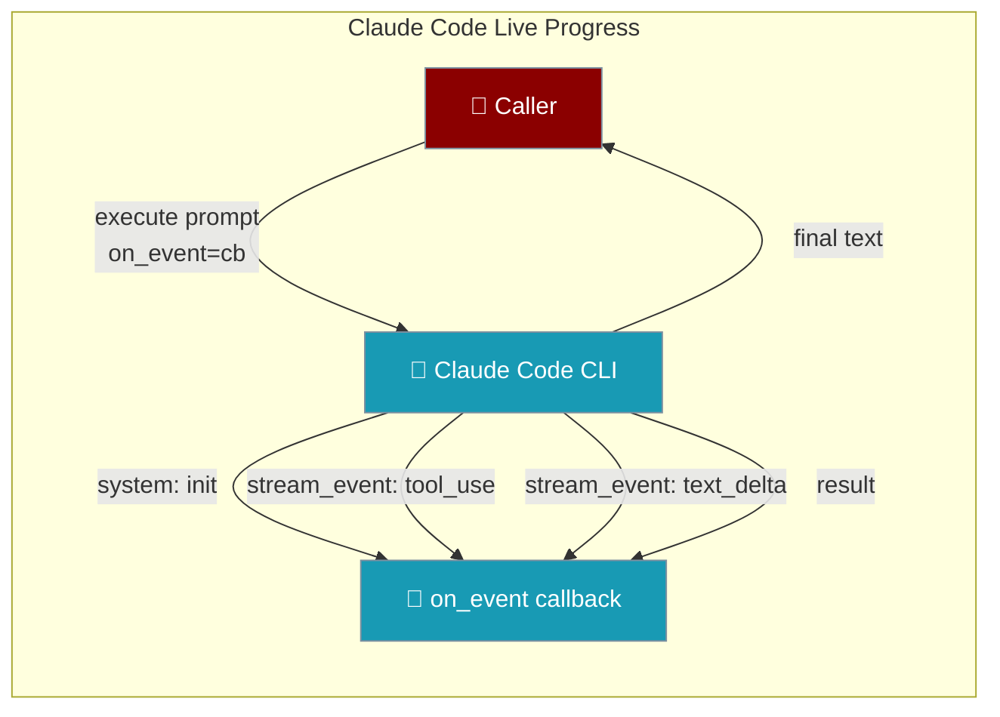

# Claude Code Integration

PraisonAI provides seamless integration with Anthropic's Claude Code CLI, supporting both subprocess-based execution and the official Python SDK.

## Installation

### CLI Installation

```bash
# Install Claude Code CLI
curl -fsSL https://claude.ai/install.sh | bash

# Verify installation
claude --version
```

### SDK Installation (Optional)

```bash
# Install the Python SDK for enhanced features
pip install claude-agent-sdk
```

## Quick Start

```python
from praisonai.integrations import ClaudeCodeIntegration

# Create integration
claude = ClaudeCodeIntegration(
    workspace="/path/to/project",
    output_format="json",
    skip_permissions=True
)

# Execute a coding task
result = await claude.execute("Refactor the auth module")
print(result)
```

## Use as Agent Backend

Delegate an Agent's LLM turns to the `claude` CLI instead of the Anthropic API — the flagship CLI backend, works with Claude Pro / Max subscriptions.

```python
from praisonaiagents import Agent

agent = Agent(name="assistant", cli_backend="claude-code")
agent.start("Hello")
```

<Note>
`cli_backend=` is deprecated (removal in 2.0.0). Prefer `runtime="claude-code"`. See [Subscription Auth](/features/subscription-auth) for login details and the [CLI Backend Protocol](/features/cli-backend-protocol) for the full config surface.
</Note>

## Configuration Options

| Option | Type | Default | Description |
|--------|------|---------|-------------|
| `workspace` | str | "." | Working directory for CLI execution |
| `timeout` | int | 300 | Timeout in seconds |
| `output_format` | str | "json" | Output format: "json", "text", "stream-json" |
| `skip_permissions` | bool | True | Skip permission prompts |
| `system_prompt` | str | None | Custom system prompt to append |
| `allowed_tools` | list | None | List of allowed tools |
| `disallowed_tools` | list | None | List of disallowed tools |
| `use_sdk` | bool | False | Use SDK instead of subprocess |
| `model` | str | None | Model to use (e.g., "sonnet", "opus") |

**Runtime-only kwargs** (passed to `execute()`, not to the constructor):

| Option | Type | Default | Description |
|--------|------|---------|-------------|
| `on_event` (alias `on_progress`) | `Callable[[dict], Any]` \| `Awaitable` | `None` | Called with every event (`system`, `stream_event`, `result`) as the run streams. Sync or async. Exceptions are swallowed so a broken sink can't fail the run. |
| `continue_session` | `bool` | `False` | Continue the previous session. |

The callback receives one event dict at a time:

| `event["type"]` | Meaning | Useful fields |
|-----------------|---------|---------------|
| `system` (subtype `init`) | Session started | `session_id`, `model` |
| `stream_event` | Partial content — token/tool-use deltas | `event.content_block.type == "tool_use"`, or `event.delta.type == "text_delta"` with `event.delta.text` |
| `result` (subtype `success`) | Terminal event with final answer | `result` (final text), `total_cost_usd` |

## Examples

### Basic Execution

```python
from praisonai.integrations import ClaudeCodeIntegration

claude = ClaudeCodeIntegration(workspace="/project")

# Simple task
result = await claude.execute("Add error handling to main.py")
print(result)
```

### With System Prompt

```python
claude = ClaudeCodeIntegration(
    workspace="/project",
    system_prompt="You are a Python expert. Follow PEP 8 guidelines."
)

result = await claude.execute("Refactor the utils module")
```

### Tool Restrictions

```python
claude = ClaudeCodeIntegration(
    workspace="/project",
    allowed_tools=["Read", "Write"],  # Only allow file operations
    disallowed_tools=["Bash"]  # Disable shell commands
)

result = await claude.execute("Update the config file")
```

### Session Continuation

```python
claude = ClaudeCodeIntegration(workspace="/project")

# First request
result1 = await claude.execute("Read main.py and understand the structure")

# Continue the session
result2 = await claude.execute(
    "Now refactor the function we discussed",
    continue_session=True
)

# Reset session
claude.reset_session()
```

### Using the SDK

```python
claude = ClaudeCodeIntegration(
    workspace="/project",
    use_sdk=True  # Use claude-agent-sdk if available
)

# Check if SDK is available
print(f"SDK available: {claude.sdk_available}")

result = await claude.execute("Complex refactoring task")
```

### Live Progress with `on_event`

Pass an `on_event` callback to `execute()` to see live progress while the run is still in flight — `execute()` still returns the final text.



An Agent using the Claude Code tool surfaces progress with the same `on_event` kwarg — nothing extra on the Agent side.

```python
from praisonaiagents import Agent
from praisonai.integrations import ClaudeCodeIntegration

progress_log = []
claude = ClaudeCodeIntegration(workspace=".")

# The agent hands its progress sink to the tool at call time via on_event.
tool = claude.as_tool()

agent = Agent(
    name="Coder",
    instructions="Refactor code and keep the user informed as you go.",
    tools=[tool],
)
agent.start("Refactor the payment module")
```

The raw one-liner most callers reach for first:

```python
from praisonai.integrations import ClaudeCodeIntegration

claude = ClaudeCodeIntegration(workspace="/project")

def show_progress(event):
    t = event.get("type")
    if t == "system":
        print(f"[started on {event.get('model')}]")
    elif t == "stream_event":
        block = (event.get("event") or {}).get("content_block", {})
        if block.get("type") == "tool_use":
            print(f"→ {block.get('name')}")

# execute() still returns the final text — you just also see progress.
final = await claude.execute(
    "Refactor the auth module and add tests",
    on_event=show_progress,
)
print(final)
```

`on_event` may be sync or async — awaitable results are awaited:

```python
async def stream_to_ui(event):
    await websocket.send_json(event)

final = await claude.execute("Big refactor", on_event=stream_to_ui)
```

<Note>
`on_event` may be sync or async — awaitable results are awaited. A failing callback never breaks the underlying run, so you can plug in any UI without crashing the agent. Use either `on_event` or its alias `on_progress`.
</Note>

<Note>
**`use_sdk=True` + `on_event`:** When you pass a progress callback, the integration silently reroutes through the subprocess path — even if `use_sdk=True` — because the SDK path yields no partial events. If you rely on the SDK for a specific reason (e.g. `claude-agent-sdk` custom tools), don't pass `on_event`. Any `output_format` you set is also ignored, since streaming forces `stream-json`.
</Note>

### Streaming Output

Iterate `stream()` directly for full control over each event.

```python
claude = ClaudeCodeIntegration(workspace="/project")

async for event in claude.stream("Add comprehensive tests"):
    if event.get("type") == "system":
        print(f"[session {event.get('session_id')} started on {event.get('model')}]")
    elif event.get("type") == "stream_event":
        inner = event.get("event", {})
        # Tool-use start
        block = inner.get("content_block", {})
        if block.get("type") == "tool_use":
            print(f"→ using tool: {block.get('name')}")
        # Streaming text
        delta = inner.get("delta", {})
        if delta.get("type") == "text_delta":
            print(delta.get("text", ""), end="", flush=True)
    elif event.get("type") == "result":
        print(f"\n✅ done. cost=${event.get('total_cost_usd', 0):.4f}")
```

### As Agent Tool

```python
from praisonai import Agent
from praisonai.integrations import ClaudeCodeIntegration

claude = ClaudeCodeIntegration(
    workspace="/project",
    skip_permissions=True
)

# Create tool
tool = claude.as_tool()

# Use with agent
agent = Agent(
    name="Code Assistant",
    role="Software Developer",
    goal="Help with coding tasks",
    tools=[tool]
)

result = agent.start("Refactor the authentication module")
```

## Environment Variables

```bash
# API Key (required)
export ANTHROPIC_API_KEY=your-key
# or
export CLAUDE_API_KEY=your-key

# Optional: Set default workspace
export PRAISONAI_CODE_REPO_PATH=/path/to/project
```

## CLI Flags Used

The integration uses the following Claude Code CLI flags:

| Flag | Description |
|------|-------------|
| `-p` | Print mode (headless) |
| `--output-format json` | JSON output for parsing |
| `--continue` | Continue previous session |
| `--dangerously-skip-permissions` | Skip permission prompts |
| `--append-system-prompt` | Add custom system prompt |
| `--allowedTools` | Restrict available tools |
| `--disallowedTools` | Disable specific tools |
| `--model` | Select model (sonnet, opus) |
| `--verbose` | Forced automatically when `output_format="stream-json"` (the CLI rejects `stream-json` in print mode without it). |
| `--include-partial-messages` | Forced automatically when `output_format="stream-json"` — emits the token/tool-use deltas that make live progress visible. |

## Error Handling

```python
from praisonai.integrations import ClaudeCodeIntegration

claude = ClaudeCodeIntegration(timeout=60)

try:
    result = await claude.execute("Complex task")
except TimeoutError:
    print("Task timed out after 60 seconds")
except Exception as e:
    print(f"Error: {e}")
```

## Best Practices

1. **Use JSON output** for programmatic processing
2. **Set appropriate timeouts** for complex tasks
3. **Use tool restrictions** for security
4. **Enable SDK** for enhanced features when available
5. **Use session continuation** for multi-step tasks
