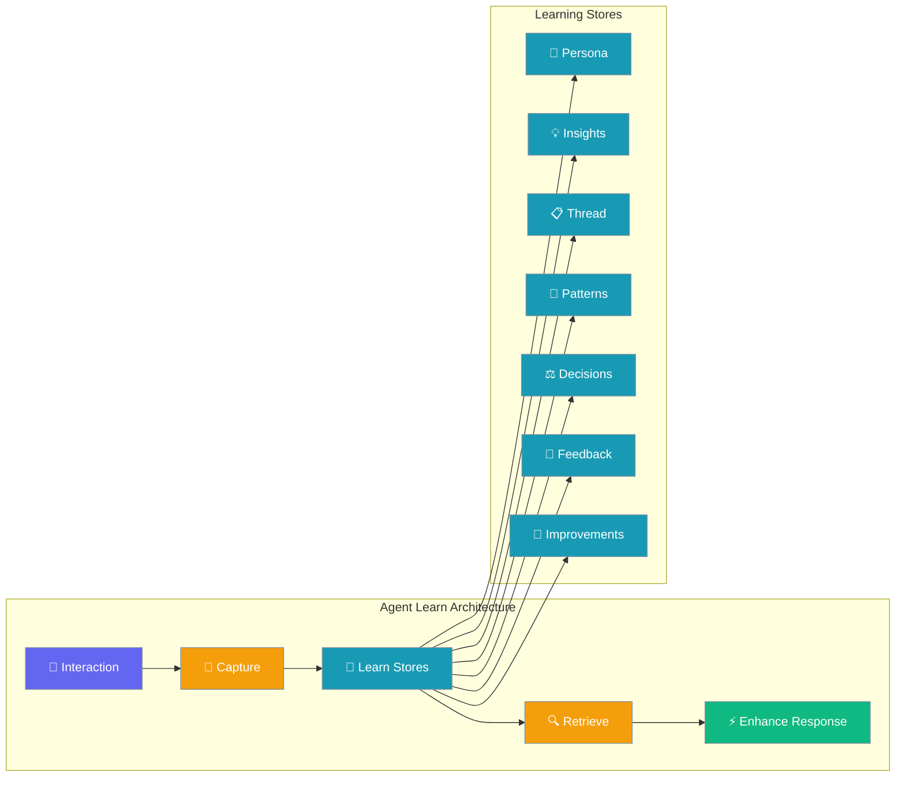
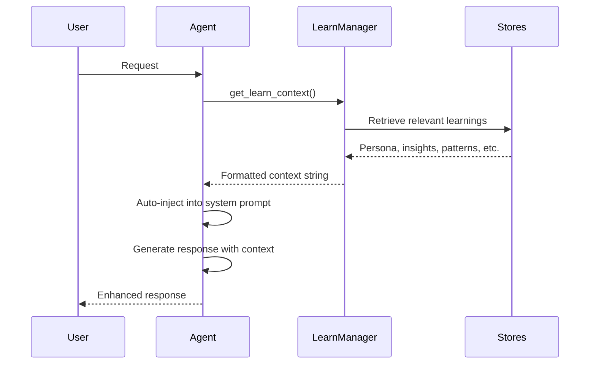

Agent Learn enables agents to capture and recall patterns, preferences, and insights from interactions, improving future responses through persistent learning stores.


```mermaid
graph LR
    subgraph "Agent Learn Architecture"
        I[💬 Interaction] --> C[🧠 Capture]
        C --> S[💾 Learn Stores]
        S --> R[🔍 Retrieve]
        R --> E[⚡ Enhance Response]
    end
    
    subgraph "Learning Stores"
        P[👤 Persona]
        N[💡 Insights]
        T[📋 Thread]
        PT[🔄 Patterns]
        D[⚖️ Decisions]
        F[📝 Feedback]
        IM[🚀 Improvements]
    end
    
    S --> P
    S --> N
    S --> T
    S --> PT
    S --> D
    S --> F
    S --> IM
    
    classDef input fill:#6366F1,stroke:#7C90A0,color:#fff
    classDef process fill:#F59E0B,stroke:#7C90A0,color:#fff
    classDef store fill:#189AB4,stroke:#7C90A0,color:#fff
    classDef result fill:#10B981,stroke:#7C90A0,color:#fff
    
    class I input
    class C,R process
    class S,P,N,T,PT,D,F,IM store
    class E result
```

## Quick Start

<Steps>

<Step title="Simple Shorthand (Recommended)">
The easiest way to enable Agent Learn:

```python
from praisonaiagents import Agent

agent = Agent(
    name="Learning Agent",
    instructions="You are a helpful assistant that learns from interactions",
    learn=True  # Enables AGENTIC mode (auto-learning)
)

agent.start("What's my preferred coding style?")
```

<Note>
`learn=True` is a top-level Agent parameter — peer to `memory=`. It auto-creates a minimal memory backend if needed.
</Note>
</Step>

<Step title="With Specific Capabilities">
```python
from praisonaiagents import Agent, LearnConfig

agent = Agent(
    name="Learning Agent",
    instructions="You learn and adapt to user preferences",
    learn=LearnConfig(
        persona=True,      # User preferences
        insights=True,     # Observations
        patterns=True,     # Reusable knowledge
        decisions=True,    # Decision logging
    )
)
```
</Step>

<Step title="All 7 Stores (Full Learning)">
```python
from praisonaiagents import Agent, LearnConfig

# Enable all 7 learning stores for comprehensive learning
agent = Agent(
    name="Full Learning Agent",
    instructions="You are a comprehensive learner",
    learn=LearnConfig(
        persona=True,       # User preferences & profile
        insights=True,      # Observations & learnings
        thread=True,        # Session context
        patterns=True,      # Reusable knowledge
        decisions=True,     # Decision rationale
        feedback=True,      # Outcome signals
        improvements=True,  # Self-improvement proposals
    )
)
```
</Step>

</Steps>

---

## How It Works


```mermaid
sequenceDiagram
    participant User
    participant Agent
    participant LearnManager
    participant Stores
    
    User->>Agent: Request
    Agent->>LearnManager: get_learn_context()
    LearnManager->>Stores: Retrieve relevant learnings
    Stores-->>LearnManager: Persona, insights, patterns, etc.
    LearnManager-->>Agent: Formatted context string
    Agent->>Agent: Auto-inject into system prompt
    Agent->>Agent: Generate response with context
    Agent-->>User: Enhanced response
```

<Info>
**Auto-Injection**: When `learn=True` is enabled, learned context is **automatically injected** into the agent's system prompt before each response. No manual wiring needed!
</Info>

| Phase | Description |
|-------|-------------|
| **Retrieve** | `get_learn_context()` fetches learnings from all enabled stores |
| **Auto-Inject** | Context automatically added to system prompt as "Learned Context" section |
| **Generate** | Agent uses learned context to personalize response |
| **Persist** | Learnings stored in JSON files for cross-session persistence |

---

## What Gets Injected

When `learn=True` is enabled, the agent's system prompt automatically includes a "Learned Context" section with:

```xml
## Learned Context

### User Persona
- Prefers dark mode and vim keybindings
- Senior developer working on Python projects

### Insights  
- User values concise, technical responses
- Prefers code examples over lengthy explanations

### Patterns
- Common workflow: test → implement → refactor
- Prefers pytest over unittest

### Decisions
- Chose PostgreSQL over MySQL for type safety
- Selected FastAPI for async performance

### Feedback
- Positive: step-by-step debugging approach
- Improvement: add more context in error messages

### Improvements
- Consider caching frequent queries
- Add retry logic for API calls
```

<Tip>
Each section only appears if the corresponding store is enabled AND contains data. Thread context is excluded from injection as it's session-specific.
</Tip>

---

## Learning Stores

Agent Learn organizes knowledge into specialized stores:

| Store | Purpose | Default |
|-------|---------|---------|
| `persona` | User preferences, communication style, profile | `True` |
| `insights` | Observations and learnings from interactions | `True` |
| `thread` | Session and conversation context | `True` |
| `patterns` | Reusable knowledge patterns | `False` |
| `decisions` | Decision logging and rationale | `False` |
| `feedback` | Outcome signals and corrections | `False` |
| `improvements` | Self-improvement proposals | `False` |

---

## Configuration Options

```python
from praisonaiagents import LearnConfig

config = LearnConfig(
    # Learning capabilities
    persona=True,           # User preferences and profile
    insights=True,          # Observations and learnings
    thread=True,            # Session/conversation context
    patterns=False,         # Reusable knowledge patterns
    decisions=False,        # Decision logging
    feedback=False,         # Outcome signals
    improvements=False,     # Self-improvement proposals
    
    # Scope configuration
    scope="private",        # "private" or "shared"
    
    # Storage
    store_path=None,        # Custom storage path
    
    # Maintenance
    auto_consolidate=True,  # Auto-consolidate learnings
    retention_days=None,    # Days to retain (None = forever)
)
```

| Option | Type | Default | Description |
|--------|------|---------|-------------|
| `persona` | `bool` | `True` | Capture user preferences and profile |
| `insights` | `bool` | `True` | Store observations and learnings |
| `thread` | `bool` | `True` | Maintain session context |
| `patterns` | `bool` | `False` | Store reusable knowledge patterns |
| `decisions` | `bool` | `False` | Log decisions with rationale |
| `feedback` | `bool` | `False` | Capture outcome signals |
| `improvements` | `bool` | `False` | Track self-improvement proposals |
| `scope` | `str` | `"private"` | Learning visibility: `"private"` or `"shared"` |
| `store_path` | `str` | `None` | Custom storage directory |
| `auto_consolidate` | `bool` | `True` | Automatically consolidate learnings |
| `retention_days` | `int` | `None` | Days to retain entries (None = forever) |

---

## CLI Commands

Manage learning data via the command line:

### Show Status

```bash
praisonai memory learn status --user-id default
```

### Show Learned Entries

```bash
# Show all stores
praisonai memory learn show all --limit 10

# Show specific store
praisonai memory learn show persona --user-id default
```

### Add Learning Entry

```bash
# Add to insights store
praisonai memory learn add "User prefers concise responses" --store insights

# Add to persona store
praisonai memory learn add "Prefers Python over JavaScript" --store persona
```

### Search Learnings

```bash
praisonai memory learn search "coding style" --limit 5
```

### Clear Learnings

```bash
# Clear all stores
praisonai memory learn clear all --force

# Clear specific store
praisonai memory learn clear persona --user-id default
```

---

## Common Patterns

### Personal Assistant with Memory

```python
from praisonaiagents import Agent, MemoryConfig, LearnConfig

agent = Agent(
    name="Personal Assistant",
    instructions="You are a personal assistant that remembers user preferences",
    memory=MemoryConfig(
        backend="sqlite",
        user_id="user123",
        learn=LearnConfig(
            persona=True,
            insights=True,
            patterns=True,
        )
    )
)

# First interaction
agent.start("I prefer dark mode and vim keybindings")

# Later interaction - agent remembers preferences
agent.start("Set up my development environment")
```

### Team Knowledge Base

```python
from praisonaiagents import Agent, MemoryConfig, LearnConfig

agent = Agent(
    name="Team Knowledge Agent",
    instructions="You help the team by learning from shared experiences",
    memory=MemoryConfig(
        learn=LearnConfig(
            scope="shared",      # Share learnings across team
            patterns=True,       # Capture reusable patterns
            decisions=True,      # Log architectural decisions
            improvements=True,   # Track improvement proposals
        )
    )
)
```

### Feedback-Driven Learning

```python
from praisonaiagents import Agent, MemoryConfig, LearnConfig

agent = Agent(
    name="Adaptive Agent",
    instructions="You improve based on feedback",
    memory=MemoryConfig(
        learn=LearnConfig(
            feedback=True,       # Capture outcome signals
            improvements=True,   # Track self-improvement
            auto_consolidate=True,
        )
    )
)
```

---

## Active Learning Tools

For agents that need **explicit control** over what they learn and recall, use the `store_learning` and `search_learning` tool functions — the Learn system counterparts to `store_memory` / `search_memory`.

```python
from praisonaiagents import Agent
from praisonaiagents.tools import store_learning, search_learning

agent = Agent(
    instructions="You learn user preferences.",
    memory=True,
    learn=True,
    tools=[store_learning, search_learning],
)

agent.start("I prefer bullet-point answers")
# Agent calls store_learning("prefers bullet-point answers", category="persona")

agent.start("How do I like my answers?")
# Agent calls search_learning("answer format") → recalls "bullet-point answers"
```

### store_learning

Store a learning entry in the agent's learn system.

| Parameter | Type | Required | Default | Description |
|-----------|------|----------|---------|-------------|
| `content` | `str` | Yes | — | The learning to store |
| `category` | `str` | No | `"persona"` | Category: `persona`, `insights`, `patterns`, `decisions`, `feedback`, `improvements` |

### search_learning

Search previously stored learnings.

| Parameter | Type | Required | Default | Description |
|-----------|------|----------|---------|-------------|
| `query` | `str` | Yes | — | Search query |
| `limit` | `int` | No | `5` | Max results to return |

<Tip>
These tools use `Injected[AgentState]` — the `learn_manager` is automatically provided at runtime. No manual wiring needed.
</Tip>

---

## Best Practices

<AccordionGroup>
  <Accordion title="Use private scope for personal data">
    Keep `scope="private"` (default) when storing user-specific preferences or sensitive information. Use `scope="shared"` only for team knowledge that should benefit all agents.
  </Accordion>
  
  <Accordion title="Enable stores incrementally">
    Start with the default stores (`persona`, `insights`, `thread`) and enable additional stores (`patterns`, `decisions`, `feedback`, `improvements`) as your use case requires them.
  </Accordion>
  
  <Accordion title="Set retention for transient data">
    Use `retention_days` for stores that capture temporal patterns. Thread context often benefits from 7-30 day retention to avoid clutter.
  </Accordion>
  
  <Accordion title="Consolidate periodically">
    Keep `auto_consolidate=True` to automatically merge and summarize learnings over time, preventing store bloat.
  </Accordion>
</AccordionGroup>

---

## Related

<CardGroup cols={2}>
  <Card title="Agent Train" icon="dumbbell" href="/docs/concepts/agent-train">
    Active iterative training
  </Card>
  <Card title="Learn vs Train" icon="scale-balanced" href="/docs/concepts/learn-vs-train">
    Compare passive learning vs active training
  </Card>
  <Card title="Memory" icon="brain" href="/docs/concepts/memory">
    Understanding agent memory systems
  </Card>
  <Card title="Knowledge" icon="book" href="/docs/concepts/knowledge">
    RAG and knowledge retrieval
  </Card>
</CardGroup>
