Agent Train enables active improvement of agent behavior through iterative feedback loops. Unlike [Agent Learn](/docs/concepts/agent-learn) which captures patterns passively, training uses explicit human or LLM feedback to refine responses.

```mermaid
graph TB
    subgraph "Agent Training Flow"
        I[📋 Scenario] --> A[🤖 Agent]
        A --> O[📝 Output]
        O --> G{Grader}
        G -->|Score + Feedback| R[🔄 Improve]
        R --> A
    end
    
    subgraph "Grading Modes"
        H[👤 Human Feedback]
        L[🧠 LLM-as-Judge]
    end
    
    G --> H
    G --> L
    
    classDef input fill:#6366F1,stroke:#7C90A0,color:#fff
    classDef process fill:#F59E0B,stroke:#7C90A0,color:#fff
    classDef output fill:#10B981,stroke:#7C90A0,color:#fff
    
    class I input
    class A,O,G,R process
    class H,L output
```



## Quick Start

<Steps>

<Step title="Simple CLI Training">
Train an agent with a single input:

```bash
praisonai train agents --input "What is Python?"
```
</Step>

<Step title="Human-in-the-Loop">
Get human feedback instead of automated grading:

```bash
praisonai train agents --input "Explain machine learning" --human
```
</Step>

<Step title="Multiple Iterations">
Run multiple training iterations:

```bash
praisonai train agents --input "Write a poem" --iterations 5
```
</Step>

</Steps>

---

## How It Works


| Phase | Description |
|-------|-------------|
| **Scenario** | Define input and expected output |
| **Execute** | Run agent and capture response |
| **Grade** | Score output (human or LLM) |
| **Improve** | Build enhanced prompt from feedback |
| **Iterate** | Repeat for N iterations |
| **Report** | Generate training summary |

---

## SDK Usage

```python
from praisonai.train.agents import AgentTrainer, TrainingScenario
from praisonaiagents import Agent

# Create agent
agent = Agent(
    name="Assistant",
    instructions="You are a helpful assistant"
)

# Create trainer
trainer = AgentTrainer(
    agent=agent,
    iterations=3,
    human=False  # Use LLM grading
)

# Add training scenario
trainer.add_scenario(TrainingScenario(
    id="greeting",
    input_text="Hello, how are you?",
    expected_output="A friendly greeting response"
))

# Run training
report = trainer.run()

print(f"Final score: {report.avg_score}/10")
print(f"Improvement: {report.improvement:+.1f}")
```

---

## CLI Commands

### Train Agents

```bash
praisonai train agents [OPTIONS] [AGENT_FILE]
```

| Option | Description | Default |
|--------|-------------|---------|
| `--input`, `-i` | Single input text | - |
| `--expected`, `-e` | Expected output | - |
| `--iterations`, `-n` | Number of iterations | `3` |
| `--human`, `-h` | Use human feedback | `false` |
| `--scenarios`, `-s` | Scenarios JSON file | - |
| `--model`, `-m` | LLM for grading | `gpt-4o-mini` |
| `--storage-backend` | `file`, `sqlite`, `redis://` | `file` |

### List Sessions

```bash
praisonai train list
```

### Show Session Details

```bash
praisonai train show <session_id>
```

---

## Grading Modes

<Tabs>
<Tab title="LLM-as-Judge (Default)">
Automated grading using an LLM to evaluate responses:

```bash
praisonai train agents --input "Explain AI" --model gpt-4o
```

The LLM grades based on:
- Relevance to input
- Accuracy of information
- Clarity and completeness
- Match to expected output (if provided)
</Tab>

<Tab title="Human Feedback">
Interactive mode where you score and provide feedback:

```bash
praisonai train agents --input "Write a haiku" --human
```

You'll be prompted to:
1. Review the agent's output
2. Provide a score (1-10)
3. Enter improvement suggestions
</Tab>
</Tabs>

---

## Storage Backends

Training data persists across sessions:

```bash
# File storage (default)
praisonai train agents --input "Hello" --storage-backend file

# SQLite (recommended for production)
praisonai train agents --input "Hello" --storage-backend sqlite

# Redis (distributed systems)
praisonai train agents --input "Hello" --storage-backend redis://localhost:6379
```

Training data is stored as JSON (not pickle), making it:
- ✅ Human-readable
- ✅ Git-friendly
- ✅ Secure (no pickle vulnerabilities)
- ✅ Cross-platform compatible

---

## Scenarios File

For batch training, use a scenarios file:

```json
[
  {
    "id": "greeting",
    "input_text": "Hello, how are you?",
    "expected_output": "A friendly response"
  },
  {
    "id": "coding",
    "input_text": "Write a Python hello world",
    "expected_output": "print('Hello, World!')"
  }
]
```

```bash
praisonai train agents --scenarios scenarios.json --iterations 5
```

---

## Learn vs Train

| Aspect | Agent Learn | Agent Training |
|--------|-------------|----------------|
| **Purpose** | Passive learning during interactions | Active iterative improvement |
| **Trigger** | Automatic during `agent.start()` | Explicit CLI/SDK call |
| **Feedback** | Implicit (patterns, insights) | Explicit (score, suggestions) |
| **Storage** | Persona, insights, patterns stores | Scenarios, iterations, reports |
| **Use Case** | Remember user preferences | Improve agent behavior |

<Tip>
Agent Learn and Agent Training are **complementary**. Use Learn for continuous adaptation and Training for focused improvement sessions.
</Tip>

See [Learn vs Train Comparison](/docs/concepts/learn-vs-train) for detailed differences.

---

## Related

<CardGroup cols={2}>
  <Card title="Agent Learn" icon="graduation-cap" href="/docs/concepts/agent-learn">
    Passive continuous learning
  </Card>
  <Card title="Learn vs Train" icon="scale-balanced" href="/docs/concepts/learn-vs-train">
    Detailed comparison
  </Card>
</CardGroup>
