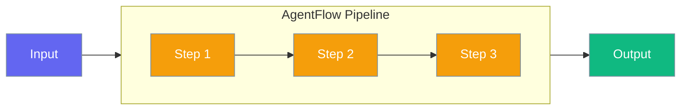
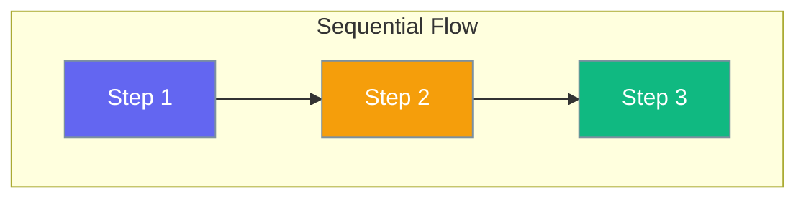
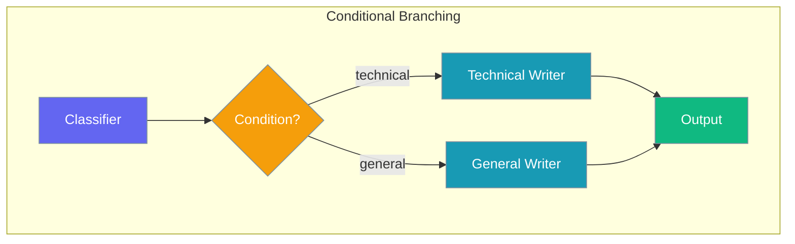
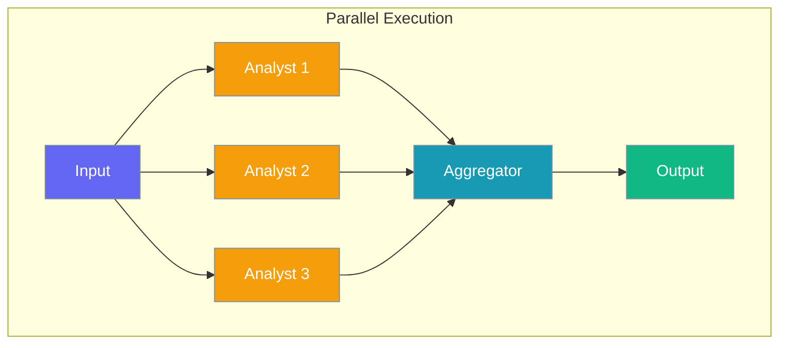
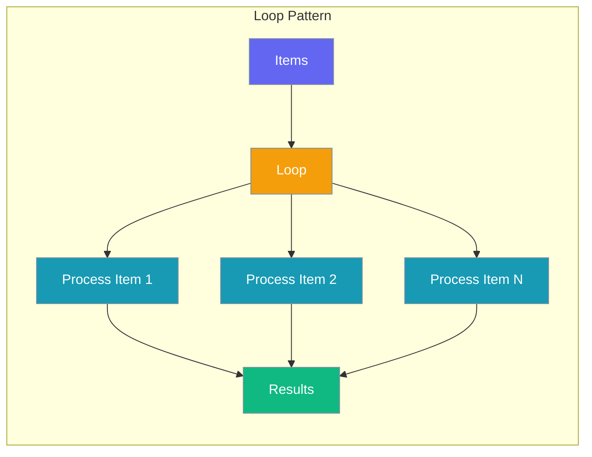

AgentFlow is the workflow orchestration system for creating deterministic, multi-step pipelines. It supports sequential execution, conditional branching, loops, and parallel processing.



## Quick Start

<Steps>

<Step title="Simple Pipeline">
Create a basic sequential workflow:

```python
from praisonaiagents import Agent, AgentFlow

# Define agents as steps
writer = Agent(
    name="Writer",
    instructions="Write content based on the input"
)

editor = Agent(
    name="Editor", 
    instructions="Edit and improve the content"
)

# Create flow
flow = AgentFlow(
    steps=[writer, editor]
)

result = flow.start("Write about artificial intelligence")
print(result["output"])
```
</Step>

<Step title="With Variables">
Pass variables between steps:

```python
from praisonaiagents import Agent, AgentFlow

flow = AgentFlow(
    steps=[researcher, writer, publisher],
    variables={
        "topic": "Machine Learning",
        "word_count": 500,
        "tone": "professional"
    }
)

result = flow.start()
```
</Step>

<Step title="Planning Mode">
Enable AI-powered planning for complex workflows:

```python
from praisonaiagents import Agent, AgentFlow

# Option 1: Enable planning with default model
flow = AgentFlow(
    steps=[agent1, agent2, agent3],
    planning=True,
    output="verbose"
)

# Option 2: Specify a planning model (also enables planning)
flow = AgentFlow(
    steps=[agent1, agent2, agent3],
    planning="gpt-4o",
    output="verbose"
)

result = flow.start("Complete this complex task")
```
</Step>

<Step title="With Loops">
Iterate over items:

```python
from praisonaiagents import Agent, AgentFlow
from praisonaiagents.workflows import loop

processor = Agent(instructions="Process the item: {{item}}")

flow = AgentFlow(
    steps=[
        loop(processor, over="items", parallel=True)
    ],
    variables={
        "items": ["item1", "item2", "item3"]
    }
)

result = flow.start()
```
</Step>

</Steps>

## Flow Patterns

### Sequential

Steps execute in order, each receiving the previous step's output.



```python
flow = AgentFlow(steps=[step1, step2, step3])
```

---

### Conditional Branching

Route to different steps based on conditions.



```python
from praisonaiagents import AgentFlow, when

flow = AgentFlow(steps=[
    classifier,
    when(
        condition="{{category}} == technical",
        then_steps=[technical_writer],
        else_steps=[general_writer]
    )
])
```

---

### Parallel Execution

Execute steps simultaneously.



```python
from praisonaiagents import AgentFlow, parallel

flow = AgentFlow(steps=[
    parallel([analyst1, analyst2, analyst3]),
    aggregator
])
```

---

### Loops

Iterate over collections.



```python
from praisonaiagents import AgentFlow, loop

flow = AgentFlow(steps=[
    loop(processor, over="items"),           # Sequential
    loop(processor, over="items", parallel=True),  # Parallel
    loop(processor, from_csv="data.csv"),    # From CSV file
])
```

## Configuration Options

| Parameter | Type | Default | Description |
|-----------|------|---------|-------------|
| `steps` | List | Required | Workflow steps (Agent, function, pattern) |
| `variables` | Dict | `{}` | Variables passed to all steps |
| `llm` | str | `"gpt-4o-mini"` | Default LLM for agents |
| `process` | str | `"sequential"` | Process type |
| `output` | str/Config | None | Output configuration |
| `planning` | bool/str | `False` | Enable/configure planning |
| `memory` | bool/Config | None | Memory configuration |
| `hooks` | Config | None | Lifecycle callbacks |
| `history` | bool | `False` | Track execution history |
| `context` | bool | `True` | Context management |

## Using Functions as Steps

You can use regular Python functions as steps:

```python
def validate(context):
    """Validate the output from previous step."""
    previous = context.get("previous_result", "")
    if len(previous) < 100:
        return "Content too short, please expand"
    return previous

def format_output(context):
    """Format the final output."""
    result = context.get("previous_result", "")
    return f"# Final Report\n\n{result}"

flow = AgentFlow(steps=[
    writer_agent,
    validate,       # Function step
    editor_agent,
    format_output   # Function step
])
```

## Execution History

Enable history for debugging:

```python
flow = AgentFlow(
    steps=[step1, step2, step3],
    history=True  # Track execution
)

result = flow.start("Process this")

# Get execution trace
history = flow.get_history()
for record in history:
    print(f"{record['step']}: {record['success']}")
```

## Best Practices

<AccordionGroup>
<Accordion title="Step Naming">
Name your agents clearly for better debugging:

```python
flow = AgentFlow(steps=[
    Agent(name="DataFetcher", ...),
    Agent(name="DataProcessor", ...),
    Agent(name="ReportGenerator", ...),
])
```
</Accordion>

<Accordion title="Variable Templating">
Use `{{variable}}` syntax in agent instructions:

```python
Agent(instructions="Write about {{topic}} in {{word_count}} words")
```
</Accordion>

<Accordion title="Error Handling">
Use hooks for error handling:

```python
def on_error(step, error):
    logging.error(f"Step {step} failed: {error}")

flow = AgentFlow(
    steps=[...],
    hooks=WorkflowHooksConfig(on_step_error=on_error)
)
```
</Accordion>
</AccordionGroup>

## Key Methods

| Method | Description |
|--------|-------------|
| `start(input)` | Execute the workflow |
| `run(input)` | Alias for start() |
| `arun(input)` | Async execution |
| `get_history()` | Get execution trace |
| `to_dict()` | Serialize workflow |
| `from_template(uri)` | Create from template |

## Related

<CardGroup cols={2}>
  <Card title="AgentTeam" icon="users" href="/docs/concepts/agentteam">
    Multi-agent coordination
  </Card>
  <Card title="Agent" icon="robot" href="/docs/concepts/agents">
    Individual AI agents
  </Card>
  <Card title="Recipes" icon="book" href="/docs/concepts/recipes">
    Pre-built workflow templates
  </Card>
  <Card title="Process" icon="gears" href="/docs/concepts/process">
    Execution patterns
  </Card>
</CardGroup>
