Deploy agents, teams, and flows as production-ready APIs.

```mermaid
graph LR
    subgraph "Development"
        A[🤖 Agent]
        T[👥 AgentTeam]
        F[🔄 AgentFlow]
    end
    
    subgraph "Production"
        OS[🚀 AgentOS]
    end
    
    subgraph "Endpoints"
        API["/api/chat"]
        Health["/health"]
        Docs["/docs"]
    end
    
    A --> OS
    T --> OS
    F --> OS
    OS --> API
    OS --> Health
    OS --> Docs
    
    classDef dev fill:#189AB4,stroke:#7C90A0,color:#fff
    classDef prod fill:#10B981,stroke:#7C90A0,color:#fff
    classDef endpoint fill:#6366F1,stroke:#7C90A0,color:#fff
    
    class A,T,F dev
    class OS prod
    class API,Health,Docs endpoint
```



---

## Quick Start

<Steps>

<Step title="Install">
```bash
pip install praisonai[os]
```
</Step>

<Step title="Python Code">
```python
from praisonai import AgentOS
from praisonaiagents import Agent

app = AgentOS(agents=[
    Agent(instructions="You are a helpful assistant")
])
app.serve(port=8080)
```
</Step>

<Step title="CLI">
```bash
praisonai app --port 8080
```
</Step>

</Steps>

---

## What AgentOS Creates

```mermaid
graph TB
    subgraph "AgentOS Server"
        direction TB
        
        subgraph "Routes"
            R1["GET /"]
            R2["GET /health"]
            R3["GET /api/agents"]
            R4["POST /api/chat"]
            R5["GET /docs"]
        end
        
        subgraph "Features"
            F1["🔒 CORS"]
            F2["📊 Auto Docs"]
            F3["💬 WebSocket"]
        end
    end
    
    classDef route fill:#6366F1,stroke:#7C90A0,color:#fff
    classDef feature fill:#10B981,stroke:#7C90A0,color:#fff
    
    class R1,R2,R3,R4,R5 route
    class F1,F2,F3 feature
```



| Endpoint | Method | Purpose |
|----------|--------|---------|
| `/` | GET | App status |
| `/health` | GET | Health check |
| `/api/agents` | GET | List agents |
| `/api/chat` | POST | Chat with agent |
| `/docs` | GET | API documentation |

---

## Configuration

```mermaid
graph LR
    subgraph "Config Tiers"
        T1["✅ Defaults"]
        T2["⚙️ Inline"]
        T3["📁 Config Class"]
    end
    
    T1 --> T2 --> T3
    
    classDef simple fill:#10B981,stroke:#7C90A0,color:#fff
    classDef medium fill:#F59E0B,stroke:#7C90A0,color:#fff
    classDef full fill:#6366F1,stroke:#7C90A0,color:#fff
    
    class T1 simple
    class T2 medium
    class T3 full
```



<Tabs>

<Tab title="Defaults">
```python
from praisonai import AgentOS
from praisonaiagents import Agent

app = AgentOS(agents=[Agent(instructions="Help me")])
app.serve()  # Port 8000
```
</Tab>

<Tab title="Inline Options">
```python
app = AgentOS(
    name="My AI App",
    agents=[agent1, agent2],
    teams=[my_team],
    flows=[my_flow]
)
app.serve(port=9000, reload=True)
```
</Tab>

<Tab title="Config Class">
```python
from praisonaiagents import AgentOSConfig

config = AgentOSConfig(
    name="Production App",
    host="0.0.0.0",
    port=8000,
    reload=False,
    cors_origins=["https://myapp.com"],
    api_prefix="/api",
    docs_url="/docs",
    debug=False,
    log_level="info",
    workers=4,
    timeout=60
)

app = AgentOS(agents=[...], config=config)
app.serve()
```
</Tab>

</Tabs>

---

## All Configuration Options

| Option | Type | Default | Description |
|--------|------|---------|-------------|
| `name` | `str` | `"PraisonAI App"` | Application name |
| `host` | `str` | `"0.0.0.0"` | Host address |
| `port` | `int` | `8000` | Port number |
| `reload` | `bool` | `False` | Auto-reload (dev mode) |
| `cors_origins` | `list[str]` | `["*"]` | Allowed CORS origins |
| `api_prefix` | `str` | `"/api"` | API route prefix |
| `docs_url` | `str` | `"/docs"` | API docs URL |
| `openapi_url` | `str` | `"/openapi.json"` | OpenAPI schema URL |
| `debug` | `bool` | `False` | Debug mode |
| `log_level` | `str` | `"info"` | Logging level |
| `workers` | `int` | `1` | Worker processes |
| `timeout` | `int` | `60` | Request timeout (seconds) |

---

## CLI Commands


| Command | Description |
|---------|-------------|
| `praisonai app` | Start with defaults |
| `praisonai app --port 9000` | Custom port |
| `praisonai app --host 127.0.0.1` | Custom host |
| `praisonai app --config agents.yaml` | Load agents from file |
| `praisonai app --reload` | Dev mode with auto-reload |
| `praisonai app --debug` | Enable debug logging |
| `praisonai app --name "My API"` | Custom app name |

---

## YAML Config File

```yaml agents.yaml
agents:
  - name: Assistant
    instructions: You are a helpful assistant
    llm: gpt-4o-mini
    
  - name: Researcher
    instructions: You research topics thoroughly
    llm: gpt-4o
```

```bash
praisonai app --config agents.yaml --port 8080
```

---

## Architecture


---

## Deployment Patterns

<Tabs>

<Tab title="Single Agent">
```python
from praisonai import AgentOS
from praisonaiagents import Agent

app = AgentOS(agents=[
    Agent(name="support", instructions="Customer support agent")
])
app.serve(port=8000)
```
</Tab>

<Tab title="Multiple Agents">
```python
app = AgentOS(agents=[
    Agent(name="support", instructions="Customer support"),
    Agent(name="sales", instructions="Sales assistance"),
    Agent(name="tech", instructions="Technical help")
])
app.serve()
```
</Tab>

<Tab title="With Teams">
```python
from praisonaiagents import Agent, AgentTeam, Task

researcher = Agent(name="researcher", instructions="Research")
writer = Agent(name="writer", instructions="Write")

task1 = Task(description="Research topic", agent=researcher)
task2 = Task(description="Write article", agent=writer, context=[task1])

team = AgentTeam(agents=[researcher, writer], tasks=[task1, task2])

app = AgentOS(teams=[team])
app.serve()
```
</Tab>

<Tab title="With Flows">
```python
from praisonaiagents import Agent, AgentFlow

flow = AgentFlow(steps=[
    Agent(instructions="Step 1"),
    Agent(instructions="Step 2")
])

app = AgentOS(flows=[flow])
app.serve()
```
</Tab>

</Tabs>

---

## Chat API Request

```bash
curl -X POST http://localhost:8000/api/chat \
  -H "Content-Type: application/json" \
  -d '{"message": "Hello!", "agent_name": "support"}'
```

**Response:**
```json
{
  "response": "Hello! How can I help you today?",
  "agent_name": "support",
  "session_id": null
}
```

---

## Best Practices

<AccordionGroup>
  <Accordion title="Use for all production deployments">
    Even for single agents, AgentOS provides proper API structure, CORS, health checks, and auto-generated docs.
  </Accordion>
  
  <Accordion title="Enable reload only in development">
    Use `--reload` during development. Disable in production for better performance.
  </Accordion>
  
  <Accordion title="Configure CORS for security">
    Replace `["*"]` with specific origins in production: `cors_origins=["https://myapp.com"]`
  </Accordion>
  
  <Accordion title="Use workers for scaling">
    Increase `workers` for production: `workers=4` (typically 2-4x CPU cores)
  </Accordion>
</AccordionGroup>

---

## Related

<CardGroup cols={2}>
  <Card title="Core Components" icon="layer-group" href="/docs/concepts/core-components">
    Compare Agent, AgentTeam, AgentFlow, AgentOS
  </Card>
  <Card title="Agents" icon="user" href="/docs/concepts/agents">
    Agent configuration reference
  </Card>
</CardGroup>
