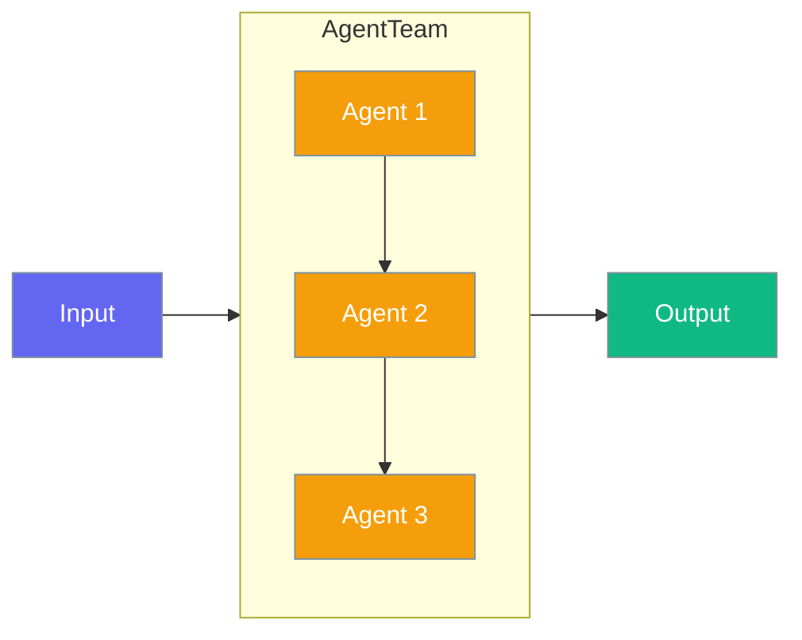

AgentTeam is the multi-agent coordinator that manages and delegates work to multiple Agent instances, supporting sequential, parallel, and hierarchical execution patterns.



## Quick Start

<Steps>

<Step title="Basic Team">
Create a simple team with multiple agents:

```python
from praisonaiagents import Agent, AgentTeam, Task

# Create agents
researcher = Agent(
    name="Researcher",
    role="Research Specialist",
    instructions="Research and gather information on topics"
)

writer = Agent(
    name="Writer", 
    role="Content Writer",
    instructions="Write clear, engaging content"
)

# Create tasks
task1 = Task(description="Research AI trends", agent=researcher)
task2 = Task(description="Write article", agent=writer)

# Create team
team = AgentTeam(
    agents=[researcher, writer],
    tasks=[task1, task2]
)

result = team.start()
print(result)
```
</Step>

<Step title="Parallel Execution">
Execute tasks in parallel for faster processing:

```python
from praisonaiagents import Agent, AgentTeam, Task

agents = [
    Agent(name="Analyst1", instructions="Analyze market data"),
    Agent(name="Analyst2", instructions="Analyze competitor data"),
    Agent(name="Analyst3", instructions="Analyze customer data"),
]

tasks = [
    Task(description="Market analysis", agent=agents[0]),
    Task(description="Competitor analysis", agent=agents[1]),
    Task(description="Customer analysis", agent=agents[2]),
]

team = AgentTeam(
    agents=agents,
    tasks=tasks,
    process="parallel"  # Execute tasks in parallel
)

result = team.start()
```
</Step>

<Step title="Hierarchical Process">
Use a manager agent to coordinate work:

```python
from praisonaiagents import Agent, AgentTeam, Task

team = AgentTeam(
    agents=[researcher, writer, editor],
    tasks=[research_task, write_task, edit_task],
    process="hierarchical",  # Manager coordinates agents
    manager_llm="gpt-4o"     # Manager model
)

result = team.start()
```
</Step>

<Step title="With Memory & Planning">
Enable shared memory and planning for the team:

```python
from praisonaiagents import Agent, AgentTeam

team = AgentTeam(
    agents=[agent1, agent2, agent3],
    memory=True,      # Shared memory across agents
    planning=True,    # Enable collaborative planning
    output="verbose"  # Detailed output
)

result = team.start("Analyze and report on Q4 sales data")
```
</Step>

</Steps>

## Process Types

| Process | Description | Best For |
|---------|-------------|----------|
| `sequential` | Tasks execute one after another | Dependent tasks, pipelines |
| `parallel` | Tasks execute simultaneously | Independent analysis |
| `hierarchical` | Manager coordinates agents | Complex delegation |

## Configuration Options

| Parameter | Type | Default | Description |
|-----------|------|---------|-------------|
| `agents` | List[Agent] | Required | List of Agent instances |
| `tasks` | List[Task] | Auto-generated | Tasks to execute |
| `process` | str | `"sequential"` | Execution pattern |
| `manager_llm` | str | `"gpt-4o-mini"` | Manager model (hierarchical) |
| `memory` | bool/Config | `False` | Shared memory system |
| `planning` | bool/Config | `False` | Collaborative planning |
| `context` | bool/Config | `False` | Context management |
| `output` | str/Config | None | Output configuration |
| `execution` | str/Config | None | Execution limits |
| `hooks` | Config | None | Lifecycle callbacks |

## State Management

AgentTeam provides shared state across all agents:

```python
team = AgentTeam(agents=[agent1, agent2])

# Set shared state
team.set_state("analysis_complete", True)
team.set_state("total_records", 1500)

# Get state from any agent
value = team.get_state("analysis_complete")

# Increment counters
team.increment_state("processed_count", 1)

# Append to lists
team.append_to_state("findings", "New insight discovered")
```

## Best Practices

<AccordionGroup>
<Accordion title="Task Dependencies">
For sequential tasks, AgentTeam automatically passes context from previous tasks:

```python
task1 = Task(description="Research topic", agent=researcher)
task2 = Task(description="Write based on research", agent=writer)
# task2 automatically receives task1's output as context
```
</Accordion>

<Accordion title="Agent Specialization">
Create agents with distinct roles for better task delegation:

```python
researcher = Agent(role="Research Specialist", tools=[search_tool])
analyst = Agent(role="Data Analyst", tools=[analysis_tool])
writer = Agent(role="Content Writer")
```
</Accordion>

<Accordion title="Memory Sharing">
Enable memory for teams that need to share information:

```python
team = AgentTeam(
    agents=[...],
    memory=True  # All agents share memory
)
```
</Accordion>
</AccordionGroup>

## Key Methods

| Method | Description |
|--------|-------------|
| `start()` | Execute the team workflow |
| `run()` | Alias for start() |
| `astart()` | Async execution |
| `set_state()` | Set shared state value |
| `get_state()` | Get shared state value |
| `add_task()` | Add task dynamically |
| `get_task_status()` | Check task status |

## Related

<CardGroup cols={2}>
  <Card title="Agent" icon="robot" href="/docs/concepts/agents">
    Learn about individual AI agents
  </Card>
  <Card title="AgentFlow" icon="arrow-right" href="/docs/concepts/agentflow">
    Deterministic workflow pipelines
  </Card>
  <Card title="Tasks" icon="list-check" href="/docs/concepts/tasks">
    Task configuration and management
  </Card>
  <Card title="Process" icon="gears" href="/docs/concepts/process">
    Execution process patterns
  </Card>
</CardGroup>
