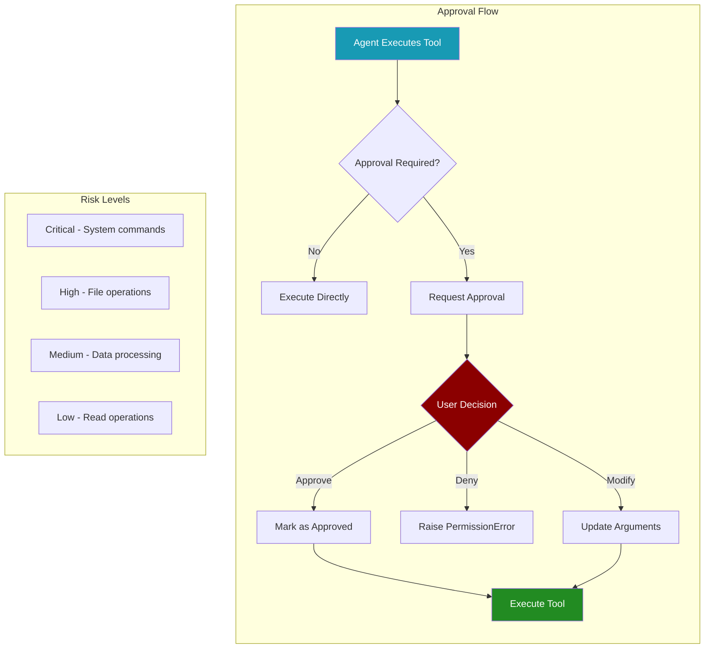

## Overview

The Human Approval System provides a minimal yet powerful human-in-the-loop framework for dangerous tool operations in PraisonAI Agents. It extends the existing callback system to require human approval before executing high-risk tools, ensuring safety and control over critical operations.

<Cards>
  <Card title="Safety First" icon="shield">
    Prevent accidental execution of dangerous operations
  </Card>
  <Card title="Risk-Based Control" icon="gauge">
    Categorise tools by risk level for appropriate handling
  </Card>
  <Card title="Flexible Integration" icon="plug">
    Customisable approval callbacks and runtime configuration
  </Card>
</Cards>

## Quick Start

<Steps>
  <Step>
    Import the approval system
    ```python
    from praisonaiagents.approval import require_approval, set_approval_callback
    from praisonaiagents import Agent, Task, Agents
    ```
  </Step>
  <Step>
    Create a tool with approval requirement
    ```python
    @require_approval(risk_level="high")
    def dangerous_operation(command: str) -> str:
        """Execute a potentially dangerous operation"""
        # Your tool implementation
        return f"Executed: {command}"
    ```
  </Step>
  <Step>
    Use the tool with an agent
    ```python
    agent = Agent(
        name="SafetyAgent",
        role="System Administrator",
        goal="Perform operations with safety checks",
        tools=[dangerous_operation]
    )
    
    # When the agent tries to use the tool, approval will be requested
    ```
  </Step>
</Steps>

## Core Concepts

### Risk Levels

The approval system categorises tools into four risk levels:

<CardGroup cols={2}>
  <Card icon="skull-crossbones" color="#dc2626">
    **Critical Risk**
    **Operations that can severely impact the system**
    - System command execution
    - Process termination
    - Code execution
    
    Example tools: `execute_command`, `kill_process`, `execute_code`
  </Card>
  
  <Card icon="exclamation-triangle" color="#ea580c">
    **High Risk**
    **Operations that modify system state**
    - File writing/deletion
    - Database modifications
    - File system operations
    
    Example tools: `write_file`, `delete_file`, `execute_query`
  </Card>
  
  <Card icon="circle-exclamation" color="#f59e0b">
    **Medium Risk**
    **Operations with moderate impact**
    - Data evaluation
    - Web crawling
    - External API calls
    
    Example tools: `evaluate`, `crawl`, `scrape_page`
  </Card>
  
  <Card icon="info-circle" color="#3b82f6">
    **Low Risk**
    **Read-only or minimal impact operations**
    - File reading
    - Data queries
    - Information retrieval
    
    Example tools: `read_file`, `list_files`
  </Card>
</CardGroup>

### Approval Flow Lifecycle

1. **Tool Execution Request**: Agent attempts to execute a tool
2. **Approval Check**: System checks if tool requires approval
3. **Context Verification**: Checks if already approved in current context
4. **User Prompt**: Displays tool details and requests approval
5. **Decision Processing**: Handles approval, denial, or modification
6. **Execution**: Tool executes with approved parameters

## API Reference

### Decorators

#### `@require_approval`

Decorator to mark a tool as requiring human approval.

```python
@require_approval(risk_level: RiskLevel = "high")
```

**Parameters:**
- `risk_level`: Risk level of the tool ("critical", "high", "medium", "low")

**Example:**
```python
@require_approval(risk_level="critical")
def execute_system_command(cmd: str) -> str:
    """Execute a system command"""
    return subprocess.check_output(cmd, shell=True).decode()
```

### Classes

#### `ApprovalDecision`

Result of an approval request.

```python
ApprovalDecision(
    approved: bool,
    modified_args: Optional[Dict[str, Any]] = None,
    reason: str = ""
)
```

**Attributes:**
- `approved`: Whether the operation was approved
- `modified_args`: Modified arguments to merge with original
- `reason`: Reason for approval/denial

### Functions

#### `set_approval_callback`

Set a custom approval callback function.

```python
set_approval_callback(callback_fn: Callable) -> None
```

**Parameters:**
- `callback_fn`: Function that accepts (function_name, arguments, risk_level) and returns ApprovalDecision

#### `add_approval_requirement`

Dynamically add approval requirement for a tool.

```python
add_approval_requirement(
    tool_name: str, 
    risk_level: RiskLevel = "high"
) -> None
```

#### `remove_approval_requirement`

Remove approval requirement for a tool.

```python
remove_approval_requirement(tool_name: str) -> None
```

#### `is_approval_required`

Check if a tool requires approval.

```python
is_approval_required(tool_name: str) -> bool
```

## Usage Examples

### Basic Usage with Default Console Approval

<Tabs>
  <Tab title="Shell Tools">
    ```python
    from praisonaiagents import Agent, Task, Agents
    from praisonaiagents.tools import shell_tools, file_tools
    
    # Create agent with dangerous tools
    agent = Agent(
        name="SystemAdmin",
        role="System Administrator",
        goal="Manage system operations safely",
        tools=[shell_tools, file_tools]
    )
    
    # Create task that will trigger approval
    task = Task(
        description="List directory contents using ls command",
        agent=agent,
        expected_output="Directory listing"
    )
    
    # Run - will prompt for approval when shell command is executed
    process = Agents(
        agents=[agent],
        tasks=[task]
    )
    
    result = process.start()
    ```
  </Tab>
  
  <Tab title="Custom Tool">
    ```python
    from praisonaiagents.approval import require_approval
    
    @require_approval(risk_level="high")
    def database_delete(table: str, condition: str) -> dict:
        """Delete records from database"""
        # Simulated database operation
        return {
            "status": "success",
            "deleted": f"Records from {table} where {condition}"
        }
    
    # Use in agent
    agent = Agent(
        name="DataManager",
        role="Database Administrator",
        goal="Manage database operations",
        tools=[database_delete]
    )
    ```
  </Tab>
</Tabs>

### Custom Approval Callback

<Frame>
  ```python
  from praisonaiagents.approval import ApprovalDecision, set_approval_callback
  
  def custom_approval_callback(
      function_name: str,
      arguments: dict,
      risk_level: str
  ) -> ApprovalDecision:
      """Custom approval logic with automated rules"""
      
      # Auto-approve low risk operations
      if risk_level == "low":
          return ApprovalDecision(
              approved=True, 
              reason="Auto-approved: low risk"
          )
      
      # Block dangerous patterns
      dangerous_patterns = ["rm -rf", "DROP TABLE", "DELETE FROM"]
      command = str(arguments.get("command", ""))
      
      if any(pattern in command for pattern in dangerous_patterns):
          return ApprovalDecision(
              approved=False,
              reason="Blocked: dangerous pattern detected"
          )
      
      # Modify arguments for safety
      if function_name == "write_file" and "path" in arguments:
          # Ensure files are written to safe directory
          safe_path = f"/tmp/safe/{arguments['path']}"
          return ApprovalDecision(
              approved=True,
              modified_args={"path": safe_path},
              reason="Approved with safe path"
          )
      
      # Fall back to console approval for other cases
      from praisonaiagents.approval import console_approval_callback
      return console_approval_callback(function_name, arguments, risk_level)
  
  # Register the custom callback
  set_approval_callback(custom_approval_callback)
  ```
</Frame>

### Async Support

<Frame>
  ```python
  import asyncio
  from praisonaiagents import Agent, Task, Agents
  
  async def async_approval_demo():
      """Demonstrate approval in async context"""
      
      agent = Agent(
          name="AsyncAgent",
          role="Async Operations Handler",
          goal="Handle async operations with approval",
          tools=[python_tools]
      )
      
      task = Task(
          description="Execute async Python code",
          agent=agent,
          expected_output="Execution result"
      )
      
      process = Agents(
          agents=[agent],
          tasks=[task]
      )
      
      # Async execution with approval prompts
      result = await process.astart()
      return result
  
  # Run async demo
  asyncio.run(async_approval_demo())
  ```
</Frame>

### Runtime Configuration

<Frame>
  ```python
  from praisonaiagents.approval import (
      add_approval_requirement,
      remove_approval_requirement,
      APPROVAL_REQUIRED_TOOLS,
      TOOL_RISK_LEVELS
  )
  
  # Add approval requirement to normally safe operation
  add_approval_requirement("read_file", "medium")
  
  # Remove approval requirement from normally dangerous operation
  # ⚠️ Use with caution!
  remove_approval_requirement("write_file")
  
  # Check current configuration
  print(f"Approval required tools: {list(APPROVAL_REQUIRED_TOOLS)}")
  print(f"Risk levels: {TOOL_RISK_LEVELS}")
  
  # Configure multiple tools at once
  dangerous_tools = {
      "custom_delete": "critical",
      "api_post": "high",
      "data_transform": "medium"
  }
  
  for tool, risk in dangerous_tools.items():
      add_approval_requirement(tool, risk)
  ```
</Frame>

## Integration with Agents

### Automatic Integration

The approval system automatically integrates with any tool used by agents:

1. **Tool Detection**: When an agent attempts to use a tool, the system checks if approval is required
2. **Context Management**: Approved tools are tracked per execution context
3. **Seamless Flow**: Agents continue execution after approval without additional configuration

### Best Practices

<CardGroup cols={2}>
  <Card>
    **Security Best Practices**
    - Always require approval for system commands
    - Use appropriate risk levels for tools
    - Validate and sanitise inputs before execution
    - Log all approval decisions for audit
  </Card>
  
  <Card>
    **User Experience**
    - Provide clear descriptions in approval prompts
    - Group related operations to minimise prompts
    - Use custom callbacks for automated policies
    - Consider batch approvals for repetitive tasks
  </Card>
</CardGroup>

## Advanced Features

### Context-Aware Approvals

The system tracks approved operations within execution contexts:

```python
from praisonaiagents.approval import mark_approved, is_already_approved

# Manually mark a tool as approved in current context
mark_approved("write_file")

# Check if tool is already approved
if is_already_approved("write_file"):
    print("Tool already approved in this context")
```

### Approval Context Management

```python
from praisonaiagents.approval import clear_approval_context

# Clear all approvals in current context
clear_approval_context()

# Useful for:
# - Starting fresh approval sessions
# - Resetting after errors
# - Testing approval flows
```

### Default Dangerous Tools

The system comes with pre-configured dangerous tools:

<Table>
  <TableHeader>
    <TableRow>
      <TableHeaderCell>Tool</TableHeaderCell>
      <TableHeaderCell>Risk Level</TableHeaderCell>
      <TableHeaderCell>Description</TableHeaderCell>
    </TableRow>
  </TableHeader>
  <TableBody>
    <TableRow>
      <TableCell>`execute_command`</TableCell>
      <TableCell>Critical</TableCell>
      <TableCell>Shell command execution</TableCell>
    </TableRow>
    <TableRow>
      <TableCell>`kill_process`</TableCell>
      <TableCell>Critical</TableCell>
      <TableCell>Process termination</TableCell>
    </TableRow>
    <TableRow>
      <TableCell>`execute_code`</TableCell>
      <TableCell>Critical</TableCell>
      <TableCell>Arbitrary code execution</TableCell>
    </TableRow>
    <TableRow>
      <TableCell>`write_file`</TableCell>
      <TableCell>High</TableCell>
      <TableCell>File writing operations</TableCell>
    </TableRow>
    <TableRow>
      <TableCell>`delete_file`</TableCell>
      <TableCell>High</TableCell>
      <TableCell>File deletion</TableCell>
    </TableRow>
    <TableRow>
      <TableCell>`move_file`</TableCell>
      <TableCell>High</TableCell>
      <TableCell>File movement</TableCell>
    </TableRow>
    <TableRow>
      <TableCell>`copy_file`</TableCell>
      <TableCell>High</TableCell>
      <TableCell>File copying</TableCell>
    </TableRow>
    <TableRow>
      <TableCell>`execute_query`</TableCell>
      <TableCell>High</TableCell>
      <TableCell>Database queries</TableCell>
    </TableRow>
    <TableRow>
      <TableCell>`evaluate`</TableCell>
      <TableCell>Medium</TableCell>
      <TableCell>Code evaluation</TableCell>
    </TableRow>
    <TableRow>
      <TableCell>`crawl`</TableCell>
      <TableCell>Medium</TableCell>
      <TableCell>Web crawling</TableCell>
    </TableRow>
    <TableRow>
      <TableCell>`scrape_page`</TableCell>
      <TableCell>Medium</TableCell>
      <TableCell>Web scraping</TableCell>
    </TableRow>
  </TableBody>
</Table>

## Console Approval Interface

The default console approval interface provides:

<Frame>
  ```
  🔒 Tool Approval Required
  ┌─────────────────────────────────────────┐
  │ Function: execute_command               │
  │ Risk Level: CRITICAL                    │
  │ Arguments:                              │
  │   command: ls -la /home                 │
  │   timeout: 30                           │
  └─────────────────────────────────────────┘
  
  Do you want to execute this critical risk tool? (y/N):
  ```
</Frame>

Features:
- Colour-coded risk levels
- Clear parameter display
- Truncation of long values
- Keyboard interrupt handling
- Rich formatting with panels

## Error Handling

The approval system handles various error scenarios:

<Tabs>
  <Tab title="Permission Denied">
    ```python
    try:
        result = agent.execute_tool("dangerous_operation", {})
    except PermissionError as e:
        print(f"Operation denied: {e}")
        # Handle denial appropriately
    ```
  </Tab>
  
  <Tab title="Callback Errors">
    ```python
    def faulty_callback(fn, args, risk):
        raise Exception("Callback error")
    
    set_approval_callback(faulty_callback)
    
    # System falls back gracefully
    # Returns ApprovalDecision(approved=False, reason="Approval callback error: ...")
    ```
  </Tab>
  
  <Tab title="Async Context">
    ```python
    # The system automatically handles async/sync context mismatches
    # Falls back to sync approval when needed
    # No manual intervention required
    ```
  </Tab>
</Tabs>

## Security Considerations

<Warning>
The approval system is a safety mechanism, not a complete security solution. Always:
- Validate inputs before execution
- Run agents in sandboxed environments for untrusted operations
- Implement additional security layers for production use
- Audit approval decisions and tool executions
</Warning>

## Summary

The Human Approval System provides essential safety controls for PraisonAI Agents:

✅ **Flexible Risk Management** - Categorise and control tools by risk level  
✅ **Seamless Integration** - Works automatically with existing agents and tools  
✅ **Customisable Callbacks** - Implement custom approval logic and policies  
✅ **Async Support** - Full support for asynchronous operations  
✅ **Runtime Configuration** - Dynamically adjust approval requirements

Use this system whenever agents interact with:

- System commands and shell operations
- File system modifications
- Database operations
- External APIs with side effects
- Any potentially dangerous operations