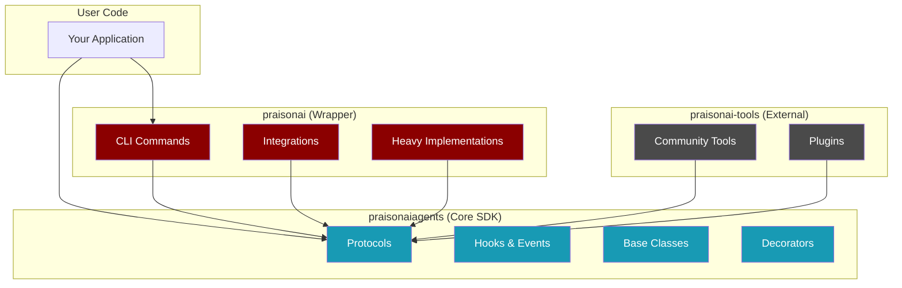
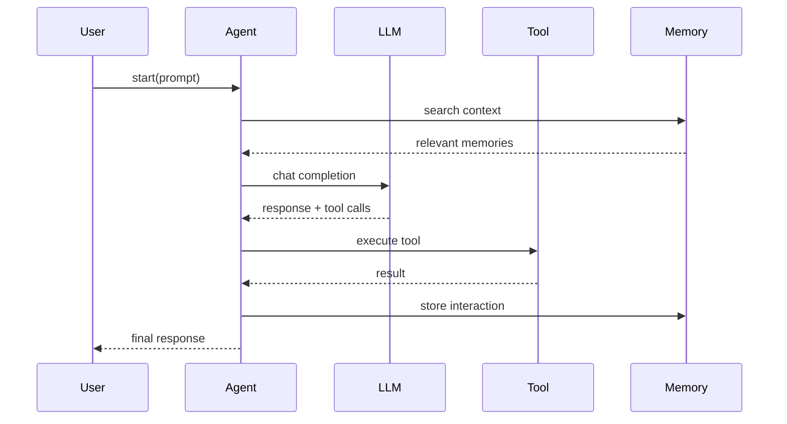

## Package Hierarchy



---

## Core SDK Modules

<AccordionGroup>
  <Accordion title="agent/" icon="robot">
    **Purpose:** Agent class and execution
    
    | File | Description |
    |------|-------------|
    | `agent.py` | Main Agent class (6549 LOC) |
    | `protocols.py` | AgentProtocol, RunnableAgentProtocol |
    | `handoff.py` | Agent-to-agent handoff |
    | `autonomy.py` | Autonomous execution |
  </Accordion>
  
  <Accordion title="tools/" icon="wrench">
    **Purpose:** Tool SDK and registry
    
    | File | Description |
    |------|-------------|
    | `base.py` | BaseTool class |
    | `decorator.py` | @tool decorator |
    | `registry.py` | ToolRegistry |
    | `protocols/tool_protocol.py` | ToolProtocol |
  </Accordion>
  
  <Accordion title="memory/" icon="brain">
    **Purpose:** Memory persistence
    
    | File | Description |
    |------|-------------|
    | `protocols.py` | MemoryProtocol, DeletableMemoryProtocol |
    | `memory.py` | Memory implementation |
    | `file_memory.py` | File-based adapter |
  </Accordion>
  
  <Accordion title="hooks/" icon="link">
    **Purpose:** Hook system and middleware
    
    | File | Description |
    |------|-------------|
    | `events.py` | Hook event types |
    | `registry.py` | Hook registration |
    | `middleware.py` | Middleware chains |
  </Accordion>
  
  <Accordion title="workflows/" icon="diagram-project">
    **Purpose:** Multi-agent coordination
    
    | File | Description |
    |------|-------------|
    | `workflows.py` | Workflow engine |
    | Patterns | Route, Parallel, Loop, Repeat |
  </Accordion>
  
  <Accordion title="bus/" icon="tower-broadcast">
    **Purpose:** Event bus for pub/sub
    
    | File | Description |
    |------|-------------|
    | `bus.py` | EventBus class |
    | `event.py` | Event types |
  </Accordion>
</AccordionGroup>

---

## Data Flow



---

## Extension Points

<CardGroup cols={2}>
  <Card title="Tools" icon="wrench" href="/tools">
    Add capabilities via @tool decorator or BaseTool
  </Card>
  
  <Card title="Hooks" icon="link" href="/features/hooks">
    Intercept events with before_tool, after_tool, etc.
  </Card>
  
  <Card title="Memory" icon="brain" href="/memory/overview">
    Custom adapters implementing MemoryProtocol
  </Card>
  
  <Card title="Workflows" icon="diagram-project" href="/features/workflows">
    Multi-agent patterns with Route, Parallel, Loop
  </Card>
</CardGroup>

---

## Repository Map

<Tabs>
  <Tab title="Core SDK">
    ```
    praisonai-package/src/praisonai-agents/
    ├── praisonaiagents/
    │   ├── agent/         # Agent execution
    │   ├── agents/        # Multi-agent (Agents class)
    │   ├── tools/         # Tool SDK
    │   ├── memory/        # Memory adapters
    │   ├── hooks/         # Hook system
    │   ├── workflows/     # Workflow engine
    │   ├── bus/           # Event bus
    │   ├── policy/        # Policy engine
    │   ├── knowledge/     # RAG/Knowledge
    │   ├── context/       # Context management
    │   ├── trace/         # Tracing
    │   └── eval/          # Evaluation
    ├── tests/             # Test suite
    └── AGENTS.md          # This guide
    ```
  </Tab>
  
  <Tab title="Wrapper">
    ```
    praisonai-package/src/praisonai/
    ├── praisonai/
    │   ├── cli/           # CLI commands
    │   ├── integrations/  # External integrations
    │   ├── ui/            # UI components
    │   ├── deploy/        # Deployment tools
    │   └── api/           # API server
    └── pyproject.toml
    ```
  </Tab>
  
  <Tab title="Examples">
    ```
    praisonai-package/examples/
    ├── agent_tools/       # Tool examples
    ├── async_runs/        # Async patterns
    ├── background/        # Background tasks
    ├── checkpoints/       # State checkpoints
    ├── eval/              # Evaluation
    ├── guardrails/        # Safety examples
    ├── hooks/             # Hook examples
    ├── knowledge/         # RAG examples
    ├── memory/            # Memory examples
    ├── multi_agent/       # Multi-agent
    ├── observability/     # Monitoring
    ├── policy/            # Policy examples
    ├── streaming/         # Streaming
    ├── workflows/         # Workflow patterns
    └── ... (65+ categories)
    ```
  </Tab>
  
  <Tab title="Documentation">
    ```
    PraisonAIDocs/docs/
    ├── agents/            # Agent guides
    ├── api/               # API reference
    ├── capabilities/      # Features
    ├── cli/               # CLI reference
    ├── concepts/          # Core concepts
    ├── features/          # Feature guides
    ├── guides/            # How-to guides
    ├── knowledge/         # Knowledge/RAG
    ├── memory/            # Memory guides
    ├── models/            # LLM configuration
    ├── observability/     # Monitoring
    ├── sdk/               # SDK reference
    ├── tools/             # Tool guides
    └── tutorials/         # Tutorials
    ```
  </Tab>
</Tabs>

---

## Design Methodology

<Steps>
  <Step title="Protocol First">
    Define abstract interfaces before implementations
    ```python
    class MemoryProtocol(Protocol):
        def store(self, text: str) -> str: ...
        def search(self, query: str) -> List: ...
    ```
  </Step>
  
  <Step title="Lightweight Core">
    Keep praisonaiagents minimal - protocols, hooks, base classes only
  </Step>
  
  <Step title="Heavy in Wrapper">
    Database integrations, CLI, UI go in praisonai wrapper
  </Step>
  
  <Step title="Optional Dependencies">
    Use `pip install praisonaiagents[memory]` for extras
  </Step>
  
  <Step title="Lazy Loading">
    Import heavy deps inside functions, not at module level
  </Step>
</Steps>

---

## Key Files Reference

| What | Location |
|------|----------|
| Agent class | `praisonaiagents/agent/agent.py` |
| Tool decorator | `praisonaiagents/tools/decorator.py` |
| BaseTool | `praisonaiagents/tools/base.py` |
| Memory protocols | `praisonaiagents/memory/protocols.py` |
| Hook events | `praisonaiagents/hooks/events.py` |
| Event bus | `praisonaiagents/bus/bus.py` |
| Workflow engine | `praisonaiagents/workflows/workflows.py` |
| Policy engine | `praisonaiagents/policy/engine.py` |
| Package exports | `praisonaiagents/__init__.py` |
| AGENTS guide | `praisonai-agents/AGENTS.md` |
