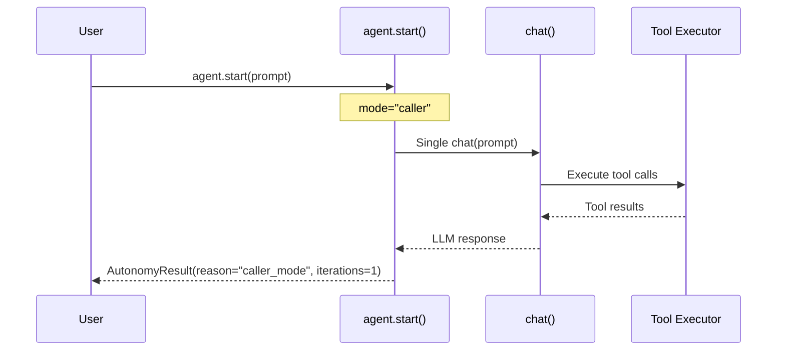
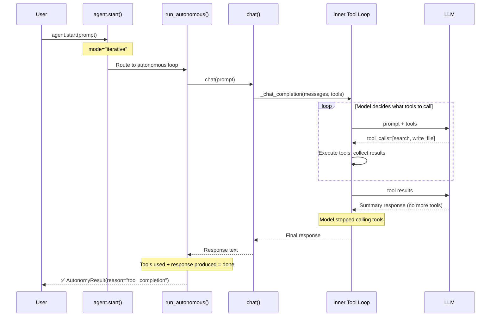
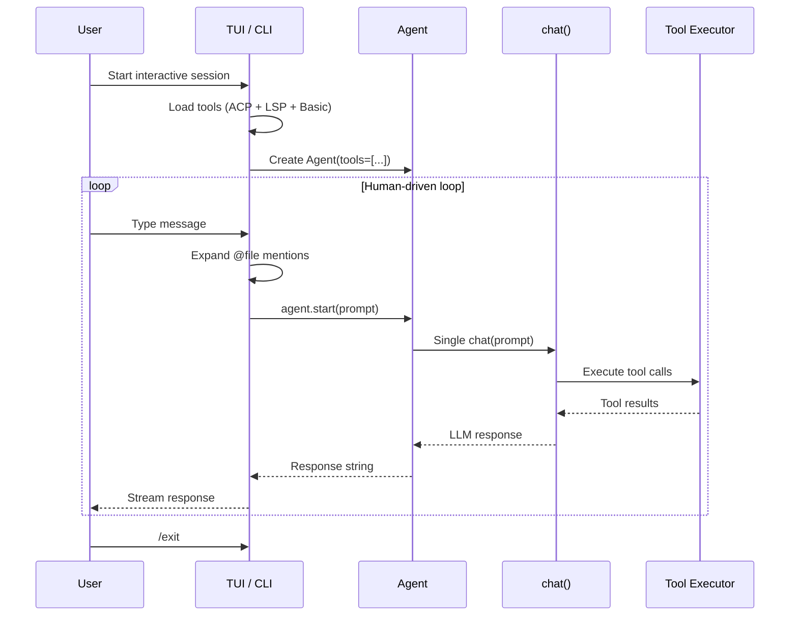
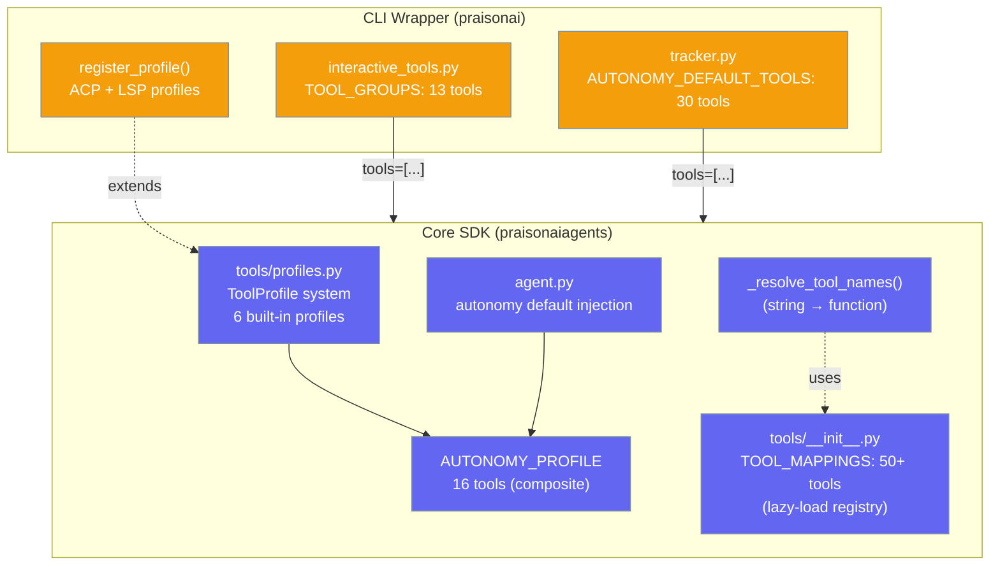

PraisonAI provides two primary execution approaches: **Autonomy** (agent-driven results) and **Interactive** (human-driven sessions). Understanding the distinction between **Iterative** (autonomous loop) and **Interactive** (manual loop) is key to building complex workflows.

## At a Glance: Iterative vs. Interactive

While the names sound similar, they represent the two sides of "who drives the loop":

| Term | Driver | Paradigm | Best For |
|------|--------|----------|----------|
| **Interactive** | 👤 **Human** | Chat / TUI | Exploratory work, manual guidance |
| **Iterative** | 🧠 **Agent** | Autonomy (mode="iterative") | Self-correction, multi-step automation |
| **Caller** | — | Single-turn response | Quick actions, direct pipelines |

## Execution Mode

`AutonomyConfig` has a `mode` field that controls execution behavior:

| Level | Default Mode | Behavior |
|-------|-------------|----------|
| `"suggest"` (default) | `"caller"` | Single `chat()` → `AutonomyResult` |
| `"auto_edit"` | `"caller"` | Single `chat()` + auto-approve edits |
| `"full_auto"` | `"iterative"` | `run_autonomous()` loop with completion detection |

<Info>
`autonomy=True` now defaults to **caller mode** — one `chat()` call wrapped in `AutonomyResult`. No wasteful iteration loop. Use `mode="iterative"` or `level="full_auto"` for multi-turn autonomous loops.
</Info>

## Execution Flow Comparison

### Caller Mode (default for `autonomy=True`)


```mermaid
sequenceDiagram
    participant User
    participant Agent as agent.start()
    participant Chat as chat()
    participant Tools as Tool Executor

    User->>Agent: agent.start(prompt)
    Note over Agent: mode="caller"
    Agent->>Chat: Single chat(prompt)
    Chat->>Tools: Execute tool calls
    Tools-->>Chat: Tool results
    Chat-->>Agent: LLM response
    Agent-->>User: AutonomyResult(reason="caller_mode", iterations=1)
```

### Iterative Mode (default for `full_auto`)

When `mode="iterative"`, the agent runs a multi-turn loop with safety infrastructure:


```mermaid
sequenceDiagram
    participant User
    participant Agent as agent.start()
    participant Auto as run_autonomous()
    participant Chat as chat()
    participant Inner as Inner Tool Loop
    participant LLM as LLM

    User->>Agent: agent.start(prompt)
    Note over Agent: mode="iterative"
    Agent->>Auto: Route to autonomous loop
    Auto->>Chat: chat(prompt)
    Chat->>Inner: _chat_completion(messages, tools)
    
    loop Model decides what tools to call
        Inner->>LLM: prompt + tools
        LLM-->>Inner: tool_calls=[search, write_file]
        Inner->>Inner: Execute tools, collect results
    end
    
    Inner->>LLM: tool results
    LLM-->>Inner: Summary response (no more tools)
    Note over Inner: Model stopped calling tools
    Inner-->>Chat: Final response
    Chat-->>Auto: Response text
    Note over Auto: Tools used + response produced = done
    Auto-->>User: ✅ AutonomyResult(reason="tool_completion")
```

<Tip>
**Key insight**: All three modes use the same inner tool loop. The difference is what wraps it — nothing (interactive), an AutonomyResult wrapper (caller), or a multi-turn retry loop (iterative).
</Tip>

### Interactive Mode Flow

In interactive mode, the **human drives the loop** — each message is a single-turn `chat()` call:


```mermaid
sequenceDiagram
    participant User
    participant TUI as TUI / CLI
    participant Agent as Agent
    participant Chat as chat()
    participant Tools as Tool Executor

    User->>TUI: Start interactive session
    TUI->>TUI: Load tools (ACP + LSP + Basic)
    TUI->>Agent: Create Agent(tools=[...])
    loop Human-driven loop
        User->>TUI: Type message
        TUI->>TUI: Expand @file mentions
        TUI->>Agent: agent.start(prompt)
        Agent->>Chat: Single chat(prompt)
        Chat->>Tools: Execute tool calls
        Tools-->>Chat: Tool results
        Chat-->>Agent: LLM response
        Agent-->>TUI: Response string
        TUI-->>User: Stream response
    end
    User->>TUI: /exit
```

<Note>
**The Loop Driver Distinction**:
- **Interactive Mode**: The **human** provides the prompt, the agent responds once, and the human decides the next prompt.
- **Iterative Mode**: The **agent** provides its own prompts to itself in a loop until it detects the task is complete.
- **Caller Mode**: A simplified "one-shot" interaction that returns rich metadata.
</Note>

## Feature Comparison

| Dimension | Caller Mode (`autonomy=True`) | Iterative Mode (`full_auto`) | Interactive (no autonomy) |
|-----------|-------------------------------|------------------------------|---------------------------|
| **Primary Driver** | Application Code | 🧠 **Agent** (Internal Loop) | 👤 **Human** (External Loop) |
| **Turns** | 1 (single `chat()`) | Up to `max_iterations` | Single turn per interaction |
| **Complexity Mgt** | Simple pipelines | Automated self-correction | Manual refinement |
| **Return type** | `AutonomyResult` | `AutonomyResult` | `str` |
| **Self-correction** | ❌ | ✅ Doom loop + recovery | ❌ (Human corrects) |
| **Session persistence** | Manual | Auto-saves each iteration | Manual |
| **Observability** | Standard | Built-in event emission | Standard |

<Tip>
**Key insight**: Caller mode gives you `AutonomyResult` metadata (`.success`, `.iterations`, `.duration_seconds`) without the overhead of the iterative loop — ideal for most use cases.
</Tip>

## Speed Profile

### Init Overhead (one-time)

| Component | Cost | Notes |
|-----------|------|-------|
| `AutonomyConfig()` | ~0ms | Simple dataclass |
| `AutonomyTrigger()` | ~1-2ms | Lazy imports `EscalationTrigger` |
| `DoomLoopTracker()` | ~1ms | Lazy imports `DoomLoopDetector` |
| `FileSnapshot` | ~50-200ms | Only if `track_changes=True` |
| `ObservabilityHooks` | ~1ms | Only if `observe=True` |

<Info>
With `autonomy=True` (defaults), init overhead is **< 5ms** since `track_changes=False` and `observe=False` by default.
</Info>

### Per-Iteration Overhead

| Operation | Cost |
|-----------|------|
| Timeout check | ~0μs |
| Doom-loop check | ~0.1ms |
| Action recording | ~0.1ms |
| Completion detection | ~0.1ms |
| Session auto-save | 0-5ms |
| **Total** | **~0.5ms** |

Per-iteration overhead is **~0.5ms** — negligible compared to LLM API calls (typically 1-30 seconds each). The real speed difference is the **number of LLM calls**, not framework overhead.

### End-to-End Comparison

| Metric | Non-Autonomy | Autonomy |
|--------|-------------|----------|
| **Minimum LLM calls** | 1 | 1 (if completion detected on first turn) |
| **Maximum LLM calls** | 1 | 20 (default `max_iterations`) |
| **Typical for multi-step task** | 1 (all tools in one turn) | 1-3 (re-injects if not "done") |
| **Overhead per call** | 0 | ~0.5ms |

## Important Behavioral Differences

<Warning>
**Return type**: `AutonomyResult.__str__()` returns `.output`, so `print(result)` works the same. But code that does `if result:` or `len(result)` may break — `AutonomyResult` is always truthy and has no `__len__`. Use `str(result)` or `result.output`.
</Warning>

<Warning>
**Early completion risk**: If the LLM says `"I'm done searching"` mid-task, keyword-based detection might stop early. For multi-step tasks, the **tool completion** signal is the primary mechanism — the model naturally stops calling tools when done. For explicit control, use structured completion signals:
```python
Agent(autonomy={"completion_promise": "COMPLETED"})
```
</Warning>

<Note>
**Approval with autonomy=True**: Default level is `"suggest"`, which does NOT auto-approve tools. Only `level="full_auto"` auto-wires `AutoApproveBackend`.
</Note>

## Two-Layer Tool Architecture

Tools are provisioned at **two independent layers**. The CLI wrapper assembles tool lists and passes them as `tools=[...]` to the SDK's `Agent()` constructor:


```mermaid
graph TB
    subgraph SDK["Core SDK (praisonaiagents)"]
        PROFILES["tools/profiles.py<br/>ToolProfile system<br/>6 built-in profiles"]
        AUTONOMY["AUTONOMY_PROFILE<br/>16 tools (composite)"]
        MAPPINGS["tools/__init__.py<br/>TOOL_MAPPINGS: 50+ tools<br/>(lazy-load registry)"]
        INJECT["agent.py<br/>autonomy default injection"]
        RESOLVE["_resolve_tool_names()<br/>(string → function)"]
        PROFILES --> AUTONOMY
        INJECT --> AUTONOMY
        RESOLVE -.->|"uses"| MAPPINGS
    end

    subgraph WRAPPER["CLI Wrapper (praisonai)"]
        IT["interactive_tools.py<br/>TOOL_GROUPS: 13 tools"]
        TK["tracker.py<br/>AUTONOMY_DEFAULT_TOOLS: 30 tools"]
        REG["register_profile()<br/>ACP + LSP profiles"]
    end

    IT -->|"tools=[...]"| SDK
    TK -->|"tools=[...]"| SDK
    REG -.->|"extends"| PROFILES

    classDef sdk fill:#6366F1,stroke:#7C90A0,color:#fff
    classDef wrap fill:#F59E0B,stroke:#7C90A0,color:#fff

    class PROFILES,AUTONOMY,MAPPINGS,INJECT,RESOLVE sdk
    class IT,TK,REG wrap
```

### What each layer provides

<Warning>
**ACP Tools Performance**: ACP tools (`acp_edit_file`, `acp_execute_command`) go through a complex orchestration flow and can be **slow (174s+ per operation)**. In autonomy mode (`--autonomy full_auto`), ACP tools are **disabled by default** for speed. Use `--acp` flag to explicitly enable them when needed.
</Warning>

<CardGroup cols={2}>
  <Card title="CLI Wrapper (praisonai)" icon="terminal">
    **13 tools** via `get_interactive_tools()`:
    - **ACP** (4): create/edit/delete files, execute commands *(disabled by default in autonomy)*
    - **LSP** (4): symbols, definitions, references, diagnostics
    - **Basic** (5): read/write files, list, execute, search

    Used by: `praisonai tui`, `praisonai "prompt"`
  </Card>
  <Card title="Core SDK (praisonaiagents)" icon="microchip">
    **16 tools** when `autonomy=True` via `AUTONOMY_PROFILE`:
    - **file_ops** (7): read/write/list/copy/move/delete/info
    - **shell** (3): execute_command, list_processes, get_system_info
    - **web** (3): internet_search, search_web, web_crawl
    - **code_intelligence** (3): ast_grep search/rewrite/scan

    Used by: `Agent(autonomy=True)` in Python
  </Card>
</CardGroup>

### Built-in ToolProfiles

The SDK ships with composable profiles in `tools/profiles.py`:

| Profile | Tools | Description |
|---------|-------|-------------|
| `code_intelligence` | 3 | ast-grep search, rewrite, scan |
| `file_ops` | 7 | read, write, list, copy, move, delete, get_file_info |
| `shell` | 3 | execute_command, list_processes, get_system_info |
| `web` | 3 | internet_search, search_web, web_crawl |
| `code_exec` | 4 | execute_code, analyze_code, format_code, lint_code |
| `schedule` | 3 | schedule_add, schedule_list, schedule_remove |
| **`autonomy`** | **16** | **Composite: file_ops + shell + web + code_intelligence** |

### Tools by entry point

| Entry Point | Tools Available | Source |
|-------------|----------------|--------|
| `praisonai tui` | **13** (ACP + LSP + Basic) | CLI wrapper |
| `praisonai "prompt"` | **13** + autonomy (16) | CLI wrapper + SDK |
| `praisonai tracker run` | **30** (expanded set) | tracker.py |
| `Agent(autonomy=True)` in Python | **16** (AUTONOMY_PROFILE) | Core SDK |
| `Agent()` in Python | **0** (user-provided only) | — |

## Design Principles

The current architecture follows a **layered separation** pattern:

<Steps>

<Step title="Core SDK stays minimal">
The `praisonaiagents` package provides the agent runtime, tool execution, and LLM integration — but **does not bundle default tools**. This keeps the SDK lightweight and avoids opinionated defaults.
</Step>

<Step title="CLI wrapper adds batteries">
The `praisonai` wrapper package adds ACP, LSP, file operations, and search tools for CLI users. It assembles toolsets and passes them as `tools=[...]` to the Agent constructor.
</Step>

<Step title="Tools are data, not hardcoded">
Interactive tools are defined as groups in `interactive_tools.py` with a `TOOL_GROUPS` dictionary. New tools are added to a group, and all consumers automatically get them.
</Step>

</Steps>

### Why this is the best approach

<AccordionGroup>
  <Accordion title="SDK independence">
    The Core SDK has **zero dependency on the CLI wrapper**. Users embedding `praisonaiagents` in their own applications bring exactly the tools they need — no surprise defaults, no bloat.
  </Accordion>
  
  <Accordion title="Composable toolsets">
    Each entry point assembles its own toolset. `praisonai tui` loads ACP + LSP + Basic. `praisonai tracker run` loads a broader set. SDK users pass their own tools. This is intentional — different contexts need different capabilities.
  </Accordion>
  
  <Accordion title="Single source of truth">
    `interactive_tools.py` with `get_interactive_tools()` is the canonical provider. Both `tui/app.py` and `main.py` call this single function. Adding a new interactive tool means editing one file.
  </Accordion>
</AccordionGroup>

## When to Use Each Mode

| Mode | Best For | Example Prompt | What Happens |
|------|----------|---------------|--------------|
| **No autonomy** | Questions, explanations, advice | "Explain authentication patterns" | Agent answers from knowledge — doesn't touch files or run tools |
| **Caller** (default) | Single-shot automation, pipelines | "Search for X and save results to file" | Agent uses tools in one turn, returns `AutonomyResult` with metadata |
| **Iterative** | Multi-step self-correction, build→test→fix | "Refactor auth module and verify tests pass" | Agent loops until task is complete, with doom loop protection |

<CardGroup cols={3}>
  <Card title="No Autonomy" icon="message">
    **Fastest** — agent explains but doesn't act.

    ```python
    agent = Agent(
        instructions="Help with coding"
    )
    agent.start("Explain this function")
    ```
  </Card>
  <Card title="Caller Mode" icon="bolt">
    **One turn** — agent acts immediately with tools.

    ```python
    agent = Agent(
        instructions="You are a research assistant",
        autonomy=True
    )
    result = agent.start("Search and save to file")
    print(result.success)
    ```
  </Card>
  <Card title="Iterative Mode" icon="rotate">
    **Multi-turn** — agent self-corrects until done.

    ```python
    agent = Agent(
        instructions="Build and test features",
        autonomy={"mode": "iterative"}
    )
    result = agent.start("Refactor the auth module")
    print(result.iterations)
    ```
  </Card>
</CardGroup>

## Extending Tools

### Using ToolProfiles (recommended)

Combine built-in profiles or register custom ones:

```python
from praisonaiagents.tools.profiles import (
    resolve_profiles, register_profile, ToolProfile
)

# Combine built-in profiles
tools = resolve_profiles("file_ops", "web", "shell")
agent = Agent(tools=tools)

# Register a custom profile (e.g., from CLI wrapper)
register_profile(ToolProfile(
    name="acp",
    tools=["acp_create_file", "acp_edit_file",
           "acp_delete_file", "acp_execute_command"],
    description="Agentic Change Plan tools",
))

# Now use it alongside built-in profiles
tools = resolve_profiles("autonomy", "acp", "lsp")
```

### Adding tools for CLI users

Add tools to `interactive_tools.py`:

```python
# In praisonai/cli/features/interactive_tools.py
TOOL_GROUPS = {
    "basic": [read_file, write_file, ...],
    "acp": [acp_create_file, ...],
    "lsp": [lsp_list_symbols, ...],
    "my_group": [my_custom_tool],  # Add new group
}
```

### Adding tools for SDK users

Pass tools directly — the SDK is tool-agnostic:

```python
from praisonaiagents import Agent

def my_tool(query: str) -> str:
    """My custom tool."""
    return "result"

agent = Agent(
    instructions="Use tools wisely",
    tools=[my_tool],
    autonomy=True  # Gets 16 AUTONOMY_PROFILE tools + your tools
)
```

## Related

<CardGroup cols={2}>
  <Card title="Autonomy Concepts" icon="robot" href="/concepts/autonomy">
    Configuration, stages, and doom loop detection
  </Card>
  <Card title="Autonomous Loops" icon="rotate" href="/features/autonomy-loop">
    Execution loop details and async support
  </Card>
  <Card title="Interactive Tools" icon="toolbox" href="/cli/interactive-tools">
    ACP, LSP, and basic tool reference
  </Card>
  <Card title="Autonomy Modes" icon="sliders" href="/cli/autonomy-modes">
    Suggest, auto-edit, and full-auto modes
  </Card>
</CardGroup>
