PraisonAI provides two distinct execution modes: **Autonomy** (multi-turn, self-correcting loops) and **Interactive** (single-turn, human-in-the-loop). Understanding their architecture helps you choose the right approach and extend the tool system correctly.

## Execution Flow Comparison

### Autonomy Mode Flow

When `autonomy=True`, the agent runs a multi-turn loop with safety infrastructure:

```mermaid
sequenceDiagram
    participant User
    participant Agent as agent.start()
    participant Auto as run_autonomous()
    participant Chat as chat()
    participant Tools as Tool Executor

    User->>Agent: agent.start(prompt)
    Note over Agent: autonomy=True detected
    Agent->>Auto: Route to autonomous loop
    Auto->>Auto: Git snapshot (before)
    loop while iterations < max
        Auto->>Chat: chat(prompt)
        Chat->>Tools: Execute tool calls
        Tools-->>Chat: Tool results
        Chat-->>Auto: LLM response
        Auto->>Auto: Doom loop check
        Auto->>Auto: Completion promise check
        Auto->>Auto: Stage escalation
        Auto->>Auto: Auto-save session
    end
    Auto->>Auto: Git snapshot (after)
    alt Promise found
        Auto-->>User: ✅ AutonomyResult(success=True)
    else Max iterations reached
        Auto-->>User: ⚠️ AutonomyResult(reason="max_iterations")
    else Doom loop detected
        Auto-->>User: 🛑 AutonomyResult(reason="doom_loop")
    end
```



### Interactive Mode Flow

In interactive mode, the **human drives the loop** — each message is a single-turn `chat()` call:


<Note>
**Key difference**: In autonomy mode, the *agent* drives the iteration loop internally with safety checks. In interactive mode, the *human* drives the loop externally by sending messages. Both use the same `chat()` → tool executor underneath.
</Note>

## Feature Comparison

| Dimension | Autonomy Mode | Interactive Mode |
|-----------|--------------|------------------|
| **Entry point** | `run_autonomous()` | `start()` → `chat()` |
| **Turns** | Multi-turn loop (up to `max_iterations`) | Single turn per call |
| **Self-correction** | ✅ Doom loop detection + graduated recovery | ❌ None |
| **File safety** | ✅ Git snapshots before/after | ❌ None |
| **Completion signal** | Completion promise pattern (`<promise>DONE</promise>`) | Return value |
| **Stage escalation** | direct → heuristic → planned → autonomous | N/A |
| **Session persistence** | Auto-saves after each iteration | Manual |
| **Observability** | Built-in event emission | Standard logging |

<Tip>
**Key insight**: Autonomy mode is a *multi-turn orchestration loop around the same `chat()` method*. Both modes use identical tool execution — the difference is the loop and safety infrastructure above it.
</Tip>

## Two-Layer Tool Architecture

Tools are provisioned at **two independent layers**. The CLI wrapper assembles tool lists and passes them as `tools=[...]` to the SDK's `Agent()` constructor:

```mermaid
graph TB
    subgraph SDK["Core SDK (praisonaiagents)"]
        MAPPINGS["tools/__init__.py<br/>TOOL_MAPPINGS: 50+ tools<br/>(lazy-load registry)"]
        INJECT["agent.py<br/>autonomy default injection"]
        AST["ast_grep_tools (3)"]
        RESOLVE["_resolve_tool_names()<br/>(string → function)"]
        INJECT --> AST
        RESOLVE -.->|"uses"| MAPPINGS
    end

    subgraph WRAPPER["CLI Wrapper (praisonai)"]
        IT["interactive_tools.py<br/>TOOL_GROUPS: 13 tools"]
        TK["tracker.py<br/>AUTONOMY_DEFAULT_TOOLS: 30 tools"]
        ATUI["async_tui.py<br/>_load_tools(): 13+3"]
    end

    IT -->|"tools=[...]"| SDK
    TK -->|"tools=[...]"| SDK
    ATUI -->|"tools=[...]"| SDK

    classDef sdk fill:#6366F1,stroke:#7C90A0,color:#fff
    classDef wrap fill:#F59E0B,stroke:#7C90A0,color:#fff

    class MAPPINGS,INJECT,AST,RESOLVE sdk
    class IT,TK,ATUI wrap
```



### What each layer provides

<CardGroup cols={2}>
  <Card title="CLI Wrapper (praisonai)" icon="terminal">
    **13 tools** via `get_interactive_tools()`:
    - **ACP** (4): create/edit/delete files, execute commands
    - **LSP** (4): symbols, definitions, references, diagnostics
    - **Basic** (5): read/write files, list, execute, search

    Used by: `praisonai tui`, `praisonai "prompt"`
  </Card>
  <Card title="Core SDK (praisonaiagents)" icon="microchip">
    **3 tools** when `autonomy=True`:
    - `ast_grep_search` — structural code search
    - `ast_grep_rewrite` — structural code rewrite
    - `ast_grep_scan` — pattern scanning

    Used by: `Agent(autonomy=True)` in Python
  </Card>
</CardGroup>

### Tools by entry point

| Entry Point | Tools Available | Source |
|-------------|----------------|--------|
| `praisonai tui` | **13** (ACP + LSP + Basic) | CLI wrapper |
| `praisonai "prompt"` | **13** | CLI wrapper |
| `praisonai tracker run` | **30** (expanded set) | tracker.py |
| `Agent(autonomy=True)` in Python | **3** (ast-grep only) | Core SDK |
| `Agent()` in Python | **0** | — |

## Design Principles

The current architecture follows a **layered separation** pattern:

<Steps>

<Step title="Core SDK stays minimal">
The `praisonaiagents` package provides the agent runtime, tool execution, and LLM integration — but **does not bundle default tools**. This keeps the SDK lightweight and avoids opinionated defaults.
</Step>

<Step title="CLI wrapper adds batteries">
The `praisonai` wrapper package adds ACP, LSP, file operations, and search tools for CLI users. It assembles toolsets and passes them as `tools=[...]` to the Agent constructor.
</Step>

<Step title="Tools are data, not hardcoded">
Interactive tools are defined as groups in `interactive_tools.py` with a `TOOL_GROUPS` dictionary. New tools are added to a group, and all consumers automatically get them.
</Step>

</Steps>

### Why this is the best approach

<AccordionGroup>
  <Accordion title="SDK independence">
    The Core SDK has **zero dependency on the CLI wrapper**. Users embedding `praisonaiagents` in their own applications bring exactly the tools they need — no surprise defaults, no bloat.
  </Accordion>
  
  <Accordion title="Composable toolsets">
    Each entry point assembles its own toolset. `praisonai tui` loads ACP + LSP + Basic. `praisonai tracker run` loads a broader set. SDK users pass their own tools. This is intentional — different contexts need different capabilities.
  </Accordion>
  
  <Accordion title="Single source of truth">
    `interactive_tools.py` with `get_interactive_tools()` is the canonical provider. Both `tui/app.py` and `main.py` call this single function. Adding a new interactive tool means editing one file.
  </Accordion>
</AccordionGroup>

## When to use which mode

<CardGroup cols={2}>
  <Card title="Use Autonomy Mode" icon="robot">
    - Multi-step tasks (refactoring, debugging)
    - Tasks that need self-correction
    - Batch/unattended execution
    - Tasks where you want git safety nets
    
    ```python
    agent = Agent(
        instructions="Refactor and test",
        autonomy=True,
        tools=[my_tools]
    )
    agent.start("Refactor the auth module")
    ```
  </Card>
  <Card title="Use Interactive Mode" icon="message">
    - Conversational Q&A
    - Quick one-off tasks
    - Human-guided workflows
    - Streaming responses
    
    ```python
    agent = Agent(
        instructions="Help with coding",
        tools=[my_tools]
    )
    agent.start("Explain this function")
    ```
  </Card>
</CardGroup>

## Extending Tools
### Adding tools for CLI users

Add tools to `interactive_tools.py`:

```python
# In praisonai/cli/features/interactive_tools.py
TOOL_GROUPS = {
    "basic": [read_file, write_file, ...],
    "acp": [acp_create_file, ...],
    "lsp": [lsp_list_symbols, ...],
    "my_group": [my_custom_tool],  # Add new group
}
```

### Adding tools for SDK users

Pass tools directly — the SDK is tool-agnostic:

```python
from praisonaiagents import Agent

def my_tool(query: str) -> str:
    """My custom tool."""
    return "result"

agent = Agent(
    instructions="Use tools wisely",
    tools=[my_tool],
    autonomy=True  # Works with any tools
)
```

## Related

<CardGroup cols={2}>
  <Card title="Autonomy Concepts" icon="robot" href="/concepts/autonomy">
    Configuration, stages, and doom loop detection
  </Card>
  <Card title="Autonomous Loops" icon="rotate" href="/features/autonomy-loop">
    Execution loop details and async support
  </Card>
  <Card title="Interactive Tools" icon="toolbox" href="/cli/interactive-tools">
    ACP, LSP, and basic tool reference
  </Card>
  <Card title="Autonomy Modes" icon="sliders" href="/cli/autonomy-modes">
    Suggest, auto-edit, and full-auto modes
  </Card>
</CardGroup>
