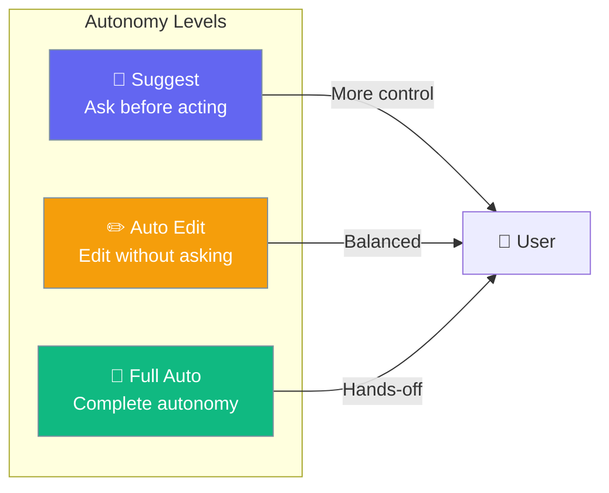
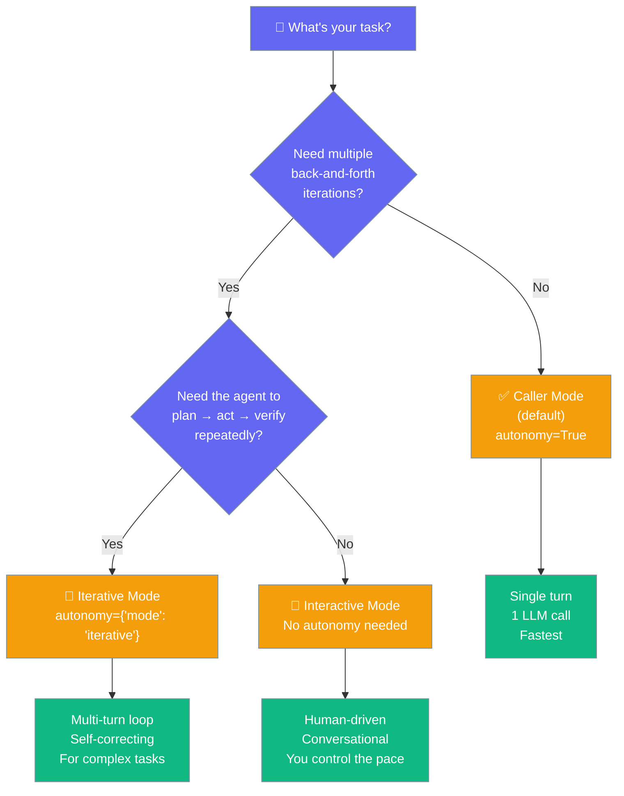
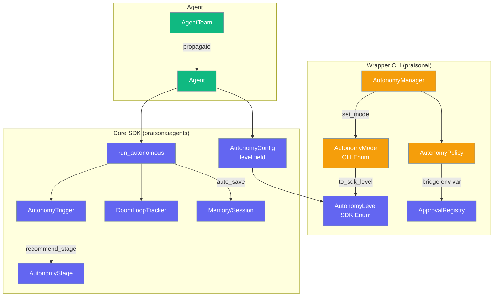
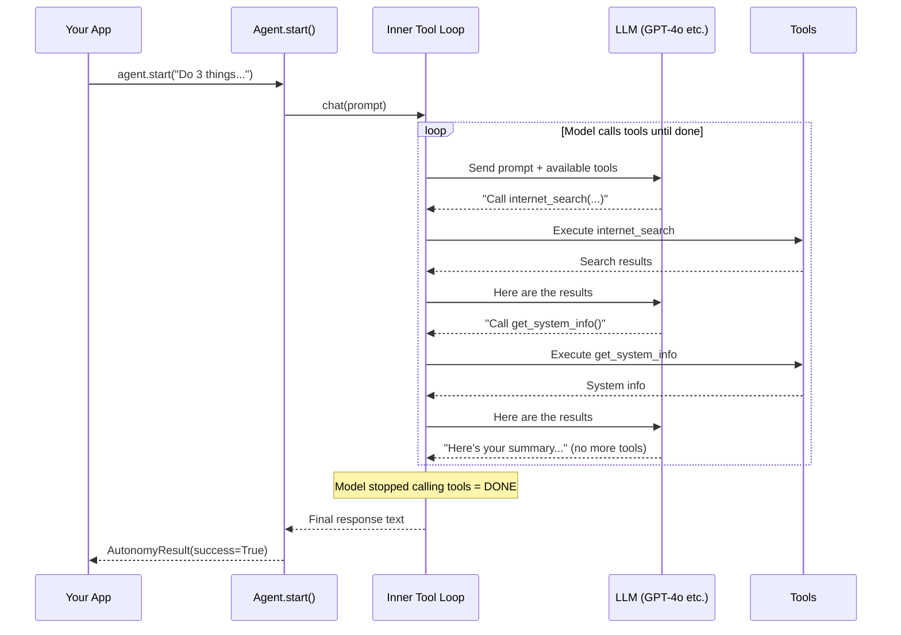
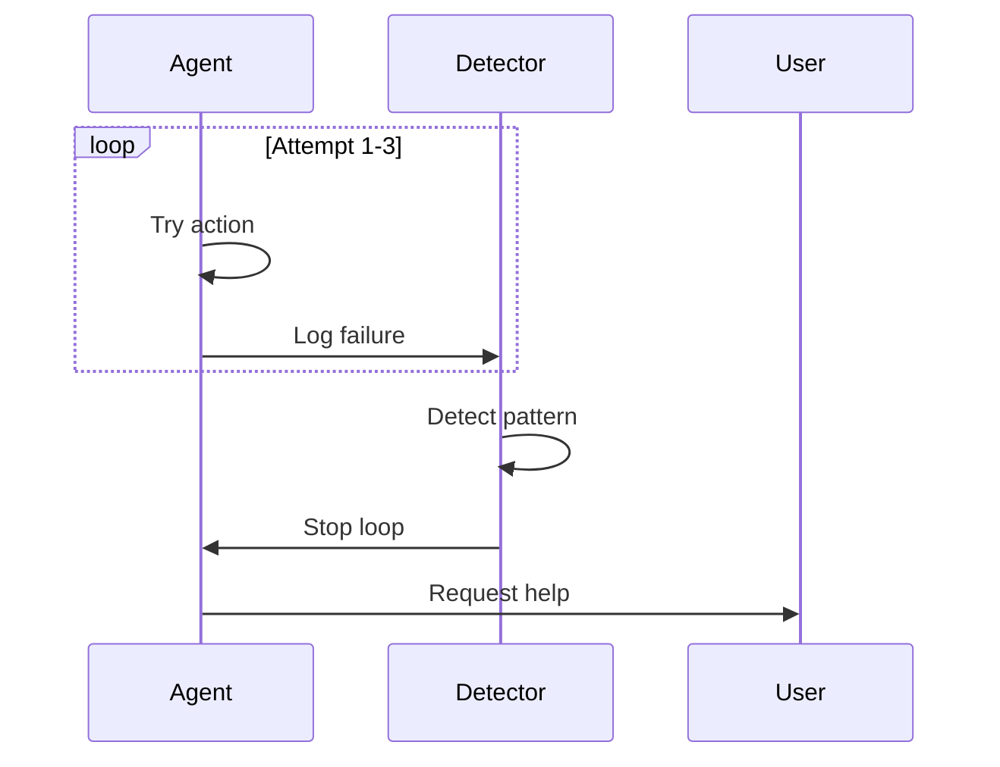
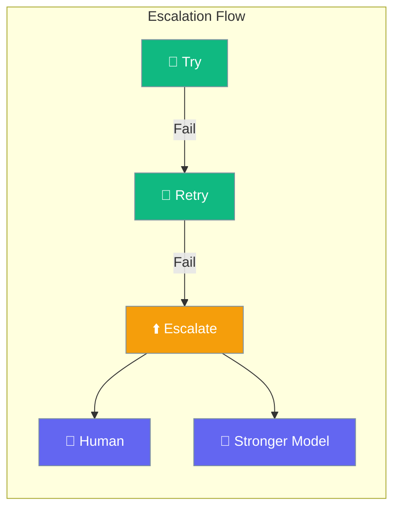
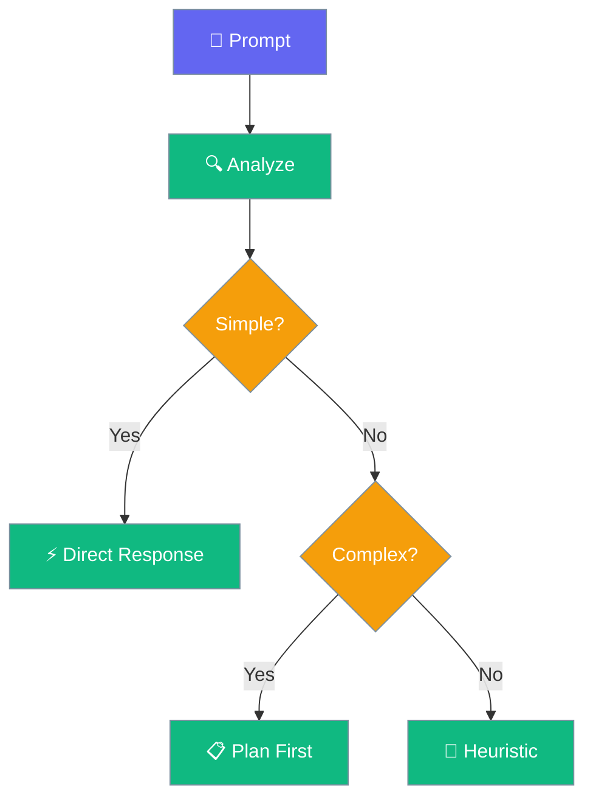

Autonomy controls how independently an agent operates — from requiring approval for every action to fully autonomous execution. The `mode` field determines whether `start()` uses a single `chat()` call (`"caller"`) or a multi-turn loop (`"iterative"`).


```mermaid
graph LR
    subgraph "Autonomy Levels"
        Suggest[💬 Suggest<br/>Ask before acting]
        AutoEdit[✏️ Auto Edit<br/>Edit without asking]
        FullAuto[🚀 Full Auto<br/>Complete autonomy]
    end
    
    Suggest -->|"More control"| User[👤 User]
    AutoEdit -->|"Balanced"| User
    FullAuto -->|"Hands-off"| User
    
    classDef suggest fill:#6366F1,stroke:#7C90A0,color:#fff
    classDef auto fill:#F59E0B,stroke:#7C90A0,color:#fff
    classDef full fill:#10B981,stroke:#7C90A0,color:#fff
    
    class Suggest suggest
    class AutoEdit auto
    class FullAuto full
```

## Which Mode Should I Choose?

Not sure which mode fits your task? Use this guide:


```mermaid
graph TB
    Start[🤔 What's your task?] --> Q1{Need multiple\nback-and-forth\niterations?}
    Q1 -->|No| Caller["✅ Caller Mode\n(default)\nautonomy=True"]
    Q1 -->|Yes| Q2{Need the agent to\nplan → act → verify\nrepeatedly?}
    Q2 -->|Yes| Iterative["🔄 Iterative Mode\nautonomy={'mode': 'iterative'}"]
    Q2 -->|No| Interactive["💬 Interactive Mode\nNo autonomy needed"]
    
    Caller --> R1["Single turn\n1 LLM call\nFastest"]
    Iterative --> R2["Multi-turn loop\nSelf-correcting\nFor complex tasks"]
    Interactive --> R3["Human-driven\nConversational\nYou control the pace"]
    
    classDef question fill:#6366F1,stroke:#7C90A0,color:#fff
    classDef mode fill:#F59E0B,stroke:#7C90A0,color:#fff
    classDef result fill:#10B981,stroke:#7C90A0,color:#fff
    
    class Start,Q1,Q2 question
    class Caller,Iterative,Interactive mode
    class R1,R2,R3 result
```

| Mode | Best For | Example Prompt | What Happens |
|------|----------|---------------|--------------|
| **No autonomy** | Questions, explanations, advice | "Explain authentication patterns" | Agent answers from knowledge — doesn't touch files or run tools |
| **Caller** (default) | Single-shot automation, pipelines | "Search for X and save to file" | Agent uses tools in one turn, returns `AutonomyResult` |
| **Iterative** | Multi-step self-correction | "Refactor auth module and verify tests" | Agent loops with doom loop protection until done |

## Quick Start

<Steps>

<Step title="Enable Autonomy">
```python
from praisonaiagents import Agent

# Caller mode (default) — single chat(), returns AutonomyResult
agent = Agent(
    name="Autonomous Agent",
    instructions="You help with coding tasks",
    autonomy=True  # mode="caller" by default
)

result = agent.start("Refactor the authentication module")
print(result.success)            # True
print(result.completion_reason)  # "caller_mode"
```
</Step>

<Step title="With Configuration">
```python
from praisonaiagents import Agent

# Iterative mode — multi-turn autonomous loop
agent = Agent(
    name="Full Auto Agent",
    instructions="You manage files and code",
    autonomy={
        "level": "full_auto",             # mode defaults to "iterative"
        "max_iterations": 30,
        "doom_loop_threshold": 5,
        "completion_promise": "DONE",
    }
)
```
</Step>

<Step title="Explicit Mode Override">
```python
from praisonaiagents import Agent

# Force iterative loop even at suggest level
agent = Agent(
    name="Iterative Agent",
    instructions="Work through complex tasks",
    autonomy={
        "mode": "iterative",
        "max_iterations": 15,
        "completion_promise": "COMPLETE",
    }
)
```
</Step>

</Steps>

---

## Architecture

The autonomy system spans the Core SDK and Wrapper CLI, unified through bridging:


```mermaid
graph TB
    subgraph "Wrapper CLI (praisonai)"
        CM[AutonomyMode<br/>CLI Enum] -->|to_sdk_level| SL
        CP[AutonomyPolicy] -->|bridge env var| AR
        AM[AutonomyManager] --> CP
        AM -->|set_mode| CM
    end
    
    subgraph "Core SDK (praisonaiagents)"
        SL[AutonomyLevel<br/>SDK Enum]
        AC[AutonomyConfig<br/>level field] --> SL
        AT[AutonomyTrigger] -->|recommend_stage| AS
        AS[AutonomyStage]
        DL[DoomLoopTracker]
        AR[ApprovalRegistry]
        RA[run_autonomous] --> AT
        RA --> DL
        RA -->|auto_save| MS[Memory/Session]
    end
    
    subgraph "Agent"
        AG[Agent] --> AC
        AG --> RA
        TM[AgentTeam] -->|propagate| AG
    end
    
    classDef sdk fill:#6366F1,stroke:#7C90A0,color:#fff
    classDef cli fill:#F59E0B,stroke:#7C90A0,color:#fff
    classDef agent fill:#10B981,stroke:#7C90A0,color:#fff
    
    class SL,AC,AT,AS,DL,AR,RA,MS sdk
    class CM,CP,AM cli
    class AG,TM agent
```

**Key design decisions:**
- **Single source of truth**: `AutonomyLevel` enum lives in the SDK; CLI's `AutonomyMode` derives from it
- **Bridge via env var**: CLI's `FULL_AUTO` mode sets `PRAISONAI_AUTO_APPROVE=true` for SDK approval
- **AgentTeam propagation**: `AgentTeam(autonomy=...)` propagates config to all managed agents
- **Memory integration**: `run_autonomous()` auto-saves sessions between iterations

---

## Autonomy Stages

The agent automatically selects an execution stage based on task complexity:


```mermaid
graph TB
    subgraph "Stage: DIRECT"
        D1[Simple question] --> D2[Immediate response]
    end
    
    subgraph "Stage: HEURISTIC"
        H1[File references] --> H2[Context-aware response]
    end
    
    subgraph "Stage: PLANNED"
        P1[Edit/test intent] --> P2[Plan then execute]
    end
    
    subgraph "Stage: AUTONOMOUS"
        A1[Multi-step task] --> A2[Full autonomous loop]
    end
    
    classDef direct fill:#10B981,stroke:#7C90A0,color:#fff
    classDef heuristic fill:#189AB4,stroke:#7C90A0,color:#fff
    classDef planned fill:#F59E0B,stroke:#7C90A0,color:#fff
    classDef autonomous fill:#6366F1,stroke:#7C90A0,color:#fff
    
    class D1,D2 direct
    class H1,H2 heuristic
    class P1,P2 planned
    class A1,A2 autonomous
```

| Stage | Triggers | Behavior |
|-------|----------|----------|
| `direct` | Simple questions, explanations | Single response |
| `heuristic` | File references, code blocks | Context-aware |
| `planned` | Edit/test intent | Plan before acting |
| `autonomous` | Multi-step, refactoring | Full iteration loop |

---

## How Completion Works

Understanding how the agent knows when it's "done" is key to choosing the right mode.


```mermaid
sequenceDiagram
    participant App as Your App
    participant Agent as Agent.start()
    participant Inner as Inner Tool Loop
    participant LLM as LLM (GPT-4o etc.)
    participant Tools as Tools

    App->>Agent: agent.start("Do 3 things...")
    Agent->>Inner: chat(prompt)
    
    loop Model calls tools until done
        Inner->>LLM: Send prompt + available tools
        LLM-->>Inner: "Call internet_search(...)" 
        Inner->>Tools: Execute internet_search
        Tools-->>Inner: Search results
        Inner->>LLM: Here are the results
        LLM-->>Inner: "Call get_system_info()"
        Inner->>Tools: Execute get_system_info
        Tools-->>Inner: System info
        Inner->>LLM: Here are the results
        LLM-->>Inner: "Here's your summary..." (no more tools)
    end
    
    Note over Inner: Model stopped calling tools = DONE
    Inner-->>Agent: Final response text
    Agent-->>App: AutonomyResult(success=True)
```

The model **decides when to stop** by not requesting more tools. This is the same protocol used by ChatGPT, Claude, and all major LLM APIs.

| Completion Signal | How It Works | Reliability |
|---|---|---|
| **Tool completion** | Model used tools, then stopped requesting more | ⭐⭐⭐ Most reliable |
| **Promise tag** | Model outputs `<promise>DONE</promise>` | ⭐⭐⭐ Explicit signal |
| **Keyword detection** | Model says "task completed" | ⭐⭐ Can be inconsistent |
| **No-tool turns** | Model produces text without tools for 2+ turns | ⭐⭐ Safety fallback |
| **Max iterations** | Reached the iteration limit | ⭐ Last resort |

<Tip>
For most tasks, **caller mode** is all you need — the model handles everything in one turn. Only use **iterative mode** when you need the agent to observe results and decide what to do next across multiple turns.
</Tip>

---

## Configuration Options

```python
from praisonaiagents import Agent

# Using dict config
agent = Agent(
    instructions="You help with coding tasks",
    autonomy={
        "max_iterations": 30,
        "doom_loop_threshold": 5,
        "auto_escalate": True,
    }
)
```

| Option | Type | Default | Description |
|--------|------|---------|-------------|
| `enabled` | `bool` | `True` | Whether autonomy is enabled |
| `level` | `str` | `"suggest"` | Autonomy level: `suggest`, `auto_edit`, `full_auto` |
| `mode` | `str` | Smart default | `"caller"` (single chat) or `"iterative"` (loop). Defaults: suggest/auto_edit → `"caller"`, full_auto → `"iterative"` |
| `max_iterations` | `int` | `20` | Maximum iterations (iterative mode only) |
| `doom_loop_threshold` | `int` | `3` | Repeated actions to trigger doom loop |
| `auto_escalate` | `bool` | `True` | Automatically escalate complexity |
| `observe` | `bool` | `False` | Emit observability events |

---

## Doom Loop Detection

Prevents agents from getting stuck in repetitive failure patterns:


```mermaid
sequenceDiagram
    participant Agent
    participant Detector
    participant User
    
    loop Attempt 1-3
        Agent->>Agent: Try action
        Agent->>Detector: Log failure
    end
    
    Detector->>Detector: Detect pattern
    Detector->>Agent: Stop loop
    Agent->>User: Request help
```

```python
agent = Agent(
    instructions="You fix bugs",
    autonomy={
        "doom_loop_threshold": 3,  # Stop after 3 similar failures
    }
)
```

---

## Escalation Pipeline

When an agent can't complete a task, it escalates:


```mermaid
graph LR
    subgraph "Escalation Flow"
        Try[🔄 Try] -->|Fail| Retry[🔄 Retry]
        Retry -->|Fail| Escalate[⬆️ Escalate]
        Escalate --> Human[👤 Human]
        Escalate --> Stronger[🧠 Stronger Model]
    end
    
    classDef try fill:#10B981,stroke:#7C90A0,color:#fff
    classDef escalate fill:#F59E0B,stroke:#7C90A0,color:#fff
    classDef human fill:#6366F1,stroke:#7C90A0,color:#fff
    
    class Try,Retry try
    class Escalate escalate
    class Human,Stronger human
```

```python
agent = Agent(
    instructions="You solve complex problems",
    autonomy={
        "auto_escalate": True,  # Enable escalation
        "max_iterations": 20,   # Max attempts before escalating
    }
)
```

---

## Signal Detection

Autonomy uses heuristics to detect task complexity:

```python
# Signals detected from prompts
SIMPLE_KEYWORDS = {"what is", "explain", "describe"}
COMPLEX_KEYWORDS = {"refactor", "implement", "debug", "fix"}
EDIT_KEYWORDS = {"edit", "modify", "change", "update"}
```


```mermaid
graph TB
    Prompt[📝 Prompt] --> Analyze[🔍 Analyze]
    Analyze --> Simple{Simple?}
    Simple -->|Yes| Direct[⚡ Direct Response]
    Simple -->|No| Complex{Complex?}
    Complex -->|Yes| Plan[📋 Plan First]
    Complex -->|No| Heuristic[🎯 Heuristic]
    
    classDef prompt fill:#6366F1,stroke:#7C90A0,color:#fff
    classDef decision fill:#F59E0B,stroke:#7C90A0,color:#fff
    classDef action fill:#10B981,stroke:#7C90A0,color:#fff
    
    class Prompt prompt
    class Simple,Complex decision
    class Direct,Plan,Heuristic,Analyze action
```

---

## Use Cases

<CardGroup cols={2}>
  <Card title="Code Refactoring" icon="code">
    **Best for**: Multi-step code changes
    
    Agent plans, executes, and verifies changes autonomously.
  </Card>
  <Card title="Research Tasks" icon="magnifying-glass">
    **Best for**: Information gathering
    
    Agent searches, synthesizes, and reports findings.
  </Card>
  <Card title="Bug Fixing" icon="bug">
    **Best for**: Debugging workflows
    
    Agent analyzes, fixes, and tests iteratively.
  </Card>
  <Card title="Content Generation" icon="pen">
    **Best for**: Writing and editing
    
    Agent drafts, refines, and polishes content.
  </Card>
</CardGroup>

---

## Best Practices

<AccordionGroup>
  <Accordion title="Start with caller mode (default)">
    Most tasks complete in a single turn. The model calls all needed tools and summarizes — no iteration loop needed. Only switch to iterative when you need multi-turn self-correction.
  </Accordion>
  
  <Accordion title="Use completion promises for iterative mode">
    Set `completion_promise` for reliable termination in iterative mode. The agent outputs `<promise>DONE</promise>` when finished.
  </Accordion>
  
  <Accordion title="Keep doom loop threshold low">
    Keep `doom_loop_threshold` at 3-5 to prevent runaway agents and wasted resources.
  </Accordion>
  
  <Accordion title="Monitor with observe mode">
    Set `observe=True` during development to track agent behavior and stage escalation.
  </Accordion>
</AccordionGroup>

---

## Related

<CardGroup cols={2}>
  <Card title="Planning" icon="list-check" href="/concepts/planning">
    Think before acting
  </Card>
  <Card title="Guardrails" icon="shield" href="/concepts/guardrails">
    Safety constraints
  </Card>
</CardGroup>
