```mermaid
graph TB
    Prompt[📝 Prompt] --> Analyze[🔍 Analyze]
    Analyze --> Simple{Simple?}
    Simple -->|Yes| Direct[⚡ Direct Response]
    Simple -->|No| Complex{Complex?}
    Complex -->|Yes| Plan[📋 Plan First]
    Complex -->|No| Heuristic[🎯 Heuristic]
    
    classDef prompt fill:#6366F1,stroke:#7C90A0,color:#fff
    classDef decision fill:#F59E0B,stroke:#7C90A0,color:#fff
    classDef action fill:#10B981,stroke:#7C90A0,color:#fff
    
    class Prompt prompt
    class Simple,Complex decision
    class Direct,Plan,Heuristic,Analyze action
```

Autonomy controls how independently an agent operates - from requiring approval for every action to fully autonomous execution.

```mermaid
graph LR
    subgraph "Autonomy Levels"
        Suggest[💬 Suggest<br/>Ask before acting]
        AutoEdit[✏️ Auto Edit<br/>Edit without asking]
        FullAuto[🚀 Full Auto<br/>Complete autonomy]
    end
    
    Suggest -->|"More control"| User[👤 User]
    AutoEdit -->|"Balanced"| User
    FullAuto -->|"Hands-off"| User
    
    classDef suggest fill:#6366F1,stroke:#7C90A0,color:#fff
    classDef auto fill:#F59E0B,stroke:#7C90A0,color:#fff
    classDef full fill:#10B981,stroke:#7C90A0,color:#fff
    
    class Suggest suggest
    class AutoEdit auto
    class FullAuto full
```



## Quick Start

<Steps>

<Step title="Enable Autonomy">
```python
from praisonaiagents import Agent

agent = Agent(
    name="Autonomous Agent",
    instructions="You help with coding tasks",
    autonomy=True  # Enable with defaults
)

agent.start("Refactor the authentication module")
```
</Step>

<Step title="With Configuration">
```python
from praisonaiagents import Agent, AutonomyConfig

agent = Agent(
    name="Controlled Agent",
    instructions="You manage files and code",
    autonomy=AutonomyConfig(
        level="auto_edit",              # Autonomy level
        doom_loop_detection=True,       # Detect stuck loops
        max_consecutive_failures=3,     # Failure threshold
        require_approval_for_writes=True,
    )
)
```
</Step>

</Steps>

---

## Autonomy Levels


| Level | File Reads | File Writes | Shell Commands |
|-------|------------|-------------|----------------|
| `suggest` | ✅ Auto | ❓ Ask | ❓ Ask |
| `auto_edit` | ✅ Auto | ✅ Auto | ❓ Ask |
| `full_auto` | ✅ Auto | ✅ Auto | ✅ Auto |

---

## Configuration Options

```python
from praisonaiagents import AutonomyConfig

config = AutonomyConfig(
    level="auto_edit",              # suggest, auto_edit, full_auto
    escalation_enabled=True,        # Enable escalation pipeline
    escalation_threshold=3,         # Failures before escalating
    doom_loop_detection=True,       # Detect repeated failures
    max_consecutive_failures=3,     # Max failures before stopping
    require_approval_for_writes=True,
    require_approval_for_shell=True,
)
```

| Option | Type | Default | Description |
|--------|------|---------|-------------|
| `level` | `str` | `"suggest"` | Autonomy level |
| `escalation_enabled` | `bool` | `True` | Enable escalation on failures |
| `escalation_threshold` | `int` | `3` | Failures before escalating |
| `doom_loop_detection` | `bool` | `True` | Detect stuck loops |
| `max_consecutive_failures` | `int` | `3` | Max failures before stopping |
| `require_approval_for_writes` | `bool` | `True` | Require approval for file writes |
| `require_approval_for_shell` | `bool` | `True` | Require approval for shell commands |

---

## Doom Loop Detection

Prevents agents from getting stuck in repetitive failure patterns:


```python
agent = Agent(
    instructions="You fix bugs",
    autonomy=AutonomyConfig(
        doom_loop_detection=True,
        max_consecutive_failures=3,  # Stop after 3 similar failures
    )
)
```

---

## Escalation Pipeline

When an agent can't complete a task, it escalates:


```python
agent = Agent(
    instructions="You solve complex problems",
    autonomy=AutonomyConfig(
        escalation_enabled=True,
        escalation_threshold=3,  # Escalate after 3 failures
    )
)
```

---

## Signal Detection

Autonomy uses heuristics to detect task complexity:

```python
# Signals detected from prompts
SIMPLE_KEYWORDS = {"what is", "explain", "describe"}
COMPLEX_KEYWORDS = {"refactor", "implement", "debug", "fix"}
EDIT_KEYWORDS = {"edit", "modify", "change", "update"}
```



---

## Use Cases

<CardGroup cols={2}>
  <Card title="suggest" icon="comment">
    **Best for**: Learning, sensitive operations, new users
    
    Agent proposes, user decides.
  </Card>
  <Card title="auto_edit" icon="pen">
    **Best for**: Development workflows, code editing
    
    Edit freely, ask for shell commands.
  </Card>
  <Card title="full_auto" icon="rocket">
    **Best for**: CI/CD, batch processing, trusted tasks
    
    Complete independence.
  </Card>
</CardGroup>

---

## Best Practices

<AccordionGroup>
  <Accordion title="Start with suggest mode">
    Begin with the most restrictive mode and increase autonomy as trust builds.
  </Accordion>
  
  <Accordion title="Enable doom loop detection">
    Always enable to prevent runaway agents and wasted resources.
  </Accordion>
  
  <Accordion title="Set appropriate failure thresholds">
    Lower thresholds for critical operations, higher for exploratory tasks.
  </Accordion>
  
  <Accordion title="Use escalation for complex tasks">
    Let agents escalate to stronger models or humans when stuck.
  </Accordion>
</AccordionGroup>

---

## Related

<CardGroup cols={2}>
  <Card title="Planning" icon="list-check" href="/concepts/planning">
    Think before acting
  </Card>
  <Card title="Guardrails" icon="shield" href="/concepts/guardrails">
    Safety constraints
  </Card>
</CardGroup>
