```mermaid
graph TB
    Prompt[📝 Prompt] --> Analyze[🔍 Analyze]
    Analyze --> Simple{Simple?}
    Simple -->|Yes| Direct[⚡ Direct Response]
    Simple -->|No| Complex{Complex?}
    Complex -->|Yes| Plan[📋 Plan First]
    Complex -->|No| Heuristic[🎯 Heuristic]
    
    classDef prompt fill:#6366F1,stroke:#7C90A0,color:#fff
    classDef decision fill:#F59E0B,stroke:#7C90A0,color:#fff
    classDef action fill:#10B981,stroke:#7C90A0,color:#fff
    
    class Prompt prompt
    class Simple,Complex decision
    class Direct,Plan,Heuristic,Analyze action
```

Autonomy controls how independently an agent operates - from requiring approval for every action to fully autonomous execution.

```mermaid
graph LR
    subgraph "Autonomy Levels"
        Suggest[💬 Suggest<br/>Ask before acting]
        AutoEdit[✏️ Auto Edit<br/>Edit without asking]
        FullAuto[🚀 Full Auto<br/>Complete autonomy]
    end
    
    Suggest -->|"More control"| User[👤 User]
    AutoEdit -->|"Balanced"| User
    FullAuto -->|"Hands-off"| User
    
    classDef suggest fill:#6366F1,stroke:#7C90A0,color:#fff
    classDef auto fill:#F59E0B,stroke:#7C90A0,color:#fff
    classDef full fill:#10B981,stroke:#7C90A0,color:#fff
    
    class Suggest suggest
    class AutoEdit auto
    class FullAuto full
```



## Quick Start

<Steps>

<Step title="Enable Autonomy">
```python
from praisonaiagents import Agent

agent = Agent(
    name="Autonomous Agent",
    instructions="You help with coding tasks",
    autonomy=True  # Enable with defaults
)

agent.start("Refactor the authentication module")
```
</Step>

<Step title="With Configuration">
```python
from praisonaiagents import Agent

agent = Agent(
    name="Controlled Agent",
    instructions="You manage files and code",
    autonomy={
        "max_iterations": 30,           # Max iterations
        "doom_loop_threshold": 5,       # Detect stuck loops
        "auto_escalate": True,          # Escalate on failures
    }
)
```
</Step>

</Steps>

---

## Autonomy Stages

The agent automatically selects an execution stage based on task complexity:


| Stage | Triggers | Behavior |
|-------|----------|----------|
| `direct` | Simple questions, explanations | Single response |
| `heuristic` | File references, code blocks | Context-aware |
| `planned` | Edit/test intent | Plan before acting |
| `autonomous` | Multi-step, refactoring | Full iteration loop |

---

## Configuration Options

```python
from praisonaiagents import Agent

# Using dict config
agent = Agent(
    instructions="You help with coding tasks",
    autonomy={
        "max_iterations": 30,
        "doom_loop_threshold": 5,
        "auto_escalate": True,
    }
)
```

| Option | Type | Default | Description |
|--------|------|---------|-------------|
| `enabled` | `bool` | `True` | Whether autonomy is enabled |
| `max_iterations` | `int` | `20` | Maximum iterations before stopping |
| `doom_loop_threshold` | `int` | `3` | Repeated actions to trigger doom loop |
| `auto_escalate` | `bool` | `True` | Automatically escalate complexity |
| `observe` | `bool` | `False` | Emit observability events |

---

## Doom Loop Detection

Prevents agents from getting stuck in repetitive failure patterns:


```python
agent = Agent(
    instructions="You fix bugs",
    autonomy={
        "doom_loop_threshold": 3,  # Stop after 3 similar failures
    }
)
```

---

## Escalation Pipeline

When an agent can't complete a task, it escalates:


```python
agent = Agent(
    instructions="You solve complex problems",
    autonomy={
        "auto_escalate": True,  # Enable escalation
        "max_iterations": 20,   # Max attempts before escalating
    }
)
```

---

## Signal Detection

Autonomy uses heuristics to detect task complexity:

```python
# Signals detected from prompts
SIMPLE_KEYWORDS = {"what is", "explain", "describe"}
COMPLEX_KEYWORDS = {"refactor", "implement", "debug", "fix"}
EDIT_KEYWORDS = {"edit", "modify", "change", "update"}
```



---

## Use Cases

<CardGroup cols={2}>
  <Card title="Code Refactoring" icon="code">
    **Best for**: Multi-step code changes
    
    Agent plans, executes, and verifies changes autonomously.
  </Card>
  <Card title="Research Tasks" icon="magnifying-glass">
    **Best for**: Information gathering
    
    Agent searches, synthesizes, and reports findings.
  </Card>
  <Card title="Bug Fixing" icon="bug">
    **Best for**: Debugging workflows
    
    Agent analyzes, fixes, and tests iteratively.
  </Card>
  <Card title="Content Generation" icon="pen">
    **Best for**: Writing and editing
    
    Agent drafts, refines, and polishes content.
  </Card>
</CardGroup>

---

## Best Practices

<AccordionGroup>
  <Accordion title="Start with lower iteration limits">
    Begin with lower `max_iterations` and increase as needed for complex tasks.
  </Accordion>
  
  <Accordion title="Enable doom loop detection">
    Keep `doom_loop_threshold` low (3-5) to prevent runaway agents and wasted resources.
  </Accordion>
  
  <Accordion title="Use auto_escalate for complex tasks">
    Enable `auto_escalate` to let agents escalate to stronger models when stuck.
  </Accordion>
  
  <Accordion title="Monitor with observe mode">
    Set `observe=True` during development to track agent behavior.
  </Accordion>
</AccordionGroup>

---

## Related

<CardGroup cols={2}>
  <Card title="Planning" icon="list-check" href="/concepts/planning">
    Think before acting
  </Card>
  <Card title="Guardrails" icon="shield" href="/concepts/guardrails">
    Safety constraints
  </Card>
</CardGroup>
