Your AI agent can live inside messaging apps. Users chat with it like a friend — no app to install, no website to visit.

```mermaid
graph LR
    subgraph "BotOS"
        U["👤 User"] -->|"sends message"| P["📱 Messaging App"]
        P -->|"delivers to"| B["🤖 Your Bot"]
        B -->|"asks"| A["🧠 AI Agent"]
        A -->|"replies"| B
        B -->|"sends reply"| P
        P -->|"shows reply"| U
    end

    classDef user fill:#8B0000,stroke:#7C90A0,color:#fff
    classDef platform fill:#189AB4,stroke:#7C90A0,color:#fff
    classDef bot fill:#F59E0B,stroke:#7C90A0,color:#fff
    classDef agent fill:#8B0000,stroke:#7C90A0,color:#fff

    class U user
    class P platform
    class B bot
    class A agent
```



---

## What Is a BotOS?

BotOS is your AI agent wrapped in a messaging app interface. Instead of typing prompts in a terminal, users send normal messages on Telegram, Discord, Slack, or WhatsApp.

| Concept | What It Means |
|---------|--------------|
| **Agent** | The AI brain — understands questions, uses tools, generates answers |
| **Bot** | The messenger — receives messages from the app, sends them to the agent, delivers replies |
| **Platform** | Where users chat — Telegram, Discord, Slack, or WhatsApp |

---

## Step-by-Step: How a Message Flows

```mermaid
sequenceDiagram
    participant User as 👤 User
    participant App as 📱 Messaging App
    participant Bot as 🤖 Bot
    participant Agent as 🧠 Agent

    User->>App: "What's the weather?"
    App->>Bot: Delivers message
    Bot->>Agent: "What's the weather?"
    Agent->>Agent: Thinks + uses tools
    Agent-->>Bot: "It's 72°F and sunny"
    Bot-->>App: Sends reply
    App-->>User: "It's 72°F and sunny ☀️"
```



| Step | What Happens |
|:----:|-------------|
| 1 | User types a message in their favorite app |
| 2 | The messaging platform sends it to your bot |
| 3 | Your bot passes the message to the AI agent |
| 4 | The agent thinks, searches the web, checks documents — whatever you've configured |
| 5 | The agent sends an answer back through the bot |
| 6 | The user sees the reply in their chat |

---

## Which Platform Should I Use?

```mermaid
graph TD
    Q1["Who is the bot for?"] -->|"My team at work"| SLACK["💼 Slack"]
    Q1 -->|"A community"| DISC["💬 Discord"]
    Q1 -->|"Anyone with a phone"| Q2["Need a business account?"]
    Q2 -->|"Yes, I have one"| WA["📲 WhatsApp"]
    Q2 -->|"No, keep it simple"| TG["📱 Telegram"]

    classDef question fill:#F59E0B,stroke:#7C90A0,color:#fff
    classDef answer fill:#10B981,stroke:#7C90A0,color:#fff

    class Q1,Q2 question
    class SLACK,DISC,WA,TG answer
```



| Platform | Best For | Setup Difficulty |
|----------|----------|:----------------:|
| **Telegram** | Personal bots, public bots, quick prototypes | ⭐ Easy |
| **Discord** | Communities, gaming, developer groups | ⭐ Easy |
| **Slack** | Workplaces, teams, internal tools | ⭐⭐ Medium |
| **WhatsApp** | Business communication, customer support | ⭐⭐⭐ Advanced |

---

## Getting Started — 3 Ways

Pick the way that fits you best:

```mermaid
graph LR
    subgraph "Choose Your Style"
        CLI["🖥️ CLI<br/>One command, no code"]
        PY["🐍 Python<br/>Full control"]
        YAML["📄 YAML<br/>Config file"]
    end

    classDef cli fill:#8B0000,stroke:#7C90A0,color:#fff
    classDef py fill:#189AB4,stroke:#7C90A0,color:#fff
    classDef yaml fill:#6366F1,stroke:#7C90A0,color:#fff

    class CLI cli
    class PY py
    class YAML yaml
```



<Tabs>
<Tab title="CLI (Easiest)">
No code needed. One command:

```bash
# Telegram
praisonai bot telegram --token $TELEGRAM_BOT_TOKEN

# Discord
praisonai bot discord --token $DISCORD_BOT_TOKEN

# Slack
praisonai bot slack --token $SLACK_BOT_TOKEN --app-token $SLACK_APP_TOKEN
```

A default AI assistant is created automatically.
</Tab>

<Tab title="Python">
```python
from praisonaiagents import Agent
from praisonai.bots import TelegramBot

agent = Agent(
    name="assistant",
    instructions="You are a helpful assistant",
    llm="gpt-4o-mini"
)

bot = TelegramBot(token="YOUR_BOT_TOKEN", agent=agent)

import asyncio
asyncio.run(bot.start())
```
</Tab>

<Tab title="YAML">
```yaml
platform: telegram
token: "${TELEGRAM_BOT_TOKEN}"

agent:
  name: "My Assistant"
  instructions: "You are a helpful AI assistant."
  llm: "gpt-4o-mini"
```

```bash
praisonai bot start --config bot.yaml
```
</Tab>
</Tabs>

---

## Adding Superpowers

Your bot can do more than just chat. Add capabilities with simple flags:

```mermaid
graph LR
    BOT["🤖 Bot"] --> MEM["🧠 Memory<br/>Remembers conversations"]
    BOT --> KNOW["📚 Knowledge<br/>Answers from your docs"]
    BOT --> WEB["🌐 Web Search<br/>Finds info online"]
    BOT --> THINK["💡 Thinking<br/>Deeper reasoning"]

    classDef bot fill:#8B0000,stroke:#7C90A0,color:#fff
    classDef cap fill:#189AB4,stroke:#7C90A0,color:#fff

    class BOT bot
    class MEM,KNOW,WEB,THINK cap
```



| Capability | CLI Flag | What It Does |
|-----------|---------|-------------|
| **Memory** | `--memory` | Remembers what users said in previous messages |
| **Knowledge** | `--knowledge` | Answers from your PDF, text, or markdown files |
| **Web Search** | `--web` | Searches the internet for up-to-date info |
| **Thinking** | `--thinking high` | Takes more time to give better, deeper answers |

```bash
# A bot that remembers conversations and searches the web
praisonai bot telegram --token $TOKEN --memory --web
```

---

## Bot vs Gateway

Two ways to deploy your agent for real-time chat:


| | Bot | Gateway |
|--|-----|---------|
| **Platforms** | One at a time | All at once |
| **Agents** | One per bot | Multiple, with routing |
| **Best for** | Quick start, single platform | Production, multi-channel |
| **Command** | `praisonai bot telegram` | `praisonai gateway --config gateway.yaml` |

<Tip>
Start with a **Bot** to get running in minutes. Switch to **Gateway** when you need multiple platforms or agents.
</Tip>

---

## Best Practices

<AccordionGroup>
  <Accordion title="Start with Telegram">
    Telegram is the easiest platform to set up — just message @BotFather and get a token in seconds.
  </Accordion>

  <Accordion title="Add memory for better conversations">
    Enable `--memory` so your bot remembers context between messages. Users get a much better experience.
  </Accordion>

  <Accordion title="Keep instructions simple">
    Write bot instructions like you're talking to a person: "You are a helpful assistant for our customer support team. Be friendly and concise."
  </Accordion>

  <Accordion title="Test locally, deploy with Docker">
    Use Socket Mode or polling for local testing. When ready for production, deploy with Docker and webhook mode.
  </Accordion>
</AccordionGroup>

---

## Related

<CardGroup cols={2}>
  <Card title="Messaging Bots" icon="robot" href="/features/messaging-bots">
    Detailed platform setup guides and configuration options
  </Card>
  <Card title="Bot vs Gateway" icon="code-compare" href="/concepts/bot-vs-gateway">
    Deep dive into deployment models
  </Card>
  <Card title="Bot Commands" icon="terminal" href="/features/bot-commands">
    Built-in bot commands and custom commands
  </Card>
  <Card title="Agents" icon="user" href="/concepts/agents">
    Create and configure AI agents
  </Card>
</CardGroup>
