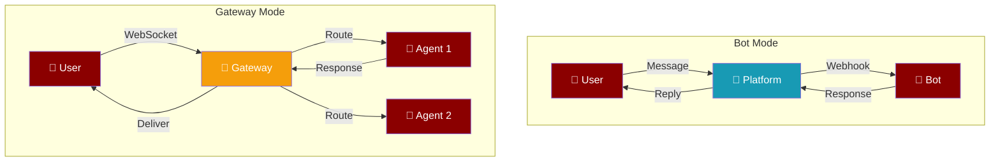
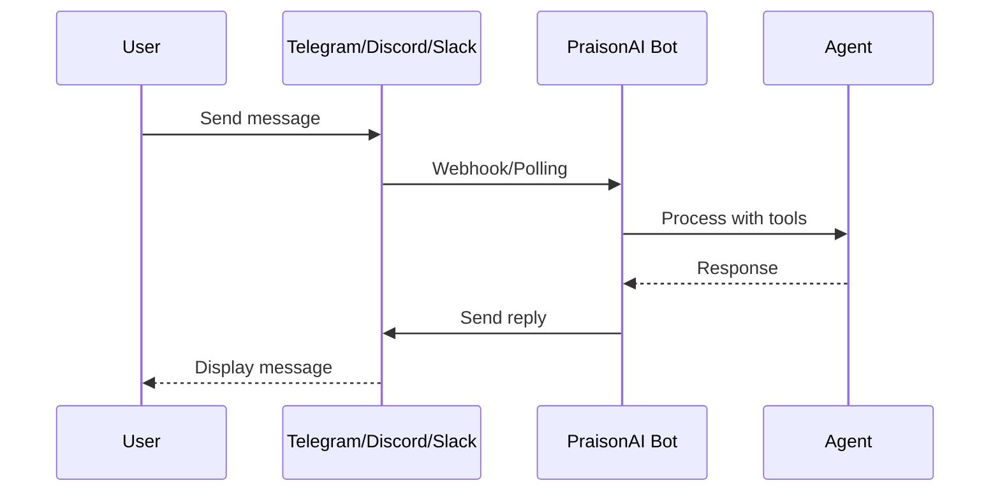
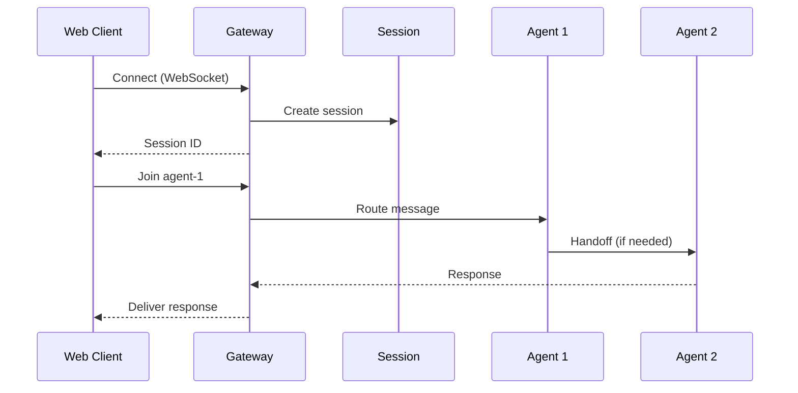
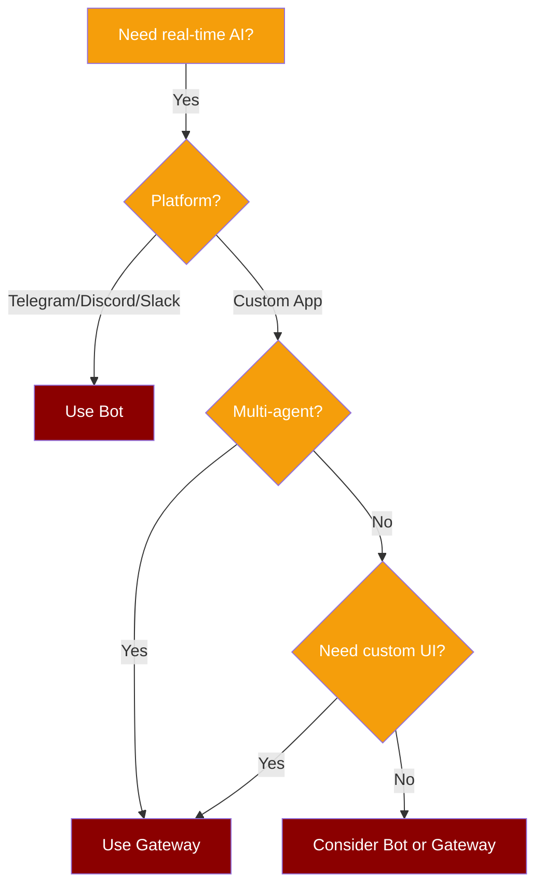

Two ways to deploy AI agents for real-time communication: **Bot** for messaging platforms, **Gateway** for custom applications.



---

## Quick Comparison

| Feature | Bot | Gateway |
|---------|-----|---------|
| **Use Case** | Messaging platforms | Custom applications |
| **Platforms** | Telegram, Discord, Slack | Any WebSocket client |
| **Users** | Single-user conversations | Multi-user, multi-agent |
| **Protocol** | Platform-specific | WebSocket |
| **CLI** | `praisonai bot <platform>` | `praisonai serve gateway` |

---

## When to Use Bot

<CardGroup cols={2}>
  <Card title="Team Communication" icon="comments">
    Deploy to Slack/Discord for team assistants
  </Card>
  <Card title="Customer Support" icon="headset">
    Telegram bots for customer interactions
  </Card>
  <Card title="Personal Assistant" icon="user">
    Single-user conversational AI
  </Card>
  <Card title="Quick Deployment" icon="rocket">
    One command to production
  </Card>
</CardGroup>

```bash
# Deploy to Telegram in one command
praisonai bot telegram --token $TELEGRAM_BOT_TOKEN --memory --web
```

---

## When to Use Gateway

<CardGroup cols={2}>
  <Card title="Web Applications" icon="globe">
    Custom chat interfaces and dashboards
  </Card>
  <Card title="Multi-Agent Systems" icon="users">
    Coordinate multiple specialized agents
  </Card>
  <Card title="Real-time Dashboards" icon="chart-line">
    Live updates and streaming responses
  </Card>
  <Card title="Custom Protocols" icon="code">
    Full control over communication
  </Card>
</CardGroup>

```bash
# Start gateway for custom applications
praisonai serve gateway --port 8765
```

---

## Architecture Deep Dive

<Tabs>
<Tab title="Bot Architecture">



**Key Points:**
- Platform handles user authentication
- Bot receives messages via webhook or polling
- Single agent per bot instance
- Platform-specific features (reactions, threads, etc.)

</Tab>
<Tab title="Gateway Architecture">



**Key Points:**
- Direct WebSocket connection
- Multiple agents per gateway
- Session-based state management
- Agent-to-agent communication

</Tab>
</Tabs>

---

## Feature Comparison

### Capabilities Support

| Capability | Bot | Gateway |
|------------|-----|---------|
| Memory | ✅ `--memory` | ✅ Session state |
| Knowledge/RAG | ✅ `--knowledge` | ✅ Per-agent |
| Tools | ✅ `--tools` | ✅ Per-agent |
| Web Search | ✅ `--web` | ✅ Per-agent |
| Browser | ✅ `--browser` | ✅ Per-agent |
| Thinking Mode | ✅ `--thinking` | ✅ Per-agent |
| Multi-Agent | ❌ Single agent | ✅ Multiple agents |
| Custom UI | ❌ Platform UI | ✅ Full control |

### Deployment

| Aspect | Bot | Gateway |
|--------|-----|---------|
| Setup | Platform token required | No external deps |
| Scaling | One bot per token | Multiple clients per gateway |
| Auth | Platform handles | You implement |
| SSL | Platform handles | You configure |

---

## Code Examples

<Tabs>
<Tab title="Bot (Telegram)">

```python
from praisonai.bots import TelegramBot
from praisonaiagents import Agent

# Create agent with capabilities
agent = Agent(
    name="assistant",
    instructions="You are a helpful assistant.",
    memory=True,
    knowledge=["./docs/"]
)

# Deploy to Telegram
bot = TelegramBot(
    token="YOUR_BOT_TOKEN",
    agent=agent
)

# Start bot
await bot.start()
```

**CLI equivalent:**
```bash
praisonai bot telegram --token $TOKEN --memory --knowledge
```

</Tab>
<Tab title="Gateway (WebSocket)">

```python
from praisonai.gateway import WebSocketGateway
from praisonaiagents import Agent, GatewayConfig

# Create gateway
config = GatewayConfig(host="0.0.0.0", port=8765)
gateway = WebSocketGateway(config=config)

# Register multiple agents
researcher = Agent(name="researcher", instructions="Research topics")
writer = Agent(name="writer", instructions="Write content")

gateway.register_agent(researcher)
gateway.register_agent(writer)

# Start gateway
await gateway.start()
```

**CLI equivalent:**
```bash
praisonai serve gateway --port 8765 --agents agents.yaml
```

</Tab>
</Tabs>

---

## Migration Guide

### Bot to Gateway

Moving from bot to gateway for more control:

<Steps>
<Step title="Extract Agent Configuration">
```yaml
# agents.yaml
agents:
  - name: assistant
    instructions: Your current bot instructions
    memory: true
    tools:
      - search_web
```
</Step>

<Step title="Start Gateway">
```bash
praisonai serve gateway --port 8765 --agents agents.yaml
```
</Step>

<Step title="Connect Your Client">
```javascript
const ws = new WebSocket('ws://localhost:8765/ws');

ws.onopen = () => {
  ws.send(JSON.stringify({
    type: 'join',
    agent_id: 'assistant'
  }));
};

ws.onmessage = (event) => {
  const data = JSON.parse(event.data);
  console.log('Response:', data.content);
};
```
</Step>
</Steps>

---

## Decision Tree



---

## Related

<CardGroup cols={2}>
  <Card title="Bot CLI" icon="robot" href="/cli/bot">
    Full bot CLI reference
  </Card>
  <Card title="Gateway Feature" icon="tower-broadcast" href="/features/gateway">
    Gateway configuration guide
  </Card>
  <Card title="Multi-Agent" icon="users" href="/features/multi-agent">
    Multi-agent coordination
  </Card>
  <Card title="Serve CLI" icon="server" href="/cli/serve">
    All serve commands
  </Card>
</CardGroup>
