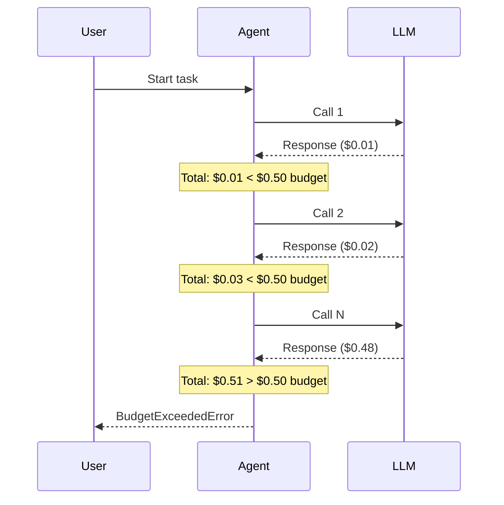
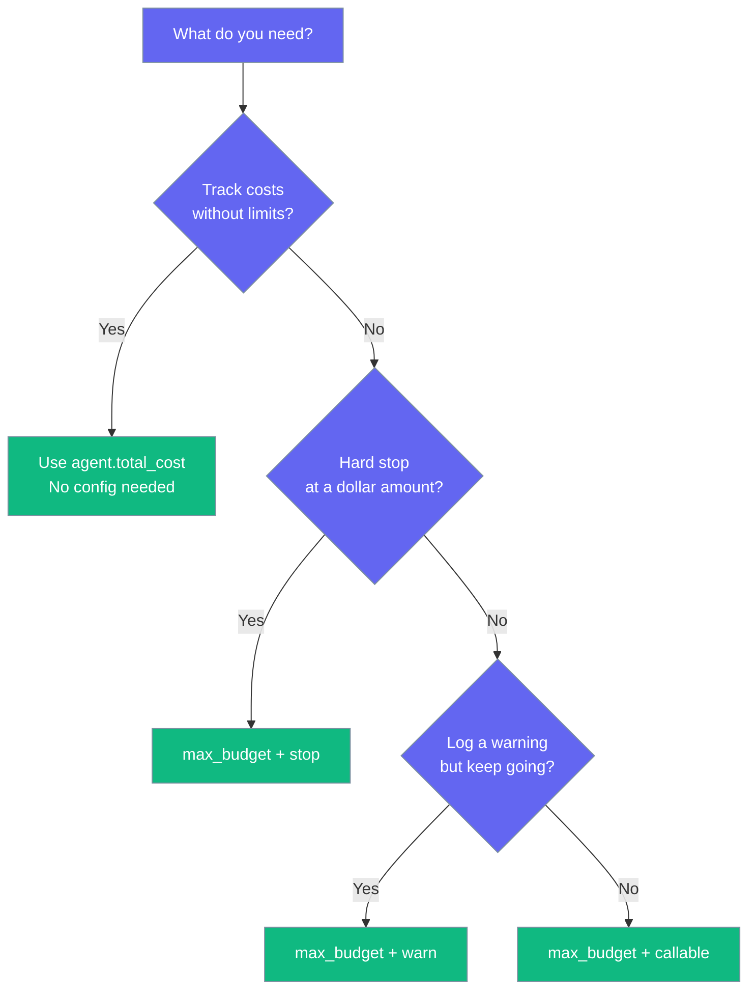

Budget management lets you cap how much an agent spends on LLM calls per run.

```mermaid
graph LR
    subgraph "Budget Guard"
        Call[🤖 LLM Call] --> Track[💰 Track Cost]
        Track --> Check{Over Budget?}
        Check -->|No| Continue[✅ Continue]
        Check -->|Yes| Action[🛑 Stop / Warn]
    end

    classDef call fill:#6366F1,stroke:#7C90A0,color:#fff
    classDef track fill:#F59E0B,stroke:#7C90A0,color:#fff
    classDef result fill:#10B981,stroke:#7C90A0,color:#fff
    classDef stop fill:#8B0000,stroke:#7C90A0,color:#fff

    class Call call
    class Track,Check track
    class Continue result
    class Action stop
```

## Quick Start

<Steps>

<Step title="Set a Budget Limit">
```python
from praisonaiagents import Agent, ExecutionConfig

agent = Agent(
    name="Researcher",
    instructions="You research topics thoroughly",
    execution=ExecutionConfig(max_budget=0.50)  # Stop at $0.50
)

agent.start("Research the history of AI")
```
</Step>

<Step title="Check Costs After a Run">
```python
from praisonaiagents import Agent

agent = Agent(
    name="Writer",
    instructions="You write articles",
)

agent.start("Write an article about climate change")

# Check how much it cost
print(agent.total_cost)       # e.g. 0.0023
print(agent.cost_summary)     # {'tokens_in': 500, 'tokens_out': 200, 'cost': 0.0023, 'llm_calls': 2}
```
</Step>

</Steps>

---

## How It Works



After each LLM call, the agent checks the running total against `max_budget`. If the total exceeds the limit, the agent takes the configured action (stop, warn, or call your handler).

---

## What to Choose



---

## Budget Actions

When the budget is exceeded, you control what happens:

### Stop (Default)

Raises `BudgetExceededError` immediately.

```python
from praisonaiagents import Agent, ExecutionConfig, BudgetExceededError

agent = Agent(
    name="Researcher",
    instructions="You research topics",
    execution=ExecutionConfig(
        max_budget=0.50,
        on_budget_exceeded="stop",  # Default
    )
)

try:
    agent.start("Research quantum computing")
except BudgetExceededError as e:
    print(f"Agent {e.agent_name} spent ${e.total_cost:.4f} (limit: ${e.max_budget:.4f})")
```

### Warn

Logs a warning but continues running.

```python
agent = Agent(
    name="Researcher",
    instructions="You research topics",
    execution=ExecutionConfig(
        max_budget=1.00,
        on_budget_exceeded="warn",
    )
)
```

### Custom Handler

Call your own function when budget is exceeded.

```python
def my_budget_handler(total_cost, max_budget):
    print(f"Budget alert: ${total_cost:.4f} exceeds ${max_budget:.4f}")
    # Send Slack notification, log to database, etc.

agent = Agent(
    name="Researcher",
    instructions="You research topics",
    execution=ExecutionConfig(
        max_budget=2.00,
        on_budget_exceeded=my_budget_handler,
    )
)
```

---

## Cost Tracking (No Limits)

Every agent tracks costs automatically, even without a budget limit.

```python
from praisonaiagents import Agent

agent = Agent(
    name="Assistant",
    instructions="You help with tasks",
)

agent.start("Summarize this document")

# Always available
print(f"Cost: ${agent.total_cost:.4f}")
print(f"Summary: {agent.cost_summary}")
# {'tokens_in': 350, 'tokens_out': 120, 'cost': 0.0015, 'llm_calls': 1}
```

| Property | Type | Description |
|----------|------|-------------|
| `agent.total_cost` | `float` | Total USD spent so far |
| `agent.cost_summary` | `dict` | Tokens in/out, cost, and LLM call count |

---

## Configuration Options

Budget is configured through `ExecutionConfig`:

```python
from praisonaiagents import ExecutionConfig

config = ExecutionConfig(
    max_budget=0.50,              # USD limit (None = no limit)
    on_budget_exceeded="stop",    # "stop" | "warn" | callable
)
```

| Option | Type | Default | Description |
|--------|------|---------|-------------|
| `max_budget` | `float` | `None` | Max USD per agent run. `None` = no limit |
| `on_budget_exceeded` | `str` or `callable` | `"stop"` | Action when budget exceeded |

---

## Multi-Agent Budget

Set per-agent budgets in a team:

```python
from praisonaiagents import Agent, Task, AgentTeam, ExecutionConfig

researcher = Agent(
    name="Researcher",
    instructions="You research topics",
    execution=ExecutionConfig(max_budget=1.00),
)

writer = Agent(
    name="Writer",
    instructions="You write articles",
    execution=ExecutionConfig(max_budget=0.50),
)

task1 = Task(description="Research AI trends", agent=researcher)
task2 = Task(description="Write summary", agent=writer)

team = AgentTeam(agents=[researcher, writer], tasks=[task1, task2])
team.start()

# Check each agent's spending
for agent in [researcher, writer]:
    print(f"{agent.name}: ${agent.total_cost:.4f}")
```

---

## Best Practices

<AccordionGroup>
  <Accordion title="Start with cost tracking, then add limits">
    Run a few times without `max_budget` to understand typical costs. Then set limits based on real data.
  </Accordion>

  <Accordion title="Use 'warn' mode during development">
    Use `on_budget_exceeded="warn"` while building. Switch to `"stop"` in production to enforce hard limits.
  </Accordion>

  <Accordion title="Set per-agent budgets in teams">
    Give each agent its own budget rather than one shared limit. Research agents typically cost more than formatting agents.
  </Accordion>

  <Accordion title="Zero overhead when disabled">
    When `max_budget` is `None` (default), the budget check is skipped entirely. Cost tracking still runs but adds negligible overhead.
  </Accordion>
</AccordionGroup>

---

## Related

<CardGroup cols={2}>
  <Card title="Execution" icon="play" href="/concepts/execution">
    Iteration limits, timeouts, rate limiting
  </Card>
  <Card title="Guardrails" icon="shield" href="/concepts/guardrails">
    Safety and validation controls
  </Card>
</CardGroup>
