Caching improves performance and reduces costs by reusing previous responses and leveraging provider-specific prompt caching.

```mermaid
graph LR
    subgraph "Caching Flow"
        Request[📥 Request] --> Check{Cache?}
        Check -->|"Hit"| Return[⚡ Return Cached]
        Check -->|"Miss"| LLM[🧠 LLM Call]
        LLM --> Store[💾 Store]
        Store --> Return2[📤 Return]
    end
    
    classDef request fill:#6366F1,stroke:#7C90A0,color:#fff
    classDef cache fill:#10B981,stroke:#7C90A0,color:#fff
    classDef llm fill:#F59E0B,stroke:#7C90A0,color:#fff
    
    class Request request
    class Check,Return,Store cache
    class LLM,Return2 llm
```



## Quick Start

<Steps>

<Step title="Enable Caching">
```python
from praisonaiagents import Agent

agent = Agent(
    name="Cached Agent",
    instructions="You answer questions",
    caching=True  # Enable response caching
)
```
</Step>

<Step title="With Configuration">
```python
from praisonaiagents import Agent, CachingConfig

agent = Agent(
    name="Optimized Agent",
    instructions="You process data efficiently",
    caching=CachingConfig(
        enabled=True,           # Response caching
        prompt_caching=True,    # Provider prompt caching
    )
)
```
</Step>

</Steps>

---

## Cache Types

```mermaid
graph TB
    subgraph "Cache Types"
        Response[📝 Response Cache<br/>Store LLM outputs]
        Prompt[💬 Prompt Cache<br/>Provider-side caching]
    end
    
    Response -->|"Local"| Fast[⚡ Fast retrieval]
    Prompt -->|"Provider"| Cost[💰 Reduced cost]
    
    classDef cache fill:#189AB4,stroke:#7C90A0,color:#fff
    classDef benefit fill:#10B981,stroke:#7C90A0,color:#fff
    
    class Response,Prompt cache
    class Fast,Cost benefit
```



### Response Caching

Stores LLM responses locally for identical requests:

```python
agent = Agent(
    instructions="You answer FAQs",
    caching=CachingConfig(enabled=True)
)

# First call - hits LLM
agent.chat("What is Python?")  # ~500ms

# Second call - returns cached
agent.chat("What is Python?")  # ~5ms
```

### Prompt Caching

Uses provider-specific caching (Anthropic, OpenAI):

```python
agent = Agent(
    instructions="You are an expert assistant...",  # Long system prompt
    caching=CachingConfig(prompt_caching=True)
)

# Provider caches the system prompt
# Subsequent calls reuse cached prompt tokens
```

---

## Configuration Options

```python
from praisonaiagents import CachingConfig

config = CachingConfig(
    enabled=True,          # Enable response caching
    prompt_caching=None,   # Provider prompt caching (None = auto)
)
```

| Option | Type | Default | Description |
|--------|------|---------|-------------|
| `enabled` | `bool` | `True` | Enable response caching |
| `prompt_caching` | `bool` | `None` | Provider prompt caching (auto-detect) |

---

## Provider Support


| Provider | Response Cache | Prompt Cache |
|----------|----------------|--------------|
| OpenAI | ✅ Local | ✅ Native |
| Anthropic | ✅ Local | ✅ Native |
| Google | ✅ Local | ⚠️ Limited |
| Ollama | ✅ Local | ❌ N/A |

---

## Cache Benefits

```mermaid
graph TB
    subgraph "Benefits"
        Speed[⚡ Speed<br/>Instant responses]
        Cost[💰 Cost<br/>Fewer API calls]
        Rate[📊 Rate Limits<br/>Reduced load]
    end
    
    Cache[💾 Caching] --> Speed
    Cache --> Cost
    Cache --> Rate
    
    classDef cache fill:#6366F1,stroke:#7C90A0,color:#fff
    classDef benefit fill:#10B981,stroke:#7C90A0,color:#fff
    
    class Cache cache
    class Speed,Cost,Rate benefit
```



| Benefit | Impact |
|---------|--------|
| **Speed** | Cached responses return in milliseconds |
| **Cost** | Avoid repeated API charges |
| **Rate Limits** | Reduce API request count |
| **Reliability** | Work offline with cached data |

---

## When to Use Caching

<CardGroup cols={2}>
  <Card title="✅ Enable Caching For" icon="check">
    - FAQ bots
    - Repeated queries
    - Static content generation
    - Development/testing
  </Card>
  <Card title="❌ Disable Caching For" icon="xmark">
    - Real-time data needs
    - Personalized responses
    - Time-sensitive content
    - Random/creative output
  </Card>
</CardGroup>

---

## Cache Invalidation

Caches are invalidated when:

- System prompt changes
- Model changes
- Temperature changes
- Tools change

```python
# These create different cache entries
agent.chat("Hello", temperature=0.0)  # Cache entry 1
agent.chat("Hello", temperature=0.7)  # Cache entry 2
```

---

## Best Practices

<AccordionGroup>
  <Accordion title="Enable for FAQ-style agents">
    Agents that answer common questions benefit most from caching.
  </Accordion>
  
  <Accordion title="Use prompt caching for long system prompts">
    If your system prompt is large, enable prompt caching to reduce costs.
  </Accordion>
  
  <Accordion title="Disable for dynamic content">
    Don't cache responses that should vary (time-sensitive, personalized).
  </Accordion>
  
  <Accordion title="Monitor cache hit rates">
    Track cache effectiveness to optimize your caching strategy.
  </Accordion>
</AccordionGroup>

---

## Related

<CardGroup cols={2}>
  <Card title="Execution" icon="play" href="/concepts/execution">
    Performance limits
  </Card>
  <Card title="Memory" icon="brain" href="/concepts/memory">
    Persistent storage
  </Card>
</CardGroup>
