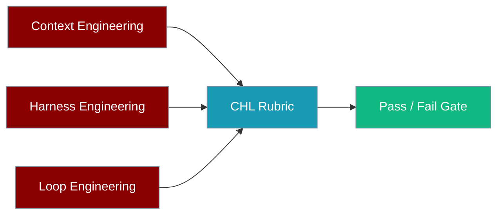

PraisonAI implements three pillars of agentic reliability engineering — **C**ontext, **H**arness, and **L**oop (CHL). This page defines each principle, maps it to concrete modules and CLI commands, and specifies a **measurable rubric** with pass thresholds so teams can validate "framework compliance" consistently and gate releases on quantitative CHL scores.

<Info>
CHL is a *validation lens*, not a new subsystem. Each principle already exists in code (`context/`, `compaction/`, runtime harness, `eval/loop.py`). This page unifies them under one rubric and links to the evaluators that score them.
</Info>



---

## 1. Principles

### 1.1 Context Engineering

Context Engineering governs **what the model sees** on every turn: keeping token usage within budget, compacting history without losing meaning, injecting the right artifacts, and handing off cleanly between agents.

| Sub-principle | Meaning | Code anchor |
|---------------|---------|-------------|
| **Budget** | Total prompt tokens stay within a configured budget | `context/` (token budgeter), `eval/tokens.py` |
| **Compaction** | History is compressed with high semantic retention | `compaction/` (6 strategies) |
| **Injection** | Relevant files/artifacts are added deterministically | `context/` (artifacts, fast context) |
| **Handoff** | Context transfers between agents without loss | `agent/` handoff, `ContextAgent` PRP |

<Tip>
Terminology aligns with the [ContextAgent](/agents/context-agent) PRP methodology and [Context Management](/features/context-management). CHL does not redefine those concepts — it scores them.
</Tip>

### 1.2 Harness Engineering

Harness Engineering guarantees that the environment the agent runs in during **testing** matches production: identical tool schemas, reproducible turn context, and required trace/artifact outputs.

| Sub-principle | Meaning | Code anchor |
|---------------|---------|-------------|
| **Parity** | `PreparedTurnContext` tool schemas match runtime exactly | `runtime/turn_context.py` |
| **Traces** | Each turn emits a structured, replayable trace | `trace/`, harness runner |
| **Artifacts** | Required output files are present after a run | interactive test harness / CSV runner |

### 1.3 Loop Engineering

Loop Engineering makes autonomous iteration **converge safely**: reaching a quality threshold in a bounded number of iterations while doom-loop guards prevent unproductive repetition.

| Sub-principle | Meaning | Code anchor |
|---------------|---------|-------------|
| **Convergence** | Iterations reach the target score within a bound | `eval/loop.py` (`EvaluationLoop`) |
| **Guardrails** | Doom-loop / repeat guards fire on stagnation | `agent/autonomy.py`, loop guards |
| **Efficiency** | Fewest iterations for a given quality target | `eval/loop.py` iteration metrics |

---

## 2. Measurable rubric

Each row maps a principle to a metric, a pass threshold, and the evaluator that produces the score. Targets are defaults — override per project via config.

| Principle | Metric | Target | Evaluator |
|-----------|--------|--------|-----------|
| Context handoff | handoff score 0–10 | ≥ 8.0 | `ContextEvaluator` |
| Context budget | tokens ≤ budget | 100% compliance | `ContextEvaluator` |
| Compaction loss | semantic retention (judge score) | ≥ 7.0 | `ContextEvaluator` |
| Harness parity | tool schema hash match | 100% | `HarnessEvaluator` |
| Harness artifacts | required files present | 100% | `HarnessEvaluator` |
| Loop convergence | iterations to threshold | ≤ N (configurable) | `LoopEvaluator` |
| Doom-loop safety | guard fires on repeat fixture | required | `LoopEvaluator` |

<Note>
The `ContextEvaluator`, `HarnessEvaluator`, and `LoopEvaluator` classes are tracked as follow-up work (PA-CHL-001–004). Until they land, the equivalent checks can be run with today's building blocks: `estimate_tokens` / `count_tokens` (`praisonaiagents.eval`), the compaction judge, the interactive test harness, and `EvaluationLoop`.
</Note>

### Interpreting scores

<CardGroup cols={3}>
  <Card title="Context" icon="layer-group">
    All three context rows must pass for a build to be "context-compliant".
  </Card>
  <Card title="Harness" icon="flask">
    Parity is a hard gate — any schema drift fails the harness pillar.
  </Card>
  <Card title="Loop" icon="rotate">
    Convergence + guard firing together certify safe autonomy.
  </Card>
</CardGroup>

---

## 3. Cross-links

### 3.1 CLI commands

```bash
# Context: budgeting and compaction
praisonai context            # inspect / manage context window
praisonai compaction         # run and inspect compaction strategies

# Harness: reproducible interactive testing
praisonai test interactive --suite smoke   # run a built-in harness suite
praisonai test interactive --list          # list available suites

# Loop: bounded autonomous iteration
praisonai loop               # run the evaluation / improvement loop

# Eval: run any evaluator (accuracy, safety, loop, ...)
praisonai eval
```

### 3.2 Python entry points

```python
from praisonaiagents.eval import (
    EvaluationLoop,        # Loop convergence + efficiency
    estimate_tokens,       # Context budget checks
    count_tokens,
)
# Compaction judge and the interactive test harness cover the
# remaining Context and Harness rows until the dedicated
# ContextEvaluator / HarnessEvaluator / LoopEvaluator land.
```

### 3.3 Related docs

<CardGroup cols={2}>
  <Card title="Context Management" icon="layer-group" href="/features/context-management">
    Token budgeting, compaction strategies, overflow prevention.
  </Card>
  <Card title="ContextAgent" icon="diagram-project" href="/agents/context-agent">
    PRP methodology and Context Engineering handoff.
  </Card>
  <Card title="Autonomy" icon="robot" href="/concepts/autonomy">
    Autonomous loops and doom-loop guardrails.
  </Card>
  <Card title="Evaluation" icon="clipboard-check" href="/concepts/evaluation">
    The evaluation framework these evaluators plug into.
  </Card>
</CardGroup>

---

## 4. Running a CHL eval suite

Once the dedicated evaluators land, a CHL suite runs like any other evaluation:

```python
from praisonaiagents.eval import EvalSuite

# Composes Context / Harness / Loop evaluators into one report,
# scored against the rubric thresholds in Section 2.
suite = EvalSuite(name="chl-compliance")
report = suite.run(print_summary=True)
```

Wire the resulting pass/fail into CI to gate releases on quantitative CHL scores.

---

## 5. Summary

| Pillar | Question it answers | Rubric rows |
|--------|--------------------|-------------|
| **Context** | Does the agent see the right, budgeted, well-compacted context? | budget, compaction, handoff |
| **Harness** | Does the test environment match production exactly? | parity, artifacts |
| **Loop** | Does autonomy converge safely without doom loops? | convergence, doom-loop safety |

CHL turns scattered examples and code comments into a single, measurable definition of "framework compliance" that engineers can onboard against and CI can enforce.
