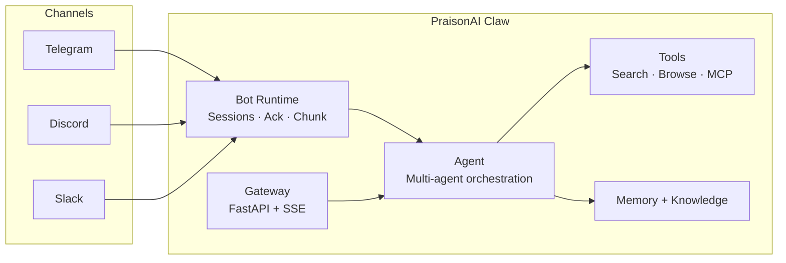

PraisonAI Claw is a single install extra that bundles the **full AI assistant stack** — dashboard, multi-agent runtime, gateway, search tools, and bot channels — into one command.

```bash
pip install "praisonai[claw]"
```

Inspired by [OpenClaw](https://github.com/openclaw/openclaw), Claw brings production-grade bot infrastructure to PraisonAI: ack reactions, message chunking, debouncing, per-user sessions, and connection resilience — all working across Telegram, Discord, and Slack.

## What's Included

| Component | Package | Purpose |
|---|---|---|
| **Dashboard** | `aiui[all]` | Full web UI with agents, chat, and monitoring |
| **Agent Runtime** | `praisonaiagents[all]` | Multi-agent orchestration, memory, knowledge, tools |
| **Chat UI** | `chainlit` | Interactive chat interface with persistence |
| **Gateway** | `fastapi` + `uvicorn` + `sse-starlette` | API server with SSE streaming |
| **Search** | `tavily` + `crawl4ai` + `ddgs` | Web search, crawling, and browsing |
| **Telegram** | `python-telegram-bot` | Telegram bot channel |
| **Discord** | `discord.py` | Discord bot channel |
| **Slack** | `slack_sdk` + `slack-bolt` | Slack bot channel |

## Architecture



## Bot Subsystems

Claw includes six production-grade subsystems for bot deployments, each solving a real-world messaging challenge.

### Ack Reactions

Reacts to inbound messages with a configurable emoji (e.g. ⏳) to acknowledge receipt, then swaps to a done emoji (e.g. ✅) when the agent responds.

```python
from praisonai.bots._ack import AckReactor

ack = AckReactor(ack_emoji="⏳", done_emoji="✅")

# On message received
ctx = await ack.ack(react_fn, chat_id=chat_id, message_id=msg_id)

# After agent responds
await ack.done(ctx, react_fn, unreact_fn, chat_id=chat_id, message_id=msg_id)
```

### Markdown-Aware Chunking

Splits long agent responses at paragraph boundaries while preserving code fences — prevents broken formatting in channel messages.

```python
from praisonai.bots._chunk import chunk_message

chunks = chunk_message(response_text, max_length=4096, preserve_fences=True)
for chunk in chunks:
    await bot.send_message(channel_id, chunk)
```

**Splitting priority:**
1. Paragraph boundaries (`\n\n`)
2. Sentence boundaries (`. ` followed by uppercase)
3. Hard split at `max_length` (last resort)

### Inbound Debouncing

Coalesces rapid messages from the same user into a single `agent.chat()` call, preventing duplicate processing and wasted tokens.

```python
from praisonai.bots._debounce import InboundDebouncer

debouncer = InboundDebouncer(debounce_ms=1500)

# User sends "hello" then "world" within 1500ms
coalesced = await debouncer.debounce("user123", "hello")
# coalesced == "hello\nworld"
```

### Per-User Session Isolation

Bots share a single `Agent` instance but each user gets independent chat history. `BotSessionManager` swaps the agent's history per user and supports persistent storage.

```python
from praisonai.bots._session import BotSessionManager

session_mgr = BotSessionManager(max_history=100, platform="telegram")

# Each user gets isolated conversation context
response = await session_mgr.chat(agent, user_id="user123", prompt="Hello!")

# Reset a user's session
session_mgr.reset("user123")

# Auto-clean inactive sessions
session_mgr.reap_stale(max_age_seconds=3600)
```

### Connection Resilience

Exponential backoff with per-platform policies, recoverable error detection, and connection health monitoring.

```python
from praisonai.bots._resilience import ConnectionMonitor, TELEGRAM_BACKOFF

monitor = ConnectionMonitor(platform="telegram", policy=TELEGRAM_BACKOFF)

try:
    await connect()
    monitor.record_success()
except Exception as e:
    delay = monitor.record_error(e)
    await asyncio.sleep(delay)
```

**Default backoff policies:**

| Platform | Initial | Max | Factor | Jitter |
|---|---|---|---|---|
| Telegram | 2 s | 30 s | 1.8× | 25% |
| Discord | 3 s | 60 s | 2.0× | 20% |
| Slack | 2 s | 30 s | 1.5× | 30% |
| WhatsApp | 5 s | 60 s | 2.0× | 20% |

### Chat Commands

Built-in `/status`, `/new`, and `/help` commands shared across all channels:

```python
from praisonai.bots._commands import format_status, format_help

# /status — shows agent name, model, platform, uptime
status = format_status(agent, platform="telegram", started_at=start_time, is_running=True)

# /help — lists available commands
help_text = format_help(agent, platform="telegram")
```

## YAML Configuration

Configure bots declaratively with `bot.yaml`:

```yaml
agent:
  name: "assistant"
  instructions: "You are a helpful assistant."
  model: "gpt-4o-mini"
  memory: true
  tools:
    - "web_search"
    - "read_url"

channels:
  telegram:
    token: "${TELEGRAM_BOT_TOKEN}"    # resolves env vars automatically
    group_policy: "mention_only"       # respond_all | mention_only | command_only
    allowlist: []
    blocklist: []
  discord:
    token: "${DISCORD_BOT_TOKEN}"
    group_policy: "respond_all"
  slack:
    token: "${SLACK_BOT_TOKEN}"
    webhook_url: "https://hooks.slack.com/..."

routing:
  default: "assistant"
  rules:
    "#support": "support-agent"
    "#sales": "sales-agent"

daemon:
  enabled: true
  restart: "always"                    # always | on_failure | never
```

Load and validate with:

```python
from praisonai.bots._config_schema import load_and_validate_bot_yaml

config = load_and_validate_bot_yaml("bot.yaml")
```

<Note>
Tokens support `${ENV_VAR}` syntax — the schema resolves environment variables automatically and raises clear errors if they're unset.
</Note>

## Quick Start

Deploy a Telegram bot with the full Claw stack:

```python
import os
from praisonaiagents import Agent
from praisonai.bots.telegram import TelegramBot

agent = Agent(
    name="Assistant",
    instructions="You are a helpful assistant.",
    llm="gpt-4o-mini",
)

bot = TelegramBot(
    agent=agent,
    token=os.environ["TELEGRAM_BOT_TOKEN"],
)
bot.start()
```

## Claw vs Individual Extras

| Feature | `[claw]` | `[bot]` | `[all]` | `[os]` |
|---|---|---|---|---|
| Dashboard (aiui) | ✅ | — | — | — |
| Agent runtime (all tools) | ✅ | — | — | — |
| Chat UI (Chainlit) | ✅ | — | ✅ | — |
| Gateway (FastAPI) | ✅ | — | — | ✅ |
| Web search + browsing | ✅ | — | ✅ | — |
| Telegram / Discord / Slack | ✅ | ✅ | — | — |
| Ack / Chunk / Debounce / Sessions | ✅ | ✅ | — | — |
| Connection resilience | ✅ | ✅ | — | — |

<Tip>
Use `[claw]` when you want everything in one install. Use individual extras (`[bot]`, `[all]`, `[os]`) for leaner deployments.
</Tip>

## Related

- [Bot Operating System](/docs/concepts/bot-os) — bot architecture and lifecycle
- [Architecture](/docs/concepts/architecture) — framework architecture overview
- [Execution Systems](/docs/concepts/execution) — agent execution patterns
