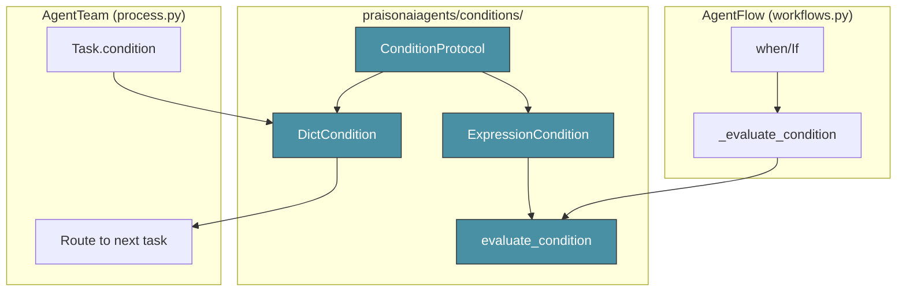
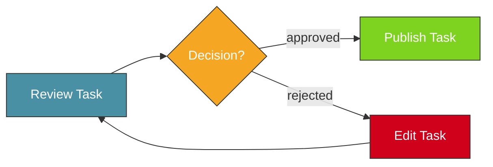

# Conditional Execution

PraisonAI provides a unified, protocol-driven approach to conditional execution across both **AgentFlow** (deterministic pipelines) and **AgentTeam** (multi-agent task graphs).

<Info>
The `ConditionProtocol` enables DRY condition handling - write conditions once, use them everywhere.
</Info>

## Architecture Overview



## Two Condition Paradigms

| System | Condition Type | Use Case |
|--------|---------------|----------|
| **AgentFlow** | String expressions | `"{{score}} > 80"` |
| **AgentTeam** | Dict routing | `{"approved": ["publish"]}` |

Both use the shared `ConditionProtocol` for consistent evaluation.

---

## AgentFlow Conditions

AgentFlow uses string-based conditions with `{{variable}}` placeholders.

### Basic Usage

```python
from praisonaiagents import AgentFlow, Agent, when

researcher = Agent(name="researcher", instructions="Research topics")
approver = Agent(name="approver", instructions="Approve content")
writer = Agent(name="writer", instructions="Write content")

flow = AgentFlow(
    steps=[
        researcher,
        when(
            condition="{{score}} > 80",
            then_steps=[approver],
            else_steps=[writer]
        )
    ]
)

result = flow.run("Research AI trends")
```

### Supported Condition Formats

<Accordion title="Numeric Comparisons">
```python
# Greater than
when(condition="{{score}} > 80", then_steps=[...])

# Greater or equal
when(condition="{{score}} >= 80", then_steps=[...])

# Less than
when(condition="{{score}} < 50", then_steps=[...])

# Less or equal
when(condition="{{score}} <= 50", then_steps=[...])

# Equal
when(condition="{{score}} == 100", then_steps=[...])

# Not equal
when(condition="{{score}} != 0", then_steps=[...])
```
</Accordion>

<Accordion title="String Comparisons">
```python
# String equality
when(condition="{{status}} == approved", then_steps=[...])

# String inequality
when(condition="{{status}} != rejected", then_steps=[...])
```
</Accordion>

<Accordion title="Contains Checks">
```python
# Using 'in' keyword
when(condition="error in {{message}}", then_steps=[...])

# Using 'contains' keyword
when(condition="{{message}} contains success", then_steps=[...])
```
</Accordion>

<Accordion title="Boolean Evaluation">
```python
# Truthy check
when(condition="{{flag}}", then_steps=[...])

# Boolean literals
when(condition="{{is_valid}}", then_steps=[...])
```
</Accordion>

<Accordion title="Nested Properties">
```python
# Access nested dict values
when(condition="{{item.score}} >= 60", then_steps=[...])

# Deep nesting
when(condition="{{result.data.status}} == success", then_steps=[...])
```
</Accordion>

---

## AgentTeam Conditions

AgentTeam uses dict-based conditions for task routing.

### Basic Usage

```python
from praisonaiagents import AgentTeam, Agent, Task

reviewer = Agent(name="reviewer", instructions="Review content")
publisher = Agent(name="publisher", instructions="Publish content")
editor = Agent(name="editor", instructions="Edit content")

review_task = Task(
    description="Review the content quality",
    agent=reviewer,
    task_type="decision",
    condition={
        "approved": ["publish_task"],
        "rejected": ["edit_task"]
    }
)

publish_task = Task(
    name="publish_task",
    description="Publish the content",
    agent=publisher
)

edit_task = Task(
    name="edit_task", 
    description="Edit and improve content",
    agent=editor
)

team = AgentTeam(
    agents=[reviewer, publisher, editor],
    tasks=[review_task, publish_task, edit_task]
)

result = team.start()
```

### Decision Flow



---

## Using the Protocol Directly

For advanced use cases, you can use the condition classes directly.

### ExpressionCondition

```python
from praisonaiagents import ExpressionCondition

# Create a reusable condition
score_check = ExpressionCondition("{{score}} > 80")

# Evaluate against different contexts
result1 = score_check.evaluate({"score": 90})  # True
result2 = score_check.evaluate({"score": 70})  # False
```

### DictCondition

```python
from praisonaiagents import DictCondition

# Create a routing condition
router = DictCondition(
    routes={"approved": ["publish"], "rejected": ["revise"]},
    key="decision"
)

# Check if decision is valid
is_valid = router.evaluate({"decision": "approved"})  # True

# Get target tasks
targets = router.get_target({"decision": "approved"})  # ["publish"]
```

### evaluate_condition Function

```python
from praisonaiagents import evaluate_condition

# Direct evaluation
result = evaluate_condition(
    condition="{{score}} > 80",
    variables={"score": 90},
    previous_output="Previous step output"
)
```

---

## Custom Conditions

Implement `ConditionProtocol` for custom condition logic.

```python
from praisonaiagents import ConditionProtocol
from typing import Dict, Any

class TimeBasedCondition:
    """Execute only during business hours."""
    
    def __init__(self, start_hour: int = 9, end_hour: int = 17):
        self.start_hour = start_hour
        self.end_hour = end_hour
    
    def evaluate(self, context: Dict[str, Any]) -> bool:
        from datetime import datetime
        current_hour = datetime.now().hour
        return self.start_hour <= current_hour < self.end_hour

# Use with AgentFlow
business_hours = TimeBasedCondition()
if business_hours.evaluate({}):
    # Execute workflow
    pass
```

---

## Best Practices

<CardGroup cols={2}>
  <Card title="Use Descriptive Variables" icon="tag">
    Name variables clearly: `{{approval_status}}` not `{{s}}`
  </Card>
  <Card title="Handle Missing Variables" icon="shield">
    Missing variables return `False` - design for this
  </Card>
  <Card title="Keep Conditions Simple" icon="minimize">
    Complex logic belongs in agents, not conditions
  </Card>
  <Card title="Test Conditions" icon="flask">
    Unit test conditions with various inputs
  </Card>
</CardGroup>

---

## API Reference

### ConditionProtocol

```python
class ConditionProtocol(Protocol):
    def evaluate(self, context: Dict[str, Any]) -> bool:
        """Evaluate condition against context."""
        ...
```

### ExpressionCondition

```python
class ExpressionCondition:
    def __init__(self, expression: str): ...
    def evaluate(self, context: Dict[str, Any]) -> bool: ...
```

### DictCondition

```python
class DictCondition:
    def __init__(self, routes: Dict[str, List[str]], key: str = "decision"): ...
    def evaluate(self, context: Dict[str, Any]) -> bool: ...
    def get_target(self, context: Dict[str, Any]) -> List[str]: ...
```

### evaluate_condition

```python
def evaluate_condition(
    condition: str,
    variables: Dict[str, Any],
    previous_output: Optional[str] = None
) -> bool: ...
```

---

## Related

<CardGroup cols={2}>
  <Card title="AgentFlow" icon="diagram-project" href="/concepts/agentflow">
    Deterministic workflow pipelines
  </Card>
  <Card title="AgentTeam" icon="users" href="/concepts/agentteam">
    Multi-agent task coordination
  </Card>
  <Card title="Task Reference" icon="list-check" href="/reference/task">
    Task configuration options
  </Card>
  <Card title="Orchestration" icon="sitemap" href="/concepts/orchestration">
    Workflow orchestration patterns
  </Card>
</CardGroup>
