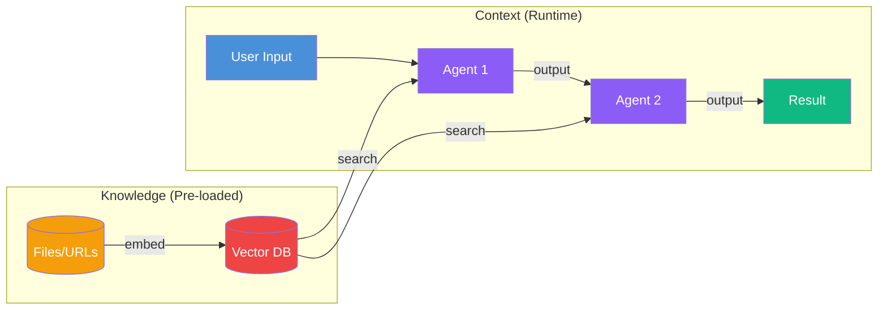
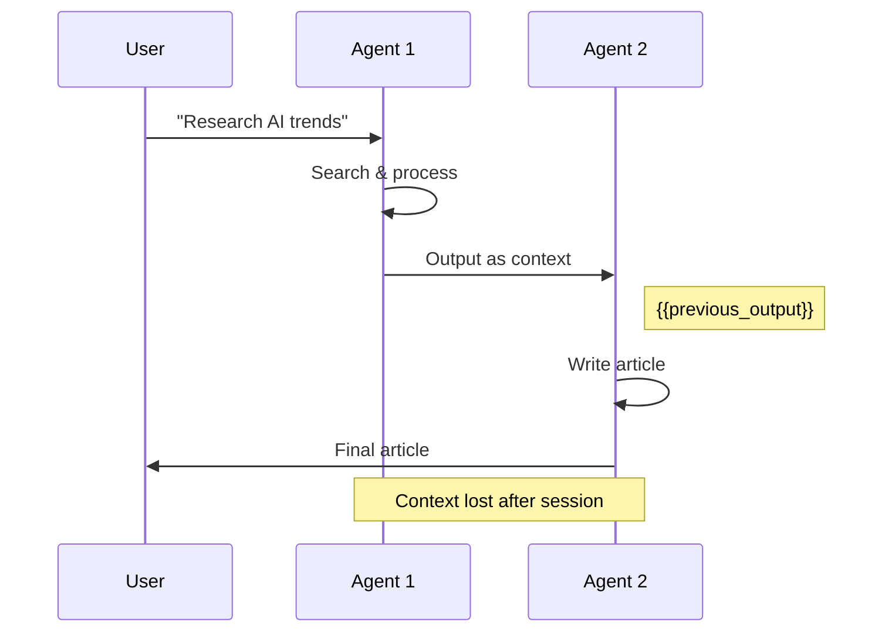
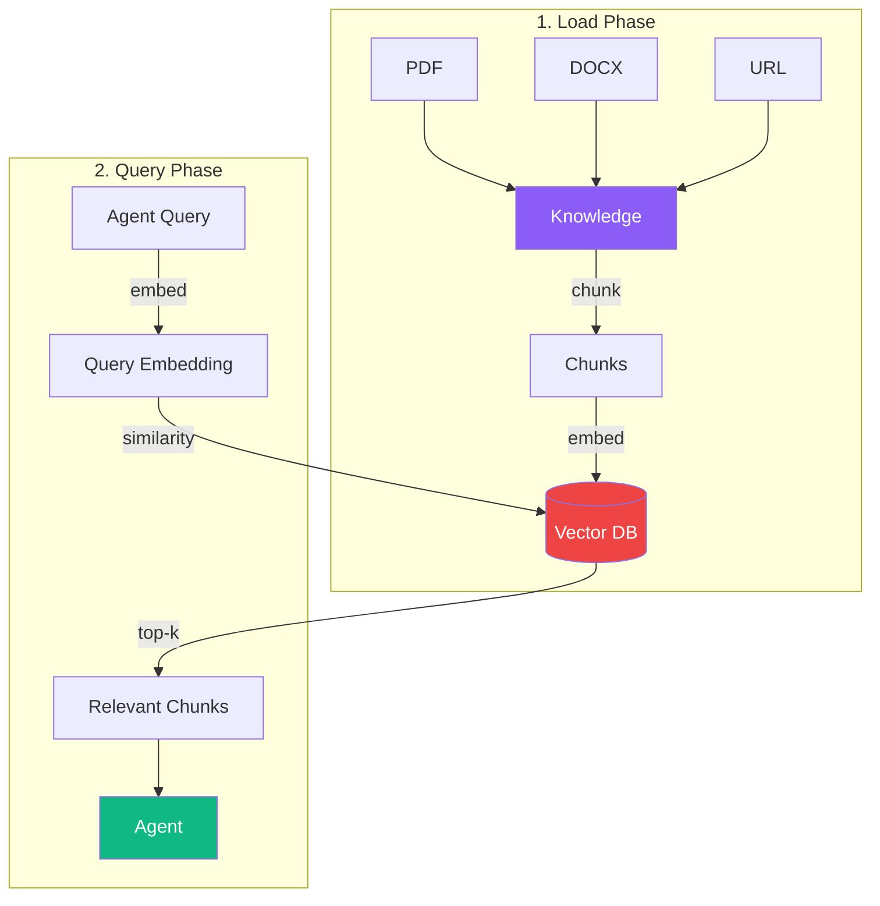
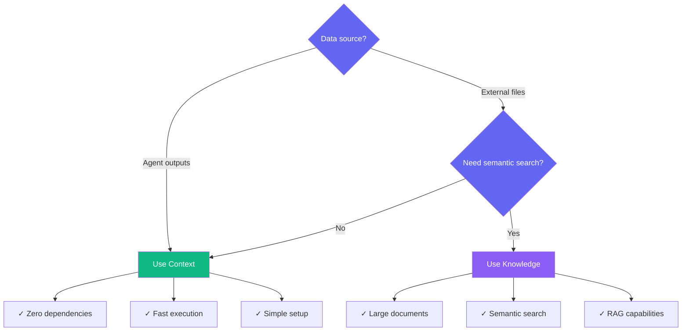
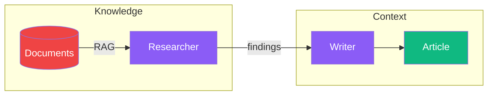

# Context vs Knowledge

PraisonAI provides two systems for providing information to agents: **Context** (runtime data flow) and **Knowledge** (pre-loaded reference data). Understanding when to use each is crucial for building efficient agents.



## Quick Comparison

| Aspect | Context | Knowledge |
|--------|---------|-----------|
| **When Loaded** | Runtime (during execution) | Pre-loaded (before execution) |
| **Source** | Agent outputs, tool results | Files, URLs, documents |
| **Storage** | In-memory (ephemeral) | Vector DB (persistent) |
| **Search** | Sequential flow | Semantic search (RAG) |
| **Use Case** | Passing data between agents | Reference information |
| **Dependencies** | None | chromadb, mem0 |

---

## Context: Runtime Data Flow

Context is how agents share information **during a single workflow execution**. Data flows from one agent to the next and is lost when the session ends.



### Context Code Example

```python
from praisonaiagents import Agent, PraisonAIAgents

researcher = Agent(
    name="Researcher",
    instructions="Research the topic"
)

writer = Agent(
    name="Writer",
    instructions="Write based on research"
)

# Context flows automatically: User → Researcher → Writer
agents = PraisonAIAgents(
    agents=[researcher, writer],
    process="sequential"
)

result = agents.start("Write about AI")
```

---

## Knowledge: Pre-loaded Reference Data

Knowledge provides agents with **pre-loaded reference information** from files, URLs, or documents. It uses RAG (Retrieval Augmented Generation) to find relevant information.



### Knowledge Code Example

```python
from praisonaiagents import Agent

# Agent with knowledge from files
agent = Agent(
    name="Support Agent",
    instructions="Answer questions using the documentation",
    knowledge=["docs/manual.pdf", "docs/faq.txt"]
)

# Agent automatically searches knowledge for relevant info
response = agent.start("How do I reset my password?")
```

### Supported File Types

<CardGroup cols={3}>
  <Card title="Documents" icon="file-pdf">
    PDF, DOC, DOCX, PPT, PPTX, XLS, XLSX
  </Card>
  <Card title="Text" icon="file-lines">
    TXT, CSV, JSON, XML, MD, HTML
  </Card>
  <Card title="Media" icon="image">
    JPG, PNG, GIF, MP3, WAV (with transcription)
  </Card>
</CardGroup>

---

## How Knowledge Works

<Steps>
  <Step title="Load Documents">
    Files are read and converted to text using MarkItDown.
  </Step>
  <Step title="Chunk Content">
    Text is split into smaller chunks (default: 512 tokens, 50 overlap).
  </Step>
  <Step title="Generate Embeddings">
    Each chunk is converted to a vector embedding.
  </Step>
  <Step title="Store in Vector DB">
    Embeddings are stored in ChromaDB for fast similarity search.
  </Step>
  <Step title="Query at Runtime">
    When agent needs info, query is embedded and similar chunks are retrieved.
  </Step>
</Steps>

---

## When to Use Each



### Use Context When:

- **Agent-to-agent data flow** - Passing results between sequential agents
- **Tool results** - Using output from tool calls
- **Simple workflows** - No external reference data needed
- **Zero dependencies** - Want to avoid extra packages

### Use Knowledge When:

- **Reference documents** - Manuals, FAQs, documentation
- **Large content** - Too much to fit in prompt
- **Semantic search** - Need to find relevant sections
- **RAG applications** - Question answering over documents

---

## Using Both Together

The most powerful pattern combines both: **Knowledge for reference data** + **Context for workflow data**.

```python
from praisonaiagents import Agent, PraisonAIAgents

# Agent with knowledge base
researcher = Agent(
    name="Researcher",
    instructions="Research using the knowledge base",
    knowledge=["research_papers/"]  # Pre-loaded documents
)

# Agent receives context from researcher
writer = Agent(
    name="Writer",
    instructions="Write article based on research findings"
    # No knowledge - uses context from researcher
)

agents = PraisonAIAgents(
    agents=[researcher, writer],
    process="sequential"
)

# Researcher searches knowledge, passes findings via context to writer
result = agents.start("Write about quantum computing advances")
```



---

## Knowledge Configuration

### Basic Configuration

```python
from praisonaiagents import Agent

agent = Agent(
    name="Assistant",
    knowledge=["docs/"]  # Directory of files
)
```

### Advanced Configuration

```python
from praisonaiagents import Agent, Knowledge

# Create shared knowledge instance
knowledge = Knowledge(config={
    "vector_store": {
        "provider": "chroma",
        "config": {
            "collection_name": "my_docs",
            "path": ".praison"
        }
    },
    "embedder": {
        "provider": "openai",
        "config": {
            "model": "text-embedding-3-small"
        }
    }
})

# Add documents
knowledge.add("docs/manual.pdf")
knowledge.add("https://example.com/faq")

# Share across agents
agent1 = Agent(name="Agent1", knowledge=knowledge)
agent2 = Agent(name="Agent2", knowledge=knowledge)
```

---

## Performance Comparison

| Operation | Context | Knowledge |
|-----------|---------|-----------|
| Setup | Instant | ~1-5s per document |
| Query | ~0ms | ~50-200ms |
| Dependencies | None | chromadb |
| Storage | Memory | Disk (persistent) |

<Note>
Knowledge has higher setup cost but enables semantic search over large document collections that wouldn't fit in context.
</Note>

---

## Summary

<CardGroup cols={2}>
  <Card title="Context" icon="arrows-left-right" color="#10B981">
    **Runtime data flow** between agents. Fast, zero dependencies, ephemeral. Use for passing agent outputs.
  </Card>
  <Card title="Knowledge" icon="book" color="#8B5CF6">
    **Pre-loaded reference data** with semantic search. Persistent, RAG-enabled. Use for documents and FAQs.
  </Card>
</CardGroup>

**Rule of thumb**: Use context for workflow data flow. Add knowledge when you need semantic search over documents.
