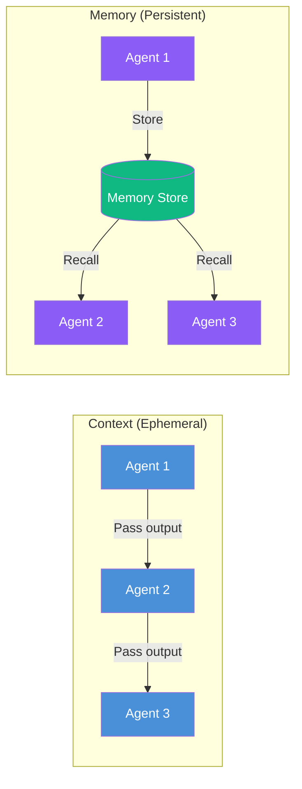
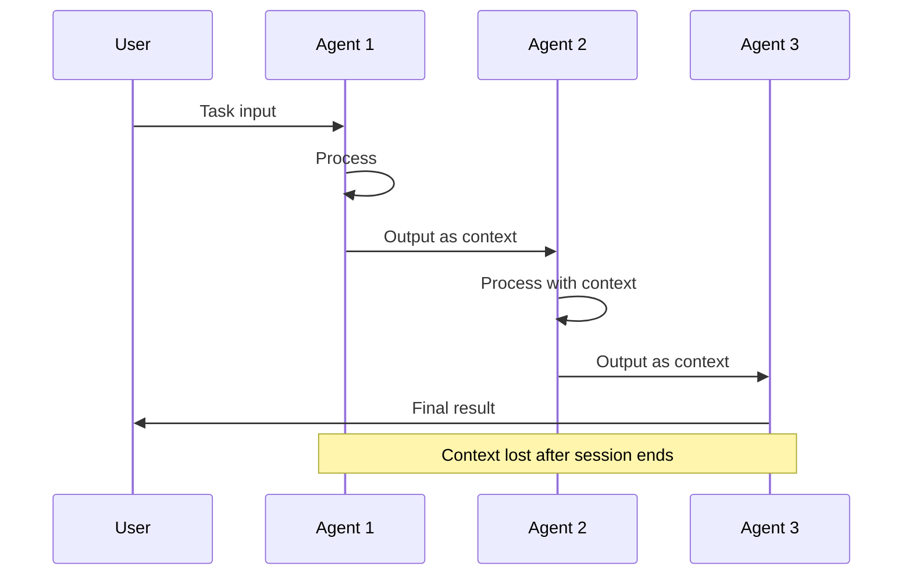
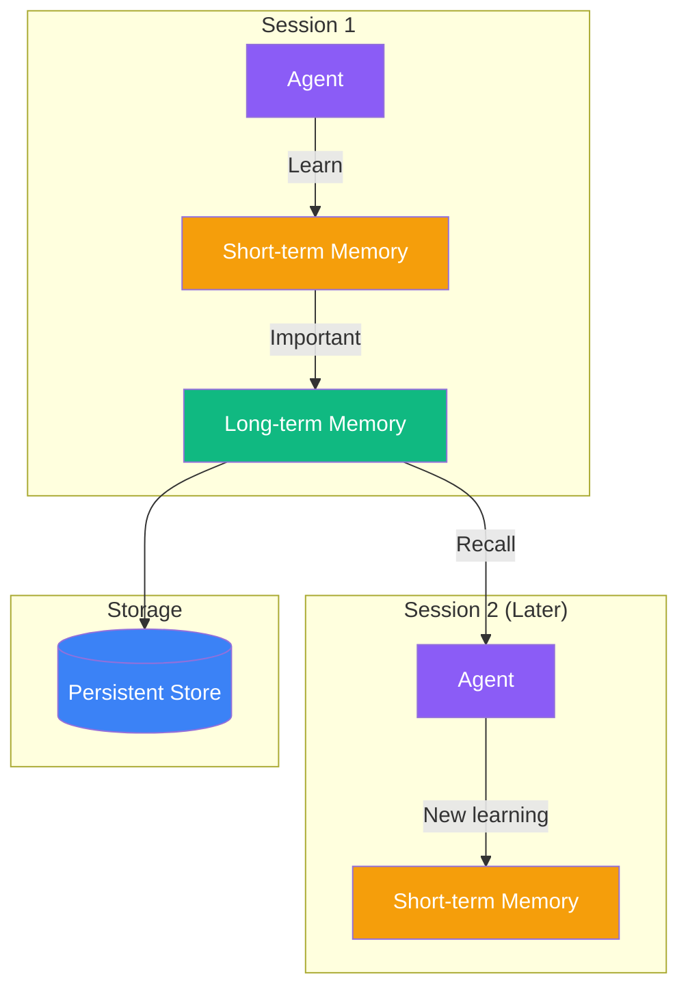
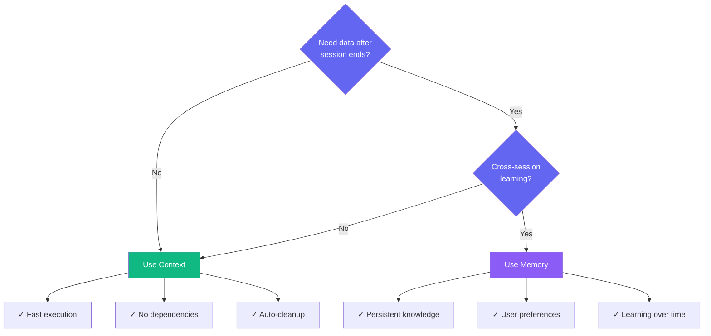
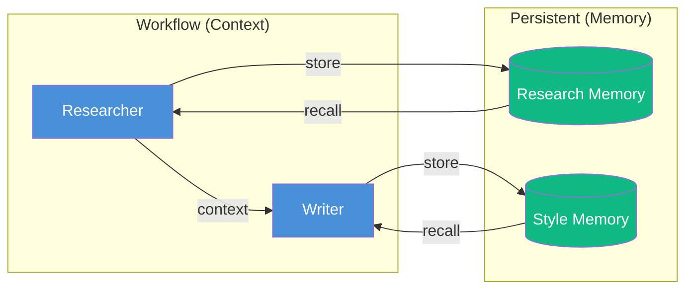

# Context vs Memory

PraisonAI provides two distinct systems for managing information flow between agents: **Context** and **Memory**. Understanding when to use each is crucial for building efficient multi-agent workflows.



## Quick Comparison

| Aspect | Context | Memory |
|--------|---------|--------|
| **Lifetime** | Single session | Persists across sessions |
| **Storage** | In-memory only | File/Database |
| **Scope** | Current workflow | All workflows |
| **Use Case** | Passing data between agents | Learning & remembering |
| **Performance** | Fast (no I/O) | Slower (disk/network) |
| **Dependencies** | None | Optional (chromadb, etc.) |

---

## Context: Ephemeral Data Flow

Context is the **default** way agents share information within a single workflow execution. Data flows from one agent to the next and is **lost when the session ends**.



### How Context Works

<Steps>
  <Step title="Agent Receives Input">
    First agent receives the user's task and any initial context.
  </Step>
  <Step title="Output Becomes Context">
    Agent's output is automatically passed as context to the next agent via `{{previous_output}}`.
  </Step>
  <Step title="Context Manager Optimizes">
    The Context Manager handles token limits, deduplication, and summarization.
  </Step>
  <Step title="Session Ends">
    When workflow completes, all context is discarded.
  </Step>
</Steps>

### Context Configuration

```yaml
# In agents.yaml or recipe
context:
  enabled: true
  auto_compact: true        # Auto-compress when near limit
  compact_threshold: 0.8    # Compress at 80% capacity
  strategy: smart           # smart, aggressive, conservative
  llm_summarize: true       # Use LLM for smart summarization
  max_tool_output_tokens: 5000
```

### Context Code Example

```python
from praisonaiagents import Agent, AgentTeam

# Agents share context automatically within a session
researcher = Agent(
    name="Researcher",
    instructions="Research the topic and provide findings"
)

writer = Agent(
    name="Writer", 
    instructions="Write an article based on the research"
)

# Context flows: User → Researcher → Writer → Output
team = AgentTeam(
    agents=[researcher, writer],
    process="sequential"
)

result = team.start("Write about AI trends")
# Context is lost after this completes
```

---

## Memory: Persistent Knowledge

Memory allows agents to **store and recall information across sessions**. Unlike context, memory persists to disk and can be accessed by any agent at any time.



### Memory Types

<CardGroup cols={2}>
  <Card title="Short-term Memory" icon="bolt">
    Rolling buffer of recent interactions. Auto-expires. Fast access.
  </Card>
  <Card title="Long-term Memory" icon="database">
    Persistent facts and knowledge. Survives restarts. Searchable.
  </Card>
  <Card title="Entity Memory" icon="user">
    Named entities with attributes and relationships.
  </Card>
  <Card title="Episodic Memory" icon="calendar">
    Date-based interaction history.
  </Card>
</CardGroup>

### Memory Code Example

```python
from praisonaiagents import Agent

# Enable memory - persists across sessions
agent = Agent(
    name="Assistant",
    instructions="Help the user and remember their preferences",
    memory=True  # Uses FileMemory (zero dependencies)
)

# Session 1: Learn user preference
agent.start("I prefer dark mode")
# Memory stored in .praison/memory/

# Session 2 (later): Recall preference
agent.start("What are my preferences?")
# Agent recalls: "User prefers dark mode"
```

### Memory Configuration

```python
from praisonaiagents import Agent

# Advanced memory configuration
agent = Agent(
    name="Assistant",
    memory={
        "provider": "file",      # file, sqlite, chromadb, mem0
        "user_id": "user123",    # Isolate memory per user
        "config": {
            "short_term_limit": 100,
            "long_term_limit": 1000,
            "auto_promote": True,
            "importance_threshold": 0.7
        }
    }
)
```

---

## When to Use Each



### Use Context When:

- **Single workflow execution** - Data only needed during current run
- **Agent-to-agent handoffs** - Passing results between sequential agents
- **Performance critical** - No disk I/O overhead
- **Stateless operations** - Each run is independent

### Use Memory When:

- **User preferences** - Remember settings across sessions
- **Learning systems** - Build knowledge over time
- **Conversation history** - Multi-turn interactions
- **Entity tracking** - Track people, places, concepts

---

## Using Both Together

The most powerful pattern combines both: **Context for workflow data flow** + **Memory for persistent learning**.

```python
from praisonaiagents import Agent, AgentTeam

# Agent with both context flow AND persistent memory
researcher = Agent(
    name="Researcher",
    instructions="Research topics. Remember what you've researched before.",
    memory=True  # Persistent memory
)

writer = Agent(
    name="Writer",
    instructions="Write articles. Remember user's style preferences.",
    memory=True  # Persistent memory
)

# Sequential workflow with context passing
team = AgentTeam(
    agents=[researcher, writer],
    process="sequential"  # Context flows between agents
)

# Run 1: Research and write, learn preferences
team.start("Write about AI in formal style")

# Run 2: Memory recalls style preference
team.start("Write about robotics")
# Writer remembers: "User prefers formal style"
```



---

## Performance Comparison

| Operation | Context | Memory (File) | Memory (ChromaDB) |
|-----------|---------|---------------|-------------------|
| Read | ~0ms | ~1-5ms | ~10-50ms |
| Write | ~0ms | ~5-10ms | ~50-100ms |
| Search | N/A | ~10ms | ~20-100ms |
| Dependencies | None | None | chromadb |

<Note>
Context is always faster because it's in-memory only. Use memory only when persistence is required.
</Note>

---

## Summary

<CardGroup cols={2}>
  <Card title="Context" icon="bolt" color="#10B981">
    **Ephemeral** - Fast data flow between agents within a single session. No persistence. Zero overhead.
  </Card>
  <Card title="Memory" icon="brain" color="#8B5CF6">
    **Persistent** - Store and recall information across sessions. Learning capability. Requires storage.
  </Card>
</CardGroup>

**Rule of thumb**: Start with context (default). Add memory only when you need cross-session persistence.
