# AI Agents with Context

PraisonAI provides **industry-leading context management** with smart defaults, lazy loading, and 6 optimization strategies.

```mermaid
flowchart TB
    subgraph Sources["📥 Context Sources"]
        SYS[System Prompt]
        HIST[Chat History]
        TOOLS[Tool Schemas]
        OUT[Tool Outputs]
        MEM[Memory/RAG]
    end

    subgraph Manager["⚙️ Context Manager"]
        EST[Token Estimator]
        BUD[Budget Allocator]
        OPT[Optimizer]
        MON[Monitor]
    end

    subgraph LLM["🤖 LLM"]
        API[API Call]
    end

    SYS --> EST
    HIST --> EST
    TOOLS --> EST
    OUT --> EST
    MEM --> EST
    EST --> BUD
    BUD --> OPT
    OPT --> MON
    MON --> API

    style SYS fill:#8B0000,color:#fff
    style HIST fill:#8B0000,color:#fff
    style TOOLS fill:#8B0000,color:#fff
    style OUT fill:#8B0000,color:#fff
    style MEM fill:#8B0000,color:#fff
    style EST fill:#2E8B57,color:#fff
    style BUD fill:#2E8B57,color:#fff
    style OPT fill:#2E8B57,color:#fff
    style MON fill:#2E8B57,color:#fff
    style API fill:#189AB4,color:#fff
```



| Feature | PraisonAI | LangChain | CrewAI | Agno |
|---------|:---------:|:---------:|:------:|:----:|
| Smart Defaults | ✅ | ❌ | ❌ | ❌ |
| Lazy Loading (0ms) | ✅ | ❌ | ❌ | ❌ |
| 6 Strategies | ✅ | ❌ | ❌ | ❌ |
| Per-Tool Budgets | ✅ | ❌ | ❌ | ❌ |
| Session Deduplication | ✅ | ❌ | ❌ | ⚠️ |
| LLM Summarization | ✅ | ⚠️ | ❌ | ❌ |

---

## Quick Start

<CodeGroup>
```python Enable Context
from praisonaiagents import Agent

# Enable with defaults (auto-enabled when tools present)
agent = Agent(
    instructions="You are helpful",
    context=True
)
```

```python Custom Config
from praisonaiagents import Agent, ManagerConfig

agent = Agent(
    instructions="You are helpful",
    context=ManagerConfig(
        auto_compact=True,
        compact_threshold=0.8,
        strategy="smart",
        llm_summarize=True,
    )
)
```

```yaml YAML Config
context:
  auto_compact: true
  compact_threshold: 0.8
  strategy: smart
  llm_summarize: true
  tool_limits:
    tavily_search: 2000
```
</CodeGroup>

---

## What is Context?

Context is **everything sent to the LLM** in a single API call. It includes:


<CardGroup cols={3}>
  <Card title="System Prompt" icon="scroll">
    Agent instructions, role, and goals (~2K tokens)
  </Card>
  <Card title="Chat History" icon="comments">
    User/assistant messages (variable)
  </Card>
  <Card title="Tool Schemas" icon="wrench">
    Function definitions (~2K tokens)
  </Card>
  <Card title="Tool Outputs" icon="terminal">
    Results from tool calls (~20K tokens)
  </Card>
  <Card title="Memory/RAG" icon="brain">
    Retrieved context (~4K tokens)
  </Card>
  <Card title="Output Reserve" icon="arrow-right">
    Space for LLM response (~8-16K tokens)
  </Card>
</CardGroup>

---

## How Context Flows

### Single Agent Flow


### Multi-Agent Flow


---

## Optimization Strategies

When context exceeds the threshold (default 80%), the optimizer kicks in:

```mermaid
flowchart LR
    subgraph "Choose Strategy"
        SPEED[⚡ Speed] --> TRUNC[TRUNCATE]
        RECENT[📜 Recency] --> SLIDE[SLIDING_WINDOW]
        QUALITY[🎯 Quality] --> SUMM[SUMMARIZE]
        BALANCE[⚖️ Balance] --> SMART[SMART]
        TOOLS[🔧 Tool Heavy] --> PRUNE[PRUNE_TOOLS]
        SAFE[🛡️ Safety] --> NONDEST[NON_DESTRUCTIVE]
    end

    style SPEED fill:#8B0000,color:#fff
    style RECENT fill:#8B0000,color:#fff
    style QUALITY fill:#8B0000,color:#fff
    style BALANCE fill:#8B0000,color:#fff
    style TOOLS fill:#8B0000,color:#fff
    style SAFE fill:#8B0000,color:#fff
```



| Strategy | How It Works | Best For |
|----------|--------------|----------|
| `truncate` | Remove oldest messages | Simple chatbots |
| `sliding_window` | Keep N recent messages | Long conversations |
| `prune_tools` | Truncate old tool outputs | Tool-heavy agents |
| `summarize` | LLM summarizes old context | Critical context |
| `smart` | Combines all strategies | **Production use** |
| `non_destructive` | Tag for exclusion (undo-able) | Audit trails |

### Smart Strategy Flow

```mermaid
flowchart TD
    START[Over Budget?] --> S1
    
    subgraph S1["Step 1: Summarize Tools"]
        ST[LLM summarizes tool outputs]
    end
    
    S1 --> C1{Under budget?}
    C1 -->|Yes| DONE[✅ Done]
    C1 -->|No| S2
    
    subgraph S2["Step 2: Truncate Tools"]
        TT[Truncate remaining outputs]
    end
    
    S2 --> C2{Under budget?}
    C2 -->|Yes| DONE
    C2 -->|No| S3
    
    subgraph S3["Step 3: Sliding Window"]
        SW[Keep recent messages]
    end
    
    S3 --> C3{Under budget?}
    C3 -->|Yes| DONE
    C3 -->|No| S4
    
    subgraph S4["Step 4: Summarize History"]
        SH[LLM summarizes conversation]
    end
    
    S4 --> DONE

    style S1 fill:#2E8B57,color:#fff
    style S2 fill:#189AB4,color:#fff
    style S3 fill:#8B0000,color:#fff
    style S4 fill:#6B21A8,color:#fff
    style DONE fill:#10B981,color:#fff
```



---

## Overflow Handling


| Level | Usage | Action |
|-------|-------|--------|
| Normal | < 70% | No action |
| Warning | 70-80% | Monitor |
| Critical | 80-90% | Auto-compact triggers |
| Emergency | 90-95% | Aggressive optimization |
| Overflow | > 95% | Emergency truncation |

---

## Token Budgeting

The Context Budgeter allocates tokens across segments:


```python
from praisonaiagents import ContextBudgeter

budgeter = ContextBudgeter(model="gpt-4o-mini")
budget = budgeter.allocate()

print(f"Model limit: {budget.model_limit:,}")      # 128,000
print(f"Output reserve: {budget.output_reserve:,}") # 16,384
print(f"Usable: {budget.usable:,}")                 # 111,616
```

### Model Limits

| Model | Context | Output Reserve |
|-------|---------|----------------|
| gpt-4o | 128K | 16K |
| gpt-4o-mini | 128K | 16K |
| claude-3-opus | 200K | 8K |
| gemini-1.5-pro | 2M | 8K |

---

## Per-Tool Budgets

Set different limits for different tools:


```python
from praisonaiagents import Agent, ManagerConfig

agent = Agent(
    instructions="You are helpful",
    context=ManagerConfig(
        tool_limits={
            "tavily_search": 2000,    # Search: 2K chars
            "tavily_extract": 5000,   # Full page: 5K chars
            "code_executor": 10000,   # Code output: 10K chars
        },
        protected_tools=["file_read"],  # Never pruned
    )
)
```

---

## Session Deduplication

Prevents duplicate content across agents in multi-agent workflows:


---

## Multi-Agent Policies

Control how context is shared between agents:


| Mode | Description | Use Case |
|------|-------------|----------|
| `NONE` | No context shared | Independent agents |
| `SUMMARY` | Summarized context | Reduce tokens |
| `FULL` | Full context (bounded) | Continuity needed |

```python
from praisonaiagents import ContextPolicy, ContextShareMode

policy = ContextPolicy(
    share=True,
    share_mode=ContextShareMode.SUMMARY,
    max_tokens=5000,
    preserve_recent_turns=3,
)
```

---

## Context Monitoring

Real-time snapshots for debugging:


```python
from praisonaiagents import Agent, ManagerConfig

agent = Agent(
    instructions="You are helpful",
    context=ManagerConfig(
        monitor_enabled=True,
        monitor_path="./context.txt",
        monitor_format="human",  # or "json"
        redact_sensitive=True,
    )
)
```

### Snapshot Output

```
================================================================================
PRAISONAI CONTEXT SNAPSHOT
================================================================================
Timestamp: 2026-01-24T06:00:00Z
Model: gpt-4o-mini
Model Limit: 128,000 tokens
Usable Budget: 111,616 tokens

--------------------------------------------------------------------------------
TOKEN LEDGER
--------------------------------------------------------------------------------
Segment              |     Tokens |     Budget |    Usage
--------------------------------------------------------------------------------
System Prompt        |        150 |      2,000 |    7.5%
History              |      5,230 |     84,616 |    6.2%
Tool Outputs         |      1,200 |     20,000 |    6.0%
--------------------------------------------------------------------------------
TOTAL                |      6,580 |    111,616 |    5.9%
```

---

## Token Estimation

Fast offline token counting (no API calls):

```python
from praisonaiagents import (
    estimate_tokens_heuristic,
    estimate_messages_tokens,
)

# Estimate text tokens
tokens = estimate_tokens_heuristic("Hello world!")  # ~3

# Estimate message tokens
messages = [
    {"role": "user", "content": "Hello"},
    {"role": "assistant", "content": "Hi!"},
]
tokens = estimate_messages_tokens(messages)  # ~12
```

| Content Type | Accuracy |
|--------------|----------|
| English text | ~90-95% |
| Code | ~85-90% |
| Non-ASCII | ~80-85% |

---

## Fast Context (Code Search)

Rapid parallel code search for AI agents:

```mermaid
flowchart TB
    Q[🔍 Query] --> FC[⚡ FastContext]
    FC --> P[Parallel Executor]
    
    P --> G[grep_search]
    P --> GL[glob_search]
    P --> R[read_file]
    P --> L[list_dir]
    
    G --> C[💾 Cache]
    GL --> C
    R --> C
    L --> C
    
    C --> RES[📄 Results]

    style Q fill:#8B0000,color:#fff
    style FC fill:#2E8B57,color:#fff
    style C fill:#189AB4,color:#fff
```



```python
from praisonaiagents.context.fast import FastContext

fc = FastContext(
    workspace_path=".",
    max_turns=4,
    max_parallel=8,
)

result = fc.search("find authentication handlers")
print(f"Found {result.total_files} files in {result.search_time_ms}ms")
```

| Feature | Value |
|---------|-------|
| Search Latency | 100-200ms |
| Cache Hit | < 1ms |
| Parallel Speedup | 2-5x |

---

## CLI Commands

```bash
# Enable context in chat
praisonai chat --context

# Set strategy
praisonai chat --context-strategy smart

# Set threshold
praisonai chat --context-threshold 0.8

# Enable monitoring
praisonai chat --context-monitor
```

### In-Session Commands

| Command | Description |
|---------|-------------|
| `/context on` | Enable monitoring |
| `/context off` | Disable monitoring |
| `/context stats` | Show token ledger |
| `/context dump` | Write snapshot now |
| `/context compact` | Force optimization |

---

## Configuration Reference

### ManagerConfig Options

| Option | Type | Default | Description |
|--------|------|---------|-------------|
| `auto_compact` | bool | `True` | Auto-optimize on threshold |
| `compact_threshold` | float | `0.8` | Trigger at this usage % |
| `strategy` | str | `"smart"` | Optimization strategy |
| `output_reserve` | int | Model-specific | Reserved for output |
| `llm_summarize` | bool | `False` | Use LLM for summarization |
| `tool_limits` | dict | `{}` | Per-tool token limits |
| `protected_tools` | list | `[]` | Tools never pruned |
| `monitor_enabled` | bool | `False` | Enable snapshots |
| `redact_sensitive` | bool | `True` | Redact secrets |

### Environment Variables

```bash
PRAISONAI_CONTEXT_OUTPUT_RESERVE=8000
PRAISONAI_CONTEXT_THRESHOLD=0.8
PRAISONAI_CONTEXT_MONITOR=true
```

---

## Best Practices

<AccordionGroup>
  <Accordion title="Enable for tool-heavy agents">
    Always enable `context=True` for agents with tools to prevent token overflow from large search results.
  </Accordion>
  <Accordion title="Use smart strategy in production">
    The `smart` strategy combines all optimization techniques intelligently.
  </Accordion>
  <Accordion title="Set per-tool limits">
    Configure lower limits for verbose tools (search, web scraping) and higher limits for code execution.
  </Accordion>
  <Accordion title="Monitor during development">
    Enable `monitor_enabled=True` to debug context issues and understand token usage.
  </Accordion>
  <Accordion title="Use session deduplication">
    In multi-agent workflows, deduplication prevents the same content from being processed multiple times.
  </Accordion>
</AccordionGroup>

---

## Related Pages

<CardGroup cols={2}>
  <Card title="Memory" icon="brain" href="/concepts/memory">
    Persistent storage across sessions
  </Card>
  <Card title="Knowledge" icon="book" href="/concepts/knowledge">
    Pre-loaded reference documents
  </Card>
  <Card title="Context vs Memory" icon="arrows-split-up-and-left" href="/concepts/context-vs-memory">
    When to use each system
  </Card>
  <Card title="Context vs Knowledge" icon="book-open" href="/concepts/context-vs-knowledge">
    Runtime vs pre-loaded data
  </Card>
</CardGroup>

<Note>
Context management uses **lazy loading** throughout. Setting `context=True` adds only 1 boolean assignment at creation time (0ms). The ContextManager is only instantiated when first accessed.
</Note>
