PraisonAI provides four core components for building AI applications. Each serves a distinct purpose in the architecture.

```mermaid
graph TB
    subgraph "Development"
        Agent[🤖 Agent]
        AgentTeam[👥 AgentTeam]
        Workflow[📋 Workflow]
    end
    
    subgraph "Production"
        AgentApp[🚀 AgentApp]
    end
    
    Agent --> AgentTeam
    Agent --> Workflow
    AgentTeam --> AgentApp
    Workflow --> AgentApp
    
    classDef dev fill:#189AB4,stroke:#7C90A0,color:#fff
    classDef prod fill:#10B981,stroke:#7C90A0,color:#fff
    
    class Agent,AgentTeam,Workflow dev
    class AgentApp prod
```



## Quick Reference

| Component | Purpose | Use When |
|-----------|---------|----------|
| `Agent` | Single autonomous unit | Simple tasks, single-purpose automation |
| `AgentTeam` | Multi-agent coordinator | Task delegation, hierarchical teams |
| `Workflow` | Deterministic pipelines | Step-by-step flows, loops, conditionals |
| `AgentApp` | Production deployment | Web APIs, production services |

---

## Agent

The fundamental building block. A single AI entity with instructions and tools.

```python
from praisonaiagents import Agent

agent = Agent(
    name="Researcher",
    instructions="You research topics thoroughly",
    tools=[search_tool]
)

result = agent.start("What is quantum computing?")
```

### Key Features
- Single purpose, focused execution
- Direct tool access
- Memory and context support
- Works standalone or within orchestrators

---

## AgentTeam

Coordinates multiple agents through task assignment. Think: "Who does what task."

```python
from praisonaiagents import Agent, AgentTeam, Task

researcher = Agent(role="Researcher", instructions="Research topics")
writer = Agent(role="Writer", instructions="Write content")

task1 = Task(description="Research AI", agent=researcher)
task2 = Task(description="Write article", agent=writer, context=[task1])

manager = AgentTeam(
    agents=[researcher, writer],
    tasks=[task1, task2],
    process="sequential"
)
result = manager.start()
```

### Key Features
- Task-based delegation with explicit agent assignment
- Sequential, parallel, or hierarchical execution
- Task dependencies via `context`
- Manager LLM for hierarchical validation

---

## Workflow

Executes deterministic step sequences with advanced patterns. Think: "What happens in order."

```python
from praisonaiagents import Agent
from praisonaiagents import AgentFlow, route, loop

researcher = Agent(instructions="Research topics")
writer = Agent(instructions="Write content")

workflow = AgentFlow(
    steps=[
        researcher,
        route({
            "positive": [writer],
            "default": [fallback]
        })
    ]
)
result = workflow.run("Research AI trends")
```

### Key Features
- Pattern-based: `route()`, `parallel()`, `loop()`, `repeat()`, `when()`
- Steps can be agents OR functions
- CSV/file iteration with `loop(from_csv="data.csv")`
- Recipe composition with `include()`

---

## AgentApp

Deploys agents, managers, or workflows as production web services.

```python
from praisonai import AgentApp
from praisonaiagents import Agent, AgentTeam, AgentFlow

assistant = Agent(name="assistant", instructions="Be helpful")
manager = AgentTeam(agents=[...], tasks=[...])
workflow = AgentFlow(steps=[...])

app = AgentApp(
    name="My AI API",
    agents=[assistant],
    managers=[manager],
    workflows=[workflow]
)
app.serve(port=8000)
```

### Key Features
- FastAPI-based REST endpoints
- WebSocket support
- Auto-generated API docs (`/docs`)
- CORS configuration
- Health checks (`/health`)

### Endpoints

| Endpoint | Method | Description |
|----------|--------|-------------|
| `/` | GET | App status and component list |
| `/health` | GET | Health check |
| `/api/agents` | GET | List all agents |
| `/api/chat` | POST | Chat with an agent |

---

## Comparison Matrix

| Capability | Agent | AgentTeam | Workflow | AgentApp |
|------------|-------|--------------|----------|----------|
| **Single Task** | ✅ Primary | ❌ | ⚠️ Via step | ✅ Wraps |
| **Multi-Agent** | ❌ | ✅ Primary | ✅ Via steps | ✅ Wraps |
| **Sequential** | N/A | ✅ | ✅ Default | N/A |
| **Parallel** | N/A | ✅ | ✅ `parallel()` | N/A |
| **Hierarchical** | N/A | ✅ | ❌ | N/A |
| **Conditional** | ❌ | ⚠️ `condition={}` | ✅ `route()`, `when()` | N/A |
| **Looping** | ❌ | ⚠️ `loop_over` | ✅ `loop()` | N/A |
| **Repeat Until** | ❌ | ❌ | ✅ `repeat()` | N/A |
| **Web API** | ❌ | ❌ | ❌ | ✅ Primary |
| **Functions as Steps** | ❌ | ❌ | ✅ | N/A |

---

## When to Use What


<Steps>
<Step title="Simple single task">
Use `Agent` directly:
```python
Agent(instructions="...").start("prompt")
```
</Step>

<Step title="Multi-agent with task delegation">
Use `AgentTeam`:
```python
AgentTeam(agents=[...], tasks=[...]).start()
```
</Step>

<Step title="Deterministic pipeline with patterns">
Use `Workflow`:
```python
Workflow(steps=[...]).run("input")
```
</Step>

<Step title="Production deployment">
Wrap in `AgentApp`:
```python
AgentApp(agents=[...]).serve(port=8000)
```
</Step>
</Steps>

---

## Shared Parameters

All orchestrators (AgentTeam, Workflow) support identical feature parameters:

| Parameter | Type | Description |
|-----------|------|-------------|
| `memory` | `bool` / `MemoryConfig` | Enable memory |
| `planning` | `bool` / `PlanningConfig` | Planning mode |
| `context` | `bool` / `ContextConfig` | Context management |
| `output` | `str` / `OutputConfig` | Output settings |
| `hooks` | `HooksConfig` | Lifecycle callbacks |
| `autonomy` | `bool` / `AutonomyConfig` | Agent autonomy |
| `knowledge` | `bool` / `KnowledgeConfig` | RAG configuration |
| `guardrails` | `bool` / `GuardrailConfig` | Validation |
| `web` | `bool` / `WebConfig` | Web search |
| `reflection` | `bool` / `ReflectionConfig` | Self-reflection |
| `caching` | `bool` / `CachingConfig` | Caching |

---

## Best Practices

<AccordionGroup>
  <Accordion title="Start with Agent, scale up">
    Begin with a single `Agent`. Only add orchestration when you need multiple agents or complex flows.
  </Accordion>
  
  <Accordion title="Choose one orchestrator per project">
    Don't mix `AgentTeam` and `Workflow` for the same task. Pick based on your mental model.
  </Accordion>
  
  <Accordion title="Use AgentApp for all production deployments">
    Even for single agents, `AgentApp` provides proper API structure, CORS, and health checks.
  </Accordion>
  
  <Accordion title="Prefer Workflow for deterministic processes">
    If you need guaranteed execution order, conditional branching, or loops, use `Workflow`.
  </Accordion>
</AccordionGroup>

---

## Related

<CardGroup cols={2}>
  <Card title="Agents" icon="user" href="/concepts/agents">
    Agent configuration reference
  </Card>
  <Card title="Tasks" icon="list-check" href="/concepts/tasks">
    Task configuration reference
  </Card>
  <Card title="Process Types" icon="play" href="/concepts/process">
    Sequential, parallel, hierarchical
  </Card>
  <Card title="Workflows" icon="diagram-project" href="/features/workflows">
    Workflow patterns deep dive
  </Card>
</CardGroup>
